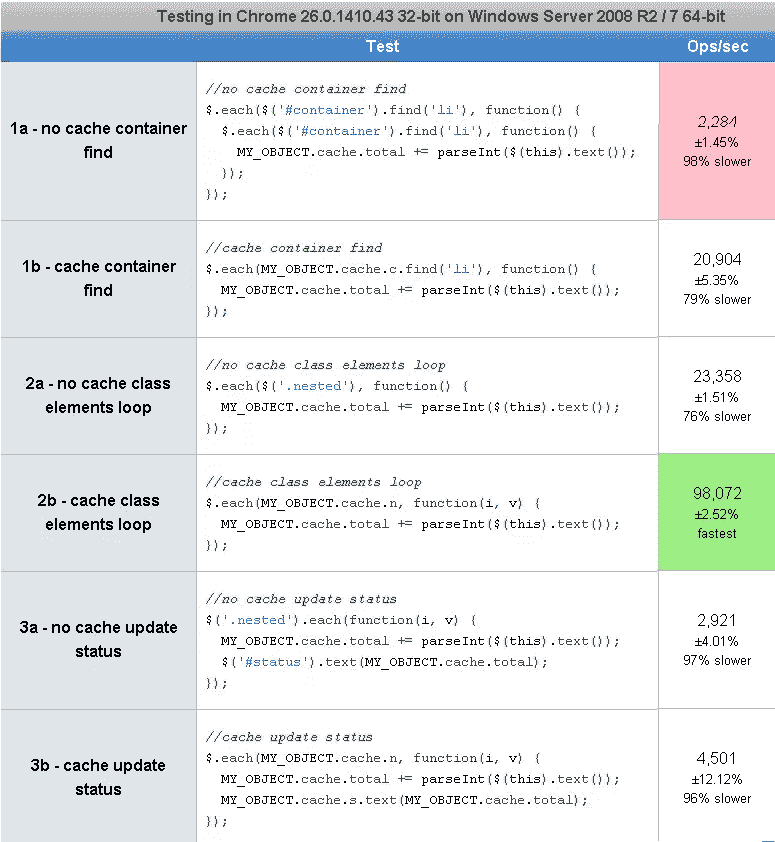
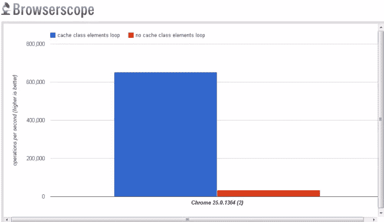

# jQuery:DOM 缓存的性能

> 原文：<https://www.sitepoint.com/jquery-performance-dom-caching/>

我决定在一个基本的 [JavaScript 命名空间模式](http://www.jquery4u.com/javascript/jquery-function-namespacing-plain-english/)中测试**DOM 缓存**的性能，我在日常编码中经常使用这个模式。**2013 年 10 月 4 日更新:**我在循环中添加了一些基本的逻辑。[更新了 jsfiddle](https://jsfiddle.net/jquery4u/R7dTr/) ，[更新了 jsperf](http://jsperf.com/dom-caching-namespace/5) 。

> 使用 DOM 缓存时，速度性能可以提高 76%(基于每秒操作数)。

这里是 jsperf 性能测试的全部结果——分组成对。所以比较 1 和 2，比较 3 和 4 等等…

[](http://jsperf.com/dom-caching-namespace/5)

结果表明，缓存 DOM 元素极大地提高了代码执行的速度。当比较测试 3 和测试 4 时，可以清楚地看到这一点，从每秒 32，889 次运算提升到 602，620 次运算！

[](http://jsperf.com/dom-caching-namespace/2)

**增加百分比的计算。**

对比 2a 和 2b，速度提高了 76%(基于每秒操作数)。((98072-23358)/98072)* 100 = 76.18%的涨幅。

一些基本的标记。

```
 `*   目录

*   目录

*   目录

*   目录` 

带有一些缓存的基本 js 对象。

```
MY_OBJECT = 
    {
        cache: {},

        init: function()
        {
            this.cache.c = $('#container');
            this.cache.n = this.cache.c.find('.nested');
            this.cache.s = this.cache.c.find('#status');
        }
    }

    MY_OBJECT.init();
```

一些标准测试。

```
//no cache container find
$.each($('#container').find('li'), function(i,v)
{
    //...
});

//cache container find
$.each(MY_OBJECT.cache.c.find('li'), function(i,v)
{
    //...
});

//no cache class elements loop
$.each($('.nested'), function(i,v)
{
    //...
});

//cache class elements loop
$.each(MY_OBJECT.cache.n, function(i,v)
{
    //...
});

//no cache update status
$('.nested').each(function(i,v)
{
    $('#status').text($(this).text());
});

//cache update status
$.each(MY_OBJECT.cache.n, function(i,v)
{
    MY_OBJECT.cache.s.text($(this).text());
});
```

## 分享这篇文章

```