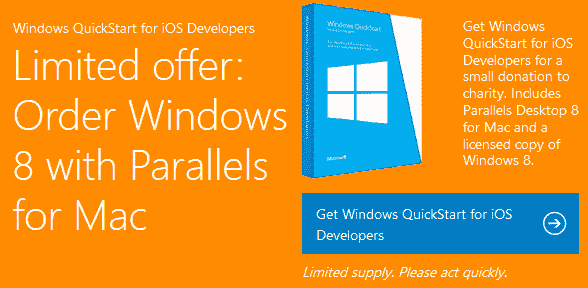

# 微软把 Parallels、Windows 8 和 IE10 送给 Mac 开发者

> 原文：<https://www.sitepoint.com/microsoft-windows8-ie10-mac-giveaway/>

IE10 让 Internet Explorer 比以往任何时候都更接近 Chrome 和 Firefox。然而，如果你最近参加了一个极客会议，你会注意到苹果电脑的激增——它们不能运行浏览器。这是微软的问题…

*   很多开发者可能不愿意在 IE 中测试网站。
*   那些这样做的人，经常在开发周期的后期测试它。
*   不可避免的问题导致*“IE 还是很糟糕”*评论。虽然 IE10 可能不会比任何其他浏览器引起更多的问题，但泥棒。

[微软发布 modern。IE 二月](https://www.sitepoint.com/modern-ie-browser-testing/)。该网站提供页面扫描仪、免费虚拟机映像、三个月免费订阅 BrowserStack 和兼容性建议。然而，为了庆祝微软对[威比奖](http://winners.webbyawards.com/)的赞助，今天推出了几个新功能…

## 面向 Mac 开发者的免费 Parallels 和 Windows 8u 盘

如果你是 Mac 开发者，可能很难证明 Parallels 和 Windows 的许可成本是合理的。微软已经让你的决定变得更容易了，它提供了免费的 u 盘，里面有 Parallels 8 和 Windows 8 的完整版本。

有什么问题吗？供应有限，所以赶快行动吧，微软希望你能向你最喜欢的慈善机构捐赠 25 美元。对我来说听起来很划算。

## 新的虚拟机映像

两个[新虚拟机](http://www.modern.ie/en-US/virtualization-tools)可用:Windows 7 上的 IE10 和 Windows XP 上的 IE8。两者都是免费的，所有虚拟机现在都可以用于 Mac 上的 Parallels 以及其他平台上的 Hyper-V、VirtualBox 和 VMware。

## 扫描防火墙后的站点

现在可以安装一个 [modern 的本地实例。IE 网页扫描仪](http://www.modern.ie/report)这样你就可以测试尚未启动的内部网应用程序或网站。

*猜猜扫描仪需要什么平台…*

你错了！是 [node.js](http://nodejs.org/) 。这是一个令人惊讶的明智选择，这意味着它可以在 Windows、Mac OS 和 Linux 上运行。

该扫描仪有许多有用的新功能:

*   使用*“如何修复”*建议进行更深入的扫描
*   响应式网页设计分析
*   触摸优化提示，和
*   为阻止 Flash 内容的网站提供帮助。

## 更好的国际化

[现代。IE](http://www.modern.ie/) 有 18 种语言版本，包括阿拉伯语、中文、荷兰语、法语、德语、意大利语、日语、韩语、俄语、西班牙语、瑞典语、泰语、土耳其语和越南语。

很高兴看到现代。IE 不断发展，微软让网络开发者的生活变得更轻松。现在，要是我们能说服[苹果再次在 Windows 上发布 Safari 就好了……](https://www.sitepoint.com/safari-6-whats-new-windows-version/)

## 分享这篇文章