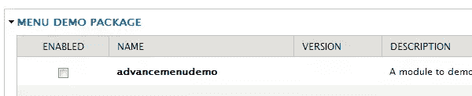
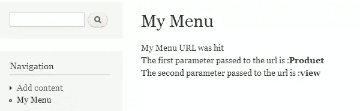
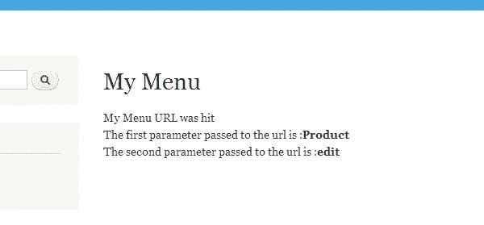
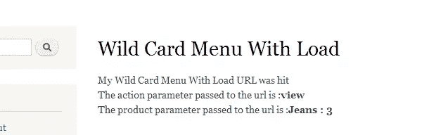
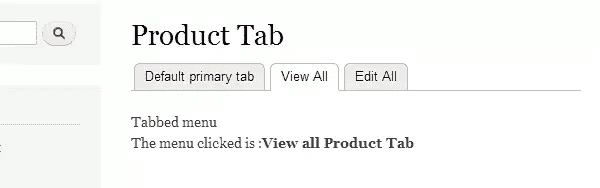

# Drupal 中的高级定制菜单

> 原文：<https://www.sitepoint.com/advanced-custom-menus-in-drupal/>

在上一篇文章[在 Drupal 中创建定制菜单](https://www.sitepoint.com/creating-custom-menus-in-drupal/)中，我们看到了如何响应 URL，如何在 Drupal 中创建菜单和子菜单，以及如何传递用于改变菜单回调函数输出的参数。

这些特性可能会满足您想要在 Drupal 上构建的大多数模块的需求，但除此之外，Drupal 菜单系统还为我们提供了更多的功能，例如向回调函数传递默认参数、在菜单 URL 中使用通配符、创建选项卡式菜单等

这些特性非常有用，可以帮助您以更简单、更高效的方式构建和设计模块。在本文中，我们将看到其中的一些功能，并了解如何在 Drupal 模块中使用它们。

## 创建模块

让我们首先创建一个名为 *advancemenudemo* 的独立模块。为此，创建一个文件夹*advance menu demo sitesallmodulescustom*，并在其中添加两个名为 *advancemenudemo.module* 和 *advancemenudemo.info* 的文件。将以下代码添加到 *advancemenudemo.info* 文件中:

```
;$Id$

name = advancemenudemo

description = A module to demo drupals menu system Part 2

package = Menu Demo Package

core = 7.x

files[] = advancemenudemo.module
```

如果一切正常，您现在应该在 Drupal 模块列表中看到您的模块，如下所示。

********

 **## 在菜单中传递默认参数

在上一篇文章中，我们看到 Drupal 菜单系统将 URL 中的任何附加参数作为参数传递。在许多模块中，有一个通用的菜单回调函数，它响应多个菜单项。

有些菜单项可能有一个额外的参数，有些可能没有。为了使用相同的回调函数，Drupal 中的菜单项可以定义传递给回调函数的默认参数。回调可以有正常的代码，该代码期望某些参数来处理输出。

我们为菜单项添加默认参数，如下所示:

```
/**

* Implementation of hook_menu().

*/

function advancemenudemo_menu() {

  $menuitems['menudemo'] = array(

  'title' => 'My Menu',

  'page callback' => 'advancemenudemo_mymenu_page_callback',

  'page arguments' => array('Product', 'view'),

  'access callback' => TRUE,

  'type' => MENU_NORMAL_ITEM,

  );

return $menuitems;

}

function advancemenudemo_mymenu_page_callback($firstparameter = '', $secondparameter ='') {

  $result = 'My Menu URL was hit';

  $result.='<br> The first parameter passed to the url is :<b>'.$firstparameter.'</b>';

  $result.='<br> The second parameter passed to the url is :<b>'.$secondparameter.'</b>';

  return $result;

}
```

在上面的代码中，我们指定了菜单项参数

```
'page arguments' => array('Product', 'view')
```

两个默认参数分别是产品和视图，它们将被传递给回调函数。

现在，如果您单击菜单项，输出将如下所示



如果您希望指定传递给回调函数的第一个参数是产品，而回调函数的第二个参数应该从 URL 获取，您可以按如下方式更新菜单项定义:

```
$menuitems['menudemo'] = array(

  'title' => 'My Menu',

  'page callback' => 'advancemenudemo_mymenu_page_callback',

  'page arguments' => array('Product', 1),

  'access callback' => TRUE,

  'type' => MENU_NORMAL_ITEM,

  );
```

在这里，您向 Drupal 菜单系统指定发送给函数*advance menu demo _ my menu _ page _ callback*的第一个参数应该是‘Product ’,第二个参数应该是 URL 中位于 *menudemo* 之后的第一个参数。

现在，如果你转到 URL *<你的 dupal 安装路径> /menudemo/edit* 输出如下:



注意:–Drupal 缓存一个模块实现的钩子，所以您可能必须转到管理配置开发性能并执行*清除缓存*来考虑 Drupal 7 中您的模块实现的钩子的新变化。

## 在菜单中使用通配符

有时你可能想对 URL 作出响应，因为你可能不想对 URL 的某些部分进行硬编码，这些部分可能是传递给你的回调函数的任何内容。

Drupal 允许您在 URL 中指定这样的通配符。您必须使用`%`符号来表示通配符。要定义在 URL 中的 *menudemo* 后带有任何单词的 URL，您必须在您的 *advancemenudemo_menu* 函数中指定以下菜单项:

```
$menuitems['menudemo/%'] = array(

  'title' => 'Wild Card Menu',

  'page callback' => 'advancemenudemo_mymenu_page_callback2',

  'page arguments' => array(1),

  'access callback' => TRUE,

);

function advancemenudemo_mymenu_page_callback2($firstparameter = '') {

  $result = 'My Menu URL with wildcard was hit';

  $result.='<br> The wildcard value parameter passed to the url is :<b>'.$firstparameter.'</b>';

  return $result;

}
```

在上面的代码中，我们用通配符指定了菜单项，回调函数是*advance menu demo _ my menu _ page _ callback 2*。位置 1 的元素是通配符字符串，将作为参数传递给回调函数。

函数*advance menu demo _ my menu _ page _ callback 2*只打印通配符参数的值。

现在如果你转到 URL *< drual 安装> /menudemo/view* 你会看到如下输出:


## 使用通配符加载对象

有时，您可能不希望通配符值直接传递给回调函数，而是希望获取该值，然后根据该参数进行一些处理或获取一些其他信息，*然后*将该信息传递给回调函数。

Drupal 框架允许您通过指定一个加载函数来实现这一点，该函数将写在`menuitem`定义中的通配符之后。您在定义中指定的值一个附加了`_load`的函数将用通配符的值调用，该函数的输出将用作回调函数的参数。

要使用通配符指定加载功能，菜单定义如下:

```
$menuitems['menudemo/%/product/%product_id'] = array(

  'title' => 'Wild Card Menu With Load',

  'page callback' => 'advancemenudemo_mymenu_page_callback_with_load',

  'page arguments' => array(1,3),

  'access callback' => TRUE,

  );

function product_id_load($id)

{

  //Here one can load a product from the database

  //or a file etc..

  $product = array();

  if($id=='1')

  {

    $product['name'] = 'Shirt';

    $product['quantity'] = '5';

  }

  else if($id=='2')

  {

    $product['name'] = 'Jeans';

    $product['quantity'] = '3';

  }

  return $product;

}

function advancemenudemo_mymenu_page_callback_with_load($action, $product)

{

  $result = 'My Wild Card Menu With Load URL was hit';

  $result.='<br> The action parameter passed to the url is :<b>'.$action.'</b>';

  $result.='<br> The product parameter passed to the url is :<b>'.implode(" : ",$product).'</b>';

  return $result;

}
```

作为第二个通配符中我们指定为 *%product_id* 的值，将调用加载函数 *product_id_load* 。在这个参数中，我们刚刚返回了一个定义具有该 id 的产品的数组。您可以从数据库或某个文件中获取 load 函数的详细信息。

现在，如果您访问 url *< drupal 安装> /menudemo/view/product/2* ，您将看到如下输出:



## 创建选项卡式菜单

Drupal 框架还允许您创建选项卡式菜单。要定义选项卡式菜单，首先我们必须定义一个普通的菜单项，然后定义一个本地默认任务，然后根据您想要的选项卡数量定义不同的本地任务。创建三个选项卡的菜单定义如下:

```
$menuitems['menudemo/producttab'] = array(

  'type' => MENU_NORMAL_ITEM,

  'title' => 'Product Tab',

  'page callback' => 'advancemenudemo_mymenu_tabbed_callback',

  'page arguments' => array('Main Product Tab'),

  'access callback' => TRUE,

  );

  $menuitems['menudemo/producttab/default'] = array(

  'type' => MENU_DEFAULT_LOCAL_TASK,

  'title' => 'Default primary tab',

  'weight' => 1,

);

  $menuitems["menudemo/producttab/viewall"] = array(

  'type' => MENU_LOCAL_TASK,

  'title' => 'View All',

  'page callback' => 'advancemenudemo_mymenu_tabbed_callback',

  'page arguments' => array('View all Product Tab'),

  'access callback' => TRUE,

  'weight' => 2,

);

$menuitems["menudemo/producttab/editall"] = array(

  'type' => MENU_LOCAL_TASK,

  'title' => 'Edit All',

  'page callback' => 'advancemenudemo_mymenu_tabbed_callback',

  'page arguments' => array('Edit all Product Tab'),

  'access callback' => TRUE,

  'weight' => 3,

);

function advancemenudemo_mymenu_tabbed_callback($firstparameter = '') {

  $result = 'Tabbed menu';

  $result.='<br> The menu clicked is :<b>'.$firstparameter.'</b>';

  return $result;

}
```

在上面的代码中，我们创建了一个产品选项卡和两个子选项卡:查看所有产品选项卡和编辑所有产品选项卡。回调函数只显示被点击的标签。

如果我们单击其中一个选项卡，您应该会看到如下输出:



## 结论

Drupal 有一个非常强大和灵活的菜单系统。它提供了一组丰富的功能，并在后台完成所有复杂的工作，为模块提供一个简单的接口来处理 URL 并为特定的 URL 生成内容。

Drupal 通过向 Drupal 模块添加几行代码，为您提供了用最少的代码创建简单菜单项到更复杂的选项卡式菜单的方法。Drupal 完成解析 URL 的复杂工作，并将其转换为代码中的函数调用，甚至在参数未被传递的情况下获取传递默认参数的参数。

基于这种基础结构，您的模块可以用最少的代码为用户提供简单的导航。

祝您在下一个 Drupal 模块中添加令人惊叹的菜单时愉快。

## 分享这篇文章**