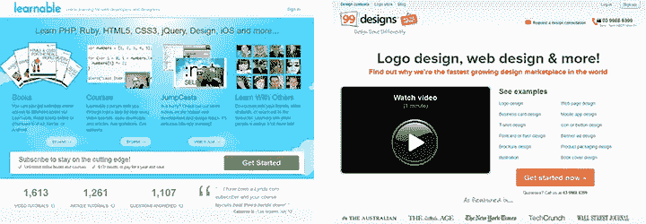

# 界面文字:行动号召还是隐藏的障碍？

> 原文：<https://www.sitepoint.com/interface-text-call-to-action-or-hidden-hurdle/>

你网站的跳出率如何？下载了你的应用程序的人中有多少人真正使用过它？你公司博客的评论率怎么样？

如果你对这些问题的回答不够好，你可能有问题。

文字的问题。

## 隐藏的障碍

我们每个人都能把一个句子串起来。在许多在线案例中，甚至不需要句子:我们都可以在按钮上输入“立即购买”或“登录”，或者“点击这里”进入链接。

当大多数人想到网络写作时，他们会想到信息页、电子书和电子邮件的长副本。

他们没有考虑的是界面文字。

界面文字告诉人们在你的页面上做什么:你的网站或应用做什么，以及他们如何访问这些功能。思考:定位句子、描述性文本、链接、按钮、菜单和标签。

文本直接影响界面的交互性、功能性和可用性。我甚至可以说它和设计一样重要。

不相信我？好吧，让我们来看看我的理论。

## 亲自看

如果说网络有什么了不起的，那就是引领潮流。就像设计和开发有趋势一样，界面文字也有趋势。

一个例子是不起眼的“开始”按钮。十年前,“开始”并不是一个受欢迎的 CTA——人们仍然关注“点击此处并立即购买”。

但是今天，行动起来才是最重要的，尤其是对于媒体喜欢称之为“颠覆性”在线服务的行动号召——可学习的 T1 和 T2 的 99 设计 T3 只是两个例子。

然而， [Tweaky 最近发现](http://www.tweaky.com/blog/how-tweaky-increased-conversions-43-listening-to-peep-laja/)，即使是一个简单明了的入门 CTA 也不一定尽如人意。

遵循专业建议，他们调整了调整。

Tweaky 对其网站*所做的四分之三的改变都是基于文本的*。他们没有改变布局，图像甚至 IA。他们所做的只是改变了网站上三个地方的措辞，并增加了聊天标签上的颜色对比。

考虑到他们的主要行动号召，他们添加了一个标题，这样用户就会知道当他们点击时会发生什么。

结果呢？转化率提高了 43%。

正如 Tweaky 发现的那样，几个小词可以对一个网站的转化率产生很大的影响。

但是这种特殊的解决方案需要用户额外的阅读和关注。那是最好的选择吗？

网络上的其他例子— [立即创建您的商店](http://www.shopify.com/)、[注册](http://www.ebay.com/)、[创建您的免费帐户](http://www.yelp.com/)、[搜索](https://www.airbnb.com)、[登录](http://instagram.com/)、[立即购买](http://www.offscreenmag.com/)—显示出常见 CTA 的种类繁多。

你想在*你的*网站上使用哪一个？

## 是时候关注隐藏的障碍了吗？

在接下来的几周，我们将更密切地关注数字开发者、设计师和企业家每天都面临的一系列界面和可用性相关的文本问题——不管你是否意识到了这一点。

这样做的目的是帮助你抓住那些可能阻碍你的网站、你的应用以及最终你的业务的文本相关问题。

如果你有任何具体的问题想问，请在下面的评论中告诉我们。

下周，我们将会看到你谈论你的产品的方式是否真的迷惑了网站的用户，而不是教育(甚至是激发)他们。到时候见。

## 分享这篇文章