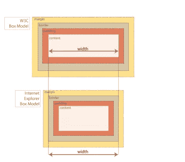

# CSS 架构:新的最佳实践

> 原文：<https://www.sitepoint.com/css-architectures-new-best-practices/>

众所周知，前端开发的世界在过去几年里已经发生了很大的变化，新鲜的头脑已经设计出新的方法来解决古老的问题。这里有一些前端编码的最新最佳实践，对你的样式表和 HTML 有很大的帮助。

## 用 Normalize.css 重置

CSS 重置有助于建立一个基线，从这个基线开始设置所有的样式。重置有效地覆盖了浏览器对某些元素的默认样式(可能会有很大变化)。尽管在过去的几年里 [CSS 重置](http://msdn.microsoft.com/en-us/magazine/gg257960.aspx)很流行，但是许多网站仍然没有使用它们，这些网站的 CSS 可伸缩性因此大受影响。

与其用 Eric Meyer 极其流行的 CSS Reset([因为太深远](http://snook.ca/archives/html_and_css/no_css_reset/))或者编个 [DIY reset](http://www.peachpit.com/blogs/blog.aspx?uk=To-CSS-Reset-or-Not-to-CSS-Reset) ，很多人推荐用 [normalize.css](http://nicolasgallagher.com/about-normalize-css/) 。css 将代码“规范化”到一个公共基线，而不是在所有浏览器中重置元素的基本样式。参考 Github 上的 [normalize.css 项目，以下是它相对于 css 重置的优势:](https://github.com/necolas/normalize.css/)

*   与许多 CSS 重置不同，保留了有用的默认值
*   标准化各种 HTML 元素的样式
*   纠正错误和常见的浏览器不一致
*   通过细微的改进提高可用性
*   使用详细注释解释代码的作用

使用 normalize.css 代替标准的重置将使您有正确的编码基础，并节省大量时间，而不必重新建立基线样式。

## 明确确定清算浮动

如果你还在使用这里显示的方法来清除文档中的浮动，那么我们真的需要谈谈:

```
<div class="clear"></div>
...
.clear { clear: both; }
```

除了这种方法之外，还推荐其他的清除方法，这是大约 10 年前，当带有浮动的 CSS 布局首次开始实现时，设计的第一种浮动清除方法之一。

[在](http://nicolasgallagher.com/micro-clearfix-hack/) [HTML5 样板](http://html5boilerplate.com/)中使用的 Micro Clearfix ，采用了最新的、可靠的前端编码最佳实践。Micro Clearfix 支持 Firefox 3.5 及更高版本、Safari 4 及更高版本、Chrome、Opera 9 及更高版本以及 Internet Explorer 6 及更高版本。这里有一个例子:

```
/* For modern browsers */
.cf:before,
.cf:after {
  content:"";
  display:table;
}

.cf:after {
clear:both;
}

/* For IE 6/7 (triggers hasLayout) */
.cf {
  *zoom:1;
}
```

清场。cf 类应该被添加到所有包含浮动的元素中。在这种情况下，应用了 clear(

)的老式空分隔线元素可以从您的曲目中永久退役。

### 溢出:隐藏呢？

清除浮动的另一种流行技术是使用 overflow: hidden，尽管更强烈地推荐使用 Micro Clearfix，因为在 Internet Explorer 7 和早期版本中，overflow: hidden 方法有时会出现问题。

虽然使用 overflow:hidden 一度几乎是每个人最喜欢的浮点清除技术，但它也带来了如下问题:

*   当浏览器窗口小于容器时，隐藏没有滚动条的内容和子元素[。](http://www.themepartner.com/blog/61/dont-use-overflowhidden-for-clearing-floats/)
*   干扰边距、边框、轮廓和绝对定位的 png。
*   CSS3 属性的应用，[，如框阴影、文本阴影和变换](http://fordinteractive.com/2009/12/goodbye-overflow-clearing-hack/)。

真实世界的 HTML5 和 CSS3 的合著者 Louis Lazaris 认为使用溢出:隐藏的 T2 会在复杂的布局中引起问题，并建议避免使用它，支持微 Clearfix。

如果您决定使用 rock overflow:hidden，那么请使用它的以下版本，该版本允许 Internet Explorer 中的 hasLayout 和块级元素:

```
.container { 
  overflow: hidden;     /* Clearfix! */ 
  zoom: 1;              /* Triggers "hasLayout" in IE */ 
  display: block;       /* Element must be a block to wrap around contents. Unnecessary if only 
                        /* using on elements that are block-level by default. */ 
}
```

## 圆规

说到不正确地使用空白 div……你必须停止摇摆空白的 cleared

,它还被分配了一个边框作为分页符:

```
<div class="divider"></div>
...
div.divider {
border-top: 1px solid #ABAA9A;
clear: both;
}
```

是的，我知道这段代码作为一个清晰的可视分页符做得很好，但是它没有语义。CSS 忍者和面向对象 CSS (OOCSS)的创造者妮可·沙利文建议使用< hr >元素来划分页面的各个部分，并为其添加必要的样式。

因此，您可以使用下面的代码来代替前面的代码:

```
<hr class="divider">
...
.divider {
border-top: 1px solid #ABAA9A;
clear: both;
}
```

## 图像替换

前端开发在用图像代替文本的 CSS 技术方面有着悠久而辉煌的历史。2012 年 3 月，Jeffrey Zeldman 在这个街区引入了一个新的孩子，被认为是[凯鲁姆方法](http://www.zeldman.com/2012/03/01/replacing-the-9999px-hack-new-image-replacement/)。他的技术不是使用-9999px hack 将文本隐藏在屏幕之外(并在此过程中创建一个巨大的隐形框)，而是隐藏文本，同时让屏幕阅读器可以访问它。

```
.hide-text {
text-indent: 100%;
white-space: nowrap;
overflow: hidden;
}
```

性能得到改善，尤其是在平板电脑和较小的屏幕设备上。

## 使用图标元素

您可能会使用  作为在页面中放置图标的方式，如下所示:

```
<li class="favorite">
<span class="icon favorite"></span><span id="favorite-insert-point" class="favorite"></span>
</li>
```

如果是这样，试试大小:图标可以与图标元素一起使用，利用*标签。这种方法在 Twitter Bootstrap 中使用后变得越来越流行。*

```
<p><i class="icon icon-comment"></i>23 comments</p>
...
.icon { background-image: url( sprites.png ); }
.icon-comments { background-position: 0 -30px; }
```

使用*比使用标准的标签更具语义，并且更容易识别图标在页面中的位置。*

## 登上 CSS3 列车

通常，网站会在不必要的地方使用图片，并且变得图片过多。使用 CSS3 有助于消除这些图像，同时让网站为转向响应式设计实践做好准备。对于大多数网站来说，CSS3 对于圆角(边框半径)、阴影(框阴影)、文本阴影(文本阴影)、渐变和框大小的任何实例都是一个福音。

然而，CSS3 有两个缺点:首先，CSS3 规范的许多部分仍在不断变化，因此即使是现代浏览器也要求大多数属性都有供应商前缀。第二，流行的老浏览器不支持 CSS3，因此需要回退或助手脚本。

### CSS3 兼容性

不幸的是，旧版本的 Internet Explorer 与 CSS3 的兼容性问题最多。目前，Internet Explorer 9 仅部分支持 CSS3(最明显的是 CSS3 选择器；最新列表见 [HTML5 和 CSS3 支持](http://fmbip.com/litmus/))，完全不受 Internet Explorer 6 到 8 的支持。如果您计划使用任何 CSS3 属性，我建议为使用 Internet Explorer 9、8 或更早版本的用户安装适当的后备。

幸运的是，有一些脚本可以帮助你。Internet Explorer 中对 CSS3 的支持得益于以下内容:

*   [IE9.js](http://code.google.com/p/ie7-js/) 。对于 IE9.js 影响了哪些属性以及修复了哪些问题，有一个很好的解释。
*   [选择性 r](http://selectivizr.com/)
*   [CSS3 派](http://css3pie.com/)
*   [CSS 砂纸](http://www.useragentman.com/blog/csssandpaper-a-css3-javascript-library/)
*   [现代化 2](http://modernizr.com/)

这些脚本的缺点是增加了页面权重和加载时间，但这种权衡是值得的。

### CSS3 的工具

CSS3 的概述以及哪些属性现在可以安全使用可能是另一篇文章的主题。关于 CSS3 最重要的一步是跟上规范的变化和浏览器对它们的采用。跟踪所有这些可能有点痛苦，所以我建议使用 http://css3please.com/[和 http://html5please.com](http://css3please.com/)[的网站来了解最新的语法变化和支持。有许多很棒的 CSS3 生成器可用。对于几乎所有的属性，](http://html5please.com/)[请 CSS3！](http://css3please.com/)是一个奇妙的资源。对于渐变来说， [Ultimate CSS 渐变生成器](http://colorzilla.com/gradient-editor/)是一个很好的工具，可以用正确的语法和回退来生成渐变代码。

如果你觉得特别懒，不想记住如何写出所有的厂商前缀， [Prefixr](http://prefixr.com/index.php) 会把它们添加到你的代码中。你也可以使用 Lea Verou 的这个很棒的脚本，它会在你的 CSS 上传到服务器后添加所有的前缀。

## 建立一个网格

如果你的站点目前还没有建立网格，你必须“[HIE you they](http://www.bathcsd.org/webpages/edepartment/shakespearean_terms.cfm)”并建立一个。如果您当前的代码拥有大量的宽度、边距和填充实例，并且元素之间的尺寸不一致，那么您的站点早就应该有网格了。

你可以使用你的元素的维度来构建你自己的，或者你可以使用一个[预制的 CSS 网格框架](http://www.xhtmljunction.com/blog/10-popular-css-grid-systems-for-a-website/) ( [有几十个](http://inspirationfeed.com/resources/tools/30-time-saving-css-grid-systems-for-web-designers/)、[甚至是响应式的](http://designshack.net/articles/css/which-is-right-for-me-22-responsive-css-frameworks-and-boilerplates-explained/))。

### 使用盒子大小

如果你正在制作自己的网格，一个非常有用的 CSS 属性就是盒子大小。框大小可以改变浏览器计算元素框大小的方式，它[是处理尺寸](http://css-tricks.com/box-sizing/)的天赐之物，尤其是对于布局和网格。

盒子大小根据所谓的“IE 盒子模型”来计算元素盒子的尺寸，也就是说，在盒子的大小中考虑填充。这意味着当一个元素的宽度和填充一起声明时，框将等于宽度的数量，而不是宽度加上填充的数量。**图 1** 说明了这个想法。



**图 1 W3C Box-Model 与 Internet Explorer Box-Model 的比较**

使用 box-sizing: border-box(与 box-sizing: content-box 相反，后者是基于 W3C box 模型的默认设置)可以大大简化布局计算。属性框大小需要供应商前缀。

### 使网格和图像流畅

规划建立一个网格的最后一个方面(如果你想提前[对未来友好](http://futurefriend.ly/))是从一个固定的像素网格切换到百分比(或 ems)网格。确定大小百分比的最好方法是使用伊桑·马科特的[响应式网页设计黄金公式](http://alistapart.com/article/responsive-web-design)[:target = content/context](http://alistapart.com/article/responsive-web-design)。谢天谢地，有计算器可以帮助确定网格的 RWD 数。我推荐 RWD 计算器。

对未来友好的另一个关键是让图像适应并随着容器的大小而移动。建立这种关系的主要方法是一行简单的代码:

```
img {
max-width: 100%;
height: auto;
}
```

图像现在将在流体容器内缩小或增大。

## 别忘了 HTML5

最后，总的来说，HTML5 对所有网站的发展都是至关重要的。这不再是一个给定站点是否决定实现它的问题，而是一个何时实现的问题。我觉得 HTML5 有几个方面对任何人来说都是有用的，可以为响应式设计奠定基础，但最容易的地方是从 HTML5 doctype 开始。HTML5 doctype 是一种快速更改，您可以立即对页面模板进行更改，作为转向 HTML5 标签和文档重组的先导。

```
<!DOCTYPE html>
```

因为 doctype 是向后兼容的，所以文档中的其他内容不需要更改，但是如果引入任何 HTML5 标记，它们都可以工作。

说到标签，HTML5 可以利用的另一个方面是采用一些新的标签，这有助于页面语义，同时为创建代码模块奠定了良好的基础。然而，与 CSS3 一样，向后的浏览器兼容性是一个需要认真考虑的问题。为了支持新标签的识别，必须在页面上使用脚本，以使旧浏览器能够正确呈现 HTML5 元素。

最常见的脚本是 [HTML5 Shiv](https://code.google.com/p/html5shiv/) ，它允许 Internet Explorer 6 到 8 识别 HTML5 元素。唯一的缺点是还有另一个脚本要添加到页面负载中。但是真的，没必要等着用 HTML5，所以[潜进](http://diveintohtml5.info/)！

## 漂亮，干净，准备好进行重大重组

还不算太糟，是吧？通过给代码一个适当的结构，在宏观层次上清理代码，然后缩小到微观层次上组织代码，你可以做很多事情来改进令人发指的 CSS。用更高效的最佳实践进一步取代过时的解决方案也有很大帮助。

所以现在我们已经完成了初步的清理工作，我们准备开始一些严肃的 CSS 重组工作。通过采用越来越流行的可伸缩 CSS 架构的一些方法，可以将站点的样式表带到可维护性和效率的下一个级别。

挂紧；在本系列的下一篇文章中，您将对这四种方法进行概述。

## 分享这篇文章