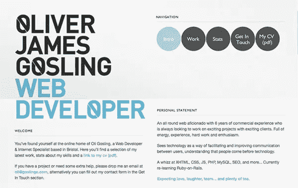
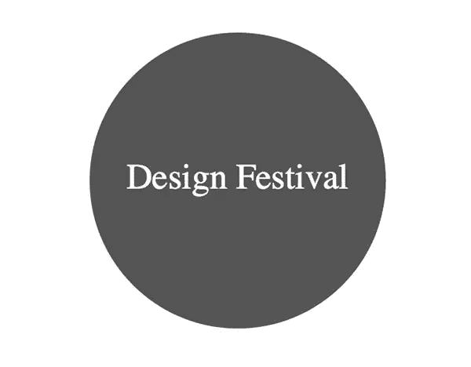
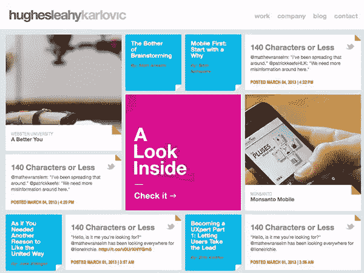
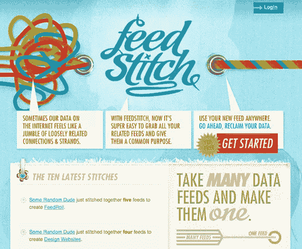
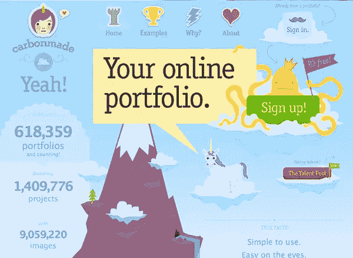
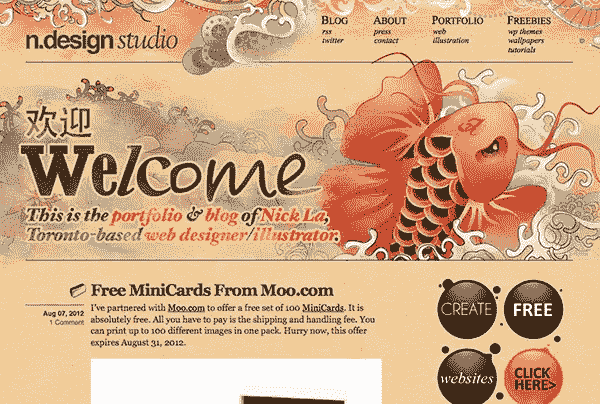
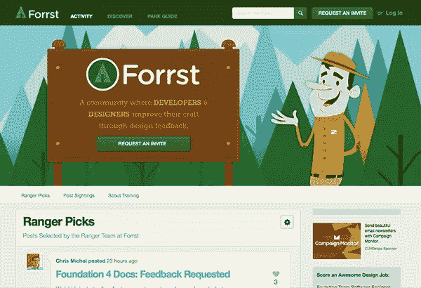
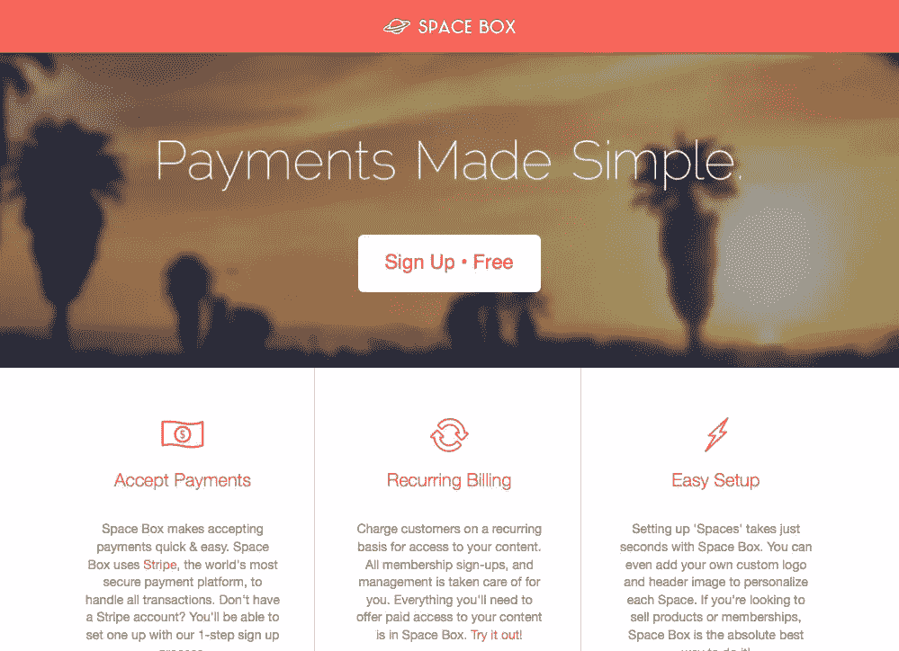

# 让你的公司更友好的 5 种颜色、形状和技术

> 原文：<https://www.sitepoint.com/5-colors-shapes-and-techniques-that-make-your-company-friendlier/>

无论你经营的是只有几个客户的小企业，还是每天面向数千人的大公司，你的在线形象都是至关重要的。拥有一个冰冷、不吸引人的网站对生意不利。这给你的访问者传递了错误的信息，会让你失去他们的信任，甚至会阻碍你的业务增长。许多网站实现的风格和技术有助于使他们的网站更友好、更吸引人。如果你的网站看起来冷漠和不友好，你可以使用刻意的颜色、形状和其他技术来使你的网站更吸引人、更可信、更有吸引力。

### 圆形和圆角

[](https://www.sitepoint.com/wp-content/uploads/2013/03/circles.jpg)

作为网页设计师，我们都知道所有的元素和容器都是由盒子组成的。一切都是由正方形和长方形组成的。然而，在你的网站上添加圆形元素有助于打破常规，让你的网站看起来更友好，更有吸引力。如果你担心不同浏览器之间的一致性，不要担心，你可以在 CSS 中实现圆角甚至全圆。只需在想要圆角的元素上使用边框半径样式。您可以一次倒圆角，也可以逐个倒圆角。你也可以保留一些方形和一些圆形。CSS 为你提供了你正在寻找的灵活性，而不损害网络标准。以下是您的操作方法:

```
#main{
width:400px;
height:400px;
border-radius:200px;
-webkit-border-radius:200px;
background:#555;
color:#fff;
text-align:center;
margin:auto;
}
#main p{
padding:170px 0px 0px 0px;
font-size:48px;
}
```

假设您要循环的 div 的 id 是 main。假设它的宽度和高度为 400 像素。如果你想在 CSS 中创建一个圆形，你所要做的就是创建一个宽度和高度的一半的边框半径，也就是 200 像素。我设置背景为灰色，文字颜色为白色。您可以通过添加垂直填充以视觉方式对齐文本。结果如下所示:

[](https://www.sitepoint.com/wp-content/uploads/2013/03/circle.jpg)

### 鲜艳的颜色

使用正确的颜色会对网站的观感产生巨大的影响。如果你想寻找有趣、友好、有吸引力的颜色，那么血红色和黑色可能不是一个好的搭配。你可以在恐怖电影网站上找到这些颜色。相反，试着在你的网站上使用明亮、活泼的颜色。有数千甚至数百万种颜色组合，所以[尝试不同的配色方案](https://www.sitepoint.com/color-theory-101-2/ "Color Theory 101")。如果你的品牌是深色的，那么一切都没有失去。你可以很容易地添加一两种强调色，只要主色与你的品牌保持一致。

[](https://www.sitepoint.com/wp-content/uploads/2013/03/hughs.jpg)

休斯采取了正常的公司外观，并通过这种设计将其抛弃。洋红色和青色相互衬托，给原本平淡无奇的配色方案增添了几分趣味。请注意每个文本框角上的橙绿色和橙色。外观对于一个公司网站来说很俏皮。

[](https://www.sitepoint.com/wp-content/uploads/2013/03/feedstitch.jpg)

Feedstitch 采用了新闻提要的概念，这可能相当复杂，并通过简单的插图、纹理背景和轻松诱人的配色方案使其变得有趣。

### 卡通和插图

有时候，需要更友好的只是风格本身。除了依赖于单调的颜色和正文的极简网站之外，你还可以加入插图元素。漫画或插图可能并不适用于每一家企业，但如果你想显得有趣和以人为本，那么使用插图风格可能会为你的企业创造奇迹。以下是一些带有插图的网站示例:

[](https://www.sitepoint.com/wp-content/uploads/2013/03/carbonmade-illustrations.jpg)

Carbonmade 的网站驳斥了投资组合应该是中性和乏味的观点。他们主页上有趣的插图组合立即引起了访问者的兴趣。

[](https://www.sitepoint.com/wp-content/uploads/2013/03/illustrations-n.designstudio.jpg)

这个网站的设计现在非常有名，因为锦鲤的设计很好，给网站增加了生动活泼的外观和感觉。色彩的混合和现实主义的传统艺术风格确实给这个网站一种手工制作的感觉。

[](https://www.sitepoint.com/wp-content/uploads/2013/03/forrst-friendlier.jpg)

Forrst 是一个在设计师和开发人员中很受欢迎的网站，它使用友好的插图来吸引专业人士请求邀请。这是一个很好的策略，因为要求对你的工作进行反馈对某些人来说是相当吓人的。友好的插图使网站更有吸引力。

### 人性化文案

许多企业专注于在他们的网站上尽可能多地塞进与行业相关的行话("*我们是一家全球性的端到端解决方案提供商，为财富 500 强公司和早期创业公司…* ")。我理解他们的想法，因为他们只是想加强自己的可信度，但同时，所有这些技术术语对一些人来说可能真的很吓人。如果你想努力做到对人友好，那么你可能需要再看一眼你的文案。你网站的主页应该简单、具体、有描述性。您可以将所有技术术语留到更深的页面中。如果你的话看起来很冷漠，有些人可能会认为你只在乎钱，他们只是另一个数字。让你的访问者知道你真的关心他们，这对于设计网络友好性大有帮助。

### 友好的图像

许多网站使用高质量的图像在他们的网站上做出大胆的声明，但这种光滑的图像并不总是传递正确的信息。例如，假设你拥有一家建筑公司，你为人们建造漂亮的房子。你可以在主页上展示你建造的漂亮的房子，这看起来很专业，是一个相当好的设计选择。然而，如果你想变得更友好，创造更强的吸引力，你可以选择人们真正享受他们的家的图片。你可以想象一家人在吃饭，笑着，在他们美好的新家里度过一段美好的时光。你可以展示一个家庭在后院享受他们定制的甲板，或者一个家庭在一个豪华、漂亮的厨房里享受。当涉及到建立个人联系时，意象可以发挥很大的作用。美丽家园的图像很棒，但很难让人与砖块和木头产生情感联系。如果你让那些房子里住满了过着自己生活的人，观众就更容易将自己投射到那些房子里。像这样的图像可以引发一段美好的回忆，或者可能接近某人在买房成家后对自己的想象。

[](https://www.sitepoint.com/wp-content/uploads/2013/03/Screen-Shot-2013-03-23-at-6.06.27-PM.png)

上面的图片展示了棕榈树和令人放松的日落，这是很好的图片，可以与典型的寻求付款的压力任务相结合。这张图片强调了这样一个观点，即当付款滚滚而来时，你可以放松并享受自己，而不是一场争论。这展示了一个非常聪明，深思熟虑的图像选择。

### 结论

创建一个友好的网站对商业非常有益。你可以很严肃，在友好的同时展示你在某个特定行业的权威。通过友好文本、图像、形状和颜色的正确组合，您可以同时创造出专业感和趣味性(这通常被视为相互排斥的对立面)。网站不一定要冷冰冰的，单纯的信息；让访问者敞开心扉，放松警惕，实际上会增加转化率。建立信任和具有说服力可以很容易地通过一个漂亮的、结构良好的、友好的网站来实现。

*有没有友好网站的例子可以补充？出于对公司形象的考虑，你的客户是否经常把你推向冷酷、不友好的设计选择？你有没有引导他们选择对客户更友好的设计？*

## 分享这篇文章