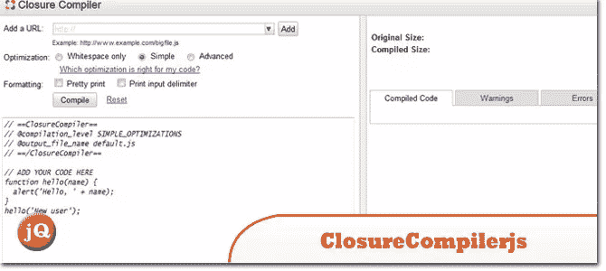
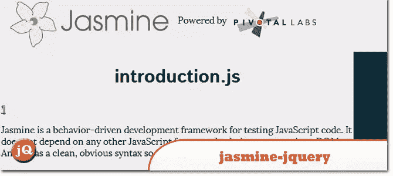
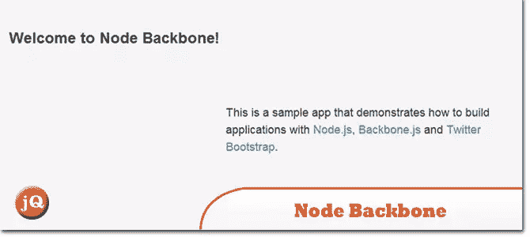
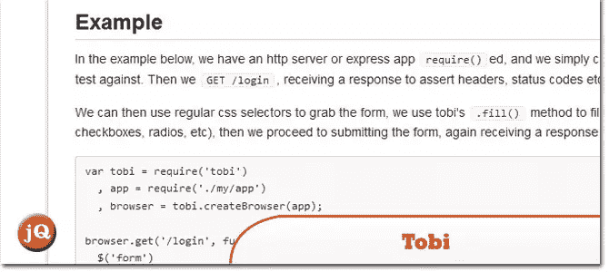
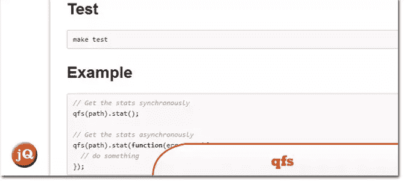
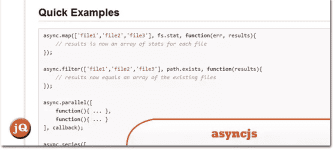
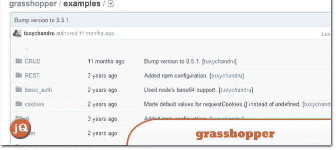
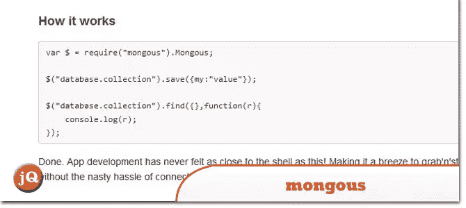

# 10 带有 jQuery 插件/扩展的 Node.js

> 原文：<https://www.sitepoint.com/10-node-js-jquery-pluginsextensions/>

今天的帖子是 node.js 和 jQuery 插件和模块/框架扩展的集合。了解 jQuery 如何补充与 node.js 一起使用的框架或受 node . js 启发的框架是很有用的。享受吧。

## 1.jscex-jquery

对 jQuery 1.5+的异步/等待支持

 
[来源](https://github.com/audreyt/jscex-jquery#readme) [演示](http://audreyt.github.com/jscex-jquery/samples/sorting-animations.html)

## 2.ClosureCompiler.js

全方位无忧套餐。如果需要，自动下载并设置闭包编译器和从 OpenJDK 构建的 JRE。无需设置环境变量，开箱即用。

 
[来源](https://github.com/dcodeIO/ClosureCompiler.js#readme) [演示](http://closure-compiler.appspot.com/home)

## 3.nQuery(测试版)

用 node.js 远程控制 jQuery/Zepto(实验性)

 
[来源](https://github.com/tblobaum/nodeQuery#readme) [演示](http://todos-nquery.nodejitsu.com/)

## 4.茉莉-jquery

Jasmine 框架的 jQuery 匹配器和夹具加载器

 
[来源](https://github.com/dkastner/node-jasmine-jquery#readme)

## 5.节点主干样本项目

这是一个 Node/HTML5 应用程序的示例项目，分别针对桌面浏览器(web)、使用 jQuery Mobile (jquerymobile)和 iPhone (iphone)的通用移动平台进行了优化。它的服务器端项目是基于 robrighter / node-boilerplate 的，而它的客户端项目是基于 ccoenreats/backbone-directory 的。

 
[来源](https://github.com/vinkaga/node-backbone#readme) [演示](http://nodebackbone-vinkaga.dotcloud.com/)

## 6.鸢

用 jQuery 进行有表现力的服务器端功能测试

 
[来源](https://github.com/LearnBoost/tobi#readme)

## 7.qfs

jQuery 方式的文件 I/O。

 
[来源](https://github.com/tommy351/qfs#readme)

## 8.异步. js

用异步函数操作值序列的一种干净、可组合的方式。

 
[来源](https://github.com/fjakobs/async.js#readme) [演示](https://github.com/caolan/async)

## 9.蝗虫

一个功能丰富、灵活的 MVC 框架，用于构建在 node.js 上的 web 应用和服务。

 
[来源](https://github.com/tuxychandru/grasshopper#readme) [演示](https://github.com/tuxychandru/grasshopper/tree/master/examples/)

## 10.蒙哥斯

Node.js 的简单 MongoDB 驱动程序，带有类似 jQuery 的语法。

 
[来源](https://github.com/amark/mongous)

## 分享这篇文章