# 在 Illustrator 中创建一个可爱的怪物吉祥物

> 原文：<https://www.sitepoint.com/create-an-adorable-monster-mascot-in-illustrator/>

矢量化字符通常用于为企业建立更友好的品牌。它们具有巨大的视觉吸引力，能对观众产生直接的影响，同时它们也是设计师在没有正常商业约束的情况下释放创造力的难得机会。有很多图形设计应用程序可以帮助你制作下一个吉祥物，包括 Illustrator、Photoshop 和 Corel Draw。

在本教程中，我将向你展示如何在 Illustrator 中创建一个不可抗拒的可爱的矢量怪物。我们将使用钢笔工具，铅笔工具，形状工具，符号工具，以及效果菜单中的各种选项来实现最终的效果。我们将使用简单的技术产生一个华丽的 3D 角色。所以，让我们开始吧！

**最终结果:([下载分层设计文件](https://www.dropbox.com/s/4piydvyjd42ofd6/Monster.zip)。)** 

[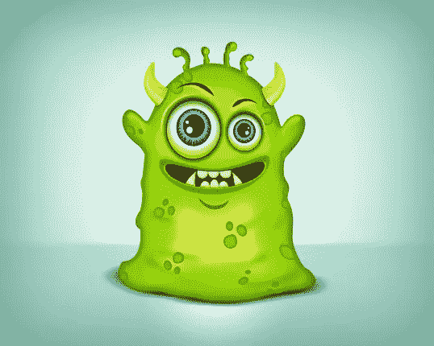](https://www.sitepoint.com/wp-content/uploads/2013/03/Final-result21.jpg)

### 第一步

在 Illustrator 中创建新文档，宽度为 600 像素，高度为 500 像素。

[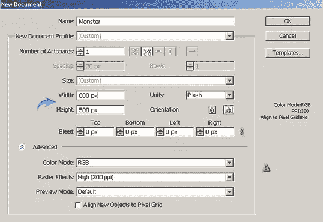](https://www.sitepoint.com/wp-content/uploads/2013/03/110.jpg)

### 第二步

使用钢笔工具或铅笔工具画出怪物的基本形状，无论你用什么工具都可以。你的怪物不需要和我的一模一样，你可以随心所欲地塑造它。将这一层标记为“身体”

[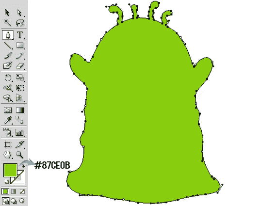](https://www.sitepoint.com/wp-content/uploads/2013/03/23.jpg)

现在，选择身体层，按下相应层右侧的环形目标，然后进入“效果”>“风格化”>“内部发光”在此使用以下设置。

[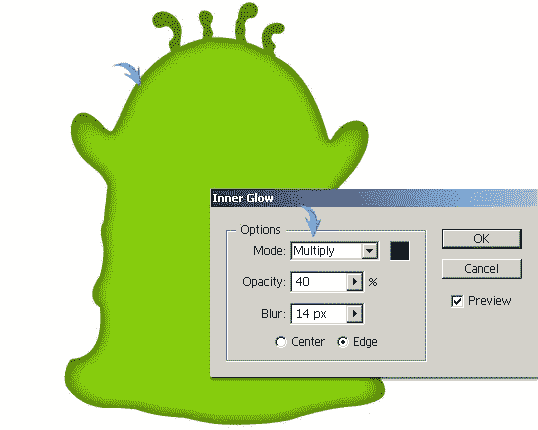](https://www.sitepoint.com/wp-content/uploads/2013/03/2b.jpg)

### 第三步

接下来，我们要做眼睛。使用椭圆工具画一个椭圆。

[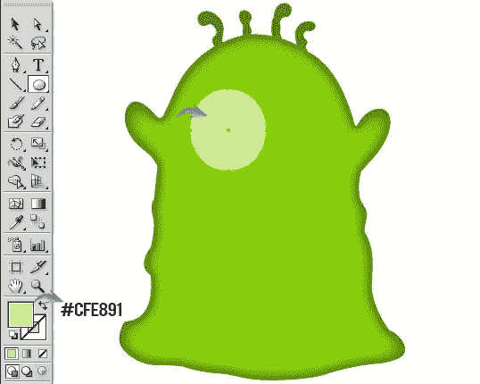](https://www.sitepoint.com/wp-content/uploads/2013/03/31.jpg)

### 第四步

在上一个椭圆内用白色画另一个椭圆。选择它，进入“效果”>“模糊”>“高斯模糊”此处应用 10px 值。

[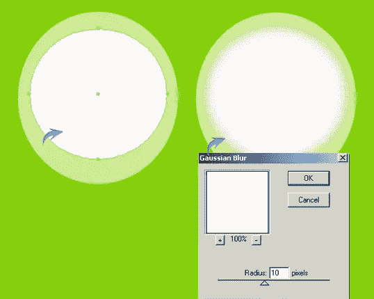](https://www.sitepoint.com/wp-content/uploads/2013/03/41.jpg)

### 第五步

要在眼球底部创建阴影，画一个椭圆。复制它并向上拖动。现在，选择这两个椭圆，并在路径查找窗口中按“负前”形状模式(Shift + Ctrl + F9)。

之后，在半月形上应用 9px 高斯模糊效果，并将混合模式改为“正片”

[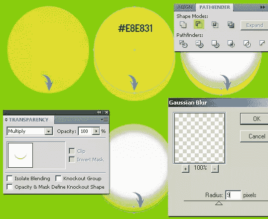](https://www.sitepoint.com/wp-content/uploads/2013/03/51.jpg)

### 第六步

要混合眼睛层，画一个灰色椭圆覆盖眼球，改变其混合模式为“屏幕”，其不透明度为 50%。

[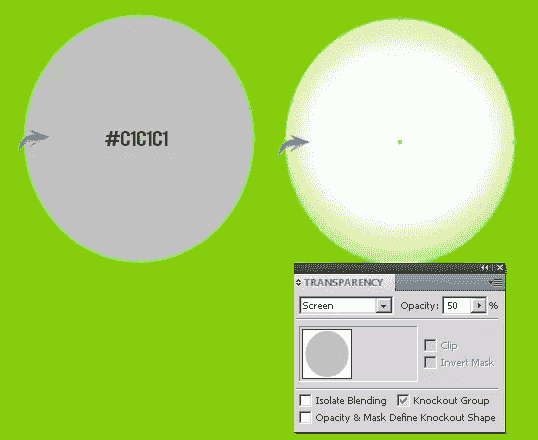](https://www.sitepoint.com/wp-content/uploads/2013/03/61.jpg)

接下来，用黑色填充眼球的顶部，制作另一个半月形。复制它，向下拖动一点，改变它的颜色为浅灰色，如下所示。

[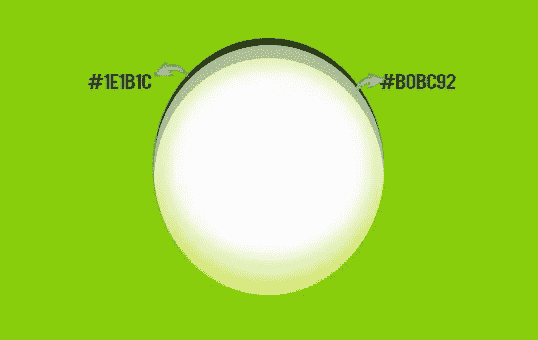](https://www.sitepoint.com/wp-content/uploads/2013/03/6b1.jpg)

### 第七步

现在，用 1 磅的灰色笔触在其余图层上方绘制一个蓝色椭圆，并应用以下设置为内部发光。

[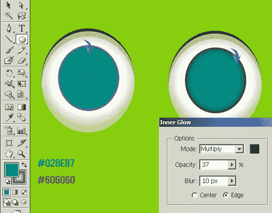](https://www.sitepoint.com/wp-content/uploads/2013/03/71.jpg)

现在，设置填充颜色为无，并选择一种如下的颜色。选择铅笔工具在上一个圆上绘制不规则的线条。之后，选择这些线，并从顶部选项栏中将其宽度轮廓更改为“1”。减少这一层的不透明度为 75%，改变其混合模式为“叠加”

[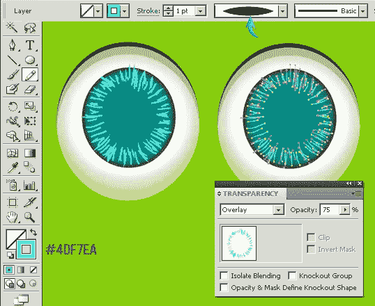](https://www.sitepoint.com/wp-content/uploads/2013/03/7b.jpg)

### 第八步

画一个较小的椭圆，并应用以下内发光值。之后在后面画一个更大的白色椭圆，对其应用 8px 高斯模糊效果。改变这一层的混合模式为“叠加”

[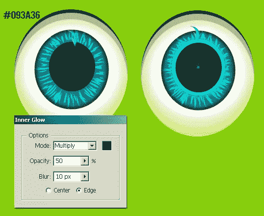](https://www.sitepoint.com/wp-content/uploads/2013/03/81.jpg)

接下来，制作下图所示的光点。

### 第九步

在其余的眼睛层下面画一个深绿色的椭圆，在上面应用 10px 的高斯模糊效果，与怪物的身体无缝融合。

[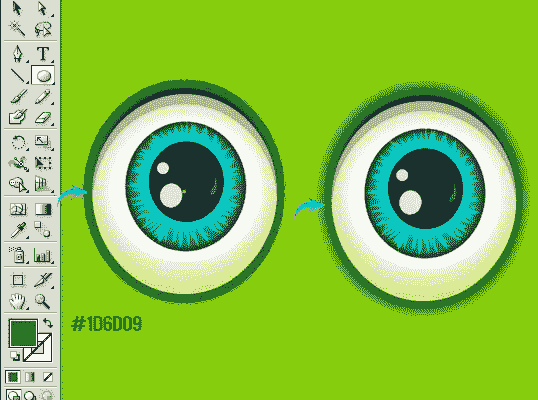](https://www.sitepoint.com/wp-content/uploads/2013/03/91.jpg)

### 第十步

现在设置填充颜色为无，选择一个 3pt 的笔画。使用钢笔或铅笔工具画一条曲线，如下所示。之后，选择它，并将其宽度轮廓更改为“宽度轮廓 1”

[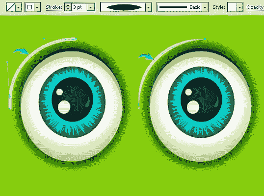](https://www.sitepoint.com/wp-content/uploads/2013/03/101.jpg)

画一个 7 磅的眉毛，并把它的宽度轮廓改为“宽度轮廓 5”

[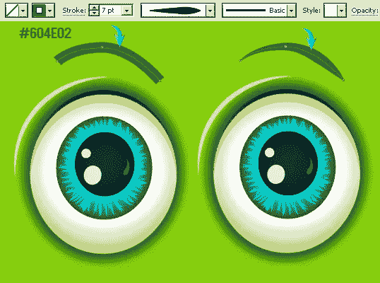](https://www.sitepoint.com/wp-content/uploads/2013/03/10b1.jpg)

### 步骤 11

选择所有眼睛图层，点击图层面板右上角的选项框。从选项中选择“在新图层中收集”。复制这一层，选择它，右键单击画布，并选择“转换”>“反映。”垂直反射它以调整复制眼睛上高光和眉毛的方向。现在缩小它的尺寸，把它放在右边。

### 步骤 12

接下来，我们将制作怪物的嘴。设置以下填充和描边(1 磅)颜色。选择钢笔工具，并绘制如下所示的形状。之后，使用下面的设置在它上面应用一个内部发光效果。

[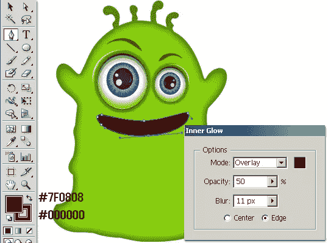](https://www.sitepoint.com/wp-content/uploads/2013/03/121.jpg)

### 第十三步

复制嘴的形状，把它放在原来的层下面，向下拖动一点。改变其填充颜色为白色，其中风为无。现在，改变其混合模式为“叠加”，并减少其不透明度为 75%。要混合嘴和身体，复制嘴的形状层，并把它放在原来的下面。设置其填充颜色为深绿色，并应用 10px 高斯模糊效果。之后，增加形状的大小，如下图。

[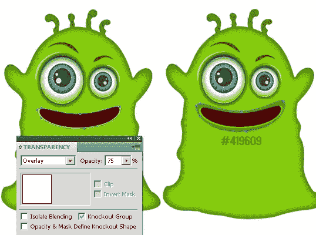](https://www.sitepoint.com/wp-content/uploads/2013/03/131.jpg)

### 步骤 14

使用钢笔工具和椭圆工具制作牙齿。为了清楚起见，请看下面。

[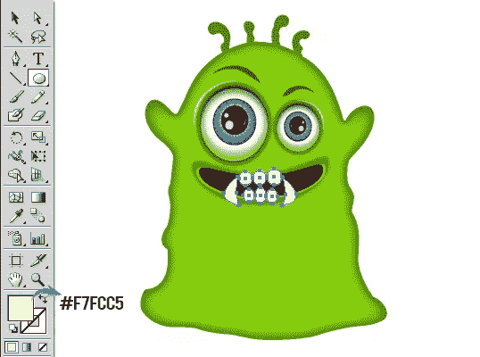](https://www.sitepoint.com/wp-content/uploads/2013/03/141.jpg)

要将牙齿限制在嘴巴区域，再次复制嘴巴形状，将其填充和描边设置为“无”，并将其放置在牙齿层上方。现在，选择牙齿和这个复制的嘴层，然后进入“对象”>“剪贴蒙版”>“制作”之后，使用以下设置在牙齿上应用内部发光效果。

[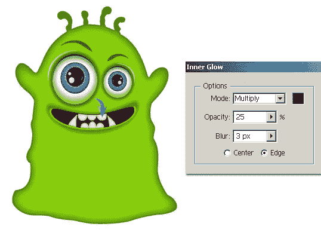](https://www.sitepoint.com/wp-content/uploads/2013/03/14b1.jpg)

### 第十五步

用 7pt 的笔画出一条曲线来制作怪物的下巴，然后将其宽度轮廓改为“宽度轮廓 1”。

[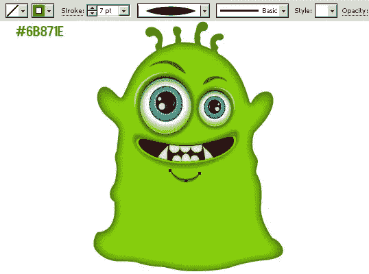](https://www.sitepoint.com/wp-content/uploads/2013/03/151.jpg)

### 第十六步

现在，我们要给怪物长角。使用钢笔工具绘制如下所示的形状，并应用下面的内发光设置。

[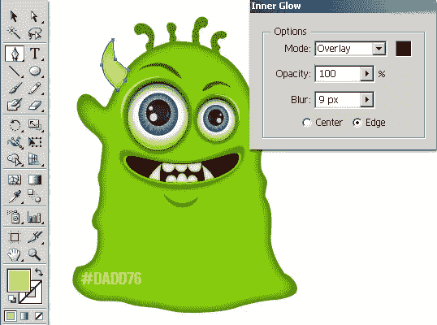](https://www.sitepoint.com/wp-content/uploads/2013/03/161.jpg)

画一些下图所示的形状，给喇叭添加一些阴影。现在，为了将这些形状限制在角上，使用我们在步骤 14 中用于将牙齿限制在嘴中的相同技术。

[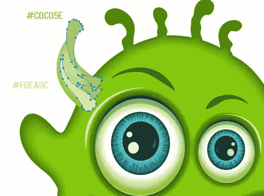](https://www.sitepoint.com/wp-content/uploads/2013/03/16b1.jpg)

### 步骤 17

用深绿色填充颜色画一个椭圆，旋转，放在喇叭图层下面，如下图所示。之后，应用 5px 高斯模糊效果，使其与身体融为一体。复制喇叭，垂直反射，放在右边。

[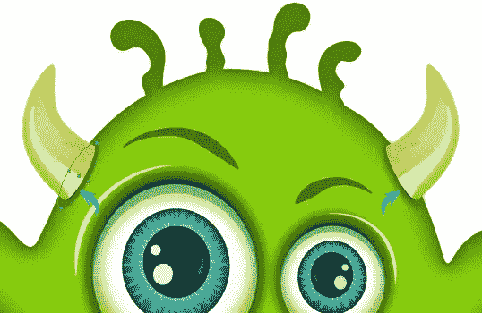](https://www.sitepoint.com/wp-content/uploads/2013/03/171.jpg)

### 步骤 18

接下来，我们将在怪物的身体上做一些阴影。选择铅笔或钢笔工具，大致做出如下所示的形状。选择一个比身体颜色浅的绿色填充。选择这个新的形状，并应用 20px 高斯模糊效果。

[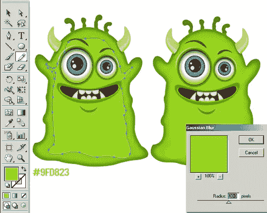](https://www.sitepoint.com/wp-content/uploads/2013/03/181.jpg)

### 步骤 19

用下面的填充颜色在眼睛和腹部周围画两个区域，并应用 20px 高斯模糊效果。

[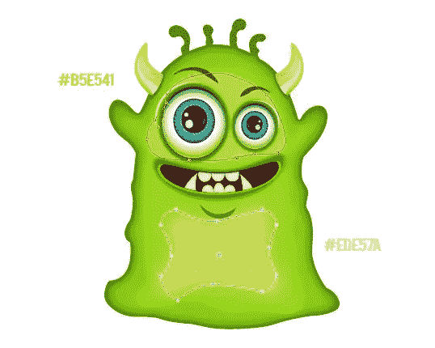](https://www.sitepoint.com/wp-content/uploads/2013/03/191.jpg)

在眉毛下面和耳朵上面再画几个形状，给它们应用 12px 高斯模糊效果。

[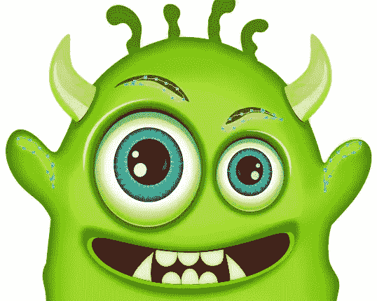](https://www.sitepoint.com/wp-content/uploads/2013/03/19b.jpg)

### 步骤 20

在头上画出小触手内部的形状，对其应用 2-3px 高斯模糊效果。

[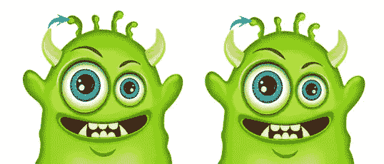](https://www.sitepoint.com/wp-content/uploads/2013/03/201.jpg)

在身体上画几笔，应用 20px 高斯模糊效果。

[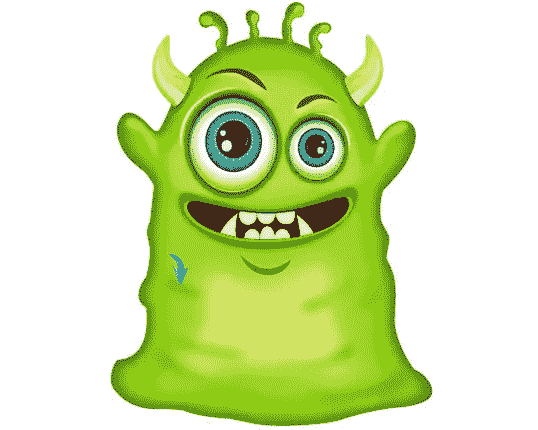](https://www.sitepoint.com/wp-content/uploads/2013/03/20b2.jpg)

### 步骤 21

我们就快搞定我们的怪物了。但是，如果您愿意，可以添加几个点。为此，绘制 4-5 个不规则点，选择它们，并将其拖动到符号窗口。现在，选择“符号喷雾器工具”将它们喷在身体上，并使用符号移位器、scruncher、sizer 和 spinner 工具使斑点看起来更随机。一旦你对它们的外观感到满意，通过添加剪贴蒙版将它们限制在身体内。

[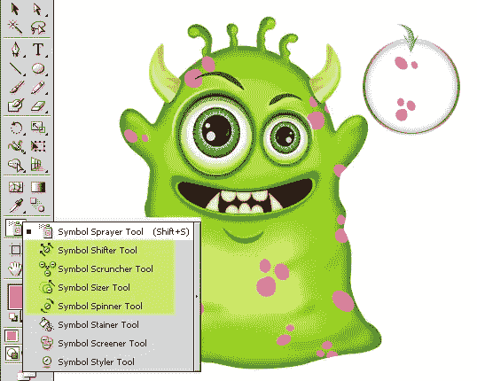](https://www.sitepoint.com/wp-content/uploads/2013/03/211.jpg)[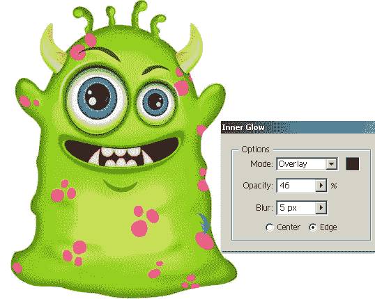](https://www.sitepoint.com/wp-content/uploads/2013/03/21b.jpg)[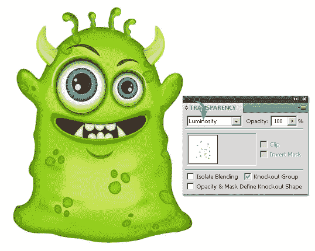](https://www.sitepoint.com/wp-content/uploads/2013/03/21c.jpg)

### 步骤 22

要制作怪物的阴影，在其余图层下面用黑色填充。应用 12px 高斯模糊效果。改变其混合模式为“乘”，减少其不透明度为 40%。

[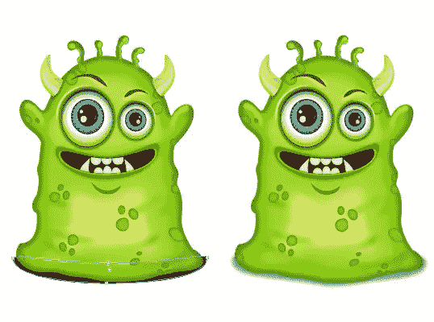 ](https://www.sitepoint.com/wp-content/uploads/2013/03/221.jpg) 

就这样，伙计们。我希望你学到了一些有趣的东西。实验你的怪物，分享你的成果！

## 分享这篇文章