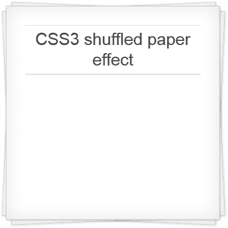

# 如何在 CSS3 中创建混洗的纸张效果

> 原文：<https://www.sitepoint.com/css3-shuffled-paper/>

这是一个很好的效果，它改变了一个标准的看起来像盒子的元素，使它看起来像洗牌的纸。我记得几年前看到过类似的效果，它是用图像处理的，但我们将使用纯 CSS3:

 [
**查看演示和代码…**](http://cssdeck.com/labs/shuffled-paper) 

使用:before 和:after 伪元素来显示底部页面并不奇怪。这些使用变换进行旋转，以给出混洗的外观。代码可以在 Chrome、Safari、Firefox、IE10 和 Opera 上运行(很快，可能还有 [Webkit 版本](https://www.sitepoint.com/opera-switches-to-webkit-rendering-engine/))。旧的浏览器可能会显示较低的页面，但他们不会旋转它们，所以它们实际上是不可见的。但是，效果会逐渐减弱。

让我们从一些 HTML 开始:

```
<div class="papers">
<p>some content</p>
</div> 
```

这里没什么特别可看的。我使用了通用的`div`，但是你也可以使用`section`、`article`或者任何合适的名字。“论文”类负责应用效果。

首先，我们将对主元素和两个伪元素应用背景、边框和阴影:

```
.papers, .papers:before, .papers:after
{
	background-color: #fff;
	border: 1px solid #ccc;
	box-shadow: inset 0 0 30px rgba(0,0,0,0.1), 1px 1px 3px rgba(0,0,0,0.2);
} 
```

注意定义了两个`box-shadow`:内页阴影和一个微妙的投影。

接下来，我们将定义主元素的样式。主要是宽度、填充和边距，但相对位置是最重要的。顺便说一句，不要试图应用一个`z-index`；这会导致伪元素出现在顶部。

```
.papers
{
	position: relative;
	width: 50%;
	padding: 2em;
	margin: 50px auto;
} 
```

我们现在将一些内容、尺寸和定位应用于:before 和:after 伪元素。本质上，它们与主要元素具有相同的大小、形状和位置:

```
.papers:before, .papers:after
{
	content: "";
	position: absolute;
	left: 0;
	top: 0;
	width: 100%;
	height: 100%; 
```

现在有趣的部分来了——我们将使用变换来旋转它们。对于 Chrome 和 Safari，我们需要-webkit 前缀。Opera 需要-o 前缀，它更喜欢“rotate”而不是“rotateZ”。Firefox 和 IE10 支持无前缀转换。

```
 -webkit-transform: rotateZ(2.5deg);
	-o-transform: rotate(2.5deg);
	transform: rotateZ(2.5deg);
	z-index: -1;
} 
```

注意，我们已经将 z-index 设置为-1，以将元素推到主容器下面。

最后，我们对:after 伪元素应用不同的旋转。

```
.papers:after
{
	-webkit-transform: rotateZ(-2.5deg);
	-o-transform: rotate(-2.5deg);
	transform: rotateZ(-2.5deg);
} 
```

简单。 [**查看演示和代码……**](http://cssdeck.com/labs/shuffled-paper)

请随意使用代码——应用不同的颜色和旋转角度相对简单，但您可能会发现一系列有趣的效果。在下面张贴您的链接…

## 分享这篇文章