# 使用 HTML5、JS、CSS3 和 Wakanda Studio 构建联系人管理应用程序

> 原文：<https://www.sitepoint.com/build-contacts-app-with-html5-css-javascript-wakanda-studio/>

很多年前，JavaScript 开发人员被认为是编程界的二等公民。JavaScript 仅用于执行一些简单的客户端任务，如警告消息、表单验证和样式操作。由于它的局限性和几个严重的安全问题，没有人相信它能用于密集型编程应用程序。

但是，在过去几年中，随着 HTML5、JQuery、NodeJS、WebRTC、Google API 和其他语言的出现，JavaScript 已经成为一种成熟的语言，可以通过服务器端编码、NoSQL 数据库、JSON 格式、REST for communication 和许多其他有价值的方法来开发健壮的业务应用程序。

在本文中，我们将证明使用 HTML5、JavaScript 和 CSS3 开发一个移动 web 应用程序是多么的可能(甚至是多么的简单),它可以在断开模式下检索电话联系人，在连接模式下从远程服务器检索联系人。我们将使用 PhoneGap 对其进行打包，以构建一个可以在线和离线工作的原生移动应用程序。

### 背景

在开始使用本指南之前，您应该对 HTML5、JavaScript 和移动开发世界有一些基本的了解。在本文中，我还将使用 [Wakanda DataStore](http://doc.wakanda.org/Datastore/Datastore.100-588923.en.html) 作为 NoSQL 数据库，它将由我们的本地应用程序远程添加，以使用 REST/HTTP 和 JSON 格式获取数据，因此了解一些 Wakanda 的基础知识会非常有帮助。

### 使用代码

**应用架构**

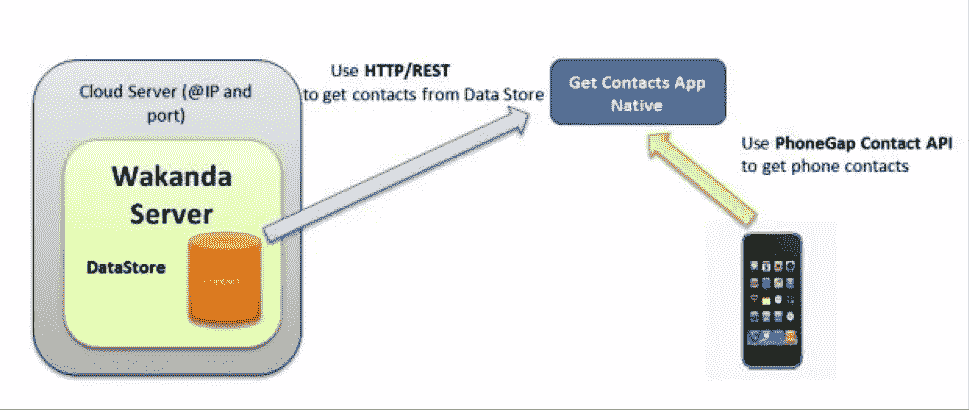

这个移动应用程序的 PhoneGap 构建输入可以免费下载。这是一个使用 Wakanda Studio smartphone 部件开发的 zip 文件。这个包包含许多值得注意的文件。

首先，也是最重要的，它包含 index.html 文件，这是我们的应用程序的主页。这个页面有三个视图:一个是主页视图，其中包含两个用于选择连接或断开模式的按钮；一个视图包含一个将从远程 Wakanda 服务器加载数据的网格；第三个视图包含一个 richText 小部件，它将使用 PhoneGap contact API 加载移动联系人列表。

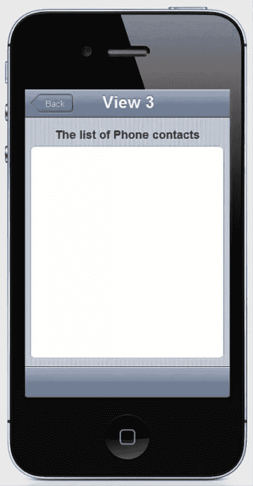

第二个值得一提的文件是 config.xml 文件。这个 XML 文件为 PhoneGap 构建服务提供了一些必要的设置。来打包应用程序并为移动设备做准备。下面是 config.xml 数据。

```
<!--?xml version="1.0" encoding="UTF-8"?-->

    GET CONTACTS

        An application that gets contacts from DataStore and also from phone

        Saad Mousliki
```

(你可以看一下官方的 PhoneGap 文档,了解更多关于如何编写这个文件的信息。另外两个值得注意的文件是 splash.png 和 icon.png。这两个文件用作在移动设备上安装打包的应用程序时显示的启动屏幕和图标。

接下来是 walib 文件夹，其中包含 WAF (Wakanda 应用程序框架)API——一组用于操纵 UI、HTTP/REST 通信、映射等的 JavaScript 库。

当然，还有广泛使用的脚本和样式文件夹，其中包含移动应用程序使用的 JavaScript 和 CSS 文件。

(注:要了解更多关于如何使用瓦坎达工作室创建该应用程序并将其预打包以被 PhoneGap 接受的信息，请查看[本指南](http://doc.wakanda.org/Quick-Start/Quick-Start.100-695763.en.html)和[本博客](http://hackanda.wordpress.com/)。)

### HTML5 界面

HTML5 页面是使用 Wakanda Studio GUI 设计器生成的，通过拖放小部件并使用属性选项卡进行精心设计。下面是一个正在开发的 Wakanda HTML5 界面的例子；让我们来看看为我们的移动应用程序设计界面的令人惊讶的简单过程。

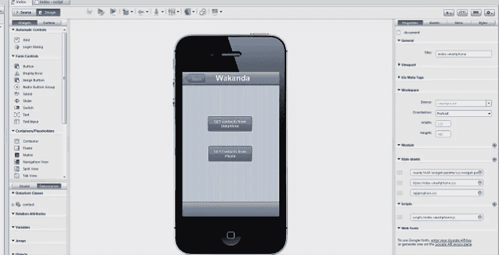

#### 第一步

安装瓦坎达工作室版本 3 后，双击其图标打开工作室。单击“创建新解决方案”按钮。

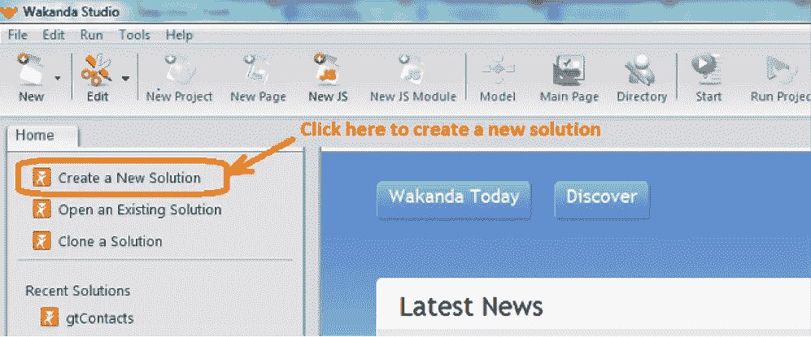

#### 第二步

为您的解决方案命名，例如“CreateHTML5Page”选中“向解决方案添加空白项目”复选框，然后单击“确定”按钮。

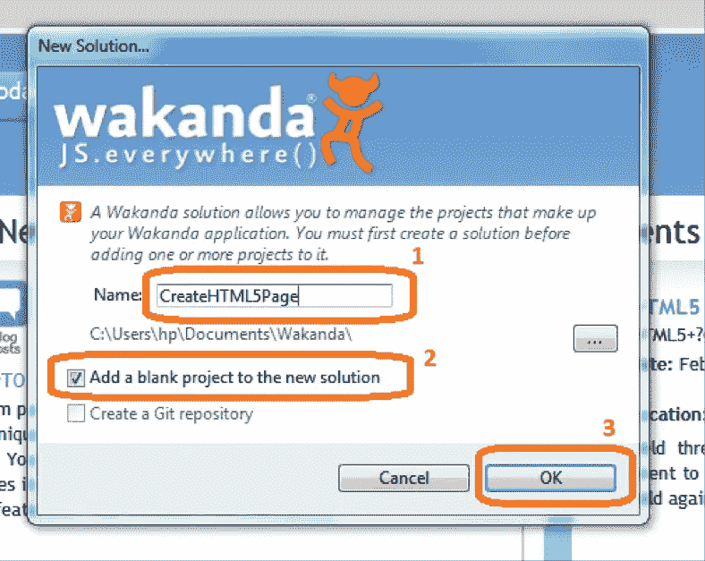

### 第三步

现在，点击“WebFolder”文件夹，双击 index.html 文件。

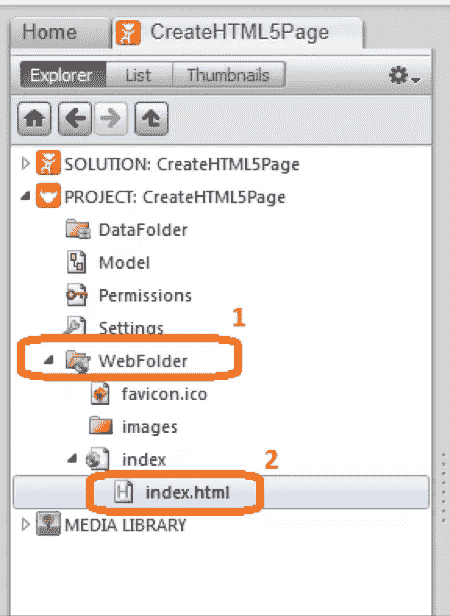

### 第四步

去工作室的右边；你会发现一个选择平台的箭头:台式机、平板电脑或智能手机。选择智能手机页面。

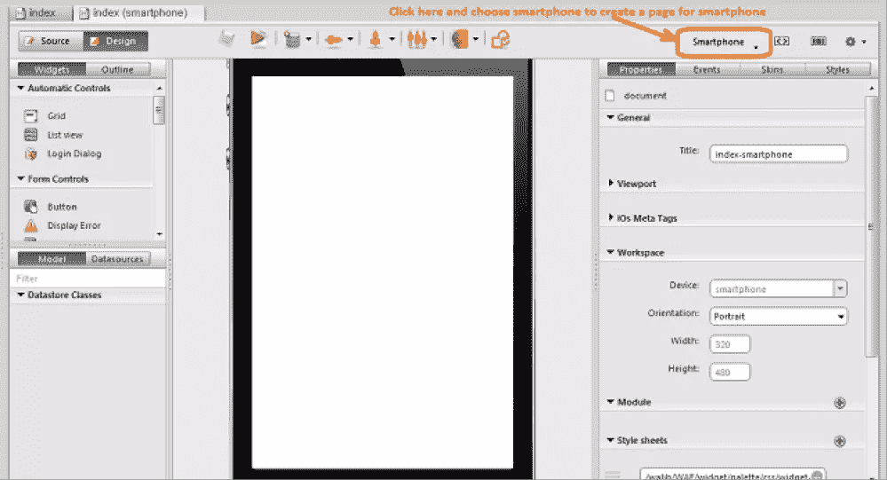

#### 第五步

在这一步，页面是空的，应该使用左边的小部件选项卡和右边的属性选项卡进行设计。首先，我们将向页面添加一个导航小部件，方法是将所需的小部件拖放到页面上。

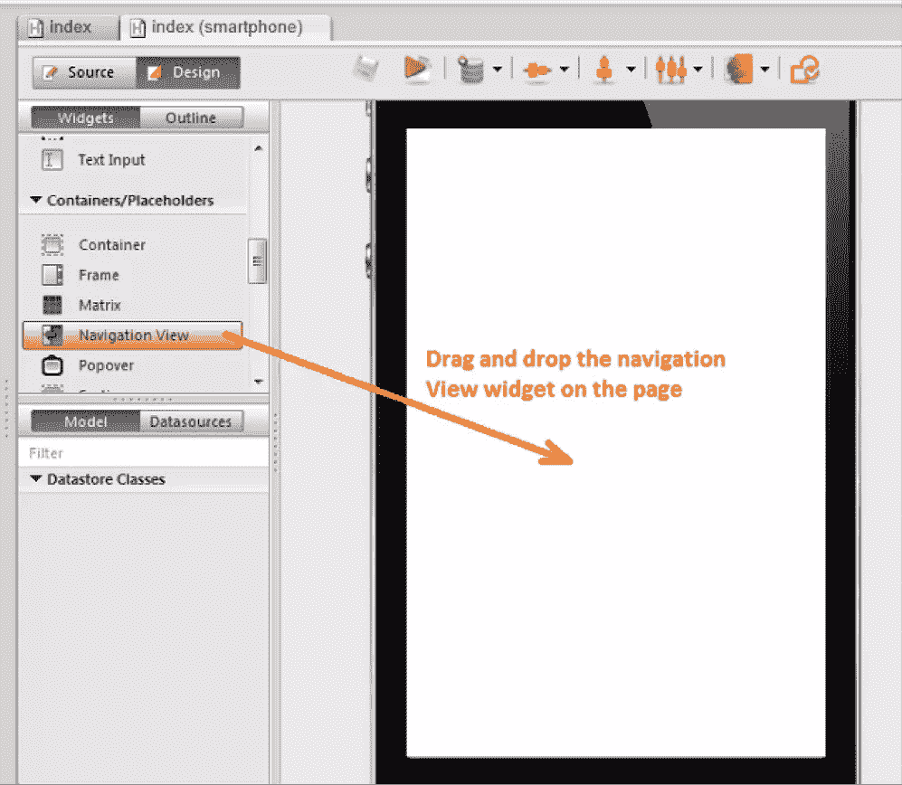

#### 第六步

之后，我们必须使用这个部件的 properties 选项卡向 navigation views 部件添加一些视图(导航选项)。

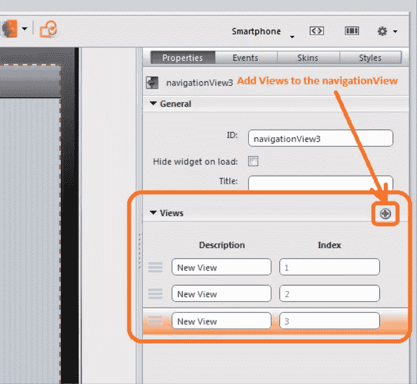

#### 第七步

现在，我们将向第一个视图添加一对按钮。

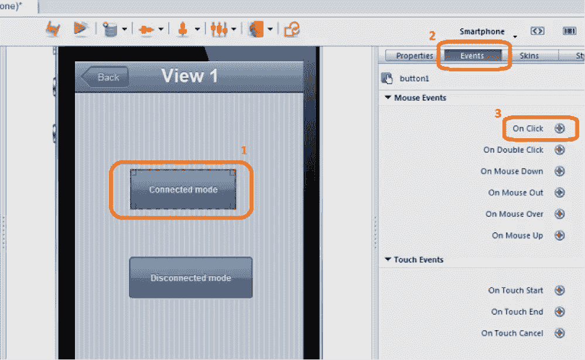

您可以修改按钮标题和其他属性(宽度、高度、颜色等)。)使用右侧的属性选项卡。

#### 第八步

要为按钮指定一个事件，我们应该单击右侧选项卡上的 events 按钮，并选择“onClick”事件。


#### 第九步

例如，我们可以添加允许在视图之间切换的代码。我们将使用导航视图方法“goToNextView”，因此当我们单击此按钮时，我们将转到视图编号 2。为了清楚起见，请看下面。

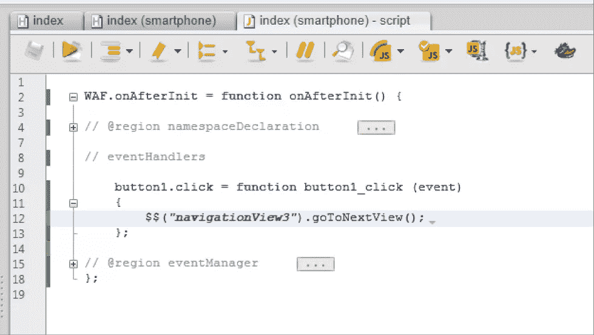

```
button1.click = function button1_click (event)

{

$$("navigationView3").goToNextView();

}
```

(注:要了解如何使用 Wakanda Studio 创建移动 web 应用程序的更多信息，请观看此视频，了解如何在 iPod 上创建和测试移动应用程序的分步说明。)

创建页面后，我们应该按照[这篇博客](http://hackanda.wordpress.com/)中描述的步骤对其进行预打包(准备由 PhoneGap build 打包)。

### 使用 PhoneGap 联系人 API 检索联系人

 **当点击“从手机获取联系人”按钮时，将执行以下 JavaScript 代码。

```
var options = new ContactFindOptions(), name, phoneNumber;
options.filter = "";
options.multiple = true;

var fields = ["name", "phoneNumbers"];

function onSuccess(contacts) {
var res = "";
for(var index = 0, len = contacts.length; index < len; index++) { name = contacts[index].name; name = name != null ? name.formatted : ""; phoneNumber = contacts[index].phoneNumbers; phoneNumber = phoneNumber != null && phoneNumber.length > 0 ? phoneNumber[0].value : "";

res += name + "   : " + phoneNumber + "n";
}
$$('textField2').setValue(res);

navView.goToView(3);
}

function onError() {
alert('onError!');
}

navigator.contacts.find(fields, onSuccess, onError, options);
```

关于这段代码的更多细节，请看一下 PhoneGap 联系人 API 。

 **### 使用 PhoneGap Build 打包应用程序

[这段视频](http://www.youtube.com/watch?v=1TyMqnfrDFo)将向您展示如何打包 web 应用程序，从上传。zip 文件来获取。ipa 文件。为了获得完整的描述，我们将从下载。zip 文件并将其解压缩。

中的“Client_Side”文件夹。zip 文件并对其进行压缩，以获得 PhoneGap 构建服务所需的输入文件。

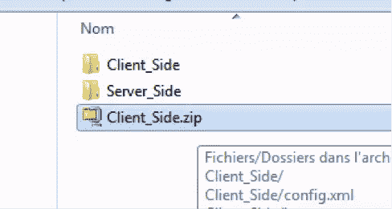

您应该在 PhoneGap build 上有一个帐户来上传和构建应用程序，所以如果您还没有帐户，您可以创建一个。

创建帐户后，转到应用程序页面，上传 zip 文件(Client_Side.zip ),然后构建它！为了清楚起见，请看下面。

 **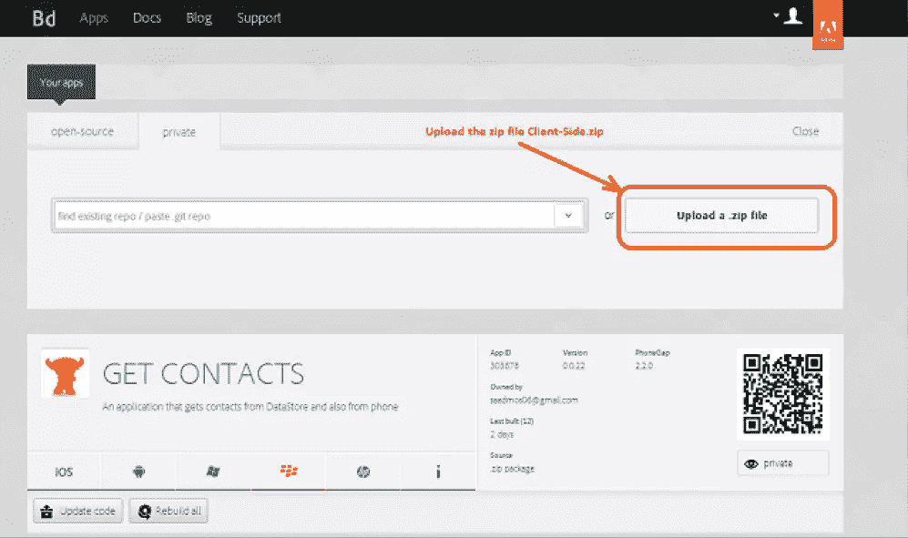

### 设置服务器端元素

 **对于服务器端的应用，你要取“Server_Side”文件夹，在 Wakanda 3 服务器上运行，使用命令行或者 Wakanda Studio。命令行是:

**"C:Wakanda Server.exe" "C:下载 applicationServer _ side getphonecontact solution getphonecontact . wasolution "**

 **之后，您应该转到“Client_Side”文件夹，在“scripts”文件夹中，打开 index-smartphone.js，并在下面几行中添加您托管 Wakanda 应用程序的计算机的 IP 地址:

```
WAF.config.baseURL = "http://@IP_of_the_Wakanda_Server:8081";
WAF.core.restConnect.defaultService = 'cors';
WAF.core.restConnect.baseURL = "http://@IP_of_the_Wakanda_Server:8081";

WAF.onAfterInit = function onAfterInit() { // @lock
// @region namespaceDeclaration// @startlock
var documentEvent = {}; // @document
var button2 = {}; // @button
var button1 = {}; // @button
```

现在，您可以使用 WAF API 远程访问 Wakanda 数据存储。

(注意:要构建。ipa 对于您的 iPhone，您应该提供预置密钥和 Apple store 帐户的密码。)

### 结论

这个应用程序是 Wakanda Studio 的一个简单演示，也是 HTML5、JavaScript 和 CSS3 创建强大移动应用程序能力的一个更好的证明。使用本例中使用的开发流程(从 HTML5、JavaScript 和 CSS 到原生应用程序)，我们可以在很短的时间内交付一个跨平台的原生移动应用程序，因此通过使用 PhoneGap，几乎没有 Java 或 Objective-C 背景的开发人员可以同时开始为许多移动平台开发原生移动应用程序。使用 PhoneGap build 开发、测试和打包这个应用程序用了不到一天的时间。********** 

## ******分享这篇文章******