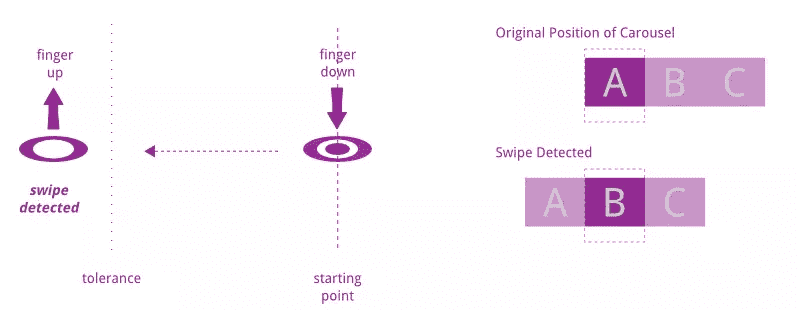
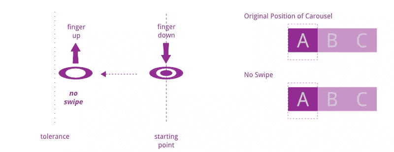
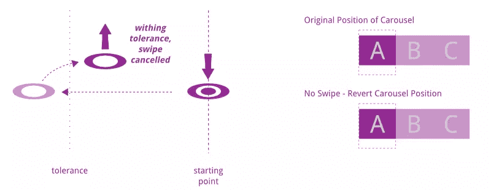
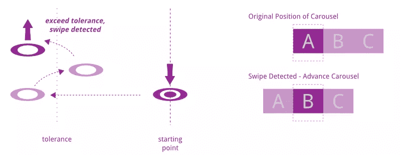

# 一个用于触摸滑动的 jQuery 插件——第 2 部分，共 2 部分

> 原文：<https://www.sitepoint.com/jquery-plugin-for-touch-swiping-part-2-of-2/>

这是描述如何创建 jQuery 插件来检测和响应滑动手势的系列文章的第二部分。

在第一部分的[中，我们看到了如何创建一个插件来改变一个转盘的图片，以符合手指在屏幕上的位置。在这一部分，我们将扩展它来检测滑动手势。这通过创建固定的间隔来改进转盘，以便滑动改变转盘来完整地显示下一张/上一张图片。](https://www.sitepoint.com/jquery-plugin-for-touch-swiping-part-1-of-2/)

```
var Swiper = function (el, callbacks, options) {
  ...
  this.opts = options;
  this.swipeDone = false;

  //perform binding
  this.el.addEventListener('touchend', function (evt) {
    tis.stop(evt);
  });
  ....
};

Swiper.LEFT = - 1;
Swiper.RIGHT = 1;

...

$.fn.swiper = function (callbacks, options) {
  var opts = $.extend({}, $.fn.swiper.defaults, options);
  if (typeof callbacks.swiping !== 'function') {
    throw '&amp;amp;amp;quot;swiping&amp;amp;amp;quot; callback must be defined.';
  }
  if (typeof callbacks.swiped !== 'function') {
    throw '&amp;amp;amp;quot;swiped&amp;amp;amp;quot; callback must be defined.';
  }
  if (typeof callbacks.swipeCancel !== 'function') {
    throw '&amp;amp;amp;quot;swipeCancel&amp;amp;amp;quot; callback must be defined.';
  }

  this.each(function () {
    ...
    if (!swiper) {
      tis.data('swiper', (swiper = new Swiper(this, callbacks, opts)));
    }
  });
};

$.fn.swiper.defaults = {
    tolerance: 100
};
```

在上面的清单中，我们看到`Swiper`的类构造函数被修改为接受第三个参数`options`，该参数保存一个属性`tolerance`。参数被分配给一个内部属性`opts`。`touchend`事件被代理到`Swiper`类的`stop()`实例方法。

此外，增加了两个回调函数(`swiped`和`swipeCancel`)来处理滑动。`tolerance`的默认值设置为 100(像素)。注意还有两个类属性`Swiper.LEFT` 和`Swiper.RIGHT`。它们分别代表向左滑动和向右滑动，并将在后续列表中使用。

插件定义也被修改为接受第二个可选参数，该参数提供了覆盖默认阈值 100 像素的选择。

我们需要扩展插件来识别滑动发生的时间，并相应地修改转盘。我们需要考虑几个场景。第一种，也是最直接的一种，是当用户在屏幕上拖动手指并松开时。如果手指覆盖的距离大于或等于`tolerance`值，我们认为这是一次滑动，当手指离开屏幕时，转盘应该前进到下一张图像。下图说明了这种情况。



另一方面，如果手指覆盖的距离小于`tolerance`值，则该移动被*而不是*视为滑动，转盘应恢复到其原始位置。



请记住，插件移动转盘，以反映手指在接触屏幕期间的移动。当手指离开屏幕时(绑定到`touchend`事件),决定是前进还是退回转盘位置。

```
Swiper.prototype.stop = function (evt) {
  if (!this.swipeDone) {
    this.cbs.swipeCancel();
  } else {
    this.cbs.swiped(this.getDirection());
  }
};
```

如果检测到滑动，调用回调以推进转盘(`swiped()`)，否则恢复转盘(`swipeCancel()`)。

需要注意的一点是，我们将移动的方向返回到由`getDirection`方法确定的“前进”回调。这是必需的，因为回调需要知道传送带向哪个方向前进。

```
Swiper.prototype.getDirection = function () {
  var direction = this.diff();
  if (direction &amp;amp;amp;lt; 0) {
    return Swiper.LEFT;
  }
  if (direction &amp;amp;amp;gt; 0) {
    return Swiper.RIGHT;
  }
};
```

该方法使用本系列第 1 部分中定义的`diff()`方法来获得手指的位移。如果差值为负，则为左扫，否则为右扫。

我们现在需要知道如何确定是否产生了滑动，即`swipeDone`标志的设置。在我们深入研究之前，让我们考虑下一个场景。

如果用户将手指放在屏幕上，将其拖动到阈值之外，然后在移开手指之前将其放回到阈值之内，我们不想让转盘前进，因为用户将手指放回去的意图是他/她不想让转盘前进。



类似地，如果用户在移开手指之前将手指带回到容差值之外，他/她的意图是推进转盘。



可以想象，确定何时检测到手势是在手指在屏幕上拖动时完成的，而不是在手指抬起时。因此，我们必须对`Swiper`类的`move()`实例方法进行一些修改。

```
Swiper.prototype.move = function (evt) {
  if (Math.abs(this.diff()) &amp;amp;amp;gt;= this.opts.tolerance) {
    this.swipeDone = true;
  } else {
    this.swipeDone = false;
  }
  if (evt.targetTouches &amp;amp;amp;amp;&amp;amp;amp;amp; evt.targetTouches.length === 1) {
    if (evt.targetTouches[0].offsetX) {
      this.points[1] = evt.targetTouches[0].offsetX;
    } else if (evt.targetTouches[0].layerX) {
      this.points[1] = evt.targetTouches[0].layerX;
    } else {
      this.points[1] = evt.targetTouches[0].pageX;
    }
    this.cbs.swiping(this.diff());
  }
};
```

在`move()`方法开始时，我们检查手指移动的距离是否超过公差值。差异包含在`Math.abs()`函数中，因为向左移动将总是产生小于任何正值的负值。通过取其绝对值，我们可以检查左右移动的距离。如果确定距离大于或等于容差值，我们认为这是一次滑动。

实现这一点的关键是从`move()`方法中移除行`this.points[0] = this.points[1];`。这是绝对关键的，因为我们要从手指接触屏幕的点开始引用(`touchstart`)。如果我们保留这一行代码，参考点将随着手指的每次移动而不断变化，我们将无法执行我们想要的计算。不过，随着这行代码的删除，`diff()`返回的值也将与之前不同。然后我们必须改变`swiping()`回调函数的定义。

对`Swiper`类进行的最后一个更改是对它的`start()`实例方法的更改。这个变化基本上是说，每次手指第一次放在屏幕上，`swipeDone`标记为 false，这是很自然的，因为手指第一次接触屏幕时不可能产生滑动。

```
Swiper.prototype.start = function (evt) {
  if (evt.targetTouches &amp;amp;amp;amp;&amp;amp;amp;amp; evt.targetTouches.length === 1) {
    this.swipeDone = false;
    ...
  }
};
```

我们已经基本上完成了插件本身。改变应用程序代码来使用插件需要我们在手指仍然在屏幕上拖动的时候改变转盘的位置。请记住，传送带应该“吸附”到完整显示任何图像的位置。因此，位置的值总是每个图像宽度的倍数。因此，用百分比来表示位置是最容易的。注意，由于我们将`currPos`的值视为百分比，因此`MAX_LEFT`和`MAX_RIGHT`的值也需要转换成百分比。

我们仍然希望保留转盘在手指上的镜像效果。为此，在`swiping()`回调中引入了一个新变量`adhocPos`。当手指在屏幕上拖动时，该值保持转盘的位置。它使用设置为 330 像素的`baseWidth`变量(轮播中每个图像的宽度)。如果转盘中图像的宽度发生变化，该值**必须**改变。

```
...
MAX_LEFT = -300,
MAX_RIGHT = 0,
baseWidth = 330;
cb = {
  swiping: function (displacement) {
    var adhocPos = currPos / 100 * baseWidth;
    adhocPos += displacement;
    pictures.css('left', adhocPos + 'px');
  },
  ...
}
```

`currPos`值被视为百分比，在下面的`swiped`回调中设置:

```
swiped: function (direction) {
  currPos += (direction * 100);
  if (currPos &amp;amp;amp;lt; MAX_LEFT || currPos &amp;amp;amp;gt; MAX_RIGHT) {
    //i.e. exceeded limit
    currPos -= (direction * 100);
  }
  pictures.css('left', currPos + '%');
}
```

回调被传递一个`direction`参数，正如我们前面看到的，这个参数要么是`1`要么是`-1`。然后乘以 100 转换成百分比值，然后用`currPos`求和。`if`语句检查以确保该值保持在边界内，这样传送带就不会滚动到空白区域。这是之前在`swiping()`回调中完成的。通过将这个检查放在`swiped()`回调函数中，我们得到了这样的效果:当用户拖动转盘超过最后一个图像时，我们看到了空白，但是一旦手指抬起，转盘就会跳回来，从而产生一种“弹跳”效果。

最后，有一个`swipeCancel()`回调函数，它在拖动开始之前将转盘设置回它的原始位置。

```
swipeCancel: function () {
  pictures.css('left', currPos + '%');
}
```

通过对本文中的插件进行修改，我们有了一个像样的滑动转盘，它几乎像你浏览器中的原生应用一样工作。类似地，该插件已经在第一篇文章中提到的相同浏览器中进行了测试。您可以观看[演示](http://jspro.rojakcoder.com/touchswipe2 "See working demo")或下载[源代码](http://jspro.rojakcoder.com/touchswipe2/touchswipe2.zip "Download ZIP file")，与他们一起享受乐趣！

## 分享这篇文章