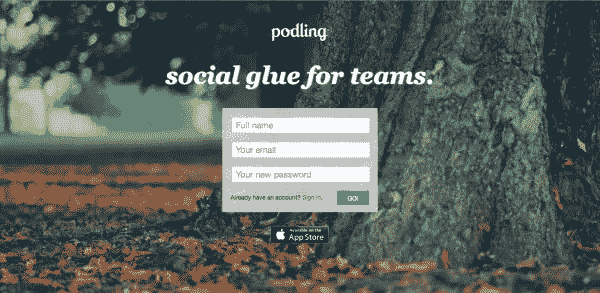
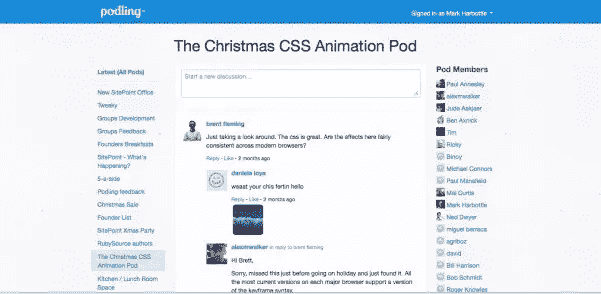
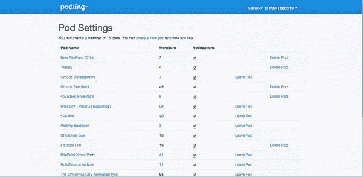

# podling–来自 SitePoint 的新产品…

> 原文：<https://www.sitepoint.com/podling/>

## 介绍 Podling——“团队的社交粘合剂”。

Podling 是我们为自己构建的一个简单的分散式讨论平台，已经在 SitePoint、Flippa 和 99designs 内部使用了几个月……我们认为我们应该开放它并获得您的反馈。我们希望你进去后能听到你的声音。

## 那么，什么是波德林？

Podling 旨在将基于小组(或团队)的讨论从您的收件箱中取出，并给它一个家。这个想法是，你可以快速方便地建立小型的“一次性”讨论组(称为 pod ),每个 pod 对你邀请的人来说都是私有的。

例如，在 SitePoint，我们有项目团队单元、活动单元、开发人员单元、营销单元、客户服务单元、社交单元等等，这些只是我们所知道的单元。

## 掌控你的讨论

Podling 的伟大之处在于，它不像“其他”平台那样是一个由你的系统管理员控制的中心公司社交页面。你控制你启动的豆荚。您可以随时启动或退出 pod。所以每个人对 Podling 的界面都会是他们独有的。权力属于人民！

## 抓取 IOS 应用程序

我们还创建了一个 iOS 应用程序，你可以从 iTunes 上的[应用程序商店下载，如果你参与多个 pod，这很方便。](https://itunes.apple.com/us/app/podling/id602974070?ls=1&mt=8)

你可以从 http://podling.com 开始

我们很乐意通过“Podling Feedback”窗格听取您的想法，您加入后将自动获得该窗格。

## 分享这篇文章