# 在 5 分钟内创建 3 种令人印象深刻的图像色调

> 原文：<https://www.sitepoint.com/create-3-impressive-image-tones-in-5-minutes-photoshop/>

有时，设计师会被要求花几个小时来完善突出的图像，但如此密集的任务(以及充分的时间来真正完善它)是罕见的。最常见的情况是，设计师被要求对图像进行快速、省时的改进，以满足截止日期并在项目上取得进展，仅仅因为你是 Photoshop 的新手并不意味着你不能给你的图像增添趣味，使用正确的方法，你可以在几分钟内给你的图像添加一层润饰。无论是用于专业项目的图像，还是您想与家人和朋友分享的图片，甚至是您自己用于社交档案的照片，您都可以非常轻松地添加色调变化，从而快速提高图像质量。

色调的改变可以给你的照片带来奇迹。全世界的摄影师都会编辑他们的照片色调，时尚杂志也几乎虔诚地这样做。今天，我向你展示三种快速的方法，让你选择的照片达到三种不同的色调。那么，我们开始吧。

**资源**

女孩肖像

**效果#1**

### 第一步

首先打开您要处理的图像。我将使用上面“参考资料”中列出的图片。请注意，在接下来的两次色调编辑中，这也将是相同的图像。

[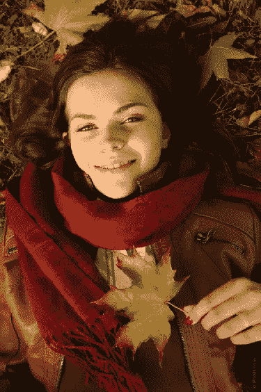](https://www.sitepoint.com/wp-content/uploads/2013/03/stp1.png)

### 第二步

根据需要进行任何面向细节的修饰更改。在开始改变图像色调之前，你需要完成所有的修饰工作。这样细节会融合，看起来更自然。

[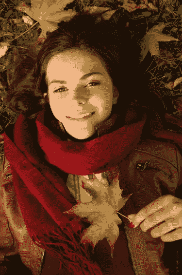](https://www.sitepoint.com/wp-content/uploads/2013/03/stp2.png)

### 第三步

复制你的图像，打开“曲线”对话菜单，设置如下所示的增量，点击“确定”使更改生效。

[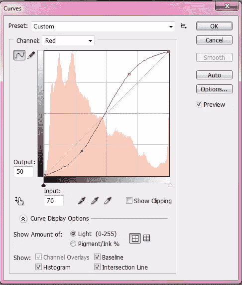](https://www.sitepoint.com/wp-content/uploads/2013/03/effect1stp3.png)[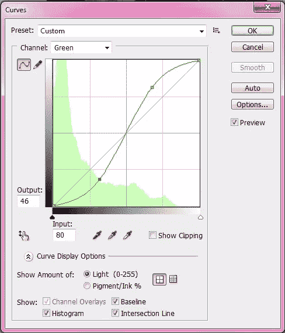](https://www.sitepoint.com/wp-content/uploads/2013/03/effect1stp3-1.png)[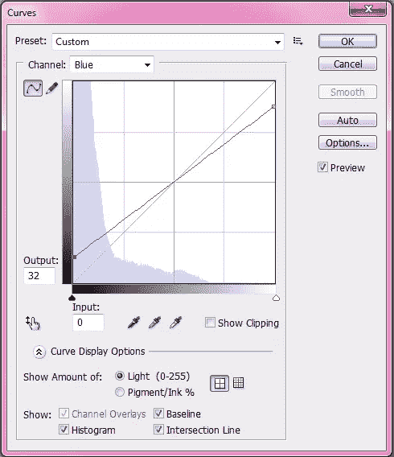](https://www.sitepoint.com/wp-content/uploads/2013/03/effect1stp3-2.png)

### 第四步

将您的图像设置为“变暗”

[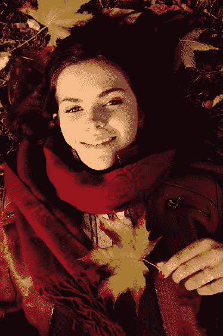](https://www.sitepoint.com/wp-content/uploads/2013/03/stp4.png)

复制图像，设置图像为“减”，不透明度降低到 30%。

转到“过滤器”>“风格化”>“发光边缘”，并设置增量值如下所示。按“确定”

[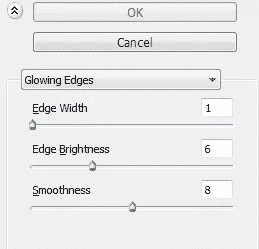](https://www.sitepoint.com/wp-content/uploads/2013/03/stp4-2.png)

**最终图像**

[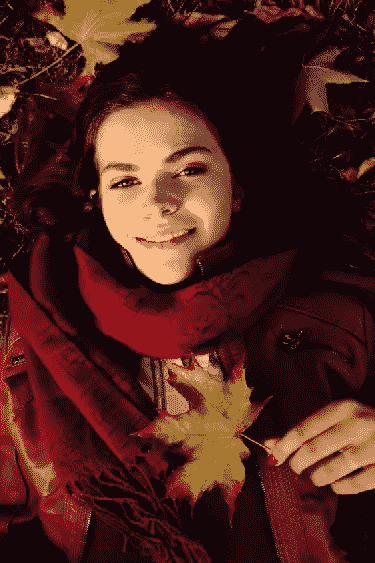](https://www.sitepoint.com/wp-content/uploads/2013/03/effect1final.png)

## 效果#2

### 重复步骤 1-2

重复上述音调教程中的步骤 1 和 2。

### 第三步

创建一个色调/饱和度层，并将饱和度改为-100。这将给你一个黑色和白色的图像，然后你设置图层模式为“屏幕”，不透明度为 50%。

[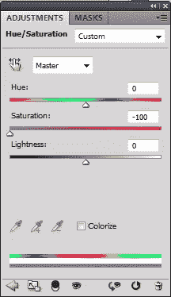](https://www.sitepoint.com/wp-content/uploads/2013/03/effect2stp3.png)

[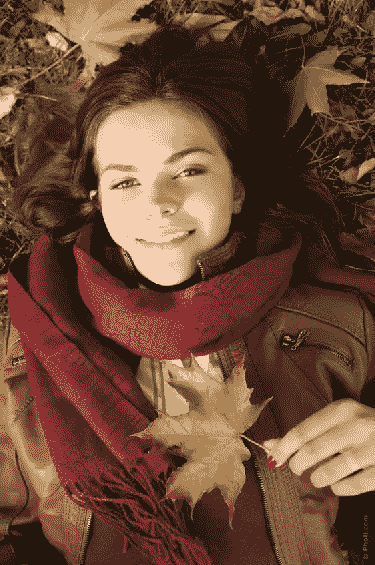](https://www.sitepoint.com/wp-content/uploads/2013/03/effect2stp3-1.png)

### 第四步

新建一个图层，填充颜色#ff2673，图层模式设置为“变亮”然后，降低你的不透明度到 25%

### 第五步

创建另一个图层，用颜色#ca9539 填充这个新图层，图层模式改为“饱和度”，不透明度降低到 25%。

**最终图像**

[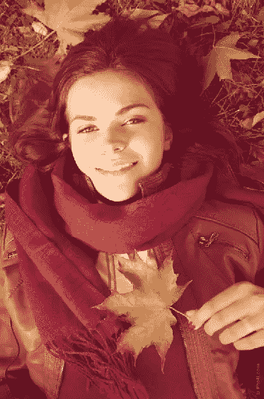](https://www.sitepoint.com/wp-content/uploads/2013/03/effect2final.png)

## 效果#3

### 重复步骤 1 和 2

从上面的原始音调编辑重复步骤 1 和 2。

### 第三步

复制你的图像，进入“图像”>“调整”>“黑白”，输入以下值。

[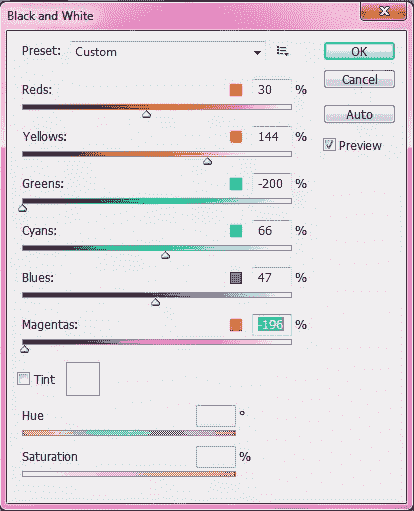](https://www.sitepoint.com/wp-content/uploads/2013/03/effect3stp3.png)

将图层模式改为“彩色”

### 第四步

再次复制图像，设置为“叠加”，不透明度为 50%。

### 第五步

新建一个图层，将前景色设置为#b87952，背景色设置为#ffffff，将线性渐变工具沿图像对角线方向拖动。改变图层模式为“强光”，不透明度降低到 21%

**最终图像**

### 结论

编辑你的图像不需要花几个小时，特别是如果你只需要改变你的图像的灯光和色调。快速技巧可以在几分钟内让你的形象从乏味变得迷人。虽然这些技巧非常有效，但请记住(取决于您的具体图像)，您不会得到完全相同的结果，可能需要做一些调整。通过使用曲线、色阶、图层模式和不透明度，尝试创建自己的外观。如果你有一个最喜欢的外观或最喜欢的方法来改变你的图像的色调和颜色，请随时分享。

## 分享这篇文章