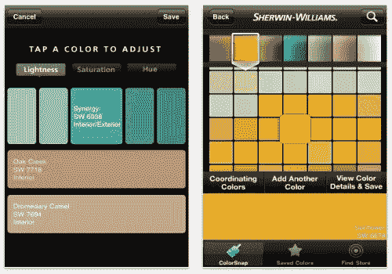
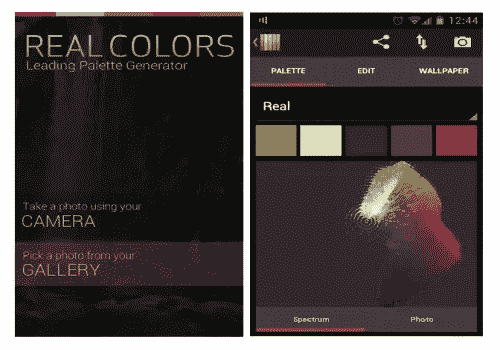
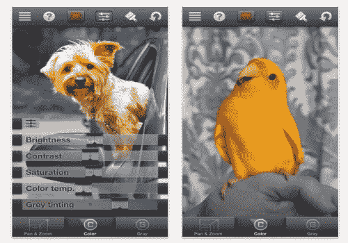
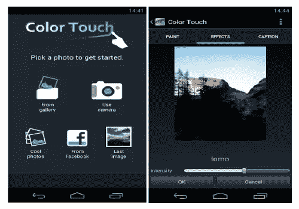
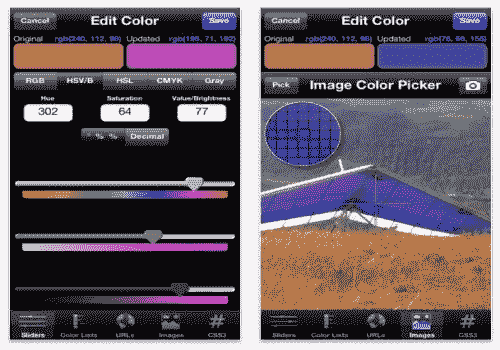
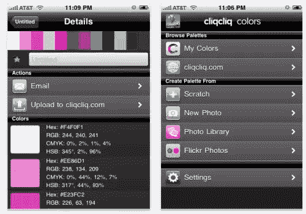
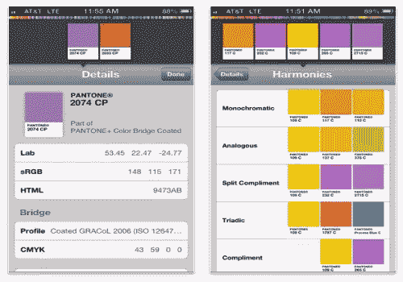
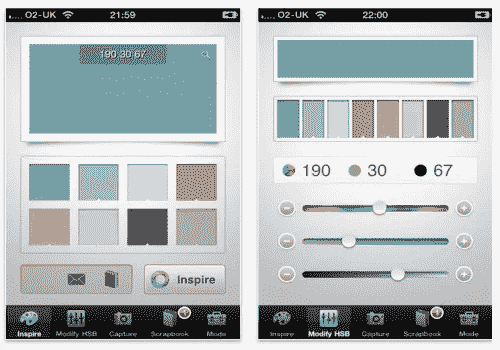
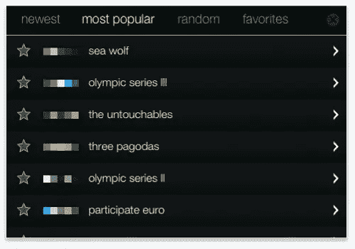
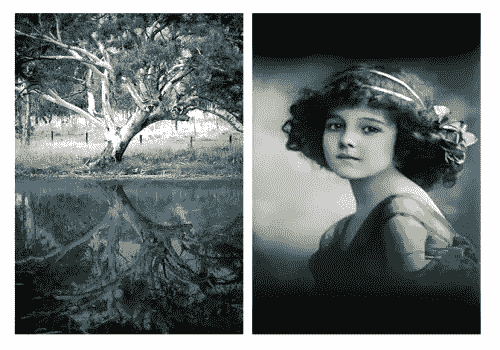

# 设计师的 10 款绚丽色彩应用

> 原文：<https://www.sitepoint.com/10-brilliant-color-apps-for-designers/>

在设计界，颜色极其重要。有色彩理论背景的精明的设计师特意选择色彩的内涵来加强他们的设计。精心选择的颜色可以把好的作品变成壮观的作品，而选择不当的颜色会给任何设计带来灾难。

虽然做出深思熟虑、深思熟虑的颜色选择可能是一个挑战，但开发调色板、匹配颜色并将这些颜色翻译成 HTML 代码却不是。有许多专门为移动设备设计的应用程序都考虑到了颜色。无论你是摄影师、室内装潢师、网页设计师还是业余爱好者，无论何时何地，只要有了颜色灵感，你就一定能从选择和组织颜色的能力中受益。以下是 10 款适用于移动设备的绚丽色彩应用。

**彩色快照**

拍摄您的照片(刚刚拍摄或已经在您的图库中)，并使用照片中的颜色来构建调色板。

价格:免费

**真彩 Pro**

从您的照片生成调色板，以创建和谐的调色板。

价格:3.99 美元

**颜色飞溅**

在转换的黑白图像中保持选择性颜色，以获得动态的外观和感觉。

价格:0.99 美元

**彩色触摸效果**

给你的图像重新着色，并应用效果，将选择的颜色变成黑白或棕褐色。

价格:免费

**调色板专业版**

调色板 Pro 允许您创建和管理您个人创建的调色板。

价格:3.99 美元

**Cliqcliq 颜色**

使用十六进制、RGB 或 CMYK 值发现、转换和管理您的颜色和调色板。

价格:免费

**MyPantone**

访问超过 13，000 种 PANTONE 颜色，并创建调色板以激发灵感、共享或在需要时放在口袋中。

价格:9.99 美元

**彩色玩具**

ColorToy 允许你建立自定义的配色方案，你可以修改和存储。

价格:0.99 美元

**饱和度**

使用生成的配色方案创建交互式光秀，以查看颜色之间的关系。

价格:免费

**彩色大戟**

您可以将颜色应用到您的照片以及令人印象深刻的照片效果。

价格:免费

## 分享这篇文章