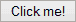

# 如何在 CSS3 中构建一个更好的按钮

> 原文：<https://www.sitepoint.com/build-a-better-button-in-css3/>

我倾向于选择`<button>`标签，而不是`<input type="submit" />`，但是，无论你喜欢哪个，标准样式都遵循你的操作系统惯例。可能会有点无趣…



让我们使用 CSS3 样式、动画和变换来构建一个更好的按钮:

[](http://cssdeck.com/labs/better-button)

[**查看按钮演示……**](http://cssdeck.com/labs/better-button)

## HTML

毫无疑问，我们只需要一个按钮标签:

```
<button>Click me!</button>
```

我们将对每个按钮应用我们的样式，但是，如果你不想这样做，添加一个类并相应地在 CSS 中定位它。

## CSS

我们的按钮应该在最新的浏览器中运行良好，但在旧的应用程序中也会降级。也就是说，我只会在绝对必要的时候添加 CSS 前缀。Firefox、Opera 和 IE10 支持没有前缀的过渡、转换和动画——但我们仍然需要——WebKit——用于 Chrome 和 Safari。

让我们从格式化按钮的一些基本样式开始:

```
button
{
	display: block;
	font-size: 1.1em;
	font-weight: bold;
	text-transform: uppercase;
	padding: 10px 15px;
	margin: 20px auto;
	color: #ccc;
	background-color: #555;
	background: -webkit-linear-gradient(#888, #555);
	background: linear-gradient(#888, #555);
	border: 0 none;
	border-radius: 3px;
	text-shadow: 0 -1px 0 #000;
	box-shadow: 0 1px 0 #666, 0 5px 0 #444, 0 6px 6px rgba(0,0,0,0.6);
	cursor: pointer;
```

没什么太复杂的。我使用了一个相当普通的灰色，但你可以应用任何你需要的颜色。还要注意，已经为不支持线性渐变的浏览器定义了一个`background-color`。我还将光标设置为指针——我一直不明白为什么浏览器默认不这么做？

盒子阴影是最有趣的属性:`box-shadow: 0 1px 0 #666, 0 5px 0 #444, 0 6px 6px rgba(0,0,0,0.6)`。这定义了按钮的边缘，一个 5px 的“深度”和一个围绕它的浅色阴影。

我们通过声明当悬停或焦点事件发生时，我们希望将过渡效果应用于每种样式来完成这个模块。需要无前缀和-webkit 替代项:

```
-webkit-transition: all 150ms ease;
	transition: all 150ms ease;
}
```

在下一个块中，我们将定义悬停和聚焦样式。这定义了一个使文本发光的`pulsate`动画:

```
button:hover, button:focus
{
	-webkit-animation: pulsate 1.2s linear infinite;
	animation: pulsate 1.2s linear infinite;
}

@-webkit-keyframes pulsate
{
	0%   { color: #ddd; text-shadow: 0 -1px 0 #000; }
	50%  { color: #fff; text-shadow: 0 -1px 0 #444, 0 0 5px #ffd, 0 0 8px #fff; }
	100% { color: #ddd; text-shadow: 0 -1px 0 #000; }
}

@keyframes pulsate
{
	0%   { color: #ddd; text-shadow: 0 -1px 0 #000; }
	50%  { color: #fff; text-shadow: 0 -1px 0 #444, 0 0 5px #ffd, 0 0 8px #fff; }
	100% { color: #ddd; text-shadow: 0 -1px 0 #000; }
}
```

Firefox、Chrome 和 Safari 不需要 0%和 100%的定义，但如果我们不使用它们，IE10 无法显示文本阴影。对我来说，这听起来像是一个浏览器错误——记住这个错误。

最后，我们设置按钮的活动状态:

```
button:active
{
	color: #fff;
	text-shadow: 0 -1px 0 #444, 0 0 5px #ffd, 0 0 8px #fff;
	box-shadow: 0 1px 0 #666, 0 2px 0 #444, 0 2px 2px rgba(0,0,0,0.9);
	-webkit-transform: translateY(3px);
	transform: translateY(3px);
	-webkit-animation: none;
	animation: none;
}
```

这将执行许多操作:

*   动画被关闭，文本被设置为“完全发光”状态
*   使用 translateY 将按钮下移 3 个像素
*   定义按钮深度的`box-shadow`更改为 0 2px 0 #444。因此，它从 5px 减少到 2px，但 3px 的翻译使它看起来像按钮沉入页面。
*   外部阴影也减少了，给人的印象是按钮更低。

我们的按钮现在完成了:

[](http://cssdeck.com/labs/better-button)

[**查看按钮演示……**](http://cssdeck.com/labs/better-button)

代码在所有现代浏览器中都能正常工作。我发现的唯一问题是在 Opera 中——它只播放一次脉动动画？但是他们很快就会[切换到 WebKit](https://www.sitepoint.com/opera-switches-to-webkit-rendering-engine/)，所以我们不要太担心…

请随意使用代码！

## 分享这篇文章