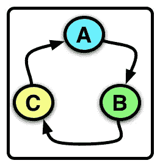

# 方法链接指南

> 原文：<https://www.sitepoint.com/a-guide-to-method-chaining/>



方法链接是一种非常方便的一次调用多个方法的技术。它不仅提高了代码的可读性，还减少了与类或类的实例交互时所需的代码量。

您可能已经以这样或那样的方式与方法链进行过交互，尤其是如果您使用了 ActiveRecord。记得做过这样的事情`Model.where(…).order(…)`？是的，这就是方法链接。在本文中，您将学习如何将相同的特性应用到您自己的代码中。

本文将分为两个简单的部分:

*   方法链接简介
*   类级别的方法链接

第一部分将介绍方法链接的基础知识，并提供一步一步的例子；第二部分将解释如何在类级别进行方法链接，无论是通过类方法的显式方法声明，还是通过使用和扩展附加模块。

你准备好开始这个令人敬畏的旅程了吗？我们走吧！

## 方法链接简介

对于入门部分，我们将设计一个包含一些最终可以链接在一起的方法和一个输出消息的方法的类。让我们从基本的类结构开始:

```
class Person

  def name(value)
  end

  def age(value)
  end

  def introduce
  end

end
```

这里没有什么，但这将作为这个例子的基础。你可以看到，它包含了三个方法:`name()`，它将接受一个输入值；`age()`，也取一个输入值；`introduce`，它不会取一个输入值。有了这些基本信息，让我们实施下一步。

我们现在将把`name()`和`age()`的输入值存储在实例变量中，以便我们以后可以访问它们:

```
# ...
def name(value)
  @name = value
end

def age(value)
  @age = value
end
# ...
```

很好，在我们的方法中添加了这一点后，让我们试试方法链接，看看会发生什么:

```
> person = Person.new
# => #<Person:0x007fb18ba29cb8>
> person.name('Baz')
# => "Baz"
> person.name('Baz').age(21)
NoMethodError: undefined method `age' for "Baz":String
```

不出所料，它不起作用。原因是这些方法只是返回一个值——在本例中是一个字符串。我们需要再次修改我们的方法，这一次，我们将返回别的东西:`self`。

通过返回`self`,我们允许实例方法链接在一起，就像这样！简单吧。！好了，是时候再次修改我们的方法了:

```
# ...
def name(value)
  @name = value
  self
end

def age(value)
  @age = value
  self
end
# ...
```

太棒了，如果我们尝试链接我们的方法调用会发生什么？

```
> person = Person.new
# => #<Person:0x007ff202829e38>
> person.name('Baz')
# => #<Person:0x007ff202829e38 @name="Baz">
> person.name('Baz').age(21)
# => #<Person:0x007ff202829e38 @name="Baz", @age=21>
```

成功了！恭喜你，你已经在 Ruby 中实现了方法链接！现在，我们需要修改我们的`introduce`方法，让它做一些事情:

```
# ...
def introduce
  puts "Hello, my name is #{@name}, and I am #{@age} years old."
end
# ...
```

有了所有的代码，你认为当我们在方法链中调用`introduce`时会发生什么？

```
> person = Person.new
# => #<Person:0x007fd079085ba0>
> person.name('Baz').age(21).introduce
# => Hello, my name is Baz and I am 21 years old.
```

是的，正如预期的那样。注意，`introduce`方法需要在链的末端，因为它不返回`self`的实例。

下面是这个例子的完整代码，我也在维基百科的[方法链接文章](http://en.wikipedia.org/wiki/Method_chaining)中提供了这些代码:

```
class Person

  def name(value)
    @name = value
    self
  end

  def age(value)
    @age = value
    self
  end

  def introduce
    puts "Hello, my name is #{@name} and I am #{@age} years old."
  end

end
```

作为对读者的一个练习，我鼓励您修改`introduce`方法，让它根据可用的数据输出文本。例如，如果只有`@name`可用，您将打印不带年龄部分的句子。如果只有`@age`可用，您将打印没有姓名部分的句子。

## 类级别的方法链接

我们刚刚学习了当调用一个类的实例上的方法时，如何链接我们的方法调用。但是像`Model.where(…).order(…)`一样，在类层次上链接方法呢？这几乎是相同的过程，除了我们的方法声明将在类级别而不是实例级别。

让我们继续这样做，让我们设计一个包含可以链接在一起的类方法的类。本例的基本结构如下所示:

```
class Speaker
  class << self

    def say(what)
      @say = what
      self
    end

    def drink(what)
      @drink = what
      self
    end

    def output
      "The speaker drinks #{@drink} and says #{@say}"
    end

  end
end
```

很简单，对吧？注意，这三个方法都是类方法。我可以用`def self.say()…`分别声明它们，但是对于类方法的多个声明，我觉得用一个`class << self`声明并在其中声明所有的类方法更简洁。

太好了，让我们现在就开始玩吧:

```
> Speaker.say('hello').drink('water').output
# => The speaker drinks water and says hello
```

这就是了，非常有效。

另一种不需要显式声明类方法就能完成的方法是使用一个模块并在我们的类中使用它。通过这样做，我们将模块中的方法公开为我们的`Speaker`类中的类方法:

```
module SpeakerClassMethods
  def say(what)
    @say = what
    self
  end

  def drink(what)
    @drink = what
    self
  end

  def output
    "The speaker drinks #{@drink} and says #{@say}"
  end
end

class Speaker
  extend SpeakerClassMethods
end
```

它应该完全像显式声明类方法一样工作:

```
> Speaker.say('hello').drink('water').output
# => The speaker drinks water and says hello
```

太好了，成功了。作为读者的另一个练习，我鼓励您修改`output`方法，并使它基于可用的数据输出文本，类似于之前为读者建议的练习。

## 结论

本文展示了在 Ruby 中加入方法链是多么简单和容易，无论是在实例级还是类级。它还展示了在添加类级方法链接时，通过使用不同的技术可以实现相同结果的不同方式。我希望它为您提供了足够的信息，使您能够将相同的技术应用到自己的代码中。

## 分享这篇文章