# 在 InDesign 中设计吸引人的名片

> 原文：<https://www.sitepoint.com/design-an-appealing-business-card-in-indesign/>

名片是强有力的营销工具，但只有当它们被设计成能给人留下强烈的正面印象时。一张设计精美的名片不仅能分享你的联系信息，还能提供你的品牌的第一印象，并加强你的专业拓展工作。一个清晰的名片设计会吸引新客户，让你从众多竞争者中脱颖而出。

今天，我们将在 Adobe InDesign 中设计一张创意名片。我们都知道 InDesign 有很多有效的工具来创建印刷媒体；您可以将它用于名片、小册子、信纸、传单等。那么，就从我们的名片开始吧。

**最终结果:([下载完成的分层 InDesign 文件。](https://www.sitepoint.com/wp-content/uploads/2013/02/business-card.zip) )** 

[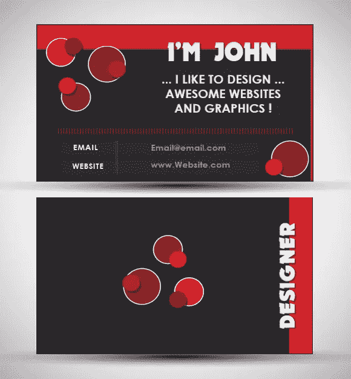](https://www.sitepoint.com/wp-content/uploads/2013/02/result.jpg)

### 第一步

打开 InDesign，单击“文件”>“新建”>“文档”将页数设置为 2，并取消选择对页选项。将宽度设置为 3.5 英寸，高度设置为 2 英寸，边距为 0.5 英寸，出血量为 0.125 英寸。

[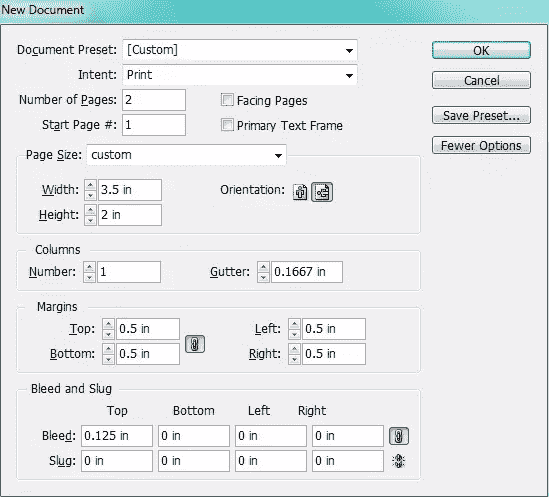](https://www.sitepoint.com/wp-content/uploads/2013/02/Step-18.jpg)

### 第二步

选择矩形工具，用红色样本创建一个矩形(C=15 M=100 Y=100 K=0)。

[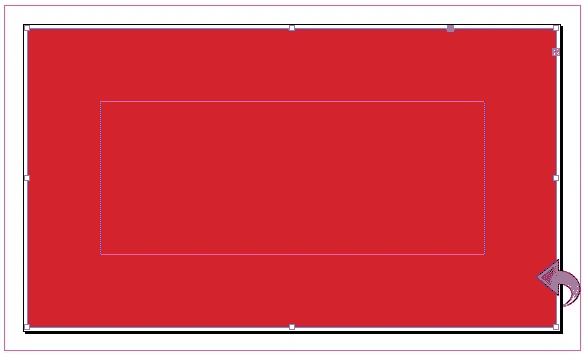](https://www.sitepoint.com/wp-content/uploads/2013/02/Step-22.jpg)

### 第三步

现在，添加一个 4pt 的笔画，使用与制作矩形相同的红色样本。

[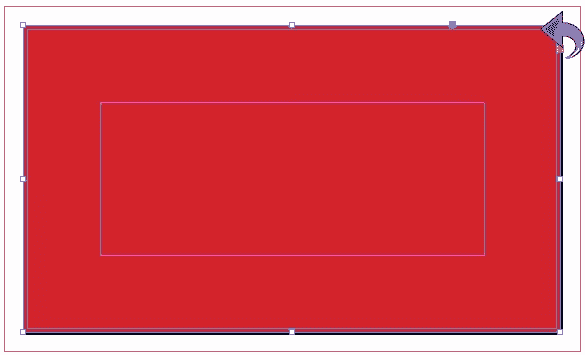](https://www.sitepoint.com/wp-content/uploads/2013/02/Step-32.jpg)

### 第四步

选择矩形工具，用黑色样本创建另一个矩形(C=0 M=0 Y=0 K=95)。

[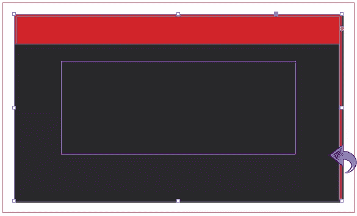](https://www.sitepoint.com/wp-content/uploads/2013/02/Step-42.jpg)

### 第五步

现在我们要创建一些圆或圆形，所以选择椭圆工具，用红色色样创建一个圆(C=15 M=100 Y=100 K=0)。使用白纸样本添加 1 磅的描边(C=0 M=0 Y=0 K=0)。

[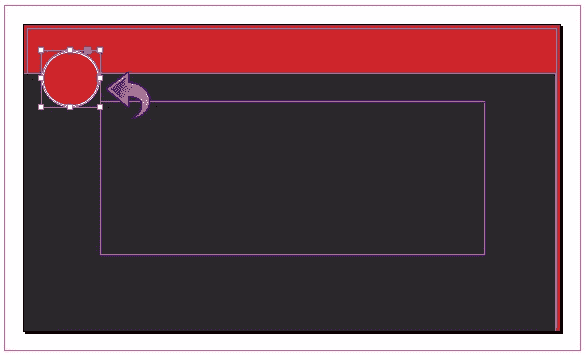](https://www.sitepoint.com/wp-content/uploads/2013/02/Step-52.jpg)

### 第六步

从图层面板中选择圆形图层，点击“效果”>“阴影”

[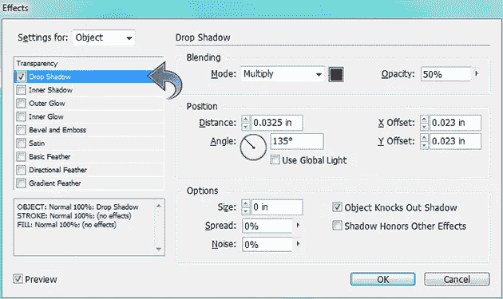](https://www.sitepoint.com/wp-content/uploads/2013/02/Step-62.jpg)

### 第七步

重复同样的过程，使用同样的技术和设置添加更多的圆。你可以用不同深浅的红色来填充你的圆圈。

[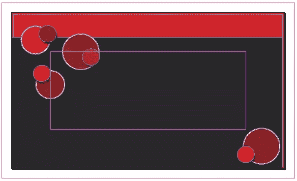](https://www.sitepoint.com/wp-content/uploads/2013/02/Step-71.jpg)

### 第八步

现在，让我们从细节开始。选择文字工具并创建一个文本框架。然后，用纸色样本添加标题。

[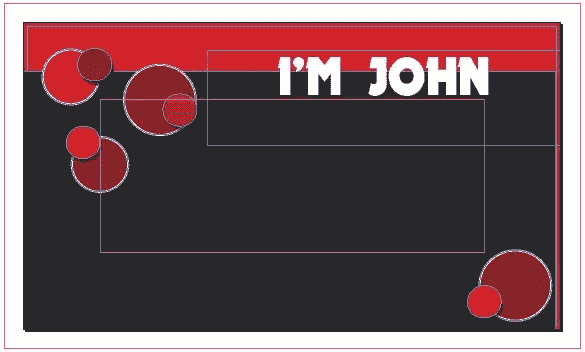](https://www.sitepoint.com/wp-content/uploads/2013/02/step-8.jpg)

### 第九步

选择标题层，点击“效果”，使用以下设置添加阴影和内阴影。

[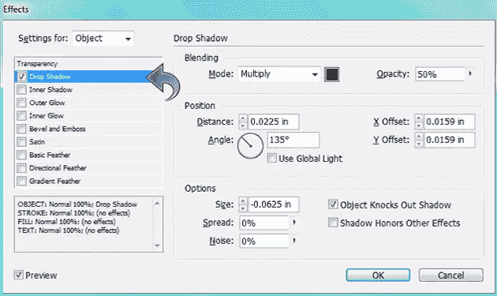](https://www.sitepoint.com/wp-content/uploads/2013/02/Step-9a.jpg)

### 第十步

重复相同的过程，并添加您想要的文本。

[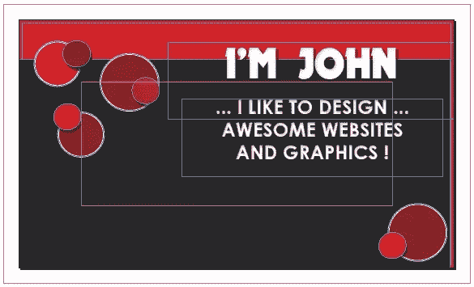](https://www.sitepoint.com/wp-content/uploads/2013/02/Step-101.jpg)

### 步骤 11

选择线条工具并创建一个分割线，然后添加一个 5pt 的“直散列”描边和一个暗红色样本(C=41 M=100 Y=100 K=200)。

[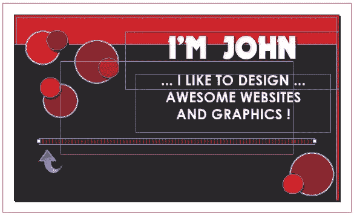](https://www.sitepoint.com/wp-content/uploads/2013/02/Step-112.jpg)

### 步骤 12

选择线条图层，点击“效果”>“阴影”，给上面的线条添加阴影

[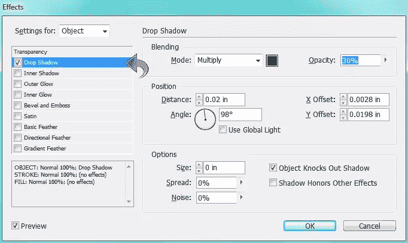](https://www.sitepoint.com/wp-content/uploads/2013/02/Step-122.jpg)

### 第十三步

现在，让我们添加联系信息。对于底部，选择矩形工具并用深灰色样本(C=0 M=0 Y=0 K=94)创建一个矩形带，并用黑色样本(C=0 M=0 Y=0 K=95)包含一个 1 磅的描边。

[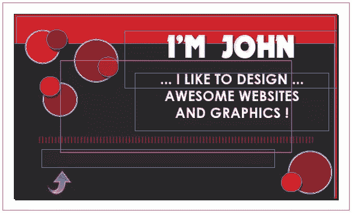](https://www.sitepoint.com/wp-content/uploads/2013/02/Step-131.jpg)

### 步骤 14

重复相同的过程创建另一个矩形，然后使用文字工具添加联系人信息。(我已经将“视图”>“屏幕模式”改为“出血”，这样我们就可以正确地看到细节。)

[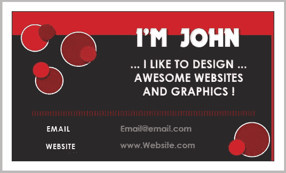](https://www.sitepoint.com/wp-content/uploads/2013/02/Step-142.jpg)

### 第十五步

选择线条工具，用深色色样(C=0 M=0 Y=0 K=93)创建一条垂直线，用色样(C=0 M=0 Y=0 K=91)创建一条 2pt“粗-粗”描边。

[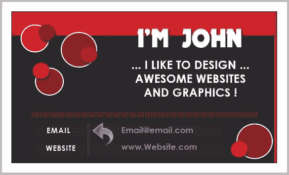](https://www.sitepoint.com/wp-content/uploads/2013/02/Step-152.jpg)

### 第十六步

名片的正面已经做好了，我们接着看另一面。重复同样的初始过程，我们遵循的正面。(让我们回到“正常”屏幕模式)

现在选择矩形工具，用红色样本创建一个矩形(C=15 M=100 Y=100 K=0)。

[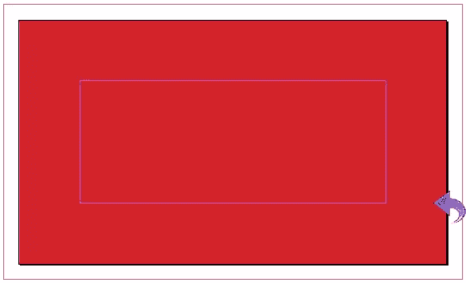](https://www.sitepoint.com/wp-content/uploads/2013/02/Step-162.jpg)

### 步骤 17

用黑色色样创建另一个矩形(C=0 M=0 Y=0 K=95)。

[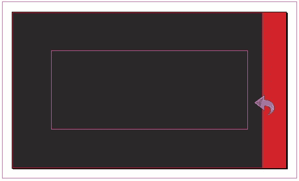](https://www.sitepoint.com/wp-content/uploads/2013/02/Step-173.jpg)

### 步骤 18

选择椭圆工具，用我们之前使用的相同的笔触和阴影创建一些圆形。

[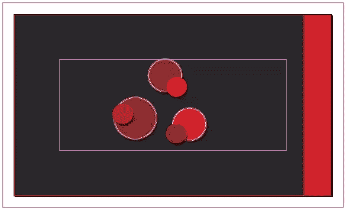](https://www.sitepoint.com/wp-content/uploads/2013/02/Step-181.jpg)

### 步骤 19

选择文字工具添加所需的标题文本。然后，点击“对象”>“变换”>“顺时针旋转 90 o ”

[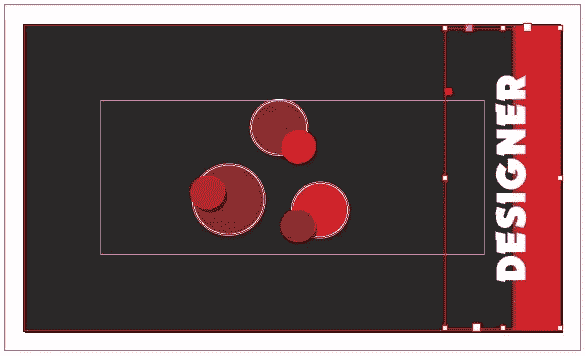](https://www.sitepoint.com/wp-content/uploads/2013/02/Step-19.jpg)

### 步骤 20

选择标题层，点击“效果”,使用以下设置添加阴影和内阴影。

[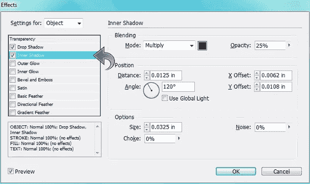](https://www.sitepoint.com/wp-content/uploads/2013/02/Step-20b.jpg)

### 步骤 21

现在我们的名片设计已经准备好了，所以让我们创建一个打印就绪的 PDF 文件。您可以根据打印机要求调整设置。点击“文件”>“Adobe PDF 预设”>“高质量打印”，然后将 PDF 保存到您想要的位置。现在会出现一个导出面板；调整设置并点击“导出”按钮。

[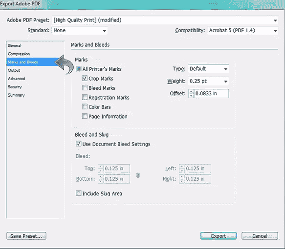](https://www.sitepoint.com/wp-content/uploads/2013/02/Step-211.jpg)

我们都做完了。我们吸引人的名片准备好了。

我希望你喜欢这个教程，我会带更多回来。在那之前，保重！

## 分享这篇文章