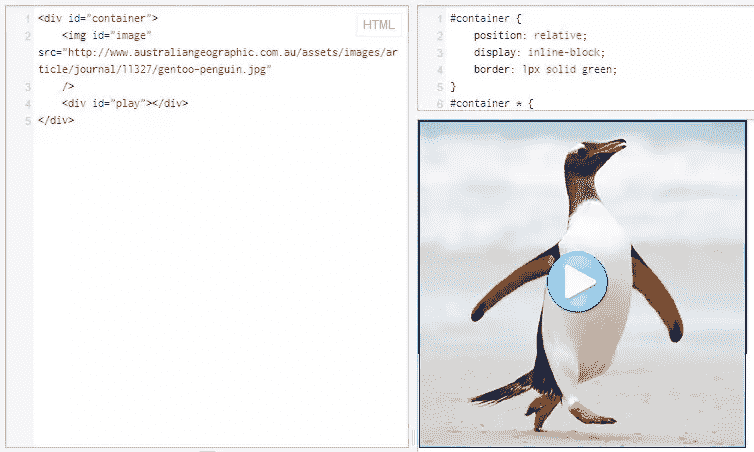

# 使用 CSS 播放按钮覆盖图像

> 原文：<https://www.sitepoint.com/play-button-overlay-image-css/>

尝试使用 CSS 将播放按钮图像覆盖在另一个图像上，使其位于父图像的中心。

*   

    ### 最佳版本

    [尝试——在现代浏览器和 IE8+jsfiddle.net/SdsJ9/1/中运行良好](https://jsfiddle.net/SdsJ9/1/)

    ### 以前的尝试

    [尝试-作品，在 FF jsfiddle.net/YAuKb/1/](https://jsfiddle.net/YAuKb/1/)不太好[尝试-作品，在 Chrome，FF，IE9 jsfiddle.net/YAuKb/6/](https://jsfiddle.net/YAuKb/6/)不错

    ## 半铸钢ˌ钢性铸铁(Cast Semi-Steel)

    ```
    #container {
        position: relative;
        display: inline-block;
        border: 1px solid green;
    }
    #container * {
        -moz-box-sizing: border-box;
        -webkit-box-sizing: border-box;
        box-sizing: border-box;
    }
    #image {
        z-index: 9;
        text-align: center;
        border: 1px solid blue;
    }
    #play {
        background: url('https://cdn1.iconfinder.com/data/icons/iconslandplayer/PNG/64x64/CircleBlue/Play1Pressed.png') center center no-repeat;
        margin: -240px 10px 0 0;
        height: 140px;
        position: relative;
        z-index: 10;
    }
    ```

    ## 超文本标记语言

    ```
     `` 

    ```

## 分享这篇文章