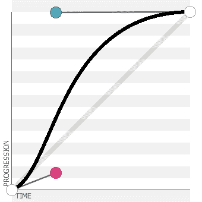

# 实验游戏开发研究

> 原文：<https://www.sitepoint.com/a-study-in-experimental-game-development/>

你如何把一个模糊的想法变成一个游戏——从技术细节到有趣和有挑战性的东西？最近，我发现自己在想 [CSS 转场](https://developer.mozilla.org/en-US/docs/CSS/Tutorials/Using_CSS_transitions "Using CSS transitions (MDN)")是否可以用来制作某种游戏。这篇文章是关于这个想法的探索，以及它发展成为一种优雅的(据我所知)独特的游戏玩法。

## 基本思想

基本想法是使用玩家部分控制的缓慢过渡来制作一个对象的`left`和`top`位置的动画。因此，我们将需要一个游戏区——姑且称之为**板**，以及一个动画对象——姑且称之为**球**:

```
<body>
  <div id="board">
    <span id="ball"></span>
  </div>
</body>
```

棋盘的长宽比为 3:2，而球是其宽度的 5%。这两个值都不是特别重要，它们只是看起来最合适的——选择纵横比是为了(最终)适合 iPhone 屏幕，球做得相对较小，所以它有足够的空间移动。下面的演示展示了基本布局，球在棋盘的左上角。

*   **[演示 1:棋盘和球](http://jspro.brothercake.com/ease/demo1-board.html)**

球的边距为负值，以抵消其自身宽度和高度的一半，因此我们在球上设置的任何位置都将是其中心原点(例如，第一个演示中的球位于`0,0`)。这是那个演示的 CSS:

```
#board
{
  position:relative;

  display:block;
  width:720px;
  height:480px;
  margin:24px auto 0 auto;

  border-radius:2px;

  background:#fff;

  box-shadow:0 0 16px -2px rgba(0,0,0, 0.5);
}

#ball
{
  position:absolute;
  left:0;
  top:0;

  display:block;
  width:36px;
  height:36px;
  margin:-18px 0 0 -18px;

  border-radius:18px;

  background:#f00;

  box-shadow:inset 0 0 0 2px rgba(0,0,0, 0.35), 4px 10px 10px rgba(0,0,0, 0.15);
}
```

理想情况下，我们将根据可用的窗口或屏幕空间动态应用棋盘和球的大小(这对于将游戏移植到移动浏览器来说是必不可少的)，但为了保持这些示例的简单性，尺寸是固定的——棋盘为 720×480，球为 36×36。

球可能的运动范围现在可以用百分比坐标来描述——从左上角的`0%,0%`到右下角的`100%,100%`。使用百分比比计算像素更简单，并且允许将来在尺寸上的灵活性。

现在，我们可以通过应用一些简单的 JavaScript 来轻松控制位置，根据方向键设置`left`或`top`的位置，即如果按下`Left Arrow`，则将`style.left`设置为`"0"`，或者如果按下`Down Arrow`，则将`style.top`设置为`"100%"`:

```
var
ball = document.getElementById('ball'),
positions =
{
  37  : ['left', '0'],
  38  : ['top', '0'],
  39  : ['left', '100%'],
  40  : ['top', '100%']
};

document.addEventListener('keydown', function(e, data)
{
  if(data = positions[e.keyCode])
  {
    ball.style[data[0]] = data[1];

    e.preventDefault();
  }

}, false);
```

`positions`数组为每个箭头`keyCode`定义了一个属性和值，并且也在第一个条件中用来知道一个箭头键是否被按下，在这种情况下，我们必须使用`preventDefault()`来阻止它的本地动作(这样页面就不能同时滚动)。同样为了简单起见，我没有做任何特征检测来过滤旧的浏览器。实际上，我们希望对浏览器进行预先测试，以确保完全支持过渡。下面的演示允许将球移动到任何角落。

*   **[演示 2:移动球](http://jspro.brothercake.com/ease/demo2-moving.html)**

接下来，让我们添加一个缓慢的`transition`规则来制作运动动画。请注意包含了供应商前缀。

```
#ball
{
  -moz-transition:all 5s ease;
  -ms-transition:all 5s ease;
  -o-transition:all 5s ease;
  -webkit-transition:all 5s ease;
  transition:all 5s ease;
}
```

现在箭头键的变化不会触发突然移动，而是触发球在棋盘上缓慢渐进的移动。由于每次按键只改变`left` *或* `top`的位置(从不同时改变)，整体效果是一种新颖而优雅的运动——一种“弹性”,这对于脚本来说要复杂得多:

*   **[演示 3:弹性运动](http://jspro.brothercake.com/ease/demo3-elastic.html)**

例如，尝试该演示中的以下操作:

1.  刷新页面重置球
2.  然后按一下`Right Arrow`
3.  等到球穿过一半(2.5 秒后)
4.  然后按一下`Down Arrow`

按下`Right Arrow`将开始向右移动球的转换，然后按下`Down Arrow`将触发向下移动球的第二次转换。但是第二个过渡不会影响第一个，第一个仍然会继续，总体效果是一个**平滑曲线**——描述了一个从顶部中心向下到底部右侧的弧线。

## 完善游戏玩法

我们现在可以把球移动到棋盘内的任何地方，使用箭头键来指示移动的方向。这提供了控制，但不是*完全的*控制，这是一个可玩游戏的基本挑战。由于转换的应用方式不同，我们的控制能力也不同。例如，当您按下`Right Arrow`时，如果球在`"left:0"`处，则需要五秒钟到达右边缘(如预期)。然而，如果当你按下`Right Arrow`时，球已经在`"left:80%"`了，那么它将*仍然*花整整五秒钟的时间移动到右边缘的更小的距离。换句话说，当改变方向时，球的速度取决于它离你指定的方向有多近。

转换定时功能的选择也有很大的不同。在这些例子中，我使用了`"ease"`函数，它等同于下面的[贝塞尔曲线](http://roblaplaca.com/blog/2011/03/11/understanding-css-cubic-bezier/ "Understanding CSS cubic-bezier (Adventures in Code)"):



该图显示了相对速度，并说明了它如何在开始时加速，然后在接近结束时减速。因此，球在过渡的开始和结束时会移动得更慢，这将使它在这些点上更容易控制。事实上，你可以通过快速不断地改变球的方向，让球几乎静止不动。

## 加入真正的挑战

我们现在有了一个不错的可玩动作，但是我们仍然没有一个游戏。必须有一些具有挑战性的事情——一些你实际上必须在有限的控制范围内*做*的事情。也许我们可以使用相同的过渡来添加额外的东西？

因为我们已经定义了应用于`"all"`属性的过渡，我们可以简单地扩展 JavaScript，这样每个箭头键也应用背景颜色的**变化，用不同的粗体颜色对应每个方向:**

```
var
ball = document.getElementById('ball'),
positions =
{
  37  : ['left', '0'],
  38  : ['top', '0'],
  39  : ['left', '100%'],
  40  : ['top', '100%']
},
colors =
{
  37  : '255,0,0',
  38  : '255,255,0',
  39  : '0,0,255',
  40  : '0,255,255'
};

document.addEventListener('keydown', function(e, data)
{
  if(data = positions[e.keyCode])
  {
    ball.style[data[0]] = data[1];
    ball.style.backgroundColor = 'rgb(' + colors[e.keyCode] + ')';

    e.preventDefault();
  }

}, false);
```

现在，通过按箭头键，我们不仅改变了球的位置，还改变了它的原色。让我们也将球的默认位置移动到中心，并将其默认颜色设置为灰色(即，设置为在比赛中永远不会有的中亮颜色):

*   **[演示 4:颜色变化](http://jspro.brothercake.com/ease/demo4-color.html)**

但是，当然，颜色不会立即改变，它会在一个过渡过程中逐渐从一个过渡到另一个，沿途经过各种中间色调。例如，如果球是红色的，然后你按下`Right Arrow`，它将通过各种紫色阴影从红色变为蓝色(以及向右移动)。

由于每个方向都有不同的颜色，同样的运动也有可能产生不同的颜色。例如，如果你按下`Right Arrow`然后快速按下`Down Arrow`，球将移动到右下角，并淡入青色(因为青色映射为向下)。但是，如果您以相反的顺序按下这些键(向下，然后向右)，球仍然会移动到同一个角落，但这次会褪色为蓝色(因为蓝色映射到右侧)。所以对于任何一个给定的物理位置，球可能会有许多种不同的颜色。

现在我想，我们已经拥有了制作游戏所需的一切。如果很难完全控制球，并且很难让它成为一种特定的颜色，那么我们可以创建一个游戏挑战，说你必须**让球到达特定的位置和特定的颜色。**

## 最终的游戏原型

我们将添加一系列具有不同背景颜色的附加元素——姑且称之为**目标**——然后添加监控球的位置和颜色的脚本。如果球在目标区域内，而且颜色相同，那么我们称之为匹配，目标消失。这很容易描述，但是实际编写起来相当复杂，如下所示。

```
var targets = 
[
  { "color" : [220,180,40], "coords" : [5,5,12,35] }, 
  { "color" : [210,80,80], "coords" : [45,2.5,10,40] }, 
  { "color" : [160,90,60], "coords" : [65,5,20,20] }, 
  { "color" : [100,100,150], "coords" : [2.5,75,35,15] }, 
  { "color" : [150,70,100], "coords" : [55,65,10,20] }, 
  { "color" : [70,230,150], "coords" : [87.5,60,10,20] } 
];

for(var len = targets.length, i = 0; i < len; i ++)
{
  var target = document.createElement('div');
  target.className = 'target';

  target.style.left = targets[i].coords[0] + '%';
  target.style.top = targets[i].coords[1] + '%';
  target.style.width = targets[i].coords[2] + '%';
  target.style.height = targets[i].coords[3] + '%';
  target.style.backgroundColor = 'rgb(' + targets[i].color.join(',') + ')';

  targets[i].target = ball.parentNode.insertBefore(target, ball);
}

var tracking = window.setInterval(function()
{
  var ballcolor = window.getComputedStyle(ball).backgroundColor.replace(/[^0-9,]/g, '').split(',');
  for(var n = 0; n < 3; n++)
  {
    ballcolor[n] = parseInt(ballcolor[n], 10);
  }

  for(var i = 0; i < targets.length; i ++)
  {
    if
    (
      ball.offsetLeft > targets[i].target.offsetLeft
      &&
      ball.offsetLeft + ball.offsetWidth < targets[i].target.offsetLeft + targets[i].target.offsetWidth
      &&
      ball.offsetTop > targets[i].target.offsetTop
      &&
      ball.offsetTop + ball.offsetHeight < targets[i].target.offsetTop + targets[i].target.offsetHeight
    )
    {
      var match = 0;
      for(var n = 0; n < 3; n ++)
      {
        if(Math.abs(ballcolor[n] - targets[i].color[n]) < 40)
        {
          match ++;
        }
      }

      if(match === 3)
      {
        targets[i].target.parentNode.removeChild(targets[i].target);
        targets.splice(i, 1);

        if(targets.length === 0)
        {
          window.clearInterval(tracking);

          window.setTimeout(function(){ alert('Yay!'); }, 250);
        }
      }
    }
  }

}, 62.5);
```

比较颜色时，我们必须留有一定的余地。我们不能期望球和目标完全相同(这几乎是不可能的)，所以我们从另一个中减去一个，并允许最大差异。因为我们需要这样做，所以使用 <abbr title="Red Green Blue">RGB</abbr> 来应用颜色，因为 RGB 值更易于编程处理:

```
var match = 0;
for(var n = 0; n < 3; n ++)
{
  if(Math.abs(ballcolor[n] - targets[i].color[n]) < 40)
  {
    match ++;
  }
}

if(match === 3)
{
  //... all three channels are sufficiently close
}
```

跟踪代码本身被包装在一个单独的`setInterval()`循环中，这(据我所知)是持续监控球的属性的唯一方法——使用`getComputedStyle()`和偏移属性，在每次迭代中获取球的颜色和位置。间隔不应该太快以至于给浏览器带来过度的压力，但是它仍然必须足够快以达到**的精确度**——基于球的大小和速度。因为球是棋盘的 5%,并且在五秒钟内移动了整个距离，所以球移动其自身宽度需要一个平均`250ms`。因此，无论我们用于区间的比例是多少，都将最大*跟踪漂移*表示为球大小的一部分，即球的区间计算位置与其实际位置之间的最大差异量。我设置的速度是`62.5ms`，它的最大漂移量是球大小的四分之一。坦率地说，这比我希望的要快一点，但比这更慢的速度就不够准确，可能会导致无法检测到有效的匹配。

如果有某种针对 CSS 转换的每帧回调事件，事情会简单得多，但没有——我们仅有的事件是一个`transitionend`事件，它在转换结束时触发，但这对我们没有用。

但是不管怎样——我们现在有游戏了！试试下面完成的原型，看看你进展如何——游戏的目标是**匹配每个目标，直到棋盘清空**:

*   **[Demo 5:最终原型](http://jspro.brothercake.com/ease/demo5-prototype.html)**

## 超越原型

当你完成的时候什么都不会发生，而且只有这一轮！这只是一个原型，尽管如此，我们仍然可以进行改进。例如，如果我们限制球的运动，使它不允许触及边缘，这将使游戏更具挑战性和更尖锐。

所以请尽快加入我这篇文章的第二部分，也是最后一部分，我们将看看如何(以及是否)进一步开发这个原型，使之成为一个精致的、可发行的游戏。

同时，您可以下载本文所有演示的 zip 文件:

*   **[下载试玩](https://github.com/jsprodotcom/source/blob/master/EaseGame.zip)**

## 分享这篇文章