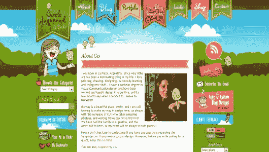
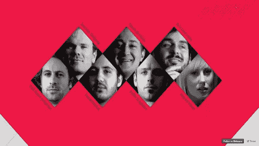
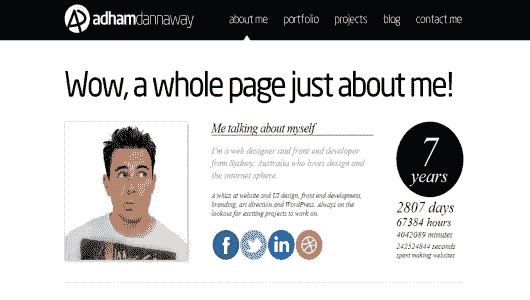
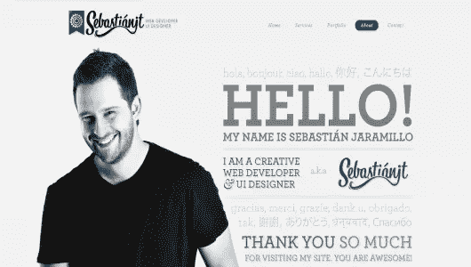
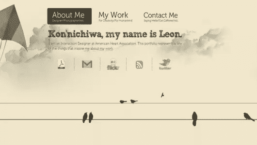

# 真正个性化你的“关于我”页面的 5 种方法

> 原文：<https://www.sitepoint.com/5-ways-to-truly-personalize-your-about-me-page/>

无论你是为大公司工作还是为小公司工作，在你的网站上有一个“关于我”的有趣的个人页面是一个很好的方式，可以让你从数以百万计的商业和个人资料中脱颖而出，这些资料都是平淡无奇的“关于我”页面。这些简介中有许多似乎纯粹是因为主管、公司政策或个人良知要求有一个“关于我”的页面，而这一要求的受害者不情愿地整理了一个旨在融入人群的乏味简介。这不是设计师的正确方法；如果你要有一个“关于我”的页面，它最好是独特的，鲜明的，醒目的。为自己设计一个好的网页可能很难，但这并不意味着你不能做出一个好的设计。

那么，是什么让“关于我”的页面变得有效和吸引人呢？事实上，这取决于你是谁，为什么你有一个网站，但有一些通用的最佳实践可以帮助你设计一个适当突出的“关于我”的页面，无论行业、技能或个性如何。

### 做一些有创意的事情

当你试图与众不同时，原创是最好的方法。在设计世界里敲着老一套的鼓会让人感到无聊，因此会让他们忽视你，除非你有一个非常吸引人的专长。为什么不把这个专业作为你个人资料的一部分呢？有创意的布局可以说明很多关于你和你的作品的信息；它可以证明你有创新精神，愿意冒险，有趣，有思想。所有这些都是需要具备的优秀品质，尤其是当你在艺术领域拥有一份职业的时候。使用不同的形状和颜色组合可以使页面元素以及整个页面脱颖而出。

说到颜色，在设计中，对比色和互补色总是你的好朋友。大胆的颜色很好用，但是如果你不喜欢它们，试着用它们作为最小的强调色来引起对某些事情的注意。大型照片背景在设计中仍然是一种流行的风格，所以利用你自己的恒星摄影是一个很好的主意(另外，它可以让你不坚持使用平凡的固体背景)。一定要注意你选择的字体，避免语言上的陈词滥调。即使是像把“关于我”改成“遇见我”这样的小变化，也能形成更有创造性的方法。

### 出现

出于这样或那样的原因，我们中的一些人不喜欢在网上露面，但是当你的网站致力于与其他人合作时，展示自己是一个好主意。首先，它培养了某种形式的信任，如果你要求人们为你的主观设计工作付钱，那么你想让自己看起来值得信任。第二，人们通常想知道他们在读什么，在和谁打交道。

如果你用的是自己的照片，要确保照片质量好。在充足的光线下给自己拍张照片，更容易让别人看到你的样子。一般来说，你应该避免在照片上使用任何创造性的滤镜，因为这会降低网站的整体质量。

你也可以用你的照片走不同的路线，用大的作为背景。如果你是一个强烈不喜欢使用自己照片的人，你可以设计一个与你相似的头像，这是一个进一步展示你创造力的好方法。

### 提供真实的解释

如果你甚至不打算谈论自己，那么拥有一个“关于我”的页面是没有意义的；这完全违背了初衷。不要让你的访客对你是谁一无所知，但也不要让他们过多地了解你生活中的每一个细节。这是你的“关于我”页面，不是你的回忆录，所以不要觉得有必要写超过两段。超过两段的内容会增加访问者有限的注意力，但是如果你有很长的相关职业经历，这可能是必要的。但是，首先也是最重要的，你需要提供一份简短的简历，介绍你是谁，你做什么。

你也可以考虑用一些个人细节(地点、教育、家庭状况、宠物、爱好等)让自己变得更有个性、更平易近人。)如果合适的话。取决于你的网站将被用于什么；分享你的目标也可以包括在内。写关于你自己的东西可能会很有挑战性，所以写一份清单可以帮助你缩小选择范围。

### 真正有风度

我之前已经提到过[风度翩翩是极其重要的](https://www.sitepoint.com/5-easy-ways-to-keep-design-clients-happy/ "5 Easy Ways to Keep Design Clients Happy"),原因有几个，尤其是在你的页面上。有很多方法可以培养人与人之间的友好关系，但是既然你要通过网络来实现这一点，那么这一切都归结于写作。你必须尽可能远离“机械”,并通过数字媒介尽可能使自己人性化。

分享个人信息是让你在观众面前显得有个性的可靠方法。每个人都至少有一个工作之余喜欢做的爱好；受得了就分享吧。此外，注意你写作的语气，你不希望它显得紧张或沉闷。尽量用友好的声音交流。当你写你的简历时，你可以用第三人称或第一人称写你自己。有些人会说，你永远不应该用第三人称写你自己，因为这会制造更多的社交距离，但我读过几个用第三人称写的简历，它们仍然迷人、幽默、有风度。

### 添加社交图标

在你的“关于我”页面上放置一些链接到你最常去的社交网络的社交媒体图标总是一个好主意。在个人技术不断发展和进步的世界里，提供一种或多种方式让人们与你联系是最理想的。它还重申了这样一个观点，你写这个“关于我”的页面不仅仅是因为你必须这样做；你真的对与你的网站访问者和客户互动感兴趣。

在提供到社交网络的异地链接方面，你通常有两种选择。你可以简单地超链接文本，或者你可以使用那些无处不在的社交媒体图标。网络上到处都有社交媒体图标，有不同的形状、大小、颜色和设计，给了你大量的选择。但是，社交图标的广泛可用性也使它们在“关于我”页面上非常常见，所以你可能想在如何将用户发送到你的社交简档方面更有创意一些。

### 结论

在制作“关于我”的页面时，请牢记你的目的。如果你真的只是想融入其中，但你觉得有义务发布一个“关于我”的页面，那么很容易就可以做一个普通的样板设计。但是，大多数设计专业人士都希望完成并脱颖而出，设计师的个人页面是展示你的创造力和技能的绝佳机会，尤其是如果你有一些在你的作品集或客户作品中无法展示的锦囊妙计。这一次，这个设计真的是你的页面，不要害怕表达自己！

## 分享这篇文章