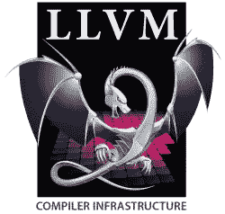
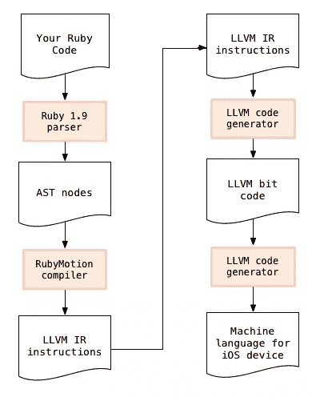
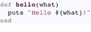
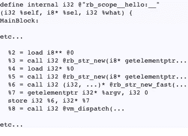
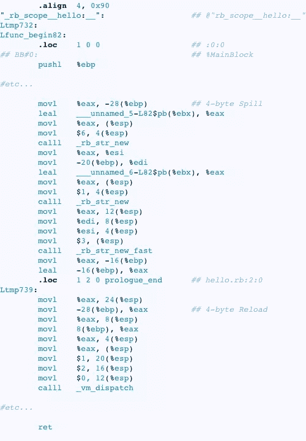
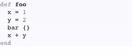
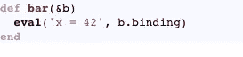

# Laurent Sansonetti 谈 RubyMotion 内部构件

> 原文：<https://www.sitepoint.com/laurent-sansonetti-on-rubymotion-internals/>

如果我们能打开 RubyMotion 看看里面，我们会看到什么？

昨天，我发布了对 Laurent Sansonetti 的采访的前半部分，内容是关于 RubyMotion，这是一个针对苹果 iOS 移动平台的 Ruby 实现。如果你对 RubyMotion 不太熟悉，请务必先阅读它。我们有机会讨论了 RubyMotion 的基础知识:它是什么，项目是如何开始的，以及编写 RubyMotion 应用程序与使用 MRI 编写标准 Ruby 应用程序有何不同。

在这篇文章中，我们采访的后半部分，我有机会问 Laurent 关于 RubyMotion 的内部工作方式:RubyMotion 如何编译 Ruby 代码？这到底意味着什么？你的代码如何从 Ruby 转换成你的 iPhone 或 iPad 可以理解的本机语言？RubyMotion 与 [MacRuby](http://macruby.org) 和 [Rubinius](http://rubini.us) 有什么不同？

当我去年写《显微镜下的 Ruby》时，我不能包含任何关于 RubyMotion 的信息，因为它不是一个开源项目。有机会与 Laurent 直接对话对我来说是一个了解 RubyMotion 内部的好方法，对你来说也是。这是 Ruby 的一个真正独特的实现，是所有 Ruby 开发者都应该知道的，即使他们目前没有从事 iOS 开发。

## RubyMotion 和 LLVM

问:我在你的网站上读到，你正在使用 LLVM 作为你的编译器背后的技术。我想知道这在高层次上是如何运作的。你把 Ruby 代码编译成 LLVM IR 指令集了吗？

RubyMotion 与 MacRuby 和 Rubinius 一样，
在内部使用 [LLVM 编译器](http://llvm.org)

是的，我们做那件事。RubyMotion 编译器将把 Ruby 源代码解析成一个 [AST](http://en.wikipedia.org/wiki/Abstract_syntax_tree) ，这里我们实际上使用的是 Ruby 1.9 解析器。

问:你已经从 MRI 中提取了 parse.y 文件？

是的。我们使用 Ruby 1.9 解析器，然后为 Ruby 文件的语法获取一个 AST 节点树。然后，我们迭代每一个并在 LLVM 语言中创建等价的。

LLVM 可以解释为两件事:

*   第一个是非常抽象的汇编语言，它与处理器无关。它应该是跨平台的，这就是为什么它有一个有限的指令集。这是一种你可以自己编写的语言，或者你可以使用 API 来生成它。LLVM 提供了一个可以用来生成指令的 C++ API。

*   LLVM 项目的第二部分是该语言的编译器。它是一组模块，可以用来将这些 LLVM 指令(也称为 IR 或“内部表示”)翻译成汇编。

在将 Ruby 代码部署到目标设备之前，您的 Ruby 代码会被转换几次

问:所以没有虚拟机？“LLVM”里没有“VM？”这是 LLVM 令人困惑的地方之一，不是吗？

绝对；LLVM 中实际上没有虚拟机。有时人们认为它是 JVM 的替代品。他们说:“我们需要将这种语言从 JVM 移植到 LLVM。”但是 LLVM 只是一个编译器。那里没有运行时。

您可以通过两种方式使用 LLVM 第一种方式是作为一个静态的、超前的编译器。您将 LLVM IR 传递给它，它就会转储一个位代码文件。比特代码实际上是语言的二进制表示。然后，从位代码中，您可以使用低级工具来编译特定处理器和架构的汇编指令。可以针对 Intel 32 位、64 位、ARM、PowerPC 等。LLVM 支持很多处理器。

问:……包括 iOS 设备里的那些？

绝对的。

我认为这是 LLVM 最常用的使用方式。然后就是 [Clang 项目](http://clang.llvm.org)使用 LLVM 的方式。Clang 是苹果新推出的 C 级编译器。它应该取代 gcc，而且它也像 RubyMotion 那样使用 LLVM。

使用 LLVM 的第二种方式是作为 JIT，或者“实时”编译器。这就是 Rubinius 在做的事情，据我所知，这就是 MacRuby 在做的事情。

问:那有什么不同呢？

唯一的区别是 LLVM 有一个 C++ API 在运行时完成编译过程。你创建 IR 指令，然后调用这个特定的 API，得到一个指向机器码的指针，你可以在程序内部调用它。

问:所以这是同一个编译器，但你在不同的时间运行它？

没错。你在运行时运行它。在 MacRuby 中，这是默认模式。当您运行“macruby foo.rb”时，它将解析、执行并即时编译整个文件，并在运行时执行。

我相信 Rubinius 也在做同样的事情；我可能弄错了，因为这些天我并不怎么关注 Rubinius 项目。我认为他们是这样使用 LLVM 的。在 MacRuby 中，我们很早就使用了 LLVM，我想是和 Rubinius 同时使用的。我认为 Rubinius 有一个原型，在某一点上，非常慢。在 MacRuby 中，我们稍后尝试了 LLVM，它对我们有效。然后埃文·菲尼克斯告诉我，他们实际上设法让它工作了。那时候 LLVM 很不成熟；有很多 bug，非常不稳定。

问:这是在 2007 年还是 2008 年？

这是 2009 年。当时，LLVM 开发人员说 LLVM 是一个很棒的实时编译器，因为苹果在 OpenGL 栈中使用了它，我想。编程语言实际上应该把它作为 JIT 来使用。这就是我们为 MacRuby 和 Rubinius 所做的。谷歌的一个项目使用了它，这是一个叫做[unload Swallow](http://en.wikipedia.org/wiki/Unladen_Swallow)的 Python 实现。

几年后，很明显 LLVM 不是一个好的实时编译器。它非常慢，而且有点不稳定。此外，进行适当的异常处理非常繁琐。与此同时，LLVM 过去是，现在仍然是做静态编译器、超前编译器的好平台，这就是我们在 RubyMotion 中使用它的方式。

问:我认为你的所作所为令人惊叹:将 Ruby 这样的动态语言编译成机器语言指令令人印象深刻。您能否向我们展示一下 RubyMotion 如何将一个简单的 Ruby 方法转换成 LLVM IR 指令，然后再转换成汇编语言？

当然——绝对可以。如果我们从一个基本的 hello.rb 文件开始:

|  |

…编译器将生成以下 LLVM 位代码(
LLVM IR 语言的指令):

|  |

这里，有趣的东西是内插字符串的构造(rb_str_new*调用)和#puts 消息的发送(vm_dispatch 调用)。

然后，编译器将从 LLVM IR 生成程序集。以下是 i386 版本(用于模拟器):

|  |

## 优化局部变量和基本算法

问:在第 1 部分的早些时候，你说你讨厌 Ruby 的 [Proc#binding](http://www.ruby-doc.org/core-1.9.3/Proc.html#method-i-binding) 方法。你为什么这么讨厌那个？

我觉得每个实现 Ruby 的人真的很讨厌这种方法。最好的论点可能是查尔斯·纳特提出的。这种方法是邪恶的，因为它不可能优化局部变量。这里有一个例子:

这里不可能知道方法返回什么。通常它应该返回 3，但是如果 bar 方法是这样写的:

问:所以它在那个绑定的上下文中评估“x=42”代码？

是的，因为 bar 方法在 proc 的绑定中求值，它将改变局部变量的值。所以在 RubyMotion 中，如果你试图使用 Proc#binding，它会抛出一个异常，说我们不支持它。

由于这一点，我们可以优化局部变量。

问:我明白了。这很有趣，因为 RubyMotion 与 JRuby、Rubinius 或其他 rubies 的不同之处在于，你以这些方式改变了语言。JRuby 和 Rubinius 使用 [RubySpec](http://rubyspec.org) 规范，试图让语言与 MRI 保持一致。

这在 MacRuby 中也是一样的；我们也支持 Proc #绑定。你说得对，在 RubyMotion 中，我尝试了一种不同的方法。嗯，这些方法并没有真正使用。据我所知在 Rails 中并没有用到它们，Rails 是 Ruby 特性的最大用例。他们几乎什么都用，但是他们不使用 Proc #绑定。此外，Proc#binding 具有最近被调用的安全含义。

我决定将它从 RubyMotion 中移除，因为性能很重要，这允许我们优化局部变量。同时，在 RubyMotion 中，不能在 Fixnum 类上重定义操作符。您不能打开 Fixnum 类并重新定义 plus 来做其他事情。

问:因为你想让本地代码做加法？

完全正确，尽可能快地编译算术运算。我们无法检查 Fixnum 方法是否被重定义。在 MacRuby 中，我们支持所有这些，但是在 RubyMotion 中，我删除了 Ruby 的一些功能，这些功能实际上会减慢这个过程。

问:这似乎是一个很好的权衡:你简化了你的技术，你使目标应用程序更快，你只删除了一些大多数人不使用的小东西。

我们得到的唯一抱怨是关于“要求”他们说我们应该有这样的东西，所以我们实际上可能在这方面做一些事情。

## RubyMotion 调试如何工作

问:什么是矮人？

[DWARF](http://www.dwarfstd.org) 是 C 级语言的调试格式。DWARF 文件包含二进制文件中每个地址的注释。比如这是一个函数…在这个区域我们保存某一类型的局部变量…这个区域包含一个 C++类。

这是二进制文件附带的调试格式。调试器如 GDB 或剖析器能够加载这种格式，因此它实际上可以了解更多关于二进制文件的信息。

问:所以你在每个二进制文件中都包含了这些信息？还是只有在你挂着某些旗帜的时候？

它仅用于开发，DWARF 文件实际上并不是二进制文件的一部分；它实际上在一个单独的文件中。

因此，当你将 GDB 连接到 RubyMotion 应用程序时，你实际上可以看到回溯帧的文件和行信息，你可以使用“下一步”跳转到下一个 Ruby 行，这真是太棒了！这对知道如何使用 GDB 的人来说很棒，但是大多数 Ruby 开发人员真的很难使用 GDB。我们的计划之一是在此基础上实际编写一个高级 Ruby 调试器。

问:RubyMotion 的调试前景如何？

现在很难使用 RubyMotion 来分析他们的应用程序，因为你需要坚持使用 GDB、MallocDebug、GuardMalloc、sample，这些都是非常低级的工具。这并不容易。所以我们想在它的基础上建立某种抽象。

## 分享这篇文章