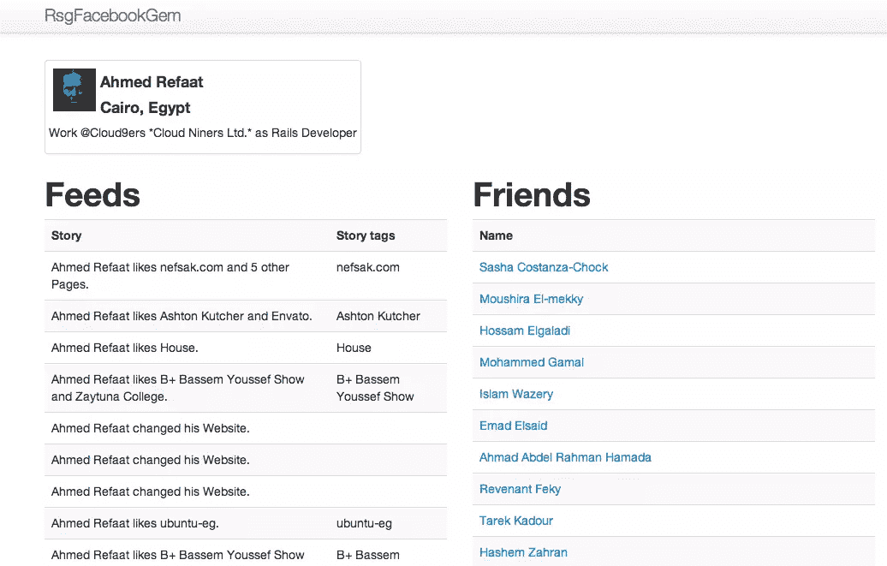

# 红宝石社交宝石:脸书

> 原文：<https://www.sitepoint.com/ruby-social-gems-facebook/>

这是我关于 Ruby 社交媒体宝石系列的第三部分。今天，我关注的是脸书宝石。

## 考拉 Gem

Koala 是一个 gem，它与各种脸书 API(Graph API、REST API、实时更新、测试用户和 OAuth 验证)接口。)我知道有许多与脸书相关的宝石，但考拉是我为本文选择的宝石。

## 演示应用程序

我们要用 Koala gem 构建的应用程序与我们用以前的文章构建的应用程序是一样的。我们将从脸书获得所有用户数据到我们的 rails 应用程序中，这样我们就可以用我们喜欢的任何格式显示它。

从应用程序开始:

> 你可以在这里下载教程表单 [github 的完整源代码](https://github.com/ahmdrefat/rsg_facebook_gem)

创建一个新的 rails 应用:
`rails new rsg_facebook_gem`

在`path/to/project/Gemfile`中添加考拉、定计、自举、少宝石

```
gem 'devise'
gem 'koala'
gem "less-rails"
gem 'twitter-bootstrap-rails'
```

然后运行
`bundle install`

我们将为 UI 组件使用 bootstrap。

### 正在初始化

在开始之前，我们需要运行几个命令来初始化项目。

#### 创建用户模型和引导样式

以下命令可以在 github 页面的[设计项目](https://github.com/plataformatec/devise)和 twitter [引导项目](https://github.com/seyhunak/twitter-bootstrap-rails)中找到

安装
装置`rails generate devise:install`

创建用户模型
`rails generate devise user`
`rake db:migrate`

要配置视图
`rails generate devise:views`

安装引导程序
`rails g bootstrap:install`

设置一个布局引导
到`rails g bootstrap:layout application fixed`

从
中删除索引文件`path/to/project/public/index.html`

### 应用程序结构

#### *控制器*

我们只需要创建一个控制器，它将处理到脸书的连接。该控制器将从 API 中提取数据，并将其推送到我们的模型中。

`rails g controller facebook`

将下面一行添加到 FacebookController 的开头

```
before_filter :authenticate_user!
```

在[脸书开发者站点](https://developers.facebook.com/apps)上创建一个应用程序，并将“站点 URL”设置为“http://localhost:3000”，将“应用程序域”设置为“localhost”。如果您在设置回调时有任何问题，您可以在此[链接](https://developers.facebook.com/bugs/147262162076254/)中找到解决方案。

为了探索 Graph API，有一个名为 [Graph API Explorer](https://developers.facebook.com/tools/explorer) 的 web 接口。您可以从右侧的“获取访问令牌”按钮更改权限，并向您的访问令牌添加任意数量的权限。

您将直接在您的 rails 应用程序中使用这个访问令牌来测试您的帐户。

我应该在这里指出，您可能会发现 ssl 的一个问题。解决这个问题的最简单方法是在控制台中运行下面一行。对于我们的应用程序，我们已经在`/path/to/project/config/initializers/openssl.rb`的初始化文件中添加了这一行

```
OpenSSL::SSL::VERIFY_PEER = OpenSSL::SSL::VERIFY_NONE
```

关于这个问题的更多细节在这个[链接](https://github.com/technoweenie/faraday/wiki/Setting-up-SSL-certificates)里。

现在，我们可以添加一些助手方法来处理身份验证和 API 查询。

考拉提供的**认证**只有两行代码。

脸书为应用程序设置了一些默认的权限，这些权限可能不符合应用程序的用途。若要添加更多权限，请转到应用程序仪表板中的“权限”选项卡。在 facebook 文档上有很多关于权限的信息。

`index`
*首先，我们检查是否已经有了一个存储 access_token 的`facebook_oauth_setting`对象。如果是这样，我们就不必每次都重定向用户来获取 access_token。access_token 存储在会话中。
*用户第一次登录时，我们用应用密钥和回调创建一个 OAuth 对象，然后将用户重定向到脸书以获得权限。

```
def index
  unless current_user.facebook_oauth_setting
		@oauth = Koala::Facebook::OAuth.new("app_id", "app_secret", "http://#{request.host}:#{request.port}/callback")
		session["oauth_obj"] = @oauth
		redirect_to @oauth.url_for_oauth_code
	else
		redirect_to "/facebook_profile"
	end
end
```

`callback`
*如果`facebook_oauth_setting`对象为零，我们使用脸书发回的“代码”参数来获取 access_token。
*为用户创建一个新的 FacebookOauthSetting 对象，并将用户重定向到`facebook_profile`动作

```
def callback
  unless current_user.facebook_oauth_setting
		@oauth = session["oauth_obj"]
		FacebookOauthSetting.create({:access_token => @oauth.get_access_token(params[:code]), :user_id => current_user.id})
		redirect_to "/facebook_profile"
	else
		redirect_to "/"
	end
end
```

`facebook_profile`
*如果`facebook_oauth_setting`对象存在，使用存储的 access_token 创建 API 对象。
*获取用户档案信息、图片、提要和朋友。并将它们设置为实例变量以在视图中显示，如果需要，您可以将它们存储在模型中。

```
def facebook_profile
  if current_user.facebook_oauth_setting
		@graph = Koala::Facebook::API.new(current_user.facebook_oauth_setting.access_token)
		@profile = @graph.get_object("me")
		@picture = @graph.get_picture("me")
		@feed = @graph.get_connections("me","feed")
		@friends = @graph.get_connections("me", "friends")
	else
		redirect_to "/"
	end
end
```

#### *路线*

将以下内容添加到`path/to/project/config/routes.rb`

```
match "/callback" => "facebook#callback"
match "/facebook_profile" => "facebook#facebook_profile"
root :to => 'facebook#index'
```

#### *视图*

在运行服务器之前，我们应该做一些修改。

修改布局视图`path/to/project/app/views/layouts/application.html.erb`，如下图所示:

```
<body>

  <div class="navbar navbar-fixed-top">
    <div class="navbar-inner">
      <div class="container">
        <a class="btn btn-navbar" data-target=".nav-collapse" data-toggle="collapse">
          <span class="icon-bar"></span>
          <span class="icon-bar"></span>
          <span class="icon-bar"></span>
        </a>
        <a class="brand" href="#">RsgFacebookGem</a>
        <div class="container nav-collapse">

        </div><!--/.nav-collapse -->
      </div>
    </div>
  </div>

  <div class="container" style="margin-top: 72px;">
      <div class="row">
        <div class="span9">
           <%= yield %>
        </div>

      </div><!--/row-->

    <footer>
      <p>&amp;copy; Company 2012</p>
    </footer>

  </div> <!-- /container -->

  <!-- Javascripts
  ================================================== -->
  <!-- Placed at the end of the document so the pages load faster -->
  <%= javascript_include_tag "application" %>

</body>
```

#### *型号*

正如我之前提到的，考拉涵盖了以下脸书 API:Graph API、REST API、实时更新、测试用户和 OAuth 验证。总的来说，github 上的考拉维基和脸书 API 参考资料都值得一读。
我们关注的是 Graph API，这是从脸书的社交图中获取数据的主要方式。关于 Graph API 的更多信息，这里有一个详细的[指南](https://developers.facebook.com/docs/getting-started/graphapi/)，其中也包含了 [Graph API Explorer。](https://developers.facebook.com/tools/explorer)

##### *用户*

转到`/path/to/project/app/models/user.rb`并向我们的 OAuth 对象添加一个`has_one`关系:

```
has_one :facebook_oauth_setting
```

##### *Facebook 的设置*

这个模型将为每个用户存储两个值:`access_token`和`user_id`。这些值稍后将用于访问脸书帐户，而无需每次都请求许可。

运行以下命令创建上述模型:

```
rails g model facebook_oauth_setting access_token:string user_id:integer
rake db:migrate
```

添加用户模型与 facebook *oauth* 设置模型的关联:
`path/to/project/app/models/facebook_oauth_setting.rb`

```
belongs_to :user
```

#### *脸书图形 API 浏览器*

我想最后一次强调 Graph API Explorer 的重要性和它的帮助。github 上的考拉维基用许多例子和文档很好地涵盖了 API 的这一部分。

这里有几个例子:

```
# to get a specific user
# http://graph.facebook.com/koppel
@graph.get_object("koppel")
# => {"name"=>"Alex Koppel", "id"=>"2905623", "last_name"=>"Koppel", "link"=>"http://www.facebook.com/koppel", "first_name"=>"Alex"}

# to get a page's feed
# http://graph.facebook.com/contextoptional/feed
@graph.get_connections("contextoptional", "feed")
# => array_of_stream stories

# to get any user profile picture
# http://graph.facebook.com/koppel/picture
@graph.get_picture("koppel")
# => "http://profile.ak.fbcdn.net/v224/784/109/q2905623_7065.jpg"

# http://graph.facebook.com/search?q=koala
@graph.search("koala")
# => {"data"=> [{"from"=>{"name"=>"Amy", ...}, "id"=>....,
#     "message"=>"My apartment is infested with koala bears...."}]}

@graph.put_wall_post("hey, i'm learning koala")
# => {"id"=>"2905623_123183957698327"}

# navigating feeds
@result = @graph.get_connections('me', 'feed')
# get the next page from the feed and so on
@next_page = @result.next_page
```

让我们把它们放在一起，构建一个简单的视图来显示存储的数据。

在`path/to/project/app/views/twitter/`
创建一个新文件`facebook_profile.html.erb`

```
<div class="row">
  <div class="span4">
    <div class="thumbnail">
      " style="float: left;margin: 5px;">
      <h4><%= @profile["name"] %></h4>
      <h4><%= @profile["location"]["name"] %></h4>
      <p>Work @<%= @profile["work"][0]["employer"]["name"] %> as <%= @profile["work"][0]["position"]["name"] %></p>
    </div>
  </div>
</div>

<div class="row" style="margin-top: 16px;width: 1000px;">
  <div class="span5">
  <h1>Feeds</h1>
  	<table class="table table-striped">
  	  <tr>
  	  	<th>Story</th>
  	  	<th>Story tags</th>
  	  </tr>
  		<% @feed.each do |f| %>
	  	  <tr>
	  	  	<td><%= f["story"] %></td>
	  	  	<td><%= f["story_tags"]["19"][0]["name"] %></td>
	  	  </tr>
  	  <% end %>
  	  <% feed_next_page = @feed.next_page %>
  	  <% feed_next_page.each do |f| %>
	  	  <tr>
	  	  	<td><%= f["story"] %></td>
	  	  	<td><%= f["story_tags"]["19"][0]["name"] if f["story_tags"]["19"] %></td>
	  	  </tr>
  	  <% end %>
  	  <% feed_next_page = @feed.next_page %>
  	  <% feed_next_page.each do |f| %>
	  	  <tr>
	  	  	<td><%= f["story"] %></td>
	  	  	<td><%= f["story_tags"]["19"][0]["name"] if f["story_tags"]["19"] %></td>
	  	  </tr>
  	  <% end %>
	</table>
  </div>
	<div class="span5">
	<h1>Friends</h1>
  	<table class="table table-striped">
  	  <tr>
  	  	<th>Name</th>
  	  </tr>
  		<% @friends.each do |f| %>
	  	  <tr>
	  	  	<td><a href="http://facebook.com/<%= f["id"] %>"><%= f["name"] %></a></td>
	  	  </tr>
  	  <% end %>
	</table>
  </div>
</div>
```

## 包扎

我希望这篇教程是有用的，并且是使用考拉 gem 和脸书 API 的很好的介绍。如果你想推荐下一个宝石，请在评论中提出。感谢阅读！

## 分享这篇文章