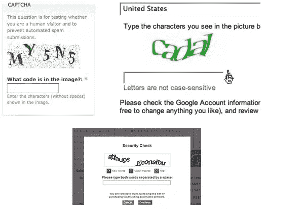
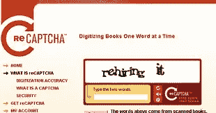

# 验证码:每个人都无法访问

> 原文：<https://www.sitepoint.com/captcha-inaccessible-to-everyone/>

## 什么是验证码？

CAPTCHA 代表完全自动化的公共图灵测试，用于区分计算机和人类。

在网页上，验证码是一种安全措施，旨在通过要求用户键入框中显示的字符来阻止机器人。

是的，就是这个:在提交在线表格之前，你必须破译一些歪歪扭扭的单词，并将其输入某个字段。并且经常做三四次才成功。

例如:

关于定义的更多信息，请参见维基百科关于验证码的文章。

就现实世界而言，有一些真正的奇迹，比如我们最近在一次审计中发现的[移动验证码](http://api.addthis.com/oexchange/0.8/forward/email/offer?url=http://picturesofyou.com.au/&username=tacweb&title=TAC%20-%20Pictures%20of%20You)(我们正在重建网站，所以它不会存在太久！)

John Foliot 发现了一些难以形容的令人困惑的 CAPTCHAs ，一篇值得一读的文章——请注意，文章中有很多移动(不，即使看起来很像，也不会不符合闪烁的可访问性要求)！

## 为什么有这么多验证码？

真的，如果没有验证码，这个世界会变得容易得多。它们令人困惑和困难，我们都没有时间。当然，人们希望我们使用他们的网站/提交他们的表格/注册他们的时事通讯？

有这么多验证码的原因是世界上有这么多垃圾邮件。他们被认为是防止机器人在博客上发布垃圾评论的有效方法。

另一个常见的用途是防止更多犯罪意图的机器人登录在线银行账户之类的。

验证码实际上是一种反向图灵测试——由机器执行，以确保填写表格的人是个人。

这也是为什么它们常常难以解释的原因。如果它们易于阅读，那么机器就可以阅读它们，这就没有意义了。

## 可访问性呢？

验证码不仅对任何人来说都很难使用，而且众所周知，患有某些类型残疾的人也无法使用。

在履行他们的指定职责，将机器拒之门外时，他们将使用屏幕阅读器等辅助技术的人拒之门外，从而将数百万盲人拒之门外。所以，如果你是盲人，使用屏幕阅读器，并想登录到你的验证码保护的银行账户，嗯…运气不好。难道没有法律禁止吗？应该有。

在网站内容可访问性指南 2.0 版中甚至有一个关于验证码的特定部分，其中承认了验证码的不可访问性，但 WCAG 工作组认为他们不能对此过于强硬:

> 验证码在易访问性社区中是一个有争议的话题。正如在论文[CAPTCHA](https://www.w3.org/TR/turingtest/)的不可访问性中所描述的，CAPTCHA 本质上推动了人类能力的边缘，试图击败自动化过程。每种类型的验证码将无法解决的用户与某些残疾。然而，它们被广泛使用，网页内容可访问性指导原则工作组相信 ***如果验证码被彻底禁止，网站会选择不符合 WCAG 而不是放弃验证码*** 。这将为更多的残疾用户制造障碍。因此，工作组选择以一种既能满足大多数残障人士需求，又能被网站接受的方式来构建关于验证码的要求。在一个给定的网站上要求两种不同形式的验证码可以确保大多数残疾人找到他们可以使用的形式。
> 
> 由于一些残疾用户仍然无法访问符合最低要求的网站，工作组建议采取更多措施。希望遵循 WCAG 的组织应该意识到这个主题的重要性，并且应该尽可能地超越指导原则的最低要求。其他建议步骤包括:
> 
> 1.  提供多于两种形式的验证码
> 2.  提供对可以绕过验证码的人工客户服务代表的访问
> 3.  授权用户不需要验证码”

[https://www . w3 . org/TR/UNDERSTANDING-wcag 20/text-equiv-all . html](https://www.w3.org/TR/UNDERSTANDING-WCAG20/text-equiv-all.html)

上面引用的重点是我的。当他们谈到“两种不同形式的验证码”时，他们指的是一种需要视觉才能完成，另一种依赖于音频，因此视力受损的人应该可以使用。然后他们承认仍然不会让每个人都可以使用它。

事实上，依靠视觉的版本对于视力正常的人来说很难使用，而音频版本使用的声音非常失真，没有人能听出来。

所以基本上他们是不可访问的，但工作组决定，如果人们必须在验证码和 WCAG2 之间选择，他们会选择验证码，所以他们无论如何都允许它。

我相信有一些有效的，独特的，最重要的是，可访问的，验证码的替代品，但我会在以后的文章中谈到这一点。

## reCAPTCHA 怎么样——它很容易接近，不是吗？

一句话，没有。

我总是被问到 reCAPTCHA，或者可访问的验证码呢？我已经测试了许多验证码，我从来没有遇到过容易使用的验证码。尽管证明我错了。

但是我还没有找到一个符合 WCAG2 的验证码。

在意图上有一个基本的脱节，这意味着一个普遍可访问的验证码，或者甚至一组不同的验证码，是极不可能被设计出来的。

顾名思义，验证码是唯一的:它们是用来阻止坏人进入的。他们测试“坏”的方式不允许合法使用机器。所以他们将变得难以接近。

要理解这是如何变成一个恶性循环的，你只需要看看谷歌账户注册过程。为了让它“可访问”，谷歌提供了一个音频版本。一群黑客能够证明它可以通过机器人音频测试(阅读关于谷歌 recaptcha 的文章)。

谷歌承认验证码是一个失败，应该被更容易使用的东西取代吗？一点也不。相反，他们使音频更加失真，以至于马奇奥尼不可能正确地解读它——任何人也不可能。说真的。自己试试[谷歌验证码](https://accounts.google.com/SignUp?service=mail&continue=https%3A%2F%2Fmail.google.com%2Fmail%2F&ltmpl=default&hl=en)。

其中一名黑客指出了问题所在:

> 虽然这些变化阻止了踩高跷者的攻击，但亚当说，他自己使用新音频测试的经验让他不相信它们是对旧系统的真正改进。
> 
> “我只能答对三分之一，”他说。"如果他们认为我是一个机器人，他们的图灵测试就不那么有效了."

我自己说得再好不过了。

在我的下一篇文章中，我将探讨如何用可访问的选项替换验证码，同时保持安全性并防止垃圾邮件。

## 分享这篇文章