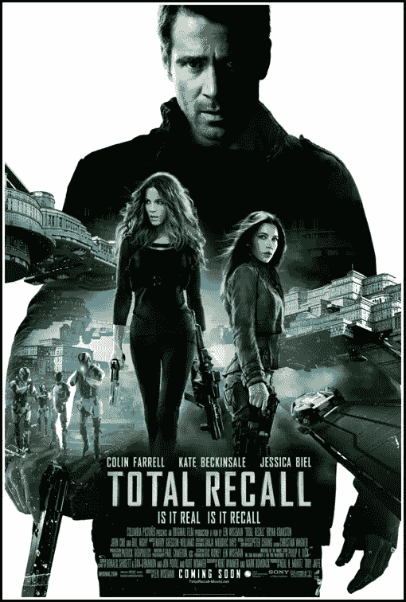
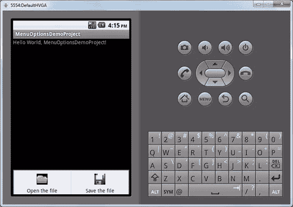
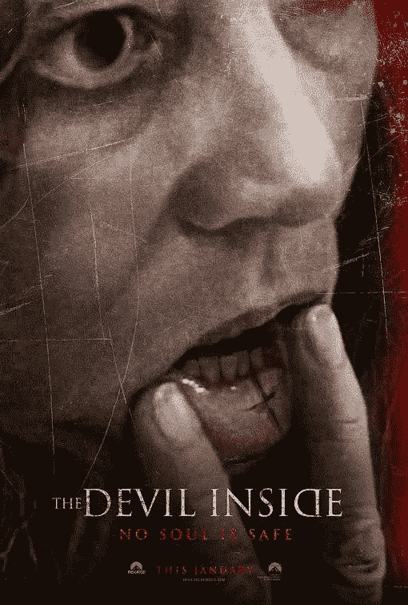
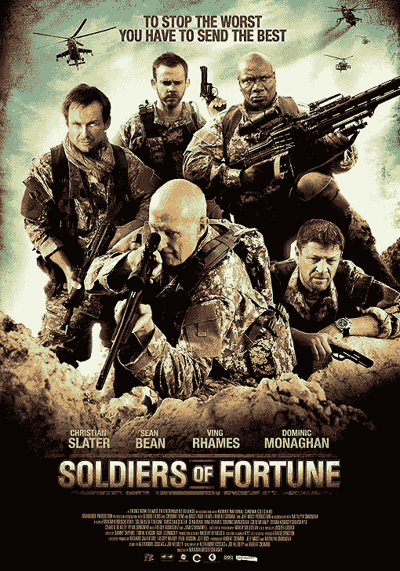
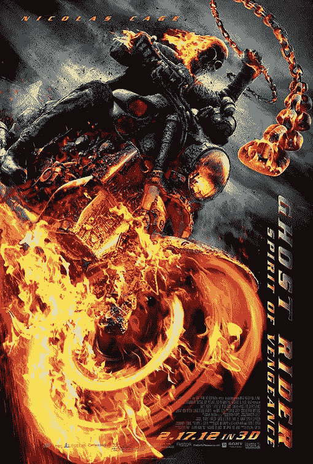
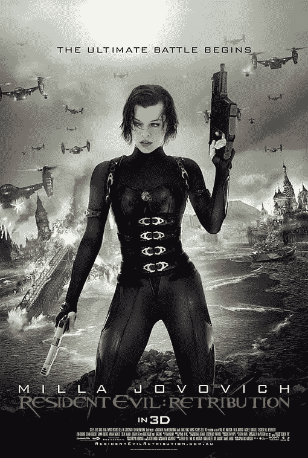
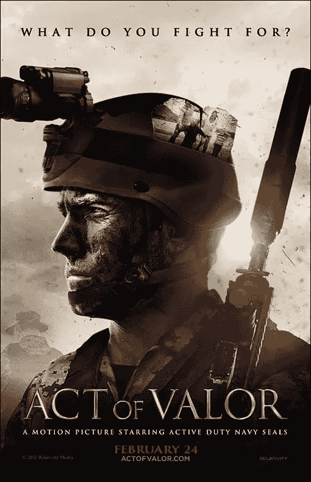
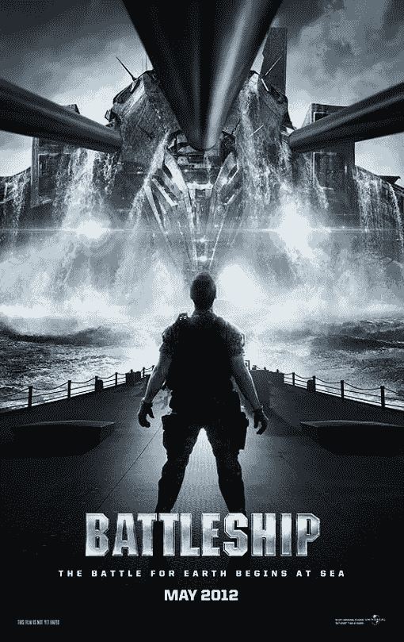

# 8 部海报设计非凡的普通电影

> 原文：<https://www.sitepoint.com/8-outstanding-posters-from-mediocre-movies/>

观影体验的一部分是预览，对于设计师来说，我们将这一方面扩展到电影院墙上的电影海报。我第一个承认，我几乎完全根据电影海报来判断一部电影。一张精心设计的海报可以吸引你，即使电影的其他部分在重要方面有所欠缺。

因此，这里有八部电影有着出色、非凡的海报艺术，但也许没有一流的电影制作。

### 8.全面召回

#### 为什么这张海报与众不同

我和大多数美国人以及世界上大多数人一样，非常喜欢这部电影的原版；是美国经典！这个重做版本的海报似乎承诺更好；更新了图形，加入了让 1990 年电影如此惊艳的所有令人难以置信的游戏。这张海报用破碎的玻璃、未来的机器人士兵和汽车以及漂浮的建筑展示了许多细节。此外，这张海报巧妙地描绘了主角的形象，这是一场我认为与电影本身有关的心理游戏。

#### 为什么这部电影不是

是的，动作场面和效果，尤其是场景的构建，令人震撼，而这些正是这部电影的可取之处。然而，表演和情节并没有公正地对待这个壮观的 20 年的故事情节。

道格在一场令人印象深刻的战斗序列中，在巨大的爆炸和无视重力的跳跃中拯救了殖民地，随后导演们试图最后一次接近原版的心理游戏水平。但是，当我们已经对这个现代化的版本印象深刻的时候，萝莉的最后一招就有点过头了。真的吗？在那次大爆炸后她还活着？这些都不是让原版电影如此受欢迎的意外惊喜。

#### 其他人的想法

烂番茄= 5/10

IMDB = 6.3/10

### 7.伯恩的遗产

#### 为什么这张海报与众不同

这部电影有几个海报设计，都是简单的角色手持单枪，潜行或逃命的屏幕截图。海报上的不是马特·达蒙，但杰瑞米·雷纳是一个令人敬畏的动作演员，所以我认为他会是一个可靠的替代者。这张特别的海报在视觉上很好地描绘了不停的动作和座位边缘的情节转折，特别是引用了分散在图像中的“从来没有只有一个”这句话。

#### 为什么这部电影不是

所有的《谍影重重》电影都非常复杂，以至于需要全神贯注才能搞清楚情节。这一张承诺相同(海报甚至似乎以与第一部《谍影重重》电影海报相同的外观暗示了这一点)，但事实证明，一旦你弄明白了这一点(这并没有太深入到电影中)，情节就简单得令人失望。

#### 其他人的想法

烂番茄= 5.9/10

IMDB = 6.7/10

### 6.内心的魔鬼

#### 为什么这张海报与众不同

切割自己的嘴唇这种纯粹令人毛骨悚然的因素被设计的前卫性放大了，吸引了我。如果有人能这样对自己，那一定是一部疯狂恐怖的电影，对吗？！我完全被虐待狂吸引住了。我承认。整部电影的海报和其他海报很好地突出了反教会和自我造成的痛苦神话，这与着魔有关。所以，感谢设计师创造了一个完全怪异的海报，使电影本身的质量黯然失色。

#### 为什么这部电影不是

电影开始大约五分钟后，我想出了剩下的可预见的情节。前提不是很新颖；他们试图用一点不稳定的摄像技术将它混合起来，但这并没有修复暗淡的情节。我想被吓到，但说实话，我发现海报比电影本身更可怕。海报设计师的荣誉，电影导演的耻辱。

#### 其他人的想法

烂番茄= 2.7/10

IMDB = 4/10

### 5.命运的战士

#### 为什么这张海报与众不同

枪支和大牌演员。我一看到这个，就觉得动作/战争电影类型今年可能会有一个合理的入围者。《黑鹰坠落》给我带来的刺激在我的想象中闪过。设计师们甚至用标题印刷术抓住了老印第安纳琼斯的氛围。

#### 为什么这部电影不是

一旦意识到主角要去“蛇岛”，我就应该知道这部电影会功亏一篑。从一个场景到另一个场景，很明显这部电影中所有的表演天赋都没有被充分利用。

有一句话特别令人痛苦，完全概括了我对这部电影的失望:“死神总能得到报酬……”真的吗？！那种写法让这部电影感觉很一般，很衍生。对于像克里斯汀·史莱特和肖恩·宾这样的演员，我期望更多……更多。这部电影绝对不像精心设计的海报所承诺的那样像印第安纳·琼斯。

#### 其他人的想法

烂番茄= 3.2/10

IMDB = 4.2/10

### 4.幽灵骑士:复仇之魂

#### 为什么这张海报与众不同

着火了。锁链。摩托车。骷髅人。这个设计，以及这部电影的其他设计，非常出色地将这个神话般的角色带入了生活。对于那些读过漫画的人来说，围绕幽灵骑士这个角色有一个精彩的故事，这张海报捕捉到了漫画读者所期待的所有焦虑、激情和激情。事实上，海报设计让我忘记了这个系列的其他电影有多糟糕，我希望这一次会更好。

#### 为什么这部电影不是

尼古拉斯·凯奇想成为幽灵骑士。他再也做不到了。坦白地说，我不确定有哪个演员能让这个情节火起来。我一直在等待一个可以与《幽灵骑士》漫画原著联系起来的可靠纽带，但它从未发生过，剧院里的每个人也想要它。

在这部《幽灵骑士》中，他有机会解除自己的诅咒。这是幽灵骑士神话中的一个核心概念，但故事情节并没有很好地诠释这个概念。这个版本错过了一个深入研究幽灵骑士背后的真实故事的巨大机会，我们只能得到很小的剂量。

#### 其他人的想法

烂番茄= 3.9/10

IMDB = 4.4/10

### 3.生化危机

#### 为什么这张海报与众不同

米拉·乔沃维奇穿着黑色皮衣拿着枪。她每次都能抓住我们，那些海报设计者知道这一点！即使作为一个小妞，我也很崇拜米拉……毕竟，她不就是女性主宰的缩影吗？

俄罗斯风格的建筑是我注意到这张海报的第二点。我的想象力飞速发展。尽管我没有沉迷于电子游戏系列，但我一直在忠实地观看其他《生化危机》电影，所以爱丽丝穿越俄罗斯城市的想法和可能性立即激起了我的兴趣。这张海报让我相信这部电影将会和第一部一样令人印象深刻，并有望弥补第二部和第三部的不足。

#### 为什么这部电影不是

也许我最近太敏感了，但是我觉得表演很粗糙。诚然，这是《生化危机》,所以没有多少空间来表达人类的全部情感，但甚至连基本的动作表演都缺失了。

导演也好不到哪里去。这部电影以慢动作倒放整个第一场开始。然后，它以同样痛苦的方式重演了之前所有的电影。过了一段时间，感觉像是时装秀，而不是僵尸片。为什么他们不能坚持海报中承诺的原始的、不受干扰的行为呢？

#### 其他人的想法

烂番茄= 4.2/10

IMDB = 5.4/10

### 2.勇敢的行为

#### 为什么这张海报与众不同

现役海豹突击队。怎样才能拍出一部更现代、更现实的战争电影？。这张电影海报通过宣传现役海豹突击队员是这部电影的明星，承诺了我们所希望的所有现实主义。设计师们出色地利用了海豹突击队的优势。武器和制服的真实感是我们这些有家庭成员的军人注意到的细节。所以当我看到这张海报的时候，我立刻就被卖了。

#### 为什么这部电影不是

现役海豹突击队。这部电影的优势也是它的致命弱点。这些英雄被训练去承担真正的英雄行为；不要像他们那样行动或假装。你可以要求海豹突击队来拯救你的生命、肢体和国家，但他们的训练和战斗磨练的战斗技能并不能完美地翻译成电影。

海报承诺现实主义，但电影未能在对话部分实现。不管你怎么说那些令人敬畏的打斗场面——我也很喜欢——但是要拍一部杀手电影，光有几场超现实的枪战是不够的。如果演技再好一点，我会给这部电影打高分。但这与华丽海报宣传的超现实主义形成了痛苦的对比。

#### 其他人的想法

烂番茄= 4.5/10

IMDB = 6.4/10

### 1.战舰

#### 

#### 为什么这张海报与众不同

外星人和*巨炮*。光是这张制作精美的海报的效果就足以让我走进电影院。巨大的外星飞船在战舰上飞速行驶，一个人在甲板上准备独自对抗整个外星力量，承诺所有我喜欢的特效和动作。海报是一个美丽的，准确的情节视觉表现，尽管故事情节固有的简单。

#### 为什么这部电影不是

我从哪里开始？糟糕的表演，糟糕的情节，糟糕的幽默…甚至特效和噪音水平都过头了。这部电影并不像小时候玩棋盘游戏时在我脑海中进行的战斗，这是一个被忽略的怀旧机会。

肖恩上将(利亚姆·尼森饰演)似乎是编剧们最讨厌的角色。有一次，他命令一名船员“准备开火！”当船员问哪些武器，海军上将谢恩回答，“所有的。”他的台词让这部电影成为陈词滥调的典型。

#### 其他人的想法

烂番茄= 4.6/10

IMDB = 6.6/10

### 结论

海报设计师显然是一流的。不幸的是，海报设计不能拍成电影。但是，成功的海报与不太成功的电影的配对证明了平面设计师可以在一个单一的静态框架中捕捉电影的本质和吸引力，即使导演无法在两小时的高预算电影中做到这一点。这表明了深思熟虑的设计和创造力能引起观众的共鸣。

你有什么精彩的电影海报可以放进去吗？你能想出哪部电影的静态图像比真实的要好吗？

## 分享这篇文章