# Photoshop 混合模式基本指南

> 原文：<https://www.sitepoint.com/the-essential-guide-to-blend-modes-in-photoshop/>

Photoshop 可能是作为摄影师的工具开始的，但它已经发展成为一种多功能的创造力催化剂。您可以从零开始构建奇妙的图像，将图像混合在一起，校正颜色，并实现几乎任何其他可以想象的东西。将图像和纹理融合在一起并不总是一件容易的事情；有时你不能令人信服地将图像融合在一起，你也不能总是依赖不透明或图层样式这样的简单技术。但是，混合模式可以帮助您设计其他方法无法实现的炫目效果和美丽图像。

混合模式会改变层中图像对其下面层中图像的反应方式。很多时候，你可以选择正确的混合模式，把你自己从图像中不需要的部分抹去的单调中拯救出来。这完全取决于每个图像的内容——顶层和底层。

了解每种混合模式的工作原理将有助于您了解何时使用特定的混合模式来获得想要的结果。我们的样本图片可以在这里找到[。我们将对每张图片应用不同的方法来帮助你理解每种混合模式的作用。](http://www.sxc.hu/photo/1412311)

### 常态

这是默认的混合模式，是图像表现得像全功能图像的起点。关于这个设置没什么好说的，除了它是默认设置，没有应用混合。

### 混合模式:溶解

*溶解*混合模式决定了给定图层的不透明度。当图层的不透明度为 100%时，这些区域保持不变。在更透明的区域，它们会按比例溶解。例如，不透明度为 10%的区域的斑点密度将小于不透明度为 50%的区域。

**正常**

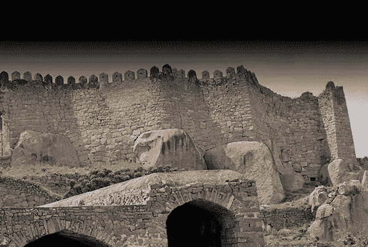

**应用的溶解**

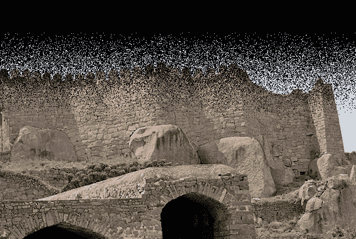

你可以从上面的例子中看到，渐变是纯黑的，实际上没有应用溶解。在梯度开始消失的地方，我们开始看到越来越多的侵蚀。

### 混合模式:变暗

*变暗*混合模式将变暗层与其下一层进行比较，它显示两者中较暗的像素信息。较亮的像素信息被丢弃，并且组合的层整体上变暗。

**在应用变暗之前**

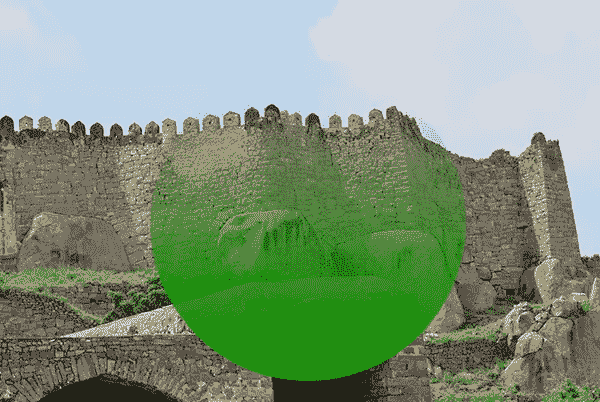

**应用变暗后**

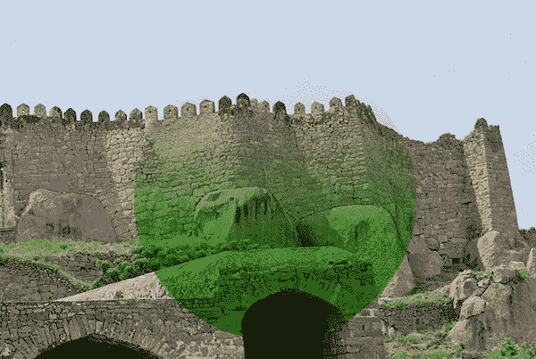

请注意，石头的阴影区域变暗了。当绿色渐变在顶部逐渐变淡时，图像变暗得更少。这是因为渐变和石头都很亮，所以不会有太多的变暗。如果我们在这个区域应用更暗的渐变，那些石头也会变得更暗。

### 混合模式:乘法

*乘*相当简单；它做它所建议的。它将混合层中的颜色与其下一层中的颜色相乘。唯一不发生颜色变化的时候是当一个区域是白色的时候。结果总是颜色更深。这有利于将细节带入阴影区域。纯黑色的图像或混合层的任何部分都将保持黑色。

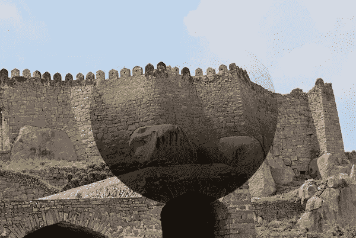

上面的渐变从深灰色过渡到白色。请注意顶部(渐变接近白色的地方),图像几乎没有任何变化。在底部，渐变为深灰色，图像变得更暗。

### 混合模式:颜色加深

*颜色加深*是一种很好的创建对比的混合模式。在这里使用暗色混合将会大大增强效果。这种效果类似于使用 Photoshop 的加深工具来加深和增加图像的对比度。在下图中，你可以看到渐变为白色的地方没有变化。但是，在梯度较暗的地方，石墙的颜色被加强了。当渐变开始消失时，混合模式会创建更微妙的结果。

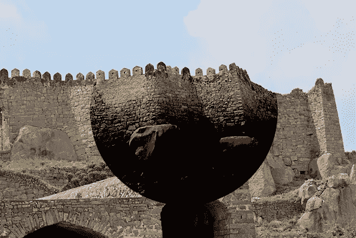

### 混合模式:线性加深

*线性烧伤*与彩色烧伤非常相似。乍一看，你可能听不出有什么不同。但是，线性加深不会产生与彩色加深相同的强烈颜色。线性加深会降低图像的亮度，因此颜色不会受到太大影响。它不会像颜色加深那样影响对比度。在下图中，请注意线性加深的颜色变化不如颜色加深强烈。

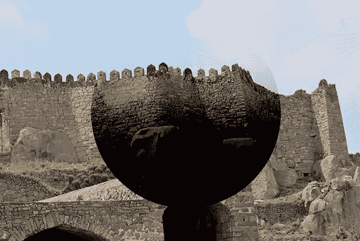

### 混合模式:深色

*较暗的颜色*查看混合图层和下面的图层，确定较暗的颜色，并显示出来。如果你使用的是纯色，你很可能会得到该颜色的纯色区域，除非你的底层有明暗不同的区域。注意下图中渐变的黑暗区域显示为灰色。在白色区域没有任何变化。

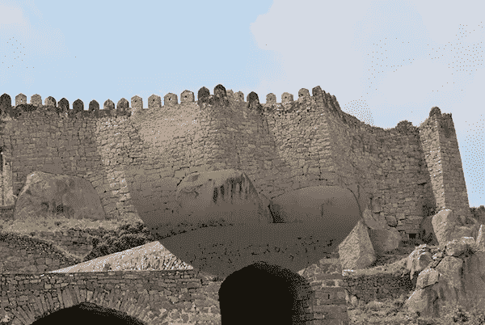

### 混合模式:变亮

变亮与变暗正好相反。它比较最上面一层和下面一层的像素信息，并选择两者中较浅的颜色。注意下图中，图像的阴影区域变亮了。白色影响这种混合模式，因为它将始终登记为更亮，并将照亮任何黑暗的地区。

### 混合模式:屏幕

*屏幕*混合模式与乘法相反。屏幕实际上乘以你的底部图像与混合模式层的反转。结果是图像会变得更亮。唯一不受此影响的区域是纯黑或纯白的区域。在下面的例子中，请注意几乎整个区域都变亮了，除了顶部是纯白的。

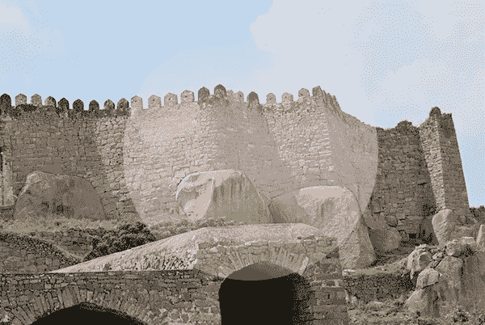

### 混合模式:颜色减淡

*颜色减淡*是颜色加深的反义词。它实际上类似于 Photoshop 的减淡工具，但作为一种混合模式。请注意，在下面的例子中，灰色区域相当一致，但在渐变开始变白的地方，减淡效果更加突出。受影响的区域几乎变成白色。

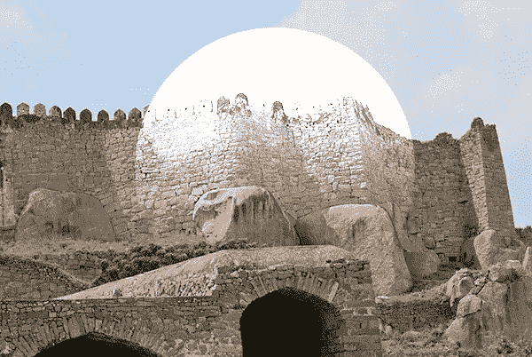

### 混合模式:线性减淡

*线性减淡*使图像区域更亮。黑色区域不受影响，但是深灰到白色会变亮。这种效果类似于 screen，但是如你所见，要强很多。它也比颜色减淡更强。注意线性减淡如何影响石头之间的阴影区域并使它们变亮，但是颜色减淡显示了图像阴影中的硬边。

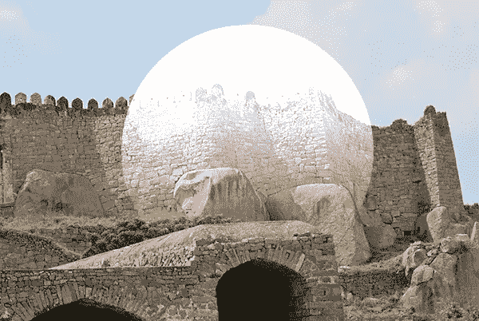

### 混合模式:较浅的颜色

*较浅的颜色*工作起来像较深的颜色，但达到相反的效果。它确定哪种颜色较亮，并丢弃较暗的颜色。黑色不会产生任何结果，但白色肯定会出现，如下例所示。你肯定能分辨出渐变的部分是从哪里开始变白的。

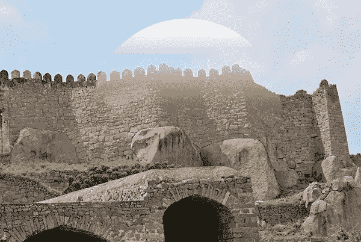

### 混合模式:叠加

*叠加*是一种有趣的混合模式，因为它将暗区倍增，然后屏蔽亮区。50%灰色的区域不受影响。注意下图中，50%灰色的渐变区域看起来正常，但是底部较暗，顶部较亮。

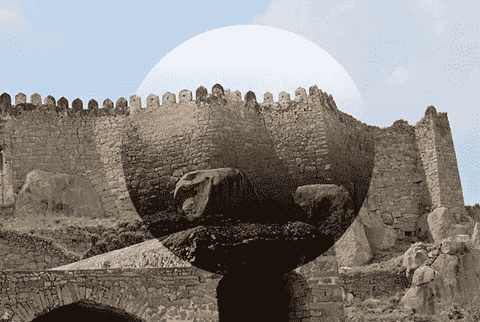

### 混合模式:柔光

*柔光*根据混合模式图层的颜色，创建更亮或更暗的颜色。如果混合模式颜色比 50%灰色浅，它将创建一个稍浅的颜色。如果它比 50%的灰色暗，它将创建一个比底层略暗的颜色。如果混合模式颜色是 50%灰色，那么您将看不到任何变化。请注意，在下图中，50%灰色的区域没有受到影响。黑白区域更亮更暗。

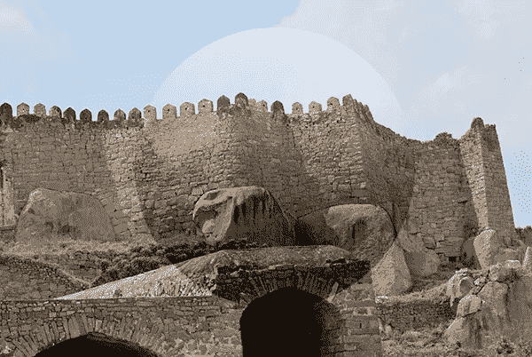

### 混合模式:强光

强光和柔光一样，但是更强烈。原因是它也影响对比度。用纯白会出白，用黑会出黑。50%的灰色根本不会产生变化。任何大于或小于 50%的灰色，而不是纯黑或纯白，都会使图像变亮，如下例所示。

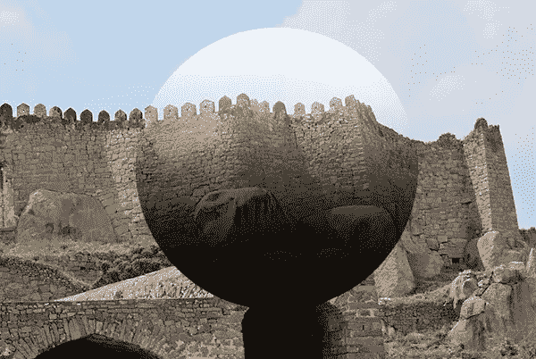

### 混合模式:生动的光

*生动光*类似于软光和硬光，但比它们还要强烈。任何比 50%更暗的灰色都会被烧掉，任何比 50%更亮的灰色会变亮，对比度会降低。注意你是如何在渐变的黑暗区域得到“烧焦”的效果的。注意渐变的白色区域，天空变亮了，对比也少了很多。

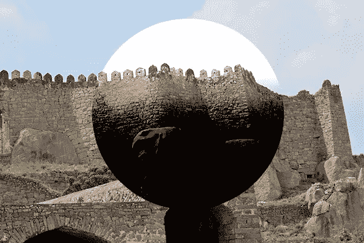

### 混合模式:线性光

线性光的工作方式就像生动的光一样，只是它不是增加对比度，而是根据混合层是亮还是暗来提高或降低亮度级别。请注意，渐变的白色区域更亮，而渐变的黑色区域更暗。您不会从线性光获得像使用生动光那样多的“烧灼”效果。

### 混合模式:点光源

*针孔光源*基本上同时执行变暗和变亮混合模式。如果混合层比 50%的灰色更亮或更暗，那么它将替换底层的颜色信息。如果底层在暗区较暗或在亮区较亮，那么你不会看到变化。注意在黑色和白色区域，颜色几乎是纯色的。

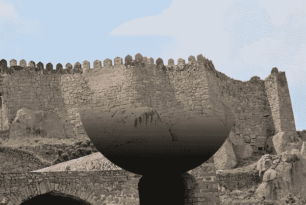

### 混合模式:硬混合

*硬混合*类似于颜色加深混合模式，但颜色没有渐变或渐变。请注意，白色区域显示为纯白色，但深色区域全部被烧焦，对比度非常高。

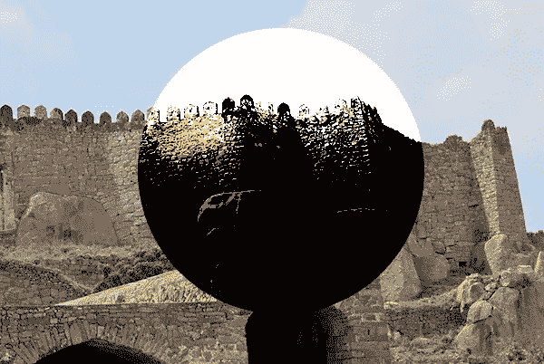

### 混合模式:差异

*差值*从混合模式中减去图像的倒数。为了实现这一点，混合模式必须是浅色。它反转底层的颜色，并将其从混合模式颜色中减去。如果混合模式的一个区域是黑色的，你不会看到任何变化。你可以在下图中看到这一点，其中混合模式的黑色区域逐渐消失，图像显示正常。

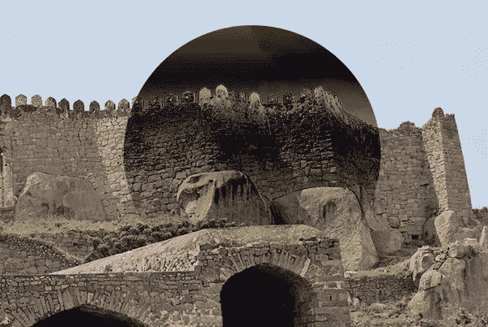

### 混合模式:排除

*排除*混合模式的工作方式类似于差异混合模式，但它不会产生如此苛刻的结果。这样做的原因是它不会产生太多的对比。纯黑色区域不会引起任何变化。注意大约 50%灰色的中间区域是如何产生柔和的灰色效果的。

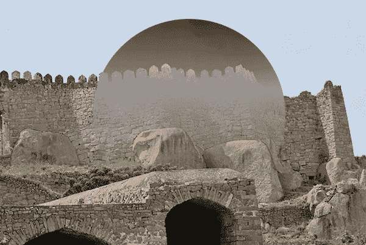

### 混合模式:减法

*减去*的混合模式很简单。它从下面的图层中减去混合模式颜色。纯黑色不受影响，因为你不能减去一种颜色，得到比黑色更暗的东西，所以它会逐渐消失。

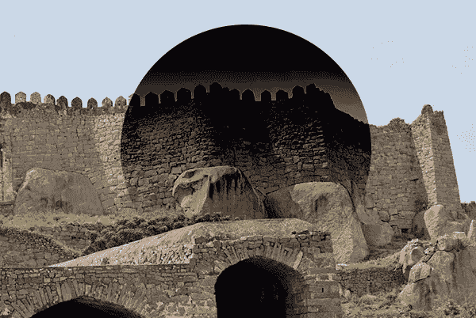

### 混合模式:划分

*Divide* 就像它说的那样；它将混合模式层的颜色除以底层中的像素。结果是一个大大减轻整体形象。注意渐变的黑色区域几乎是纯白的。混合模式的纯白区域逐渐消失。

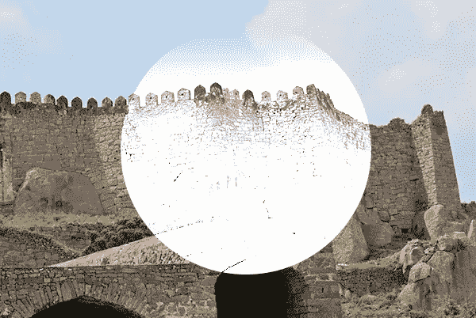

### 混合模式:色调

*色调*将底部图像的色调更改为混合模式颜色的色调。这不会影响图像的饱和度或亮度或暗度。注意在下面的图片中，我们的黑到白渐变实际上降低了图片的这个区域的饱和度。

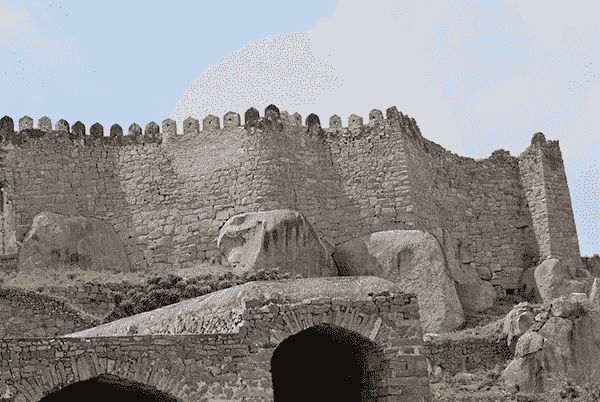

在下图中，我们将黑色到白色渐变改为蓝色到白色渐变，这显示了砖墙的色调是如何改变的，以匹配渐变的蓝色色调。这一切都发生在没有使图像变暗或变亮的情况下。

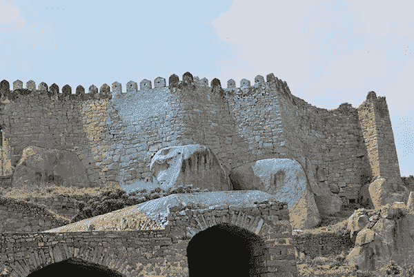

### 混合模式:饱和度

*饱和度*改变底部图像的饱和度，以匹配混合模式颜色的饱和度。我们用蓝色到白色的渐变来演示这一点。请注意下面的第二个图像，区域变得更加饱和，在一些区域图像变得过度饱和，你可以看到粉红色和紫色的砖块。

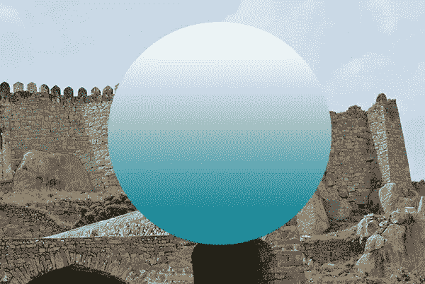

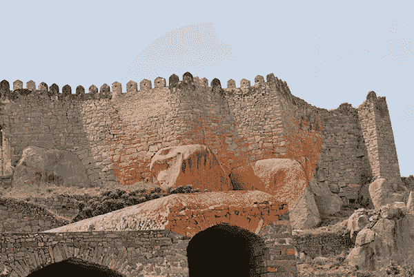

### 混合模式:颜色

*颜色*混合模式将混合模式的色调和饱和度应用到它下面的图层。这不会改变图像的亮度或暗度，如下图所示。它只是将砖块的颜色更改为与渐变本身相同的蓝色。

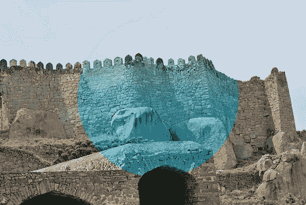

### 混合模式:亮度

*亮度*将混合模式图层颜色的亮度应用到底层。注意在蓝色区域，颜色是模糊的。白色区域变成白色，黑色区域变成黑色。

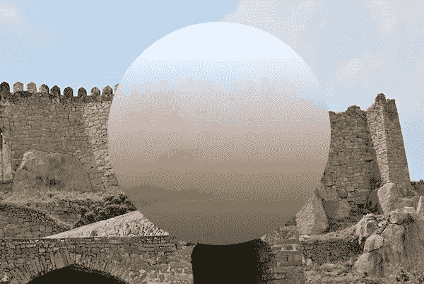

## 结论

混合模式是 Photoshop 的重要组成部分。您可以将混合模式应用到图层、不同的图层样式，甚至画笔，以获得不同的结果。有时，能够将两个图像混合在一起只是找到正确的混合模式的问题。

只需轻轻一按按钮，就可以丢弃图像中的亮、暗或灰色区域，非常方便。许多流行的效果是通过在不同层之间应用滤镜和混合模式的组合或多个混合模式来创建的。组合是无穷无尽的，可以产生的效果是任何其他功能无法比拟的。

*你最喜欢的混合模式是什么？你知道使用/组合混合模式来获得良好效果的技巧吗？请在下面的评论区分享你的经历。*

## 分享这篇文章