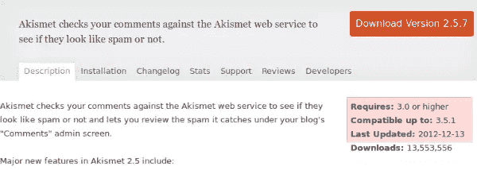
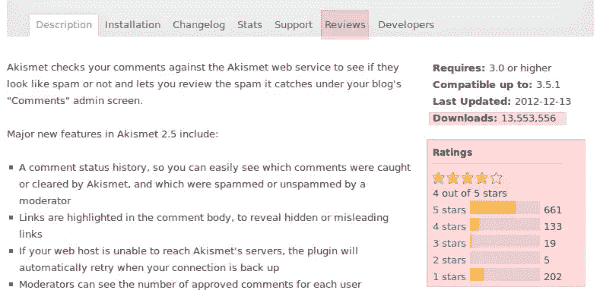
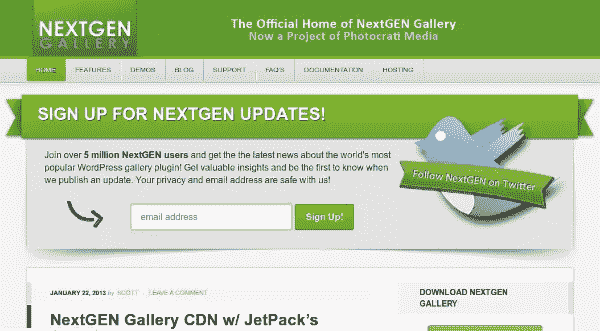

# 使用免费 WordPress 插件的开发者指南

> 原文：<https://www.sitepoint.com/a-developers-guide-to-using-free-wordpress-plugins/>

WordPress 是世界上最受欢迎的内容管理系统，它建立在一个允许用户用提供视觉设计的主题和提供特定附加功能的插件来补充核心功能的结构之上。

现在官方 WordPress 库中有超过 20，000 个插件，全部免费使用。任何人都可以上传一个插件，如果它是好的，它可能会变得非常受欢迎。然而，这确实会带来一些风险。插件编码很差，崩溃了怎么办？如果它与其他插件，正在使用的主题，甚至核心功能不兼容怎么办？如果——但愿不会——它被故意设置成在你的网站上放置恶意代码，那该怎么办？

## 开发者应该使用免费插件吗？

这个问题的答案取决于你的个人偏好和你项目的状态。就我个人而言，只要有可能，我更喜欢自己编写插件。在现实生活中，这并不总是可能的:客户要求、截止日期、其他团队成员的能力等可能不允许这样做。在这种情况下，开发者会考虑一个免费插件是否能提供所需的功能，这是可以理解的。

即使是有经验的开发人员，使用免费的插件也会更容易、更快、更划算。这没有错，但是开发人员需要意识到，有一些需要考虑的事项。一旦你决定使用免费插件，你必须考虑各种因素来选择合适的插件，以防止意外的行为。

## 选择 WordPress 插件的基础

有一组因素适用于任何考虑使用免费 WordPress 插件的人，无论他们是网站所有者、业余设计师还是专业开发人员。

### 版本和兼容性



版本详细信息放在每个 WordPress 插件详细信息页面的右上角。检查你正在使用的插件的最新版本，并且它与你正在使用的 WordPress 版本兼容。如果一个插件最近更新了，这表明作者正在跟上兼容性的要求。

### 下载量、评分和评论



大量的下载和良好的用户评级表明用户在使用这个插件时没有问题。另外，一定要查看评论部分，了解用户为什么喜欢这个插件，以及他们在使用这个插件时可能会遇到什么困难。

### 文档和支持



插件可能由大型开发机构或有好主意的个人运营商创建和发布。无论哪种方式，最终用户和你作为开发者应该寻找清晰、准确和最新的文档，以及从插件开发者和/或使用插件的社区获得支持的方法。较大的机构可能有一个提供知识库的网站、一个常见问题页面、一个票务系统和/或一个用户可以众包问题解决方案的论坛。

较小的或独立的插件开发者可能会提供一个博客，涵盖几乎相同的目的，最好包括直接联系插件作者的方式。

一个非技术用户，比如一个建立自己网站的业余爱好者，可能会认为冒险使用一个没有足够文档和支持的插件是值得的。一个为客户工作的专业开发人员永远不应该这么做:后果可能会对你的声誉造成灾难性的影响。

## 开发者的视角

上一节提到的因素适用于任何考虑使用免费 WordPress 插件的人。然而，开发人员拥有普通人无法获得的技能和信息，因此他们肩负着更大的责任来检查普通用户可能甚至不知道的事情。

## 在非关键环境中测试

永远不要在你的生产环境或任何其他对你很重要的 WordPress 安装中测试新的插件。相反，试着用默认主题和默认插件保持一个单独的 WordPress 安装用于测试目的。

保持你的测试环境整洁，这样你就不会有很多未使用的插件，这些插件可能会互相冲突。让您的测试环境尽可能模拟您的生产环境。激活选择的插件，正确测试它，然后在测试下一个插件之前移除它。

假设一切都如预期的那样工作，是时候深入研究代码，看看选择的插件是否适合在您的实际应用程序中使用。

## 函数和类命名约定

任何人都可以上传插件到 WordPress 插件库，只要它符合基本的插件提交指南。这就造成了两个或更多的插件开发者使用相同的函数和类名的可能性，导致了运行时的冲突。

这种冲突可以通过在插件函数和类前面加上与插件相关的关键字来避免。作为这类插件的用户，你应该检查函数名，以确保它们至少在你的应用程序中是唯一的。

考虑下面的函数声明。

### 不推荐

```
function **get_key**() {

}
```

### 被推荐的

```
function **akismet_get_key**() {

}
```

不能保证前缀会完全防止冲突，但是使用唯一的前缀肯定会减少拥有重复函数的机会。

## 插件特定表

WordPress 足够灵活，可以使用默认的表格结构创建各种各样的 web 应用程序。但是有时我们需要额外的自定义表格来提供插件特定的功能。

这些自定义表格通常是在激活插件时创建的。大多数开发者不会在插件停用时移除这些自定义表格。因此，每当你决定摆脱一个现有的插件，你必须从数据库中手动删除表，以防止数据库不必要的扩展。

定制数据库也应该在配置文件中包含前缀，而不是对表名进行硬编码。考虑下面的代码以获得正确的表命名约定。

### 不推荐

```
$portfolios = $wpdb->get_results( "SELECT * FROM **wp_portfolio**");
```

### 被推荐的

```
$portfolios = $wpdb->get_results( "SELECT * FROM “.**$wpdb->prefix .** “**portfolio**");
```

因为 WordPress 不提供内置方法，所以需要定制的 sql 查询来访问这些表格。用于从表格中访问数据的 WordPress 函数被优化以获得更好的性能。因此，对于定制表，由于没有进行优化，性能可能会略有下降。

检查你的插件是否使用自定义表格，并确保在选择插件时考虑上述准则。

## 安全性和垃圾邮件

安全是使用免费插件的一个大问题。我们并不确切知道代码的质量以及开发人员在这些代码中做了什么。因此，检查插件是否包含安全漏洞或垃圾内容是很重要的。

*   首先，我们需要寻找数据验证。如果用户输入的数据没有经过适当的验证和清理，任何人都可以输入数据，从而对我们的网站造成损害。

*   然后，我们需要检查插件是否访问敏感数据，如配置细节和用户细节，以及它是否将它们发送给第三方应用程序。

*   此外，我们需要检查插件是否发送电子邮件到未知的电子邮件地址，数据来自你的数据库或文件。

*   一些开发人员插入垃圾内容，如开发人员的社交档案链接、网站、附属广告和插件生成的链接。请确保从代码中删除此类内容，或者避免使用此类插件。

这些只是插件在其代码中存在的几个安全问题。当你在插件代码中发现一些恶意的东西时，一定要分享到社区中，以防止其他用户使用此类插件。

## 插件特定选项

WordPress 插件开发者使用选项来保留设置和其他与插件相关的重要信息。这些选项存储在默认的`wp_options`表中。

使用相同键作为选项的插件很难在没有冲突的情况下管理，类似于函数名和类名的问题。在这种情况下更糟，因为两个重复的选项键可能不会产生可见的错误，但会发生冲突。很难找出确切的问题。

考虑使用以下代码来创建插件选项。

### 不推荐

```
update_option( **'xml'**, $opt );

update_option( **'social'**, $opt );
```

### 被推荐的

```
update_option( '**wpseo_xml**', $opt );

update_option( '**wpseo_social**', $opt );
```

不幸的是，我所知道的解决这个问题的唯一方法是手动检查插件是否使用前缀作为它的选项键。

## CSS 和 JavaScript 的直接加载

没有经验的 WordPress 开发者倾向于直接在插件中加载 CSS 和 JavaScripts 文件。这可能会引起问题。

*   重复的 CSS 和 JavaScript 文件
*   增加了页面加载时间和破解代码的可能性。
*   包括页面内任何地方的文件

另一方面，有经验的开发人员会使用`wp_enqueue_scripts`动作来加载文件。在将库包含到页面中之前，它会检查库是否已经加载以及是否有任何依赖项，以防止任何重复。

考虑以下包含脚本和样式的代码。

### 不推荐

```
function include_scripts_styles(){

    echo ‘<script type="text/javascript" src="jquery.js"></script>’;

    echo ‘<link type="text/css" rel="stylesheet" href="styles.css" />‘;

}
```

### 被推荐的

```
add_action('wp_enqueue_scripts', 'wppc_scripts');
function wppc_scripts() {
    wp_enqueue_script('jquery');
    wp_register_style('sample_style', plugins_url('styles.css', __FILE__));
    wp_enqueue_style('sample_style');
}
```

所以，你应该更喜欢使用插件和更有组织的脚本和样式来防止维护问题。

## 结论

本文中的所有内容都是基于我自己的 WordPress 开发经验。我不知道有谁，从忠诚的业余爱好者到有经验的专业人士，拥有每一个可用插件所需的经验，以及他们将如何在每一个可能的生产环境中操作。这可能是不可能的。

可能的是利用你对代码如何工作的专业知识，给你自己和你的客户最好的机会来避免免费 WordPress 插件的问题。与他人分享你的知识是额外的责任。如果你发现一个可能影响其他人使用插件的问题，让全世界都知道。也许最好的方法是通过插件开发者提供的途径，但是你也应该考虑联系插件作者，让他们知道你发现了什么。

我邀请 WordPress 开发者加入这个对话，并加入他们使用免费插件的个人经历。你个人的优缺点是什么？你是否制定了自己的程序指南和安全措施？你有关于你会使用或不会使用的插件的规则吗？

期待大家的评论和建议。

## 分享这篇文章