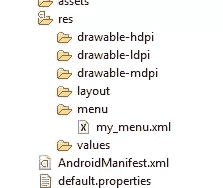

# 用 Java 和 XML 在 Android 中构建菜单:简介

> 原文：<https://www.sitepoint.com/menus-in-android/>

应用程序用户喜欢强大的选项和功能，但是如果它们没有在你的应用程序界面中很好地组织起来，它们甚至可能不存在。根据您构建的内容，这些选项和功能可能会影响应用程序的行为方式，它们可以提供广泛的定制选项，甚至可以绑定到 API、其他应用程序、硬件功能或其他外部技术。但是，他们必须有直觉和组织能力，才能达到最佳状态。这就是恰当的菜单设计的用武之地。

当你设计一个应用程序时，为你计划构建的许多选项、功能和设置设计一个合理的顺序和结构是非常重要的。显然，你的界面对你的应用程序的性能起着举足轻重的作用；没有它，你的应用程序将只是一堆杂乱无章的功能。

菜单项是一个非常古老和著名的用户界面实体。几乎所有用户都习惯在应用程序中使用菜单。Android 提供了一个简单灵活的基础设施，可以在你的应用中添加菜单。它允许您通过 XML 资源或直接通过代码创建菜单。根据点击的菜单项，应用程序可以执行特定的操作。在本文中，我们将看到如何使用 Android API 轻松创建菜单和响应菜单。

### 使用 XML 创建菜单

让我们从创建一个名为 MenuOptionsDemoProject 的 Android 项目开始，在这个项目中，我们将通过 XML 演示菜单的创建。一旦我们创建了一个项目，并在 MenuOptionsDemoProject 中创建了一个活动，我们就可以向它添加一个菜单了。

在 Android 中创建选项菜单的一种方法是使用 menu.xml 资源文件。要使用此方法创建菜单，必须在资源目录中创建一个菜单目录。创建名为 my_menu.xml 的文件。您的目录结构应该如下所示:



一旦创建了上面的文件结构，就可以将以下代码添加到 my_menu.xml 文件中:

```
<?xml version="1.0" encoding="utf-8"?>

<menu xmlns:android="http://schemas.android.com/apk/res/android">

<item android:id="@+id/open" android:icon="@drawable/openicon"

android:title="Open the file" />

<item android:id="@+id/save"

android:icon="@drawable/saveicon"

android:title="Save the file" />

</menu>
```

要创建一个菜单资源，您必须使用

<menu>标签。您必须为要在菜单中显示的每个菜单项创建这个 XML item 标记。您可以在

<menu>XML 标记中指定许多属性。其中最重要的是项目的 *id* 和*标题*标签，它们决定了菜单项上显示的文本。您还可以为<菜单>项目指定*图标*，以确定与其各自菜单选项视觉关联的图形。</menu>

</menu>

在上面的 XML 中，我们创建了两个菜单项:一个用于打开文件，一个用于保存文件。我们给了这两个项目标题，也给了每个项目一个图标。

一旦菜单资源文件(my_menu.xml)准备好并包含了所有要添加的项目，就可以使用 MenuInflater 来覆盖 onCreateOptionsMenu 函数。这个函数应该用想要的菜单项填充菜单对象，但是 Android 的 MenuInflater 类可以帮助你从上面提到的 XML 资源中创建菜单项。我们活动的代码如下:

[sourcecode language="java"]

导入 Android . app . activity；

导入 Android . OS . bundle；

导入 Android . view . menu；

导入 Android . view . menuinflater；

公共类菜单选项开发项目扩展活动{

/**首次创建活动时调用。*/

@覆盖

public void on create(Bundle saved instancestate){

超级。oncreate(savedinstancestat)：

setContentView(r . layout . main)；

}

@覆盖

public boolean onCreateOptionsMenu(菜单菜单){

MenuInflater inflater = getMenuInflater();

inflater . inflate(r . menu . my _ menu，menu)；

返回 true

}

}

[/sourcecode]

现在，如果您运行您的活动并单击 menu 按钮，您应该能够看到您新创建的菜单项，如下所示。


如果您使用 Eclipse 进行开发，您还可以使用一个有用的 Android 菜单编辑器，您可以使用它来添加菜单项。下面，我们只是通过 Eclipse 的 Android 菜单编辑器多添加了一个菜单项(一个用于关闭文件)。


### 使用 XML 创建子菜单

一旦我们使用 XML 创建了单级菜单，现在让我们使用相同的 XML 方法创建一个*子*菜单。假设我们希望用户要么只保存或关闭当前文件，要么保存或关闭所有文件。使用 Android 中的子菜单，我们将为用户提供这些新的选项。

我们必须更新 my_menu.xml 文件来添加子菜单。下面是修改后的 XML 文件:

```
<?xml version="1.0" encoding="utf-8"?>

<menu xmlns:android="http://schemas.android.com/apk/res/android">

<item android:id="@+id/open"

android:icon="@drawable/openicon"

android:title="Open the file" />

<item android:id="@+id/save"  android:icon="@drawable/saveicon"   android:title="Save the file">

<menu>

<item android:id="@+id/savecurrent"

android:title="Save Current file" />

<item android:id="@+id/saveall"

android:title="Save All Files" />

</menu>

</item>

<item android:id="@+id/close" android:title="Close the file" android:icon="@drawable/closeicon">

<menu>

<item android:id="@+id/closecurrent"

android:title="Close Current file" />

<item android:id="@+id/closeall"

android:title="Close All Files" />

</menu>

</item>

</menu>
```

在上面的 XML 中，你可以添加一个嵌套的

<menu>标签来创建一个子菜单。在新修改的 XML 数据中，我们在两个原始菜单项中都添加了菜单标记。</menu>

onCreateOptionsMenu 中的代码不需要任何修改，因为 MenuInflater 将只使用新更新的 xml。这使我们能够使用简单的 XML 标签快速轻松地构建多层 Android 菜单项。

如果我们现在运行活动并单击菜单按钮，我们将首先看到第一级菜单，如下所示。


一旦用户点击“保存文件”项，将显示子菜单供用户选择第二层选项之一，如下所示。


### 对菜单选择执行操作

现在我们已经完成了菜单，我们应该编写代码来响应所有可能的菜单选择。每当选择 Android 活动的选项菜单中的菜单项时，都会调用该活动的 onOptionsItemSelected 函数。为了响应菜单选择，我们必须在活动中覆盖此功能。

onOptionsItemSelected 的代码如下:

[sourcecode language="java"]

@覆盖

public boolean onoptions item selected(菜单项){

switch (item.getItemId()) {

案例编号打开:

show toast(" Open Clicked ")；

返回 true

案例编号保存当前:

showToast("保存当前点击")；

返回 true

案例 id.saveall:

showToast("保存所有点击")；

返回 true

案例编号关闭当前:

showToast("关闭当前点击")；

返回 true

案例编号关闭所有:

showToast("关闭所有点击")；

返回 true

默认值:

返回 super . onoptionsitems elected(item)；

}

}

公共 void showToast(字符串消息)

{

Toast Toast = Toast . make text(getApplicationContext()，message，Toast。LENGTH _ SHORT)；

toast . show()；

}

[/sourcecode]

在上面的代码中，选定的菜单项被传递给函数 onOptionsItemSelected。然后，使用菜单项上的 getItemId 函数，我们可以找出选择了哪个菜单项。

然后，根据所选的菜单项，我们调用函数 showToast 并给出相应的消息。在这里，您可以将想要执行的任何代码放在特定菜单项的选择上。

因此，如果单击“Close all”菜单选项，现在我们应该会看到显示以下消息:


### 通过代码创建菜单

如果由于某种原因不能使用 XML 创建菜单，也可以通过代码本身添加菜单项。假设我们想通过代码添加同样的三个菜单项(“打开文件”、“保存文件”、“关闭文件”)。我们必须编写 onCreateOptionsMenu 函数的代码，如下所示:

[sourcecode language="java"]

@覆盖

public boolean onCreateOptionsMenu(菜单菜单){

menu.add(1，1，0，“打开文件”)；

menu.add(1，2，1，“保存文件”)；

menu.add(1，3，2，“关闭文件”)；

返回 true

}

[/sourcecode]

现在，我们的 onCreateOptionsMenu 函数有了 Menu 对象，我们可以利用它来构建所需的菜单。在 *add* 函数中，你需要传递 **groupid** 、 **itemid** 、 **order** 和 **title** 作为参数。完成更改并运行活动后，菜单应该如下所示:


### 结论

在本文中，我们看到在 Android 中，我们可以使用两种不同的方法轻松创建菜单。菜单可以定义为 XML 文件中的资源，这使得我们可以很容易地根据需要更改菜单项。如果需要，我们还可以根据我们希望在 Android 应用程序中提供的选项类型创建子菜单。如果用 XML 创建菜单不合适，可以用 Java 添加菜单项。如果你想制作一个有用的 Android 应用程序，在你的 Android 应用程序中为用户提供选项和定制是绝对必要的。

因此，用简单、易于编辑的菜单构建强大、可扩展的 Android 应用程序会很有趣。

## 分享这篇文章