# 在 Photoshop 中创建一个可爱的 8 位动物

> 原文：<https://www.sitepoint.com/create-an-adorable-8-bit-animal-in-photoshop/>

不久前，8 位图形在视频游戏和其他形式的数字媒体中非常突出。8 位媒体统治了数字世界好几代，许多在 8 位图形的稳定饮食中长大的人现在是父母、企业主和潜在客户。有效的设计旨在形成一种强烈的、即时的情感联系，所以当你设计品牌材料、广告或其他设计作品时，如果忽略了一种对许多人来说具有如此强烈怀旧吸引力的风格，那将是一种耻辱。

所以，今天我们要创造一个彩色的 8 位海雀来带回一些美好的回忆。

**资源:**

蓝色垃圾图案

来看看我们最后的结果:([下载完成的分层 PSD 文件](https://www.dropbox.com/s/itl5nlsltqya8po/8%20bit%20Puffin.zip)。)

[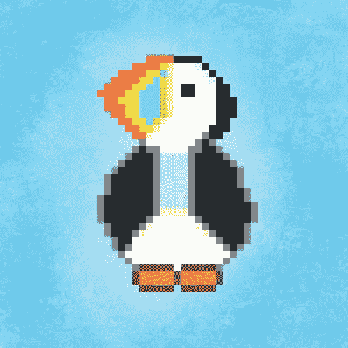](https://www.sitepoint.com/wp-content/uploads/2013/01/Pixel-Puffin.jpg)

### 第一步

打开 Photoshop，调整一些偏好设置。所以去“编辑”>“偏好设置”>“常规”现在，将“图像插值”改为“最近邻”

[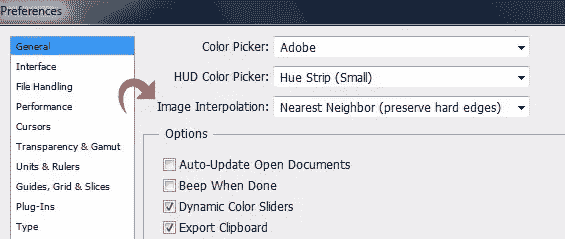](https://www.sitepoint.com/wp-content/uploads/2013/01/Step-11.jpg)

### 第二步

创建一个宽 50px、高 50px 的新文件。

[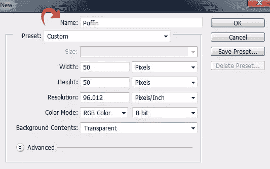](https://www.sitepoint.com/wp-content/uploads/2013/01/Step-21.jpg)

### 第三步

现在，使用边上的导航器将画布缩放至 1400%。这样，你可以很容易地看到像素指南。

[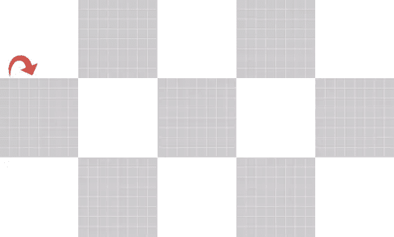](https://www.sitepoint.com/wp-content/uploads/2013/01/Step-31.jpg)

### 第四步

现在，用一些对比色填充背景，这样你就可以轻松地处理你的 8 位作品了。

[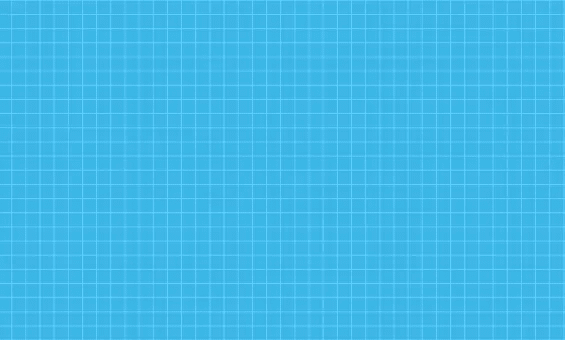](https://www.sitepoint.com/wp-content/uploads/2013/01/Step-41.jpg)

### 第五步

现在让我们从我们的海雀开始，创建一个新的层，选择 1 像素大小的铅笔。用前景色#ffffff，画出脸部的白色区域。

[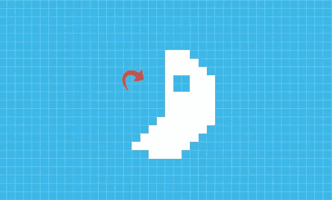](https://www.sitepoint.com/wp-content/uploads/2013/01/Step-51.jpg)

### 第六步

将前景色改为# ebeaea，并在外围添加一些阴影。

[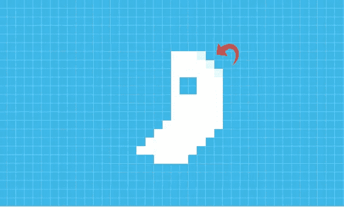](https://www.sitepoint.com/wp-content/uploads/2013/01/Step-61.jpg)

### 第七步

现在，让我们来看看彩色的鸟嘴。创建一个新层，改变前景色为#ffefa4。按照下面所示的方式应用颜色。

[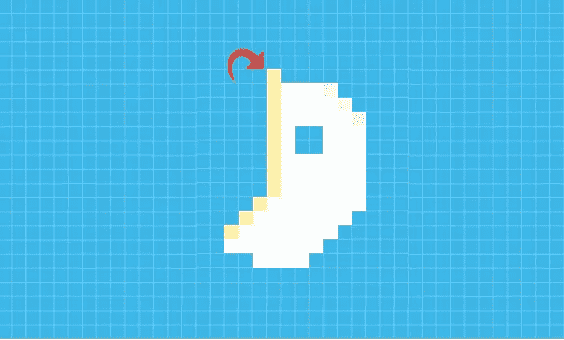](https://www.sitepoint.com/wp-content/uploads/2013/01/Step-7.jpg)

### 第八步

现在，使用颜色#dacd35、#70cbe8、#ffd700、#fa5900 和#e05000。保持你的图案和下图一样。

[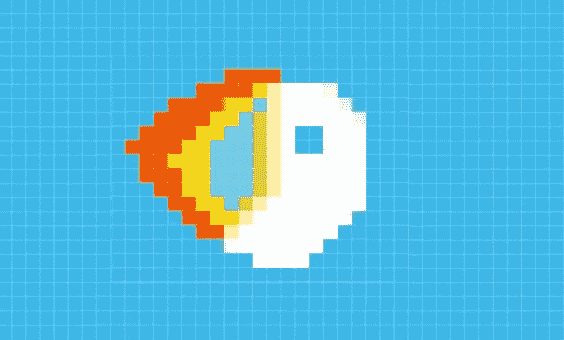](https://www.sitepoint.com/wp-content/uploads/2013/01/Step-81.jpg)

### 第九步

创建一个新层，选择颜色#000000 作为你的前景色，并绘制我们的海雀的黑色区域。

### 第十步

使用颜色#cdcdcd 和#fdf1bf 创建海雀的灰色胸部。

[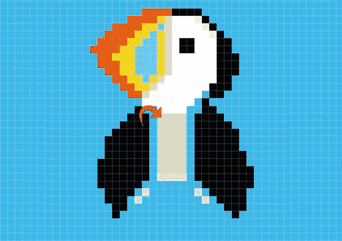](https://www.sitepoint.com/wp-content/uploads/2013/01/Step-101.jpg)

### 步骤 11

选择颜色#757575 和#ffffff 创建主体和轮廓。

### 步骤 12

现在，使用颜色#722c0c 和#f47f3d 创建脚。我们的 8 位海雀准备好了。

[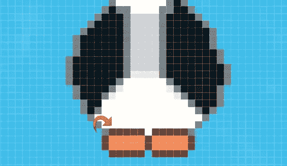](https://www.sitepoint.com/wp-content/uploads/2013/01/Step-121.jpg)

### 第十三步

如果你想给海雀增加一些风格，我们需要增加尺寸。要增加图像大小而不失去想要的像素化效果，请进入“图像”>“图像大小”，并将宽度和高度更改为 500 像素。保持设置如下。

[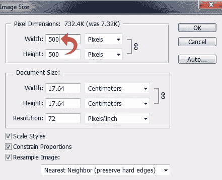](https://www.sitepoint.com/wp-content/uploads/2013/01/Step-131.jpg)

### 步骤 14

现在，让我们添加一些风格。选择背景层，填充颜色#79cdee。

[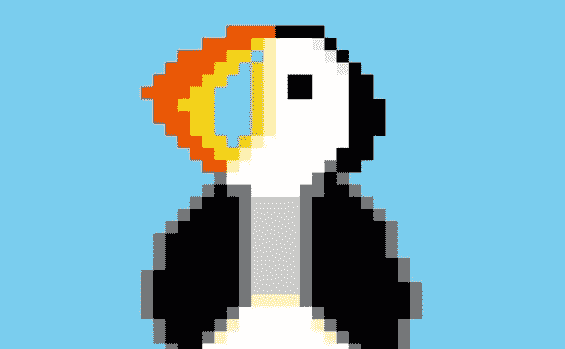](https://www.sitepoint.com/wp-content/uploads/2013/01/Step-141.jpg)

### 第十五步

点击“图层样式”,将我们资源中的图案添加到背景中。

[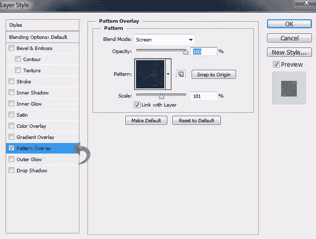](https://www.sitepoint.com/wp-content/uploads/2013/01/Step-151.jpg)

### 第十六步

新建一个图层，放在海雀图层的上面，填充颜色#d4efff。现在，减少填充到 20%。

[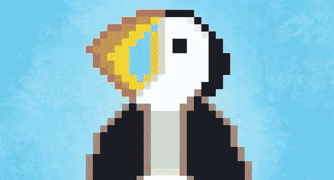](https://www.sitepoint.com/wp-content/uploads/2013/01/Step-16.jpg)

### 步骤 17

现在，点击“图层样式”,使用下面的设置添加一个图案。

下面是最终结果:

我们的 8 位海雀已经完成了。我希望这个教程能带来一些美好的怀旧回忆。我会带着更多的教程回来。在那之前，保重！

## 分享这篇文章