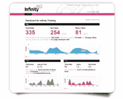
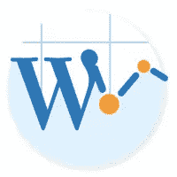
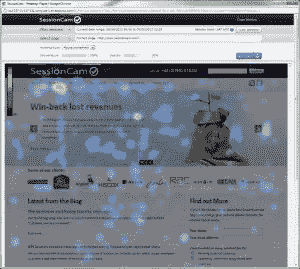
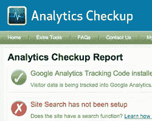
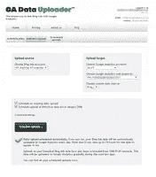

# 提升谷歌分析数据的应用

> 原文：<https://www.sitepoint.com/apps-to-boost-your-google-analytics-data/>

正如你们可能已经知道的，谷歌分析是一个无价的网络分析平台。而且是免费的。

无论你是将它用于你的个人网站还是你客户的网站，你可能会错过一些额外的功能。相信我:这是我自己花钱学来的。

这里列出了七个应用程序，应该可以帮助你充分利用谷歌分析。

## 无限呼叫跟踪

**类别:**电话追踪

**费用:**100-150 美元/月

**隐私:**不访问 GA 数据

[无限追踪](http://www.google.com/analytics/apps/about?app_id=1401001)是最受欢迎的通话追踪解决方案之一。尽管比其他竞争对手稍贵，但它完全集成了 Google AdWords 和 Analytics。

它可以跟踪无限数量的关键词或销售渠道。例如，当有人搜索您的服务并登陆您的网站时，会生成一个唯一的跟踪号码，当访问者拨打该跟踪号码时，它会记录详细信息并整理其门户中的数据。

它到底是怎么工作的？每次调用跟踪号码时，Infinity 都会向 Google Analytics 生成一个虚拟页面查看请求，并提交原始 GA 访问者 ID，以便调用是客户与网站交互的扩展。该电话将显示在 GA 的目标报告中。

## WordPress 的谷歌分析

**类别:**数据收集

**费用:**免费

**隐私:**以[非标准方式访问数据](http://www.google.com/analytics/apps/faq#data-access)

如果你正在使用 WordPress 网站，Google Analytics for WordPress 插件是在每个页面上安装 Google Analytics 跟踪代码的最简单的方法。我知道你可以直接编辑 PHP 文件，但是这个来自 [Joost de Valk](http://www.twitter.com/yoast) 的插件可以防止你犯愚蠢的错误，并且不必去检查你最新的备份。

这个插件最大的优点是，你不仅可以安装跟踪代码，还可以直接从插件的界面添加最常用的功能。

## 会话摄像头

**类别:**数据收集

**费用:**每月 30 美元起

**隐私:**以[非标准方式访问数据](http://www.google.com/analytics/apps/faq#data-access)

GA 页面内分析报告仅显示点击量数据，但也存在缺陷。 [SessionCam](http://www.google.com/analytics/apps/about?app_id=1155013) 取而代之的是类似 CrazyEgg 的功能，它记录并回放现场用户的活动，如鼠标移动、点击和滚动——但价格更低。SessionCam 同时支持`http://`和`https://`协议，支持最流行的 web 开发技术，包括 HTML、ASP、PHP、Ruby on Rails 和 JSP。

最强大的功能是与谷歌分析的集成。通过将 SessionCam 的数据导入到您的 Google Analytics 仪表板，您可以基于现有的 Google Analytics 细分市场查看会话(例如，有交易的访问和付费搜索点击)。

## 分析检查

**类别:**现场审计

**费用:**免费

**隐私:**使用 [AuthSub、OAuth 或 Open ID](http://www.google.com/analytics/apps/faq#data-access) 安全地访问 GA 数据

[Analytics Checkup](http://www.google.com/analytics/apps/about?app_id=17001) 是一款免费工具，允许您自动检查 Google Analytics 跟踪代码是否设置正确。检查内容包括 AdWords 准确性、目标设置、自我推荐和其他常见问题。创建帐户后，您可以将其连接到 Google Analytics 帐户，并创建故障排除报告。该工具不仅检查常见的跟踪问题，还提供修复问题的建议。

如果你喜欢更技术性的东西，看看这个 Chrome 扩展[，它通过启用 *GA* Javascript 的*调试*版本，将有用的信息打印到浏览器的 JavaScript 控制台。](https://chrome.google.com/webstore/detail/google-analytics-debugger/jnkmfdileelhofjcijamephohjechhna?hl=en)

## 小的

**类别:**商业智能

**费用:**免费

**隐私:**使用 [AuthSub、OAuth 或 Open ID](http://www.google.com/analytics/apps/faq#data-access) 安全地访问 GA 数据

[SumAll](http://www.google.com/analytics/apps/about?app_id=1771001) 是一项免费的数据连接服务，让数据“美丽、实惠、可访问”。抛开华丽的辞藻不谈，这项服务从 56 个不同的平台检索指标，包括社交网络、PayPal、谷歌 AdWords 和易贝，并将它们与源自谷歌分析的网站活动相结合。

然后，它会自动创建相关的表格和图表，帮助您更好地了解不同活动和销售之间的相关性。

## 谷歌标签管理器

**类别:**数据收集

**费用:**免费

**隐私:**不访问 GA 数据

谷歌标签管理器是谷歌自己开发的一个免费工具，可以将不同类型的跟踪标签整合到一个管理面板中。您只需点击几次就可以添加和更新标签，而无需重写站点代码。

Google Tag Manager 容器片段只是一小段 JavaScript 代码，应该在打开`<body>`标签后立即粘贴到页面上。它允许标签管理器通过在页面上插入`gtm.js`来触发标签。

主要特性包括异步标签加载(如 GA 跟踪代码)、即用型标签模板和多用户功能。

## 上传数据

**类别:**数据收集

**费用:**每月 29 美元起

**隐私:**使用 [AuthSub、OAuth 或 Open ID](http://www.google.com/analytics/apps/faq#data-access) 安全地访问 GA 数据

[GA 数据上传器](http://www.google.com/analytics/apps/about?app_id=1978001)按照 tin 上说的做。你可以设置每天自动上传 Bing 广告数据到 Google Analytics 新的成本分析部分。计划上传后，该工具会自动运行它。

结果:您可以在 GA 中看到您的 Bing 活动，并轻松地将其与您的 AdWords 活动进行比较。

## 结论

随着时间的推移，谷歌分析已经发展成为一种高度复杂、灵活和强大的跟踪和理解网站访问和访问者的方式。毫不奇怪，它现在如此复杂，以至于我们需要工具来帮助我们理解它。

当这样的需求出现时，总会有人通过创建应用程序来填补空缺。明智的做法是探索外面有什么，并使用最适合你的工具。

你有依赖的应用程序和工具来帮助你使用谷歌分析吗？请在评论中告诉我们。

## 分享这篇文章