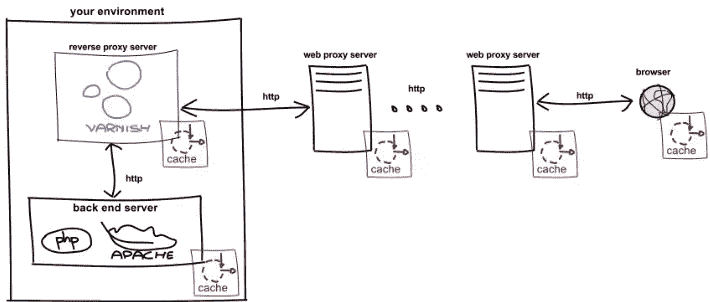

# 清漆入门

> 原文：<https://www.sitepoint.com/getting-started-with-varnish/>

缓存无处不在。从您的浏览器到其目的地的请求将通过几乎每个节点的缓存。您的浏览器有一个缓存，大多数 web 代理服务器缓存请求，而像 Apache 和 nginx 这样的 web 服务器也可能缓存请求。

[清漆](http://www.varnish-cache.org/ "Front page | Varnish Community")是一个*反向代理服务器*；它位于你的网络服务器前面，提供来自你的服务器而不是其他人的内容。反向代理服务器与 web 服务器紧密耦合，可以处理从 web 服务器收到的消息。例如，可以使用后端的 purge 命令刷新缓存的页面，这是离客户端较近的缓存无法做到的。这意味着在某些情况下，反向代理服务器缓存内容的时间比其他类型的缓存更长。



简单地说，Varnish 只做一件事:超级快速地提供网页内容。它通过处理大部分的高流量让你的网络服务器保持良好状态，并快速为你的访问者提供服务。换句话说，清漆确保你为交通高峰做好准备，并有助于保持较低的跳出率。

作为一种缓存服务，Varnish 并不是独一无二的，但是，就性能而言，它确实大放异彩。Varnish 的首席架构师是保罗·海宁·坎普(他也是一位杰出的 FreeBSD 开发人员)。所做的每一个架构决策都专注于提高性能和/或更好的灵活性，这就是为什么 Varnish 几乎没有依赖性，它有自己的配置语言，并且针对运行 FreeBSD 和 GNU/Linux 的现代硬件进行了优化。所有这些导致反向代理服务器充分利用操作系统，以便以极快的速度提供内容。

在本文中，我们将设置 Varnish 来缓存一个简单的网页两分钟。我们将逐步设置一个 web 服务器并配置 Varnish 来缓存我们的页面。为了简单起见，我们将在同一台主机上安装两者，并使用基于 Debian 的发行版。您可以在以后根据需要定制您的设置。

## 你的第一个清漆设置

Varnish 从后端服务器获取内容，后端服务器是生成内容的 web 服务器(在本例中是 Apache)。我们的例子将使用一个简单的 PHP Hello World 页面，它在每次刷新时都会更新。所以，让我们先设置一下:

```
$ sudo apt-get install apache2 php5
$ echo '<?php echo date('h:i:s') . 'Hello, world!'; | sudo tee /var/www/world.php
```

通过在浏览器中打开该页面来测试其工作情况。每次刷新页面时，时间都会更新。

接下来让我们安装清漆。它目前的版本是 3.x，因为它是为 FreeBSD 和 GNU/Linux 开发和优化的，你会发现所有主要的软件包系统都支持 Varnish。

```
$ sudo apt-get install varnish
```

要配置 Varnish，我们需要编辑两个文件:`/etc/default/varnish`和`/etc/varnish/default.vcl`。第一个为 varnishd(Varnish 守护进程)设置选项，第二个配置 Varnish 本身。

varnishd 选项文件的位置取决于您选择的操作系统。对于基于 Debian 的系统，确保`/etc/default/varnish`中的`DAEMON_OPTS`变量是:

```
DAEMON_OPTS="-a :6081  
             -T localhost:6082  
             -f /etc/varnish/default.vcl  
             -S /etc/varnish/secret  
             -s malloc,256m"
```

`-a`选项告诉 varnishd 在端口 6081 上监听请求。当您最终准备好让 Varnish 处理请求时，您可以将其更改为端口 80。选项`-f`告诉 varnishd 第二个配置文件的位置。`-T`设置管理界面的位置。在管理界面中，您可以对 Varnish 运行时进行更改。-S 选项为管理接口设置身份验证密码的位置。选项`-s`决定如何存储缓存的对象。

确保`/etc/varnish/default.vcl`中未注释的行如下:

```
backend default {
    .host = "127.0.0.1"; 
    .port = "80"; 
}
```

Varnish 使用 HTTP 与后端通信，如果你需要的话，它也支持多个后端。该设置将从端口 80 上的本地主机获取内容。

现在我们可以开始 varnishd:

```
$ sudo service varnish start
```

尝试通过 Varnish 打开我们的 Hello World 页面，方法是将我们设置的 varnishd 要监听的端口添加到 URL(即:*http://localhost:6081/World . PHP*)。当您刷新页面时，您会注意到时间每两分钟才更新一次(默认的 Varnish 设置将缓存一个页面两分钟，因为它是一个 HEAD 或 GET 请求，没有设置 Authorization 或 Cookie header)。

## 配置清漆

按照我们当前的设置，没有指定端口的本地主机请求将默认为端口 80，并被直接路由到 Apache。当您觉得 Varnish 正在缓存您想要的内容时，您可以将 Apache 切换到另一个端口，比如 8080，并将 Varnish 切换到端口 80，而不是`/etc/default/varnish`中的 6081。记住也要改变`/etc/varnish/default.vcl`中的后端配置；应该是 8080 而不是 80。

为了进一步配置 Varnish，您需要了解 VCL，Varnish 配置语言(您可能已经注意到第二个文件的文件扩展名是。vcl)。拥有自己的配置语言是实现 Varnish 灵活性和性能目标的重要因素。

当 Varnish 处理一个请求时，该请求将经历一系列状态。VCL 代码是你如何决定 Varnish 在这些状态中对请求做什么，这就是为什么 VCL 被称为状态引擎。在 VCL，每个州都有自己的默认功能。您可以通过在`default.vcl`中重新定义其功能来编辑每个状态的行为。请注意，除非添加 return 语句，否则重定义函数会在默认的 VCL 函数之前。如果你想知道一个默认的 VCL 函数是做什么的，在文件底部的注释部分有一个所有函数的副本。

这有助于看到一个例子，所以让我们编辑`vcl_fetch`并将页面在 Varnish 中缓存的时间更改为 5 秒。在`default.vcl`中，增加以下功能:

```
sub vcl_fetch { 
  set beresp.ttl = 5s; 
} 
```

需要重新加载清漆守护程序才能使其生效，因此请使用以下命令重新启动服务:

```
$ sudo service varnish restart
```

当你现在刷新你的 Hello World 页面时，时间将每 5 秒更新一次。

当 Varnish 在缓存中寻找页面但找不到时，这就是*未命中*。如果它确实找到了，那就是一次*命中*。函数`vcl_fetch`控制您的请求在失败后的最终状态。在`vcl_fetch`中，Varnish 已经从后端获取了页面，现在必须决定如何缓存页面。VCL 的每个函数都有一组可用的对象，`vcl_fetch`有几个，包括后端响应对象`beresp`。通过在`beresp`对象上设置`ttl`(生存时间),我们告诉 Varnish 页面在无效之前应该在缓存中保存 5 秒钟。一旦 5 秒钟过去，对页面的新请求意味着 Varnish 需要再次从后端获取页面。

注意，在上面的例子中，`vcl_fetch`中没有 return 语句，这意味着默认函数将在之后运行。这是一个写 VCL 的好主意，默认的 VCL 是有原因的，你应该有一个很好的理由跳过它。

Varnish 也有分析和查看其结果和性能的工具。这些有助于针对高负载场景微调您的配置。要查看其中一个的运行情况，请在使用`varnishlog -c`刷新 Hello World 页面时尝试运行 varnishlog。当请求到达时,`-c`选项过滤 varnish 日志中来自用户的条目。要过滤进出后端的条目，使用`-b`选项。

## 结论

就这样，你现在有了一个简单的设置来试验提高你的网站的性能。在这篇文章中，你已经学习了清漆的基础知识，它是什么，默认设置会给你什么。我们还快速浏览了一下 VCL，Varnish 的配置语言。VCL 可能有点难以理解，主要是因为它是一种不寻常的配置方式——然而，一旦你接受了这种方式，它使用起来就出奇的简单，而且它比配置文件更灵活。

如果你想继续学习清漆，请访问[varnish-cache.org](https://www.varnish-cache.org/ "Front page | Varnish Community")了解更多信息。你也可以在 IRC 上寻求帮助，freenode 服务器上的#varnish 频道充满了有技能和乐于助人的人。并且，所有 web 开发人员都应该做的事情是阅读 [RFC2616](http://www.ietf.org/rfc/rfc2616.txt "RFC 2616") 。对于那些想更好地理解 Varnish 和缓存的人来说，关于缓存头的部分是相关的。祝你好运！

## 分享这篇文章