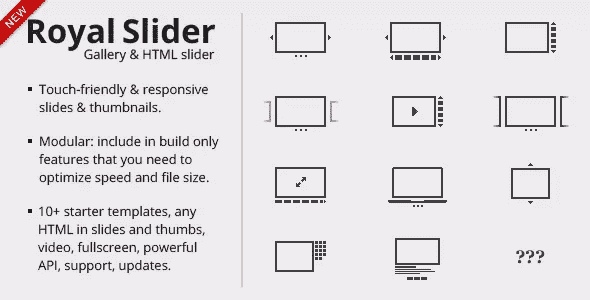
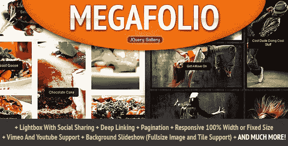
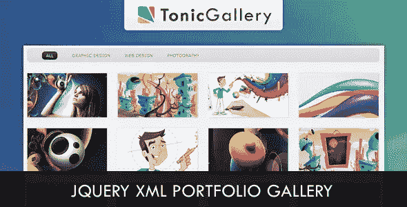
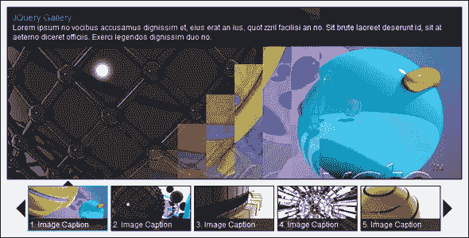
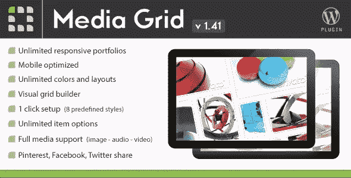
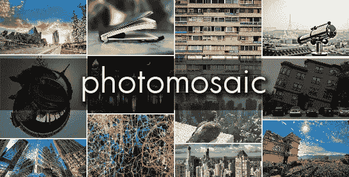

# 10 个高级 jQuery 图片库插件

> 原文：<https://www.sitepoint.com/10-premium-jquery-image-gallery-plugins/>

世界上最好的 jQuery 图片库插件的集合，主要托管在 CodeCanyon 上。享受吧。

## 1.royal slider–触控 jQuery 图片库

RoyalSlider 易于使用 jQuery image gallery 和内容滑块插件，带有动画字幕、响应式布局和对移动设备的触摸支持。

## 2.Megafolio Gallery jQuery 插件

Megafolio 是一个高度可定制的 jQuery 插件，用于展示您的画廊或作品集。它使用 jQuery 的强大功能，以砖石效果(自定义宽度或 100%宽度响应)在网格布局中呈现您的图片。

## 3.缩略图画廊(WP 下一代画廊模板)

这个下一代模板将帮助你轻松地添加缩略图到你的 WordPress 网站或博客。图库完全可定制、可调整大小，并兼容所有浏览器和设备(iPhone、iPad 和 Android 智能手机)。

[")](http://codecanyon.net/item/thumbnail-gallery-wp-nextgen-gallery-template/1716291?ref=sdeering)

## 4.对齐的图像网格-高级 WordPress 图库

这个响应式的 WordPress gallery 插件使用 jQuery 将你的缩略图对齐。Flickr 和 Google+都有类似的图片。

## 5.Tonic 图库 jQuery XML 作品集图库

Tonic Gallery 是一个 jQuery XML Portfolio Gallery，它允许你非常容易地创建一个 Portfolio Gallery，带有一些漂亮的效果和灵活的定制设置。

## 6.jQuery 图像库

这是一个图片库 jQuery 插件，具有水平缩略图布局。滑动缩略图和按钮可以轻松导航您的图像组合。

## 7.脸书画廊

脸书画廊是一个强大的 PHP 脚本，旨在允许您快速添加和显示一个或多个脸书“喜欢”页面或用户帐户的相册集。

## 8.jQuery Lightbox 进化

Lightbox Evolution 是一个以“Lightbox”风格显示图像、html 内容、地图和视频的工具，它漂浮在网页之上。使用 Lightbox Evolution，网站作者可以在所有主流浏览器中展示各种各样的媒体，而无需将用户从链接页面引开。

## 9.媒体网格——WordPress 响应式组合

在您的网站上轻松创建响应迅速、可过滤的投资组合。媒体网格带有砖石布局，旨在使每个组合适应任何情况，并针对响应主题进行了移动优化。

## 10.WordPress 的照片拼版

PhotoMosaic 创建了一个短代码([photomosaic])，通过给它一个值得你喜欢的设计博客的新鲜的砖石布局，把一个 WordPress 照片库转变成一个视觉上引人注目的设计作品。

所有图片均来自 Code Canyon，版权归各自作者所有。

## 分享这篇文章