# 制作引人注目的 300 x 250px 像素广告

> 原文：<https://www.sitepoint.com/create-a-compelling-300-x-250px-advertisement/>

吸引人的广告对任何营销活动都至关重要。你可以用富有创意和引人注目的广告设计轻松赢得人们的青睐，即使是最小的视觉改进也会对广告活动的底线产生戏剧性的放大效应。一个好的广告会引起你潜在顾客的兴趣，激发他们的好奇心。所以，今天我们要为广泛使用的 300 x 350x 广告尺寸制作一个广告。我们将使它明亮和令人兴奋，我们将使用一些有趣的技术和混合选项。那么，我们开始吧。

**资源:**

垃圾图案

**最终结果:([下载完成的分层 PSD 文件。](https://www.dropbox.com/s/tdpc8vreo84c7og/advertisement.zip) )** 

[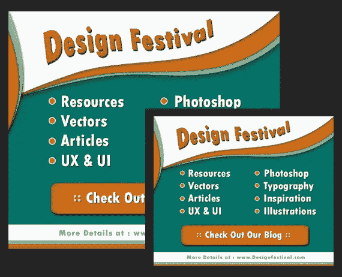](https://www.sitepoint.com/wp-content/uploads/2013/01/Final.jpg)

### 第一步

打开 Photoshop，新建一个宽 300 像素、高 250 像素的文件。

[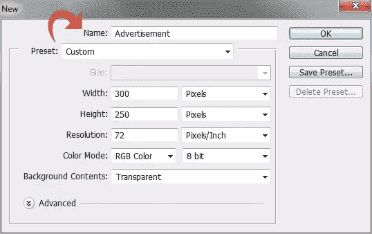](https://www.sitepoint.com/wp-content/uploads/2013/01/Step-1.jpg)

### 第二步

使用油漆桶工具，用颜色#027368 填充整个画布，并添加我们资源中的图案。

[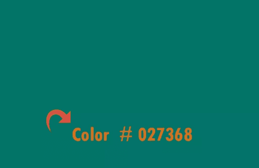](https://www.sitepoint.com/wp-content/uploads/2013/01/Step-2.jpg)

### 第三步

创建一个新层，选择钢笔工具，并创建以下形状。

[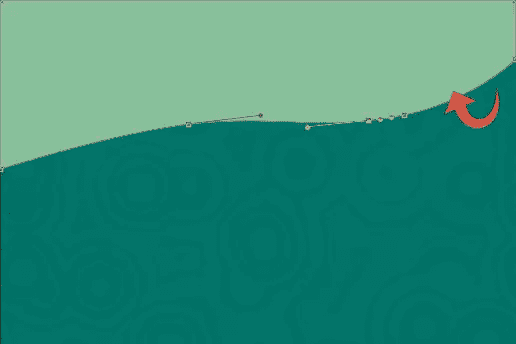](https://www.sitepoint.com/wp-content/uploads/2013/01/Step-3.jpg)

### 第四步

使用以下设置给上面的形状添加阴影。

[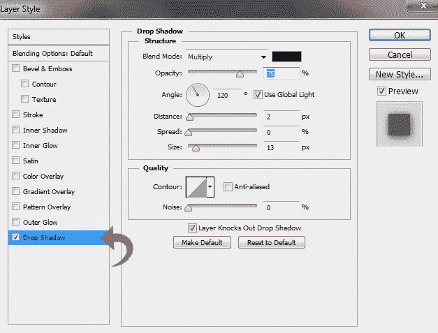](https://www.sitepoint.com/wp-content/uploads/2013/01/Step-4.jpg)

### 第五步

创建第二个类似的形状，这一次用颜色#d97014。

[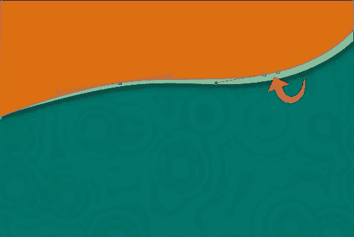](https://www.sitepoint.com/wp-content/uploads/2013/01/Step-5.jpg)

### 第六步

现在，点击图层样式并添加阴影。使用下面的设置。

[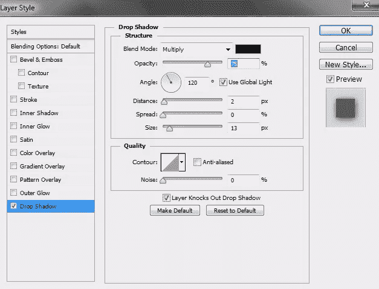](https://www.sitepoint.com/wp-content/uploads/2013/01/Step-6.jpg)

### 第七步

使用#FFFFFF 颜色创建另一个形状。然后，使用以下设置添加图案叠加和投影。

[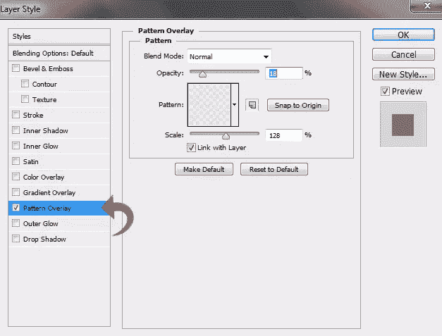](https://www.sitepoint.com/wp-content/uploads/2013/01/Step-7a.jpg)

[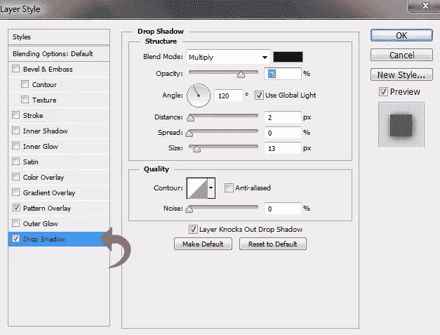](https://www.sitepoint.com/wp-content/uploads/2013/01/Step-7b.jpg)

### 第八步

重复同样的过程，在侧面再画两个形状。添加与前面步骤中使用的相同的投影。

### 第九步

选择矩形工具，使用颜色#d97014 和# 8abf9c 在画布底部添加条纹。

### 第十步

使用#FFFFFF 颜色添加另一个矩形条纹，并添加以下图案叠加。

[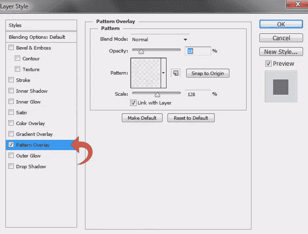](https://www.sitepoint.com/wp-content/uploads/2013/01/Step-10.jpg)

### 步骤 11

现在，让我们添加标题。选择文字工具，使用颜色#d97014 添加您想要的标题。点击“图层样式”,使用下面的设置添加图案叠加和阴影。

[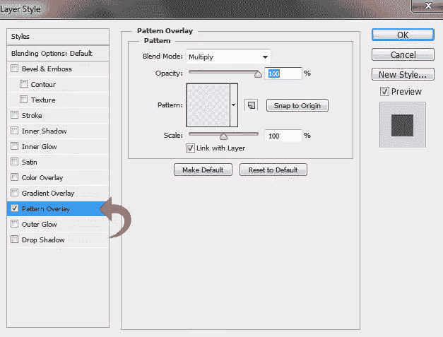](https://www.sitepoint.com/wp-content/uploads/2013/01/Step-11a.jpg)

[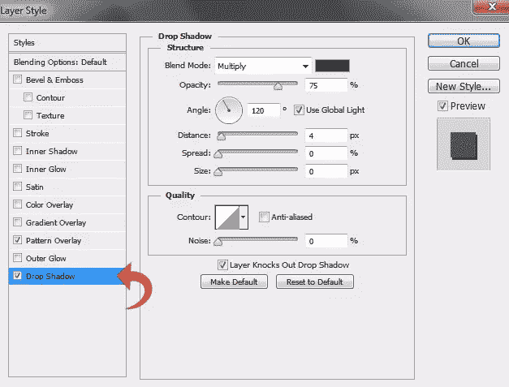](https://www.sitepoint.com/wp-content/uploads/2013/01/Step-11b.jpg)

### 步骤 12

选择“扭曲文本”工具并调整设置，以获得如下所示的波浪效果。

[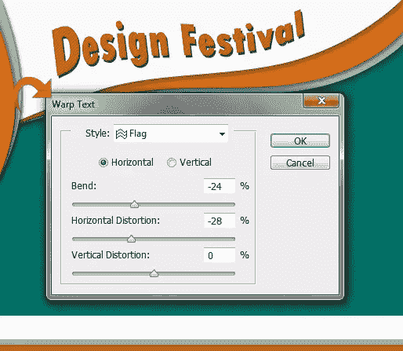](https://www.sitepoint.com/wp-content/uploads/2013/01/Step-12.jpg)

### 第十三步

让我们开始添加一些更好的细节。选择椭圆工具，使用颜色#d97014 创建一个小圆。现在，点击“图层样式”,用下面的值添加一个笔画。

[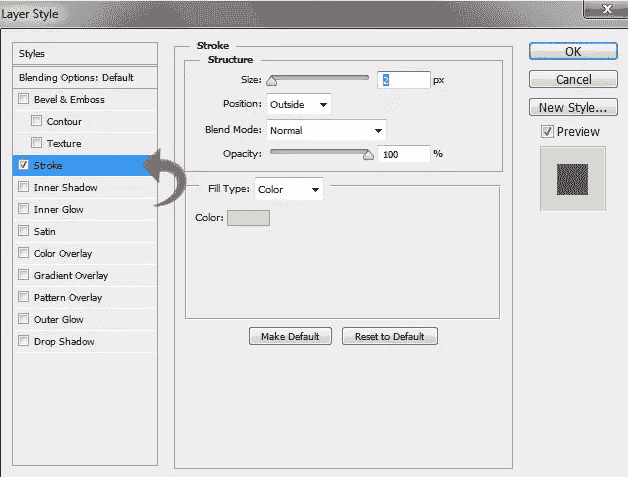](https://www.sitepoint.com/wp-content/uploads/2013/01/Step-13.jpg)

### 步骤 14

重复相同的过程创建项目符号。在每个项目符号旁边添加一些引人注目的文字来描述你正在宣传的产品。

[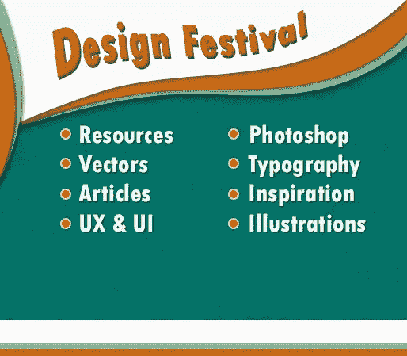](https://www.sitepoint.com/wp-content/uploads/2013/01/Step-14.jpg)

### 第十五步

对于主按钮，选择圆角矩形工具，使用颜色#d97014 创建一个“行动号召”区域。

[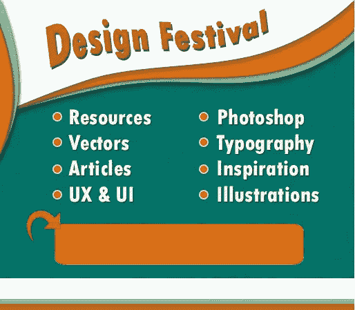](https://www.sitepoint.com/wp-content/uploads/2013/01/Step-15.jpg)

### 第十六步

现在，使用下面的设置添加一个内阴影和一个投影。

[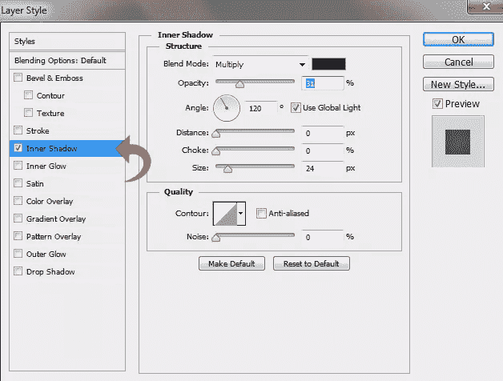](https://www.sitepoint.com/wp-content/uploads/2013/01/Step-16a.jpg)

[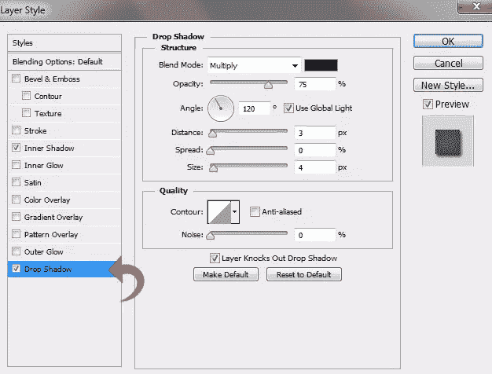](https://www.sitepoint.com/wp-content/uploads/2013/01/Step-16b.jpg)

### 步骤 17

选择文字工具将文本添加到行动号召中，然后给新文本添加一些阴影。

[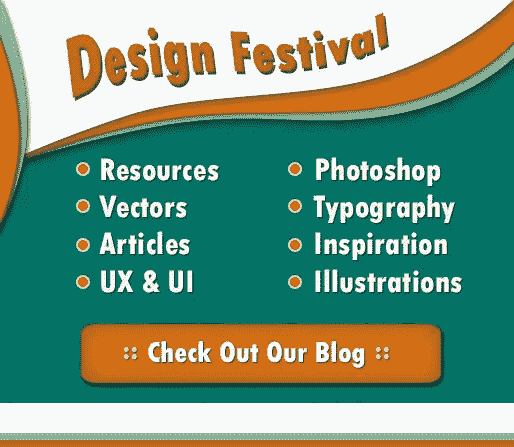](https://www.sitepoint.com/wp-content/uploads/2013/01/Step-17.jpg)

### 步骤 18

再次选择文字工具，在底部的白条上添加 URL 文本。

[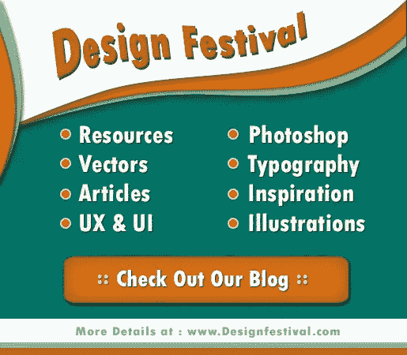](https://www.sitepoint.com/wp-content/uploads/2013/01/Step-18.jpg)

我们完了！我们的广告设计已经准备好了。我希望你们喜欢这个教程。我很快就回来，在那之前，玩得开心！

## 分享这篇文章