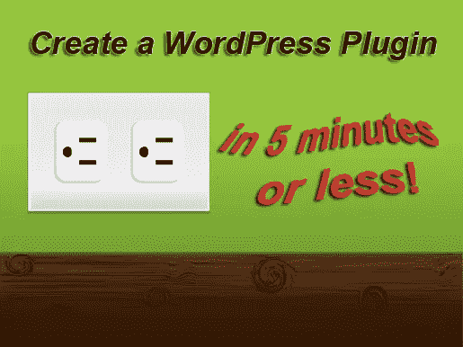
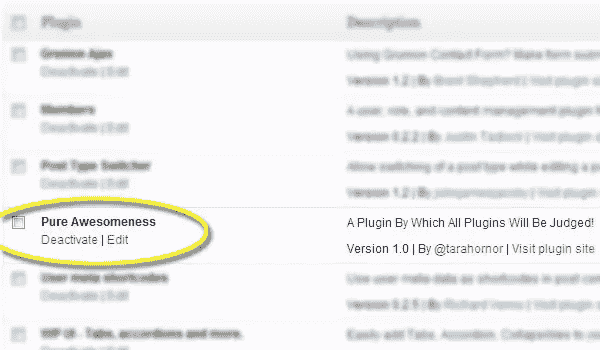

# 在五分钟或更短时间内设计一个 WordPress 插件

> 原文：<https://www.sitepoint.com/design-a-wordpress-plugin-in-five-minutes-or-less/>

在最近一篇关于短代码的文章中，我解释了一种快速添加短代码到 WordPress 站点的方法。但是，有时你需要的不仅仅是像短码这样的权宜之计。这就是插件的更强大选项发挥作用的地方。

然而，创建插件可能会非常令人生畏。我做的第一个花了我整整一天的时间进行研究、试错和令人毛骨悚然的“乐趣”但是，一旦我有了插件，开发就变得容易多了。

更重要的是，插件相对安全，当客户端运行自动 WordPress 更新，升级主题，甚至完全改变主题时，不会破坏你的工作。如果你正在寻找 WordPress 设计需求的永久解决方案，插件就是答案。

添加功能的简单方法是打开 functionality 文件，开始添加代码。但是，这注定会被打破。如果你不直接管理这个网站，有人会闯进去破坏一些东西。这似乎是好奇的客户的工作方式。

所以，创建一个 WordPress 插件会给你一个近乎永久的安全解决方案(众所周知，客户端会因为一些未知的原因卸载插件)。除了 WordPress 升级使你的代码过时，你不必担心你的新功能消失或被覆盖。

### 步骤 1:创建你的插件文件

这是这个过程的第一点也是最重要的一点——实际上比大多数人意识到的要容易得多。为了演示创建一个插件有多简单，这里有一个无用的插件，你可以简单地通过复制粘贴这段代码并上传到你的站点来编写和安装它。它什么也不做，但是它用这一小段代码正确地注册并安装了插件:

[sourcecode language="php"]

/*

插件名称:PureAwesomeness

外挂 URI:http://www . your site . com/pure-awesome ness

描述:一个用来判断所有插件的插件！

版本:1.0

作者:@塔拉霍诺尔

作者 URI

执照:GPLv3

*/

？>

[/sourcecode]

试试看！将上面的代码保存到一个名为 awesome.php 的文件中，并上传到你的 WordPress 站点中的“插件”>“添加新项”页面。你会得到激活确认，你就大功告成了！现在它显示为你安装的 WordPress 插件之一…尽管它还没有做任何有用的事情。

注意:根据你的 WordPress 版本，你可能需要先将文件压缩到一个 zip 文件夹中。

现在，就像我说的，这个插件还没有做任何事情，所以让我们看看如何让 WordPress 实际上开始用我们新创建的插件做一些有用的事情。

### 步骤 2:初始化函数

有了一个完全注册的插件，你现在可以开始告诉 WordPress 你创建的功能了。为此，我们使用内置的初始化特性。只需在代码下面添加以下内容:

[sourcecode language="php"]

add_action('init '，' pure _ awesome ness ')；

函数 pure_awesomeness() {

//这里有一些代码

}

[/sourcecode]

再说一次，我们现在还没有做任何事情，但是如果你曾经用 PHP 编写过，你应该开始对这一点感到兴奋。一旦你有了 PHP 函数，你就可以做*任何事情*！但是，让 WordPress 开始处理我们的功能并不容易。

我可以就此打住，但是我想给你一些工具，你可以用它们来开始构建这个超级简单的插件。实际上，上面的代码什么都不是。插件通过将大量文件和其他内容链接到插件中，让你能够创建强大的功能，但这并不完全直观。

### 步骤 3:链接文件(可选)

如果你做任何类型的 web 开发，你会想要把你的功能分解成多个文件。表单、CSS 和图像都是您可能想要引用的*单独的*文件的主要例子。

要链接额外的文件，使用 WordPress include 功能:

[sourcecode language="php"]

包含(插件目录路径(__ 文件 _ _)。pure-awesome-functions . PHP’)；

[/sourcecode]

我们链接的文件可以包含任何内容——附加函数、表单等。您包含的文件中的任何函数现在都可供您随时调用！

### 步骤 CSS 入队(可选)

你可能想要实现的另一个插件难题是 CSS。无论你是设计你自己的功能，还是给现有的 WordPress 主题添加样式，你都必须首先注册 CSS，WordPress 称之为入队——有史以来最不直观的单词*之一*。

入队过程需要四个步骤:

1.  上瘾
2.  创建一个函数
3.  注册 CSS
4.  将 CSS 排入队列

听起来很痛苦吗？没错。但这就是过程，下面是它的代码:

[sourcecode language="php"]

add_action( 'wp_enqueue_scripts '，' pure _ awesome _ style sheet ')；

函数 pure_awesome_stylesheet() {

WP _ register _ style(' pure-awesome-style '，plugins _ URL(' CSS/cpure-awesome-styles . CSS '，__FILE__)，array())；

WP _ enqueue _ style(' pure-awesome-style ')；

}

[/sourcecode]

这里值得一提的一点是，CSS 文件是相对于调用 CSS 的文件的位置的。在上面的例子中，我指向一个 CSS 文件夹。该文件夹将受到保护，不会被插件目录中的客户端和核心更新访问。

让我们后退一步，看看发生了什么。首先，我们使用 add_action 来告诉 WordPress 我们将要让一个脚本入队——这可能是一个 PHP 文件、CSS 或其他东西。add_action 特性中的下一个参数是我们想要调用的函数的名称。

接下来，我们创建函数。这是实际执行文件注册和入队工作所必需的。

wp_register_style 只是指向 CSS 文件的文件位置，并给它一个短名称。

最后，wp_enqueue_style 函数实际上向 WordPress 注册了样式，使其可以访问。现在你会在网站源代码的部分看到 CSS 文件。

### 步骤 5:添加短代码(可选)

你可能想利用插件的另一个特性是[创建无限数量的短代码](https://www.sitepoint.com/create-custom-shortcodes-for-wordpress-in-two-minutes/ "Create Custom Shortcodes for WordPress in Two Minutes")的能力。使用上面的 include 调用(来自步骤 3)，您可以编写任意数量的函数。如果您想将函数用作短代码，您所要做的就是使用步骤 3 中的技术链接到函数所在的文件，然后添加以下内容:

[sourcecode language="php"]

add _ short code(pure _ awesome _ short code '，' pure _ awesome _ function ')；

[/sourcecode]

将短代码的名称作为第一个参数，将您想要调用的函数的名称作为第二个参数。

当然，关于插件还有很多其他的东西要学，但是希望这能给你信心，让你今天就开始创建自己的插件，边学边学。

祝你好运，玩得开心！

## 分享这篇文章