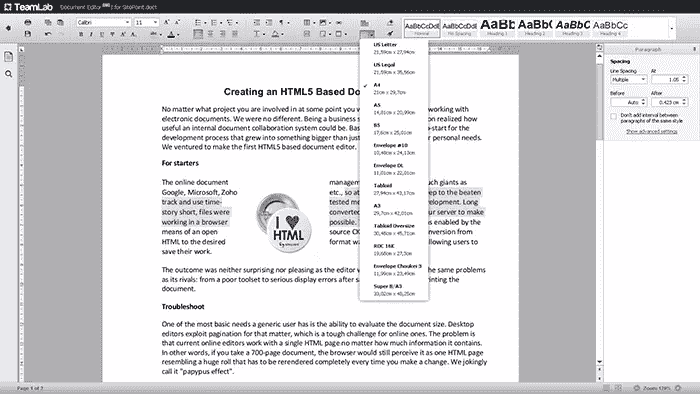

# 创建基于 HTML5 的文档编辑器

> 原文：<https://www.sitepoint.com/creating-an-html5-based-document-editor/>

不管你参与的是什么样的项目，在某个时候你很可能会以处理电子文档而告终。

我们没有什么不同。

作为业务服务提供商，我们很快意识到内部文档协作系统是多么有用。

基本上，这是发展过程的一个开端，发展过程不仅仅是为我们的个人需求创造一个工具。我们冒险制作了第一个基于 HTML5 的文档编辑器。

## 首先

在线文档管理领域拥有谷歌、微软、Zoho 等巨头。所以一开始我们决定保持常规，使用久经考验的方法进行产品开发。

长话短说，文件在我们的服务器上被转换成 HTML 格式，使得在浏览器中工作成为可能。编辑功能是通过开源 CKEditor 实现的。从 HTML 到所需格式的反向转换迅速展开，允许用户保存他们的工作。

结果既不令人惊讶也不令人满意，因为编辑器面临着与其竞争对手完全相同的问题，从糟糕的工具集到保存、转换或打印文档后的严重显示错误。

## 充当故障检修员

普通用户最基本的需求之一是评估文档大小的能力。桌面编辑利用了分页技术，这对在线编辑来说是一个严峻的挑战。问题是，目前的在线编辑器只处理一个 HTML 页面，不管它包含多少信息。

换句话说，如果你有一个 700 页的文档，浏览器仍然会认为它是一个 HTML 页面，就像一个巨大的卷，每次你做了改变都要重新呈现。我们开玩笑地称之为“纸莎草纸效应”。

目前只有两个正在开发的编辑器有这个功能。虽然 Zoho 的分页最恰当的描述是近似的，但 Google Docs 平台的表现更准确，但这反过来加剧了臭名昭著的“纸莎草纸效应”，例如，每次输入新符号时，都需要重新渲染文件并重新应用分页。

人们可以从自己的错误中吸取教训，因此我们决定将正确分页作为我们的主要目标。我们必须做的第一件事是放弃旧方法。

## 从零开始发展

将桌面编辑器作为我们成功解决分页问题的基准，我们决定使用相同的原则来获得有价值的结果。

我们在文档呈现部分更改了代码架构，因此现在所有操作都在文档的可见部分执行，而文档的其余部分仅在被引用时呈现。这样，我们一次解决了几个问题，使得:

*   避免对多页文档进行低速操作(例如，在更改类型系列时)
*   放大/缩小文档本身(不是浏览器窗口)
*   显示不可见字符
*   更改页边距的大小

## 相同显示挑战

我们在使用在线编辑器时注意到的另一个问题是，不同浏览器和打印后的文档显示不一致。从用户的角度来看，这只是一个问题，但从开发人员的角度来看，至少有两个问题:字体测量(获取字体度量)和文档中的文本呈现。

目前，在线文档编辑器使用浏览器进行渲染和测量。然而，浏览器测量从来都不精确。此外，它缺乏重要的属性，如上升、下降和其他指标。

此外，每个浏览器都可能有自己的测量方法，从而导致同一文档在不同浏览器中的不正确显示。

这同样适用于浏览器呈现文本的方式。当前的编辑器使用浏览器在操作系统提供的“画布”上呈现文本。

这就是为什么我们必须想出我们自己的字体度量获取引擎以及我们自己的渲染方法。结果，我们控制了字体规格，所以我们能够向渲染器发送请求。

毫无疑问，我们必须对新的 HTML5 技术(更准确地说是 canvas 元素)给予信任，该技术允许访问内容的像素。每一个元素都精确地渲染到一个像素，因此不依赖于浏览器或操作系统。

除了在不同的浏览器中有相同的显示之外，我们在打印文档(保存到。pdf 格式)。通过命令集将文件参数存储在元文件中，可以避免不可避免地导致质量损失的转换。

## 前景

我们在桌面编辑器上已经习以为常的功能，如行距、丰富的字体和文本样式、多级编号、表格或多页报告的编辑，已经渗透到了在线编辑的领域，无论你使用的是哪种浏览器，或者你试图从哪里导入你的文档。

从长远来看，HTML5 保证了这个领域中各种更重要的魅力。

同时，这是我们最后得到的结果:

该编辑器现在是[TeamLab Office](http://www.teamlab.com)collaboration suite 的一部分，可以在登录后在那里进行测试，或者在我们位于 html5.teamlab.com 的[的演示门户(这要快得多)上进行测试。](http://html5.teamlab.com)

## 分享这篇文章