# 给自己做一杯热气腾腾的矢量咖啡

> 原文：<https://www.sitepoint.com/make-yourself-a-steamy-cup-of-vectorized-coffee/>

你会惊讶于设计师经常被要求在他们的设计中使用日常物品。这些图像通常具有强烈的象征意义，能够引起观众强烈的内心反应… [尤其是当它与美味的食物和饮料有关时](https://www.sitepoint.com/how-to-use-food-to-add-mouthwatering-appeal-to-your-design/ "How To Use Food To Add Mouthwatering Appeal to Your Design")。

在本教程中，我将带你完成在 Illustrator 中创建矢量化咖啡杯的过程。我们将使用不同的形状工具，钢笔工具，渐变工具，网格工具，和符号喷雾器工具来实现最终的结果。希望你会学到一些有用的技巧。我们开始吧！

### 第一步

在 Illustrator 中创建新文档，宽度为 600 像素，高度为 450 像素。

### 第二步

首先，我们将画出基本的杯子形状。选择#C11B1D 作为你的填充颜色，设置你的笔画为“无”选择椭圆工具绘制一个拉长的椭圆，如下图所示。

### 第三步

在椭圆图层上方的新图层上画一个矩形，覆盖半个椭圆。你可以为矩形使用任何颜色，这没关系。现在，选择椭圆和矩形层，按下相应层右侧的环形目标，并在路径查找器窗口中选择“负前”形状模式。要打开 pathfinder 窗口，请转到“窗口”>“Pathfinder”

[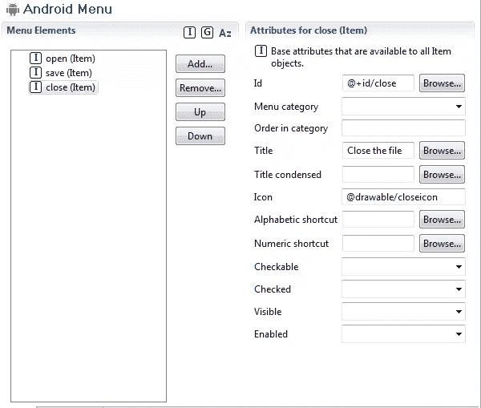](https://www.sitepoint.com/wp-content/uploads/2013/01/31.jpg)

### 第四步

选择“添加锚点工具”在杯子底部添加两个锚点。现在，在“直接选择工具”(“A”)的帮助下，一个接一个地双击基础锚点，赋予它如下所示的形状。将这一层标记为“杯子”。

[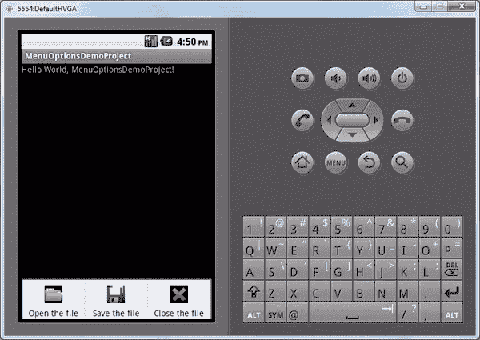](https://www.sitepoint.com/wp-content/uploads/2013/01/41.jpg)

### 第五步

复制杯子层，使用选择工具(“V”)稍微减小它的大小。现在，选择网格工具(“U”)并将其应用于复制的杯子，如下图所示。这样做你会得到路径网络。用网格工具点击锚点 2，将填充颜色改为#F46777。这将突出显示第二条路径。使用网格工具单击第五个锚点，再次将填充颜色更改为#F46777，在杯子的另一侧创建第二个高光。

为了调整高光，我们需要使这些网格路径有点弯曲。使用直接选择工具(“A”)调整每个锚点，以创建稍微弯曲的路径。

[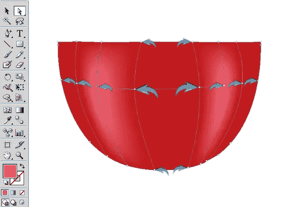](https://www.sitepoint.com/wp-content/uploads/2013/01/5b.jpg)

### 第六步

接下来，我们将制作杯子的顶部。使用纯白填充颜色和#F4F4F4 作为颜色笔画(1 磅笔画宽度)在杯子上画一个椭圆。

[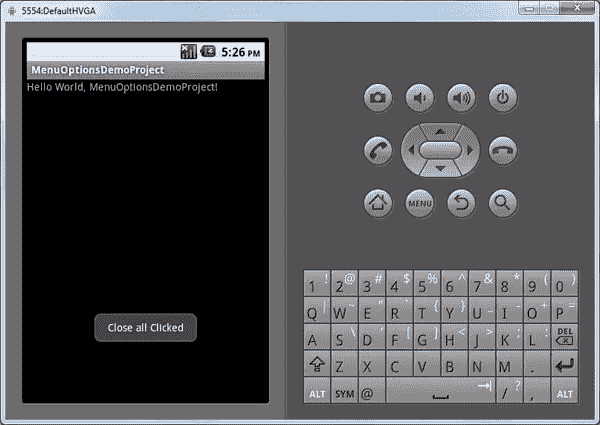](https://www.sitepoint.com/wp-content/uploads/2013/01/61.jpg)

### 第七步

复制顶部的椭圆，并应用以下梯度。一旦你完成了，用渐变减少椭圆的不透明度到 40%。

[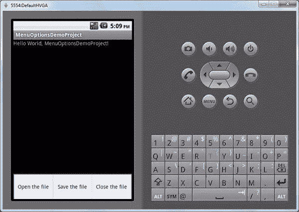](https://www.sitepoint.com/wp-content/uploads/2013/01/71.jpg)

### 第八步

复制顶部的椭圆层，并使用选择工具(“V”)稍微减小它的大小。现在，使用#F4F4F4 作为你的颜色笔画，在上面应用下面的渐变。再次使用 1 磅的笔画宽度。

[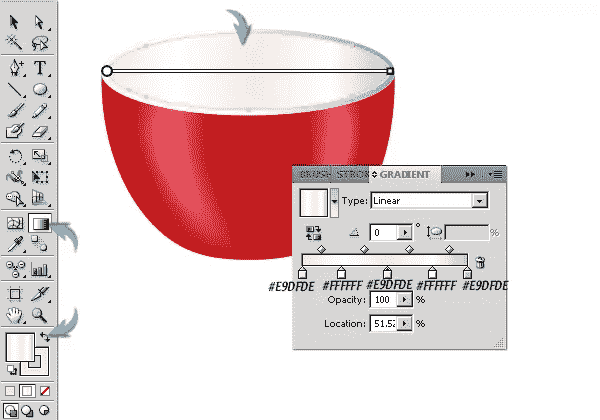](https://www.sitepoint.com/wp-content/uploads/2013/01/81.jpg)

复制这个新的椭圆层，并应用以下梯度。之后，将其不透明度降低到 20%。

[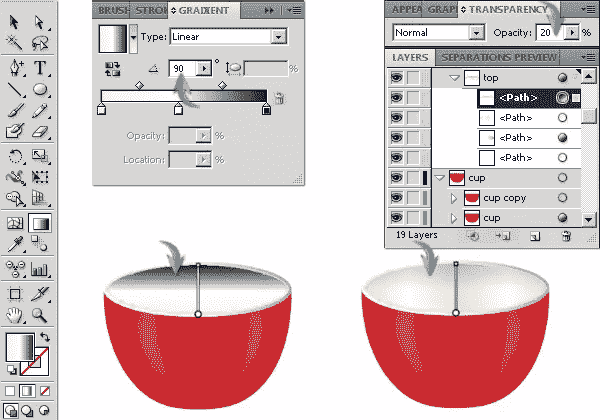](https://www.sitepoint.com/wp-content/uploads/2013/01/8b1.jpg)

### 第九步

接下来，我们将在杯子里煮咖啡。使用#64504F 作为填充颜色，在其余图层上方画一个椭圆。

[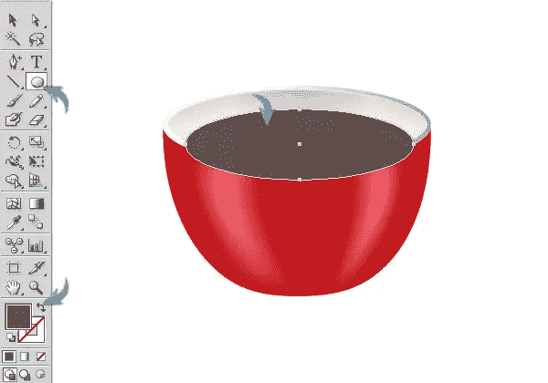](https://www.sitepoint.com/wp-content/uploads/2013/01/91.jpg)

### 第十步

为了把咖啡限制在杯子里，复制步骤 8 中形成的小椭圆层。现在，选择咖啡和椭圆层，并点击“相交”在路径查找窗口得到如下所示的结果。

[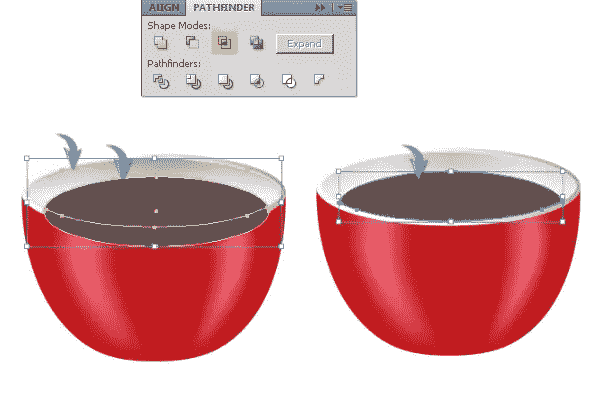](https://www.sitepoint.com/wp-content/uploads/2013/01/101.jpg)

### 步骤 11

使用钢笔工具，以#451D15 为填充颜色，绘制如下所示的形状。

[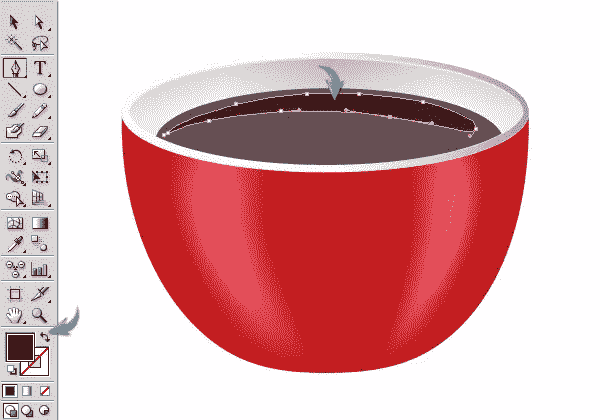](https://www.sitepoint.com/wp-content/uploads/2013/01/111.jpg)

### 步骤 12

接下来，我们将在咖啡上制造一些泡沫。用下面的两个椭圆画一个泡泡。复制它几次，调整大小和旋转每个副本轻微。完成后，选择一组泡泡，并将其拖到“符号”窗口。

[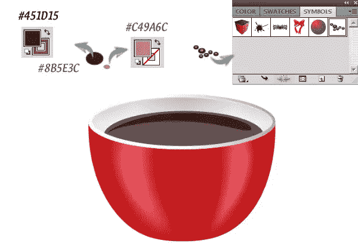](https://www.sitepoint.com/wp-content/uploads/2013/01/121.jpg)

### 第十三步

要添加气泡，创建一个新的层上休息，并选择“符号喷雾器工具”(Shift+“S)。双击它的图标打开“符号工具选项”并使用以下设置。然后，按“确定”并在咖啡杯的一侧应用工具。

[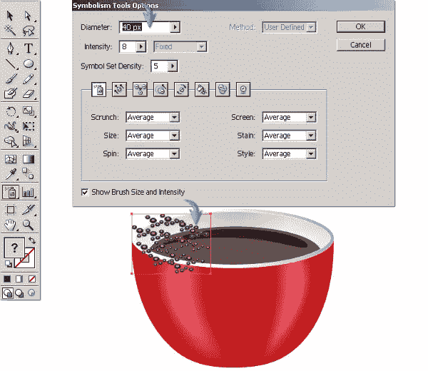](https://www.sitepoint.com/wp-content/uploads/2013/01/132.jpg)

### 步骤 14

若要调整气泡，请选择它们并使用选择工具(“V”)减小它们的大小。之后，应用符号 scruncher 工具，符号 sizer 工具，和符号微调工具随机超过泡沫，给他们一个不同的外观。尝试这些工具，在你的咖啡中获得想要的泡泡。

[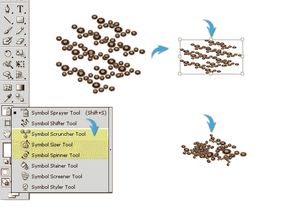](https://www.sitepoint.com/wp-content/uploads/2013/01/141.jpg)

### 第十五步

一旦你完成了，复制气泡层，把它拖到原始层下面，然后到“对象”>“扩展”展开对象和填充。扩大它五到六倍，然后改变这个修改层的填充颜色为#754C29。向右拖一点。这将作为气泡的基础。减少气泡层的不透明度到 75%来很好的混合它们。

[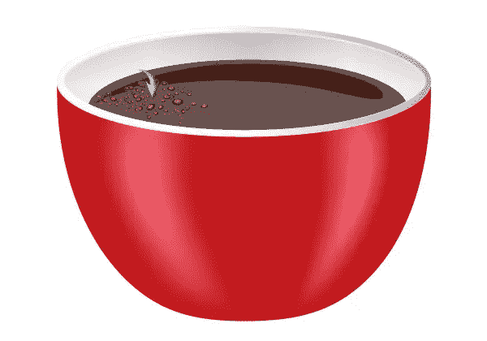](https://www.sitepoint.com/wp-content/uploads/2013/01/151.jpg)

### 第十六步

接下来，我们将制作杯子的把手。使用钢笔工具绘制以下形状，填充颜色为#C11B1D，笔画颜色为#E04158。使用 1 磅的笔画宽度。

[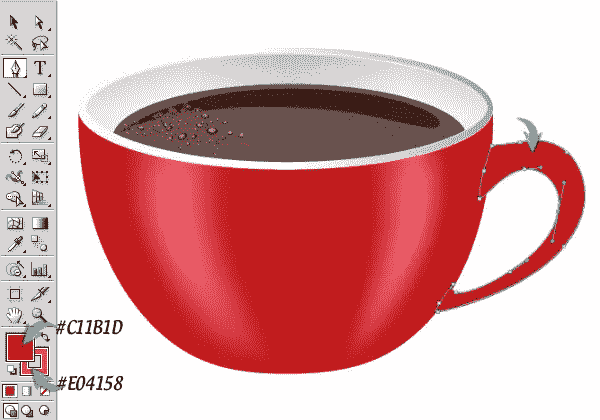](https://www.sitepoint.com/wp-content/uploads/2013/01/161.jpg)

### 步骤 17

复制手柄，应用下面的黑色到透明渐变。将渐变图层的混合模式改为“正片”，不透明度降低到 75%。

[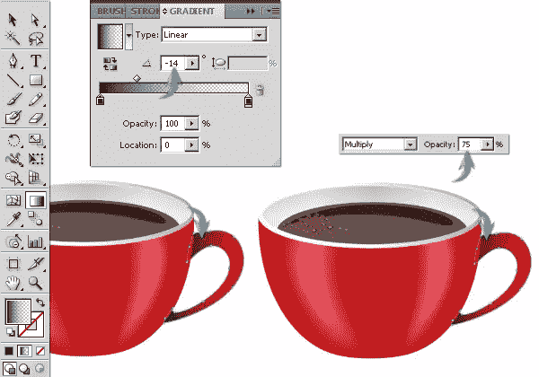](https://www.sitepoint.com/wp-content/uploads/2013/01/171.jpg)

### 步骤 18

使用钢笔工具在手柄上绘制如下所示的笔画。

[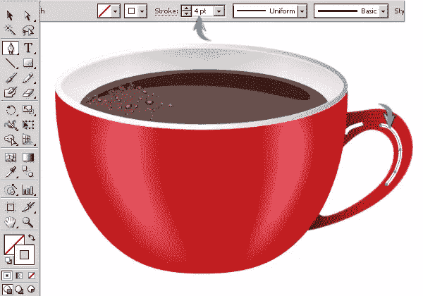](https://www.sitepoint.com/wp-content/uploads/2013/01/182.jpg)

将描边宽度轮廓从均匀改为“宽度轮廓 1 ”,并将不透明度降低到 20%。

[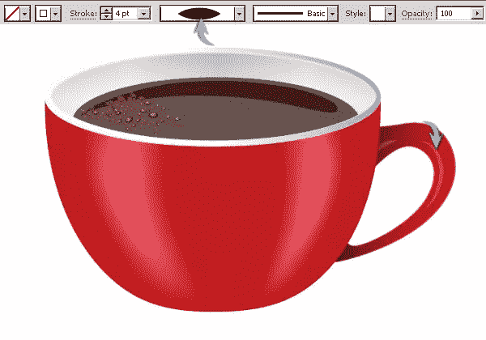](https://www.sitepoint.com/wp-content/uploads/2013/01/18b.jpg)

### 步骤 19

使用#770101 作为填充颜色，画出如下所示的形状，完成杯子把手。

[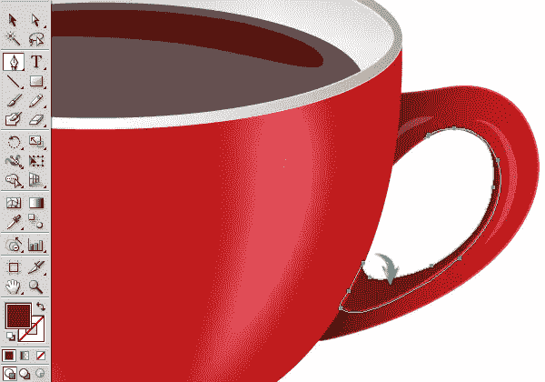](https://www.sitepoint.com/wp-content/uploads/2013/01/19.jpg)

### 步骤 20

接下来，我们要做飞碟。在其余层的下面画一个椭圆。应用下面的梯度到它。

[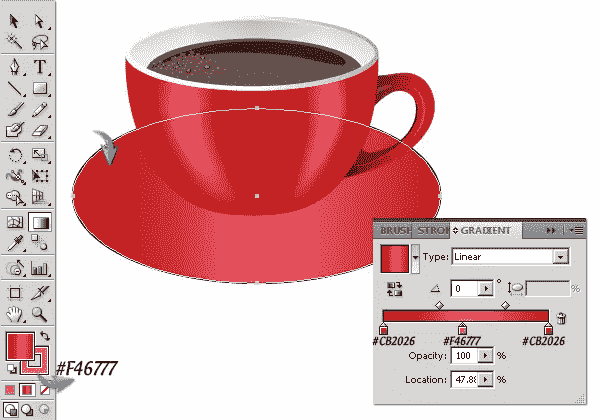](https://www.sitepoint.com/wp-content/uploads/2013/01/201.jpg)

现在，选择椭圆，进入“效果”>“风格化”>“内部发光”，应用以下设置。

[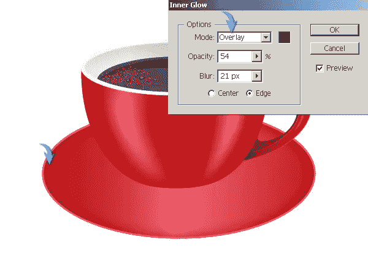](https://www.sitepoint.com/wp-content/uploads/2013/01/20b.jpg)

再做一个小一点的椭圆。应用同样的内发光设置和渐变，就像我们应用于飞碟一样。但是，将渐变的角度从 0 更改为-90⁰，如下所示。

[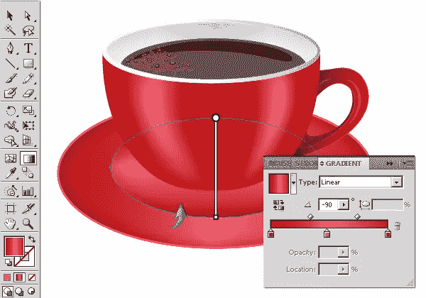](https://www.sitepoint.com/wp-content/uploads/2013/01/20c.jpg)

### 步骤 21

使用#451D15 填充颜色，在茶托上方和杯子下方再画一个小椭圆。复制这个椭圆，增加它的大小并向右拖动一点。降低其不透明度为 40%，为杯子制作一个小阴影。

[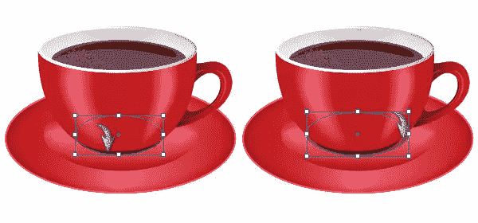](https://www.sitepoint.com/wp-content/uploads/2013/01/211.jpg)

### 步骤 22

现在，选择飞碟层，并前往“对象”>“路径”>“偏移路径。”使用 2px 值作为偏移量。将这个新路径的填充颜色改为#E9DFDE，向下拖动，如下图所示。

[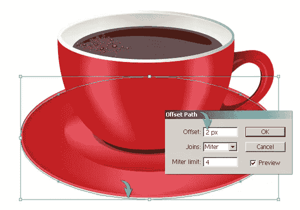](https://www.sitepoint.com/wp-content/uploads/2013/01/221.jpg)

### 步骤 23

选择这个新路径，并转到“对象”>“路径”>“偏移路径”使用 2px 值作为偏移，并将其填充颜色更改为#451D15。向下拖动这条路径完成飞碟。

### 步骤 24

要为茶托制作阴影，使用纯黑色填充颜色画一个椭圆，然后进入“效果”>“模糊”>“高斯模糊”这里使用 6px 值。改变其混合模式为“乘”，减少其不透明度为 35%。

###  
第二十五步

要设计杯子的阴影，复制杯子图层和组成杯子把手的两个图层。将这些图层放在一起，选择它们，然后合并它们。将这个新组合的图层命名为“杯子阴影”，将填充颜色改为黑色，并将其放置在茶托上方。缩小它的尺寸，并使用选择工具(“V”)将其向右旋转。现在，复制茶托层，把它放在这个新的“杯子阴影”层上面。选择这两个层，并点击“裁剪”在探路者窗口。现在，改变其混合模式为“乘”，并设置其不透明度为 25%。

### 步骤 26

画一个薄矩形，并应用“地球色调 31”梯度给它。你可以通过选择“样本库菜单”>“渐变”>“地球色调”找到这个渐变。现在，选择矩形，进入“效果”>“扭曲”>“弧线”在此使用以下设置。生成的弧的端点需要一些修正。首先，选择弧，并前往“对象”>“扩展外观”，然后在直接选择工具(“A”)的帮助下调整末端的锚点。

[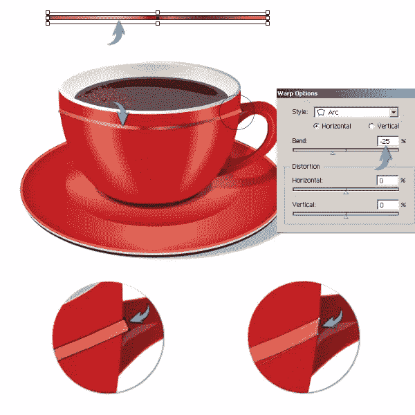](https://www.sitepoint.com/wp-content/uploads/2013/01/26.jpg)

[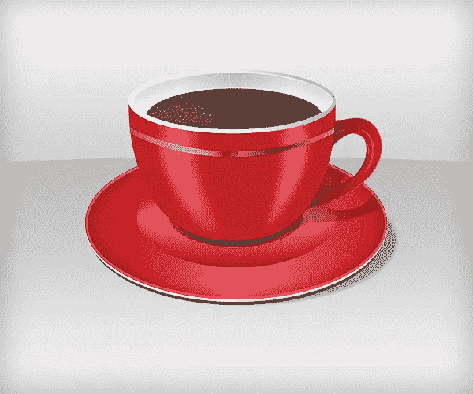](https://www.sitepoint.com/wp-content/uploads/2013/01/Final-result4.jpg)

就这样，伙计们。我希望你喜欢这个教程，并学到一些有用的东西。享受你的咖啡吧！

## 分享这篇文章