# 2012 年 100 大 jQuery 插件(第 5/5 部分)

> 原文：<https://www.sitepoint.com/top-100-jquery-plugins-of-2012-part-5/>

接下来是[第一部分(#1-20)](http://www.jquery4u.com/plugins/top-100-jquery-plugins-2012-part-1/) 和[第二部分(#21-40)](http://www.jquery4u.com/plugins/top-100-jquery-plugins-2012-part-25/) ，以及[第三部分(#41-60)](http://www.jquery4u.com/plugins/top-100-jquery-plugins-2012-part-35/) ，[第四部分(#61-80)](http://www.jquery4u.com/plugins/top-100-jquery-plugins-2012-part-4/) 。这里是 2012 年(第 5/5 部分)排名 81-100 的前 100 个 jQuery 插件的最终汇总。享受吧。

## 81.jQuery 站点功能

SiteFeature 是一个不引人注目的 jQuery 插件，它简化了交互式“特色项目”小部件的创建。

[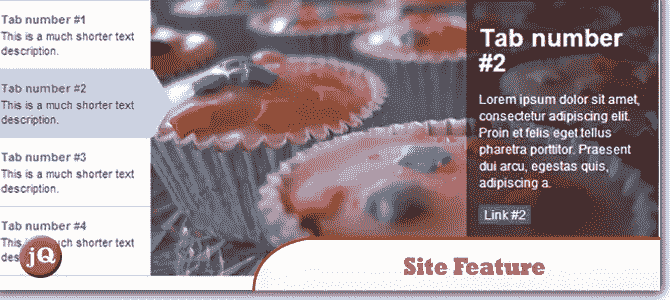](http://codecanyon.net/item/sitefeature/53896) 
[来源](http://codecanyon.net/item/sitefeature/53896) [演示](http://iwantaneff.in/repo/plugins/menu-nav/site.feature/index.html#)

## 82.SlabText 响应标题

一个 jQuery 插件，用于产生大的、粗体的和响应性的标题。

[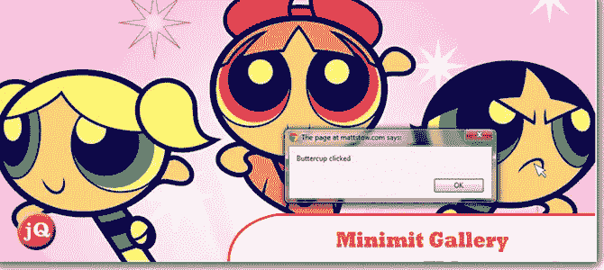](http://www.frequency-decoder.com/demo/slabText/) 
[源+演示](http://www.frequency-decoder.com/demo/slabText/)

## 83.打字机

这个 jQuery 插件帮助你在你的文章上做“打字机”效果。

[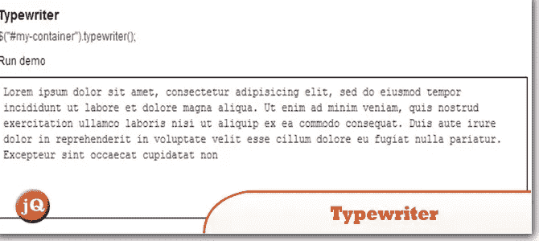](http://onehackoranother.com/projects/jquery/jquery-grab-bag/text-effects.html) 
[源+演示](http://onehackoranother.com/projects/jquery/jquery-grab-bag/text-effects.html)

## 84.jBreadCrumb

它是 breadcrumbs 的 jquery 扩展，允许在 breadcrumbs 中使用长名称，并可以调整可见文本的数量，以确保当前/第一个节点可见。它还能够将鼠标悬停在截断的面包屑上，并显示它们的完整文本。

[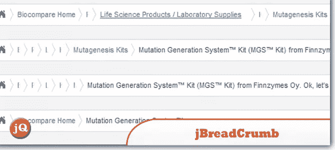](http://code.google.com/p/jbreadcrumb/) 
[来源](http://code.google.com/p/jbreadcrumb/) [演示](http://www.comparenetworks.com/developers/jqueryplugins/jbreadcrumb.html)

## 85.jQuery 倒计时插件

一个倒计时，有一个伟大的动画。

[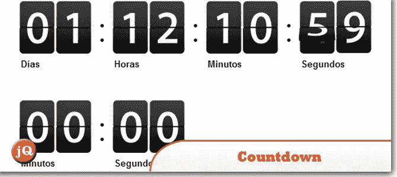](http://code.google.com/p/jquery-countdown/) 
[来源](http://code.google.com/p/jquery-countdown/) [演示](http://jquery-countdown.googlecode.com/svn/trunk/index.html)

## 86.jquery instagram

一个简单的 jQuery 插件，显示 Instagram 照片列表。

[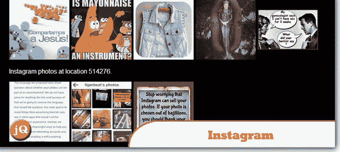](http://potomak.github.com/jquery-instagram/) 
[源+演示](http://potomak.github.com/jquery-instagram//)

## 87.jQuery Minimit 图库

Minimit Gallery 是你能找到的最定制的滑块插件。它已经过测试，支持 Css3 过渡和变换、拖动、滚动和触摸交互。

[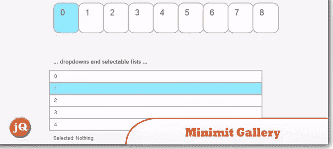](http://www.minimit.com/works/minimit-gallery-plugin) 
[来源](http://www.minimit.com/works/minimit-gallery-plugin) [演示](http://www.minimit.com/mg/demo.html)

## 88.jPushup–滑动内容栏

这是一个智能快捷的内容栏，您可以轻松地将其集成到任何网站或 web 应用程序中。它无缝集成在您的网站中，可以在任何需要的时候弹出。

[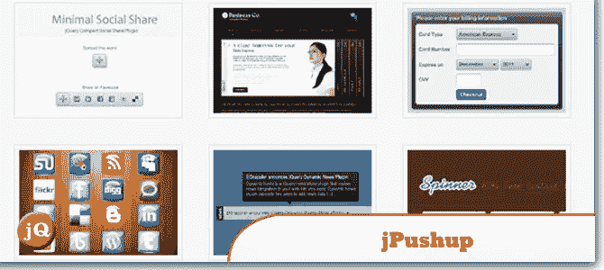](http://www.egrappler.com/jquery-pushup-content-bar/) 
[来源](http://www.egrappler.com/jquery-pushup-content-bar/) [演示](http://www.egrappler.com/pupslider/index.htm)

## 89.jqvMap

一个呈现矢量地图的 jQuery 插件。

[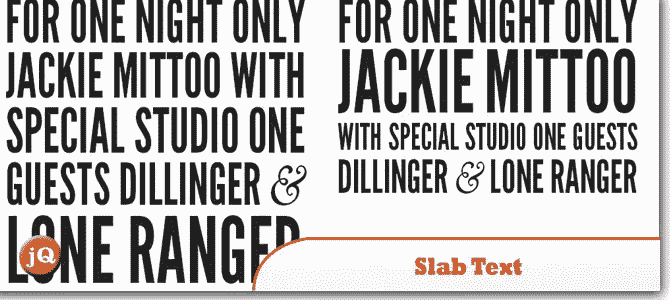](http://www.frequency-decoder.com/demo/slabText/) 
[源+演示](http://www.frequency-decoder.com/demo/slabText/)

## 90.scrolldeck.js

一个用于制作滚动演示平台的 jQuery 插件。

[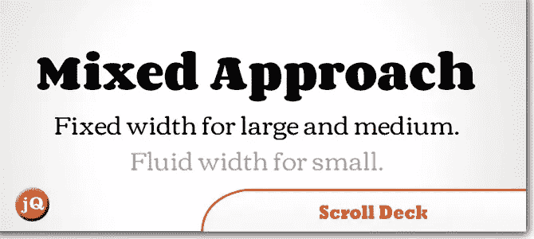](http://www.frequency-decoder.com/demo/slabText/) 
[源+演示](http://www.frequency-decoder.com/demo/slabText/)

## 91.桌布

一个 jQuery 插件，它可以帮助你轻松地设计 HTML 表格的样式以及一些简单的定制。

 
[源+演示](http://tableclothjs.com/)

## 92.tinycon–favicon change(更改图标)

一个操作图标的小程序库。

[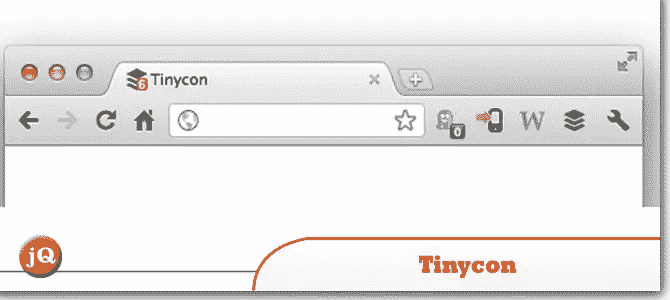](http://tommoor.github.com/tinycon/) 
[源+演示](http://tommoor.github.com/tinycon/)

## 93.响应图像地图

通过在 load 和 window.resize 中重新计算区域坐标以匹配实际图像大小，允许在响应设计中使用图像映射。

[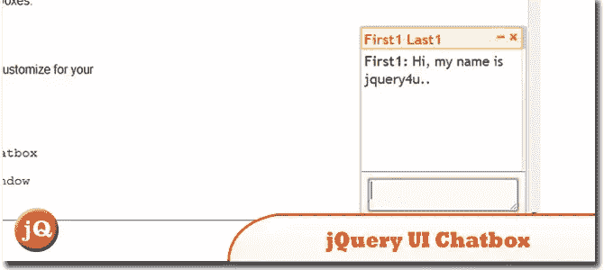](http://mattstow.com/experiment/responsive-image-maps/rwd-image-maps.html) 
[源+演示](http://mattstow.com/experiment/responsive-image-maps/rwd-image-maps.html)

## 94.我建立了一个社会插件

一个简单、强大而优雅的社交 jQuery 插件，用于显示你的社交链接。

[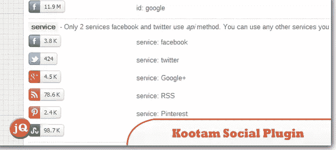](http://jobyj.in/koottam-jquery-plugin/index.html) 
[源](http://jobyj.in/koottam-jquery-plugin/index.html) [演示](http://jobyj.in/koottam-jquery-plugin/demo.html)

## 95.jQuery 灰度图像悬停

当悬停在图像上时，它会将灰度图像淡入彩色。

[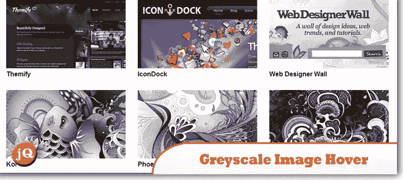](http://webdesignerwall.com/tutorials/html5-grayscale-image-hover) 
[来源](http://webdesignerwall.com/tutorials/html5-grayscale-image-hover) [演示](http://webdesignerwall.com/demo/html5-grayscale/)

## 96.管状的

一个 jQuery 插件，允许你设置一个 YouTube 视频作为你的页面背景。

[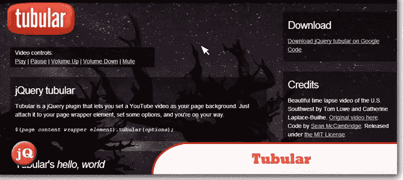](http://www.seanmccambridge.com/tubular/) 
[源+演示](http://www.seanmccambridge.com/tubular/)

## 97.jQuery ICE–跟踪更改

Ice 是一个用 javascript 构建的跟踪修改实现，适用于任何可在网上编辑的内容。

[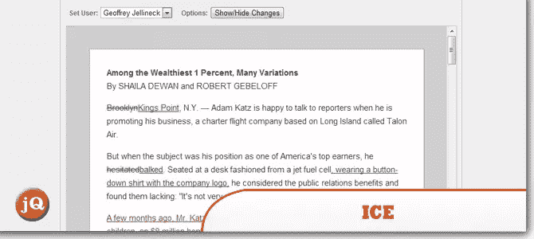](http://nytimes.github.com/ice/demo/) 
[源+演示](http://nytimes.github.com/ice/demo/)

## 98.很久以前

一个 jQuery 插件，使得支持自动更新模糊时间戳变得容易。

[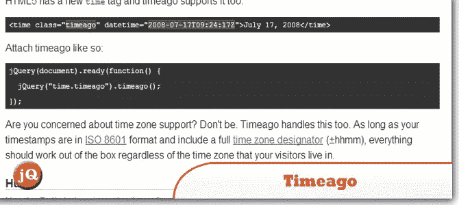](http://timeago.yarp.com/) 
[源+演示](http://timeago.yarp.com/)

## 99.jQuery 地理

jQuery Geo 是一个开源的地理空间制图 jQuery 插件，由 Applied Geographics 开发，旨在使空间 web 制图比最初看起来简单得多。

 
[来源](http://jquerygeo.com/test/) [演示 1](http://jquerygeo.com/test/examples/events.html) [演示 2](http://twheat.jquerygeo.com/?q=jquery&l=&center=153.02350199999995,-27.470932999999995&zoom=10)

## 100.MetroJs

为 jQuery 开发的 JavaScript 插件，可以轻松地在 web 上启用 Metro 接口。此版本主要关注实时磁贴、应用程序栏和主题。>

[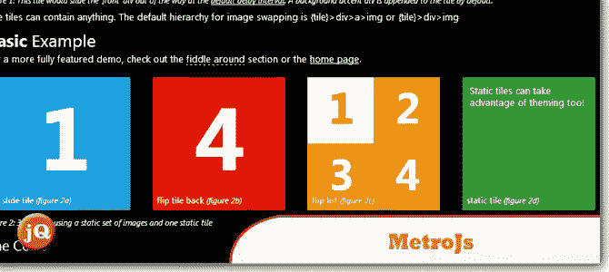](http://www.drewgreenwell.com/projects/metrojs) 
[来源](http://www.drewgreenwell.com/projects/metrojs) [演示](http://www.drewgreenwell.com/projects/metrojs#fiddleAround)

菲尼托！！！

## 分享这篇文章