# 印刷术 101

> 原文：<https://www.sitepoint.com/typography-101/>

设计是关于视觉传达和有效传递精心制作的信息。信息是通过图像、颜色、文字和排版的组合来传递的。理解排版将有助于你使你的信息强大、引人注目、有说服力。重要的是[为合适的场合选择合适的字体](https://www.sitepoint.com/7-fonts-with-very-specialized-purposes/ "7 Fonts With Very Specialized Purposes")，并确保它能强化你的设计和信息。为了选择正确的字体，你必须了解字体的基本原理，字体之间的差异，以及为什么在某些情况下应该和不应该使用不同的字体。

### 解剖

要理解字体，最好先理解组成字体的各个部分。在每一个部件和片段中发现的差异就是字体之间的区别。

[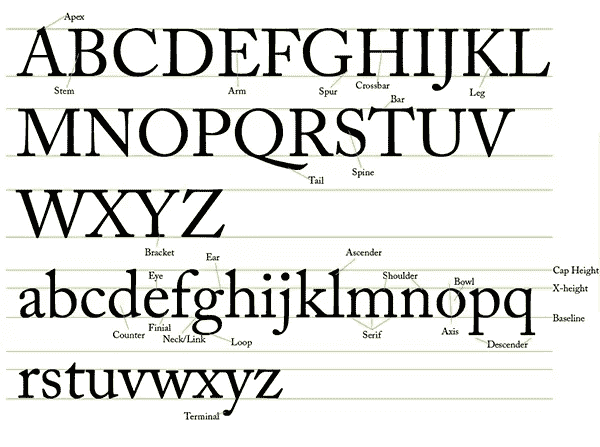](https://www.sitepoint.com/wp-content/uploads/2013/01/anatomy.jpg)

### 模式解剖学的定义

*   顶点——字母 A、M 和 N 的一部分，两个笔划相交形成一个顶点。
*   词干——任何字母中的竖线，如 H、B、d、B、F 或任何其他包含竖线的字母中的竖线。
*   臂——一端连接词干，另一端不连接的横线，如字母 E、F 和 t。
*   骨刺——一些大写字母 G 的突出部分，类似于人脸上的下巴。
*   横木——两个词干之间的细条，如字母 A 和 h 中的横木。
*   腿-向下的对角线茎，如字母 K 和 r 中的茎。
*   任何字母中的竖线，如 D，B，B，D，H，F 等。
*   tail–在字母 q 上发现的下行字母。
*   脊柱-连接字母 s 上的圆形部分的中间对角线。
*   括号–字母在词干和衬线之间的弯曲部分。如果字母中没有括号，但仍然有衬线，那么你通常看到的是一个平板衬线字体。
*   眼睛–小写 e 的封闭部分。
*   耳朵——一种装饰性的花饰，通常在小写字母 g 的碗的右上方。
*   ascender——小写字母中高于 x 高度的部分，如 b、d、h 等。
*   肩部——字母的圆形部分，如 r、m 或 n。这个名字来源于它类似于人的肩膀。
*   碗——字母的弯曲部分，包围着字母的圆形部分，如 B，P，g，D 等。
*   柜台——封闭或部分封闭的圆形或弧形的空白区域，例如 o 和 d。
*   末端——一个字母笔画末端的锥形部分，如字母 c 或 e。
*   颈/环–连接小写字母 g 的上下碗的细线。
*   loop–小写 g 的圆形部分。
*   衬线–字母笔画上的方形或矩形末端，包括茎、腿、臂等。
*   轴–将一个字母从中间一分为二的线称为轴。
*   下行字母——字母中延伸到基线以下的部分，见于 y，p 或 q。
*   结尾——字母中不以衬线结尾的任何笔画的结尾。
*   大写高度–从字体基线到大写字母顶部的高度。
*   x-Height–字母小写部分的高度，通常由小写 x 的高度定义。
*   基线–任何字母所在的线。词干低于这一点的任何字母都称为下行字母。

### 分类

字体是根据它们不同的风格和特征来分类的。这些功能由一组基于结构和风格差异的规则决定。

#### 衬线

[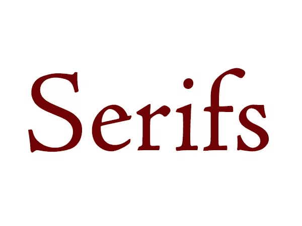](https://www.sitepoint.com/wp-content/uploads/2013/01/serif.jpg)

衬线字体已经使用了几十年。它们的负空间使它们在小尺寸下容易阅读。这就是为什么他们一直喜欢在书中的正文。衬线字体在大尺寸时看起来也很棒，尽管一些专业的衬线字体有一个针对大字号优化的显示版本。衬线字体的好例子有:巴斯克维尔，迪多特，卡斯龙，鸽子，八分衬线，萨邦，本博，博多尼，克拉伦登，Garamond，佐治亚，Goudy 和 Meta 衬线。

#### 无衬线字体

[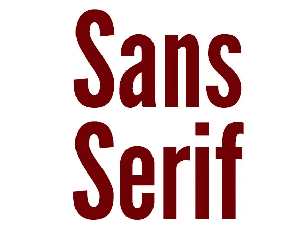](https://www.sitepoint.com/wp-content/uploads/2013/01/sans-serif.jpg)

Sans serif 字面意思是“没有衬线”，它们也用于正文复制和显示目的。有些字体，如 Futura，更适合用于正文，因为它们可以平衡正负空间，便于阅读。其他无衬线字体，如联盟哥特式，用于显示目的。对于大量的文本，你不会使用联体哥特式字体。无衬线字体的好例子有 Futura、Arial、Helvetica、League Gothic、Gill Sans、Optima、Franklin Gothic、Frutiger、Bebas、Franchise、Akzidenz Grotesk、Univers、Meta 和 DIN。还有许多其他可用的，但这些是一个良好的开端。

#### 平板衬线

[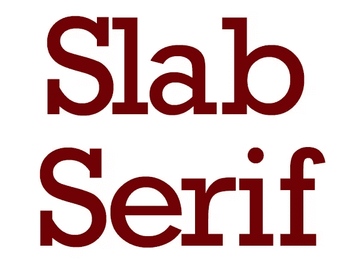](https://www.sitepoint.com/wp-content/uploads/2013/01/slab-serif.jpg)

平板衬线字体因其刚性衬线而具有独特的外观。平板衬线不包含括号，使它们的衬线看起来像块状，但这给了字体一个坚实的外观。平板衬线使字体看起来非常稳定，这使得平板衬线字体适合传统的身份。这种字体给人以稳定的印象。平板衬线字体的好例子有:Rockwell，Museo，Chunk 和 Nilland。

#### 哥特族的

[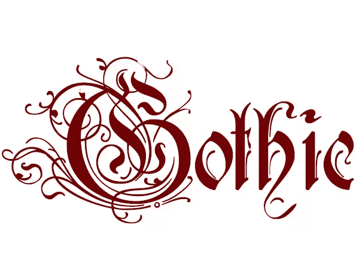](https://www.sitepoint.com/wp-content/uploads/2013/01/gothic.jpg)

哥特式是用来装饰的，它真的表现出来了。装饰性的华丽和摇摆展示了一种古老的工艺。这意味着模仿旧的字体风格。这些字体应该尽量少用，因为它们很难大量阅读。例如 Lucida Blackletter、Deutsch Gothic、Perry Gothic、Rothenburg Decorative 和 Urdeutsch。

#### 脚本

[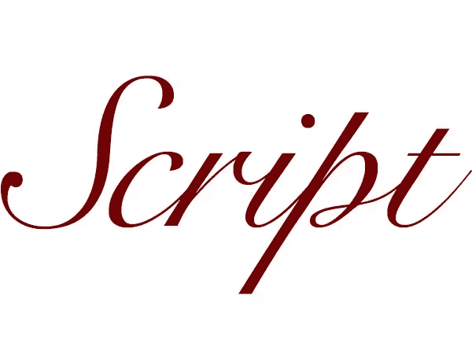](https://www.sitepoint.com/wp-content/uploads/2013/01/script.jpg)

脚本字体应该是优雅和装饰性的。它们的出现不可否认地表明了重要性和正式性。这些字体非常适合用于请柬、贺卡、周年纪念、毕业典礼和浪漫场合。这些字体的基调是严肃的。好的例子有 Scriptina、Pro、Snell Roundhand 和 Edwardian Script。

#### 刷

[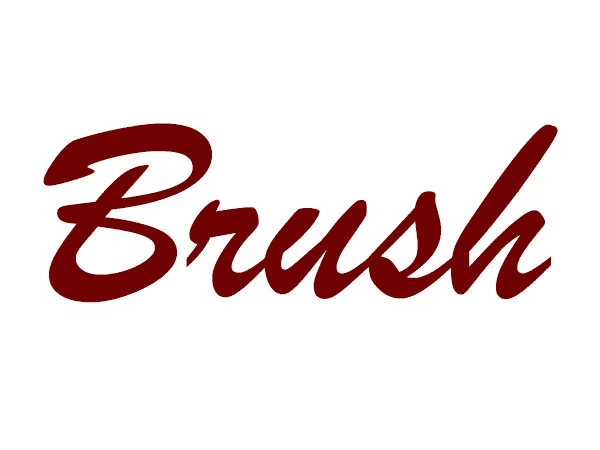](https://www.sitepoint.com/wp-content/uploads/2013/01/brush.jpg)

笔刷字体旨在模拟自定义手写字体。它们有粗细不同的笔画，非常圆润流畅。这些字体看起来好像是艺术家用刷子刷出来的。一些例子是笔刷脚本 MT、棒球场、Artbrush、Bello、Reklame 脚本和 Lobster。

#### 书法

[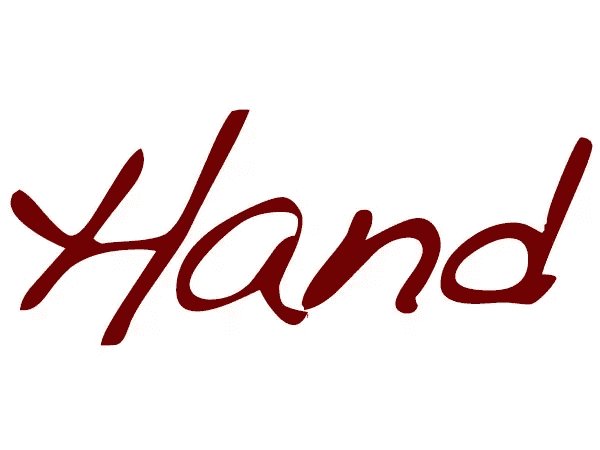](https://www.sitepoint.com/wp-content/uploads/2013/01/handwriting.jpg)

手写字体旨在模拟自然笔迹。这给了设计更多的个人风格，使设计看起来更友好。你会在需要情感联系的有机或个人产品上发现这样的字体。好的例子有 Journal、handshaw-Dakota、Grimshaw Hand、notewable 和 Windsong。

### 绳索

连字是两个字母在视觉上组合在一起，以优化阅读和查看。笔画是组合在一起的，比如两个分开的字母的横杠，或者一个“t”的横杠和一个“I”的词干。这方面的例子有 ff、fi、ffi、fl、fh、tt、ti 等。你可以看到下面的例子。

[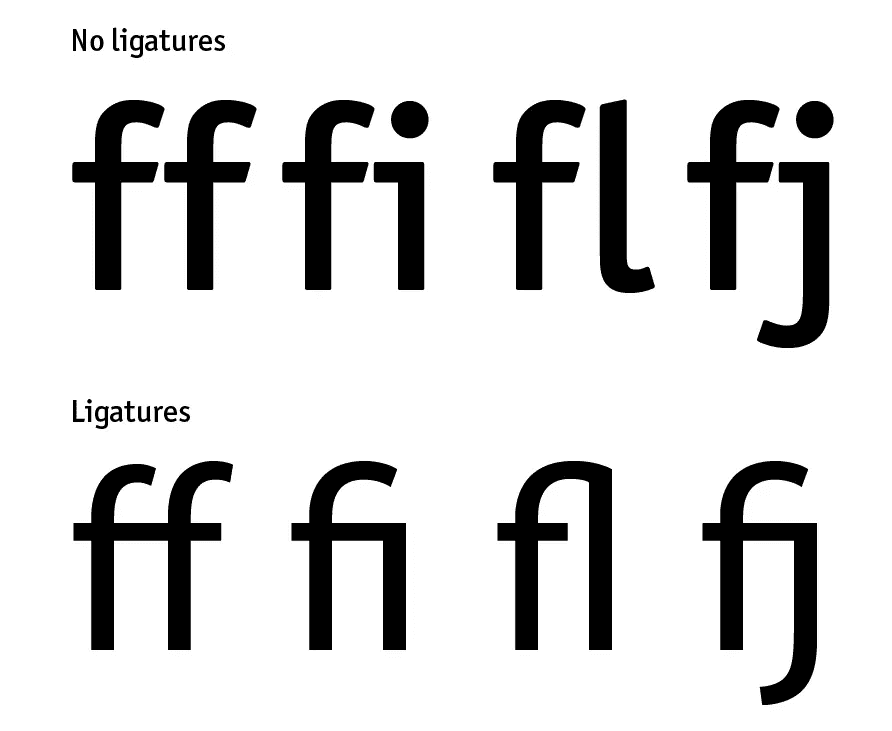](https://www.sitepoint.com/wp-content/uploads/2013/01/Screen-shot-2013-01-10-at-9.06.33-AM.png)

### 字距调整和跟踪

字距是两个字母之间的间距，字距是一组字母之间的间距。很多时候，两个字母之间的间距需要优化，例如一个“o”和一个“v”相邻，或者一个大写的“T”与大多数小写字母相邻。这适用于许多不同的字母组合，取决于字体。下面的例子显示了一些字母的字距可以调整得更紧一些，这样单词会更连贯。

[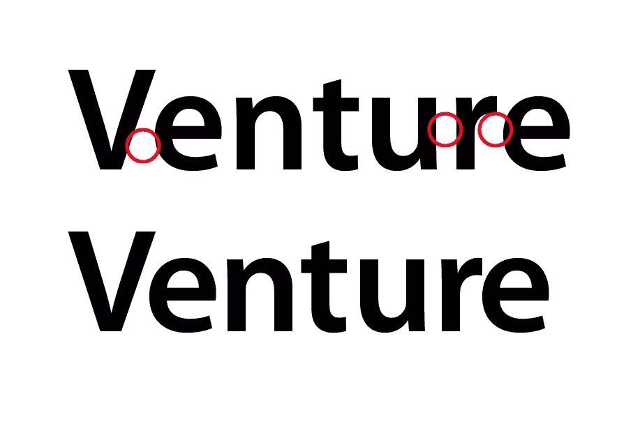](https://www.sitepoint.com/wp-content/uploads/2013/01/Screen-shot-2013-01-10-at-9.11.59-AM.png)

下面，您可以看到堆叠类型在第一个示例中工作得不好。跟踪是正常的，但“摄影”这个词太大了，字母之间没有足够的对比度和大小差异。在下面的例子中，单词的字体大小减小了，跟踪显著增加了，产生了更具冲击力的优雅效果，同时减少了两个单词之间不和谐的视觉竞争。

[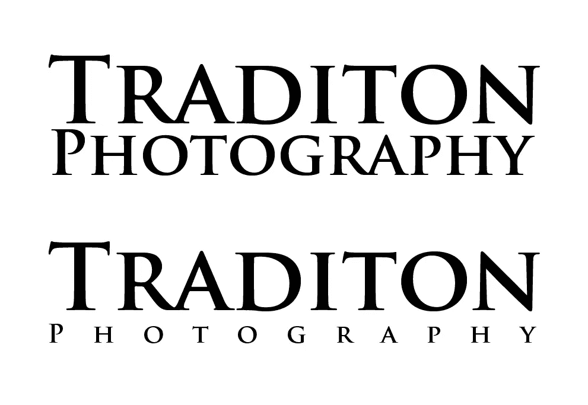](https://www.sitepoint.com/wp-content/uploads/2013/01/Screen-shot-2013-01-10-at-9.19.21-AM.png)

### 主要的

行距是每行文本之间的间距。找到文本行之间的最佳间距将使大量文本更容易阅读。当你阅读大量文本时，如果文本行之间靠得太近，你经常会错误地重读文本行。这让你读起来不愉快，而且会非常沮丧。打开大量文本的前导将使其更容易阅读，同时使其整体外观更优雅。正如你在下面看到的，2pt 的行距对可读性有很大的影响。想象一下眯着眼睛阅读一整本书。你的眼睛会疲劳，你可能会因为不得不集中精力不失去自己的位置而头疼。

[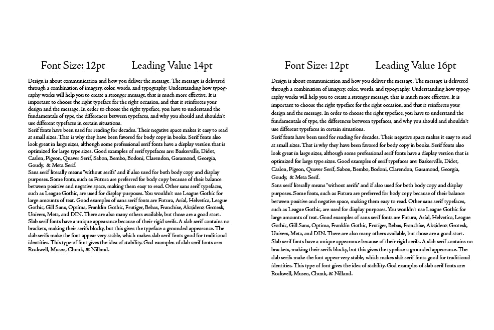](https://www.sitepoint.com/wp-content/uploads/2013/01/Screen-shot-2013-01-10-at-9.33.06-AM.png)

### 结论

对于任何设计师来说，排版都是一项基本技能。我们的整个职业生涯都依赖于能够发出有效的信息，并得到有力、积极的回应。如果有人看不懂这个信息，那么整个设计就失败了。遵循这些原则将确保你理解类型和如何避免重大错误，如没有足够的领导，或没有适当的字距。在大量的文本中，你可能不会对每个单词都进行字距调整，但是在大标题中，字距调整是必不可少的。如果你遵循这篇文章的指导方针，你的设计将会很容易阅读并且令人愉快。

(如果你喜欢这篇文章，你会爱上[色彩理论 101](https://www.sitepoint.com/color-theory-101-2/ "Color Theory 101") 。)

你对排版有什么体验？你对打字有什么建议吗？在下面的评论区分享你的想法。

## 分享这篇文章