# 在 Illustrator 中创建彩色折扣徽章

> 原文：<https://www.sitepoint.com/create-a-colorful-discount-badge-in-illustrator/>

徽章在营销业务中有着独特的地位。由于其引人注目的品质，它们瞬间抓住了观众的注意力。网络上并不缺乏股票徽章资源，但最好还是创建自己的徽章，并根据自己的具体需求进行定制。今天，我们将在 Illustrator 中创建一个引人注目的折扣徽章。

在本教程中，我将带你从头开始设计一个彩色折扣徽章的整个过程。在此过程中，您将学习 Illustrator 中各种工具的使用，如形状工具、钢笔工具等。您还将学习如何将文本弯曲成圆形等等。所以，让我们开始吧！

**资源:**

[雄激素字体](http://www.dafont.com/androgyne-tb.font "Androgyne font")

**最终结果:([要下载完整的分层文件，请单击此处。](https://www.sitepoint.com/wp-content/uploads/2012/12/Discount-Badge.zip "Discount Badge") )**

### 第一步

在 Illustrator 中创建新文档，宽度为 600 像素，高度为 400 像素。选择 RBG 作为您的颜色模式。

[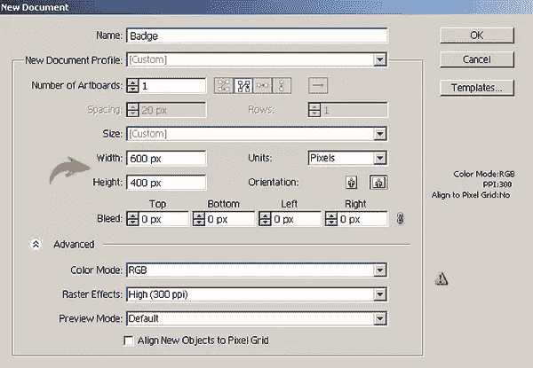](https://www.sitepoint.com/wp-content/uploads/2012/12/114.jpg)

### 第二步

选择颜色#0ABC99 作为填充，使用颜色#6D6E71 作为描边。在顶部属性栏中选择 0.5 磅的描边粗细。现在，用椭圆工具画一个椭圆。在绘制形状时按住 Shift 键可以得到一个正圆。将此形状标记为“底部”

[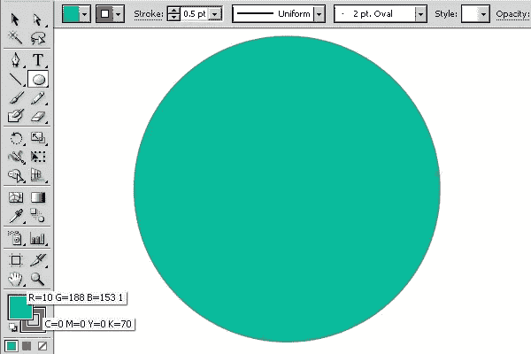](https://www.sitepoint.com/wp-content/uploads/2012/12/23.jpg)

### 第三步

选择椭圆图层，点击图层面板右上角的选项面板，选择“复制图层”选择复制层现在点击该层右侧的环形目标。将描边设置为“无”，并应用“虚线”图案作为填充。前往“窗口”>“样本”，打开样本窗口现在，从样本窗口的左下角打开样本库菜单，选择“图案”>“基本图形”>“基本图形纹理”从这些纹理中挑选“虚线”图案。

通过按下环形目标选择纹理层。改变这一层的混合模式为“叠加”，并减少其不透明度为 30%。

**[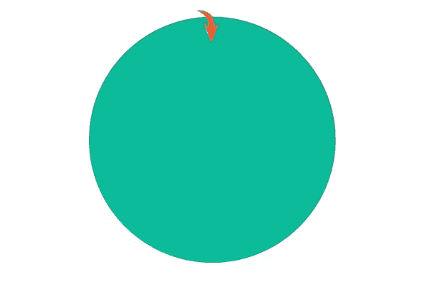](https://www.sitepoint.com/wp-content/uploads/2012/12/3b2.jpg)**

### 第四步

我想在底部增加一些厚度。要做到这一点，复制基础层，改变其填充颜色为#065B4B，把它放在原来的基础层下面，并向下拖动一点，以创建一个微妙的阴影。

[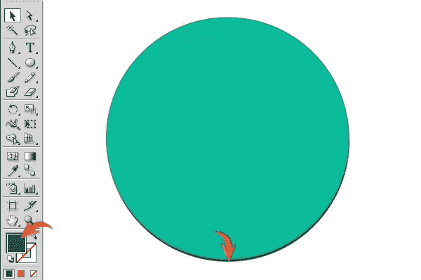](https://www.sitepoint.com/wp-content/uploads/2012/12/42.jpg)

### 第五步

接下来，我们将装饰徽章的中心。创建一个新层，选择#231F20 作为你的填充颜色，并选择星形工具。现在，左键单击文档，使用给定的设置绘制如下所示的形状。

[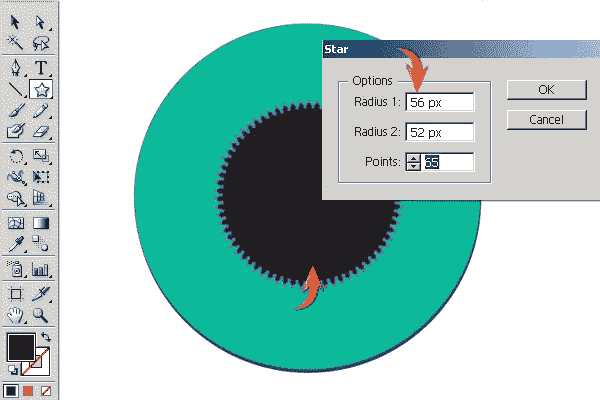](https://www.sitepoint.com/wp-content/uploads/2012/12/52.jpg)

复制这个新的形状，改变它的颜色为#BCB3AC，把它放在原来的图层下面后稍微向下拖。

[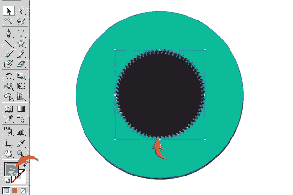](https://www.sitepoint.com/wp-content/uploads/2012/12/5b.jpg)

### 第六步

在顶部创建一个新层。将填充颜色设置为“无”，并将#BCAC9B 的描边设置为 1 磅。现在，使用下面的星形工具设置绘制如下所示的形状。

[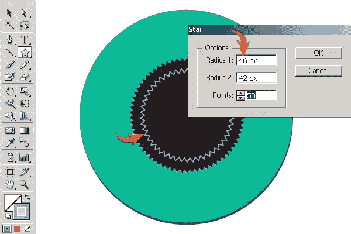](https://www.sitepoint.com/wp-content/uploads/2012/12/62.jpg)

### 第七步

选择这个新的图层，进入“效果”>“扭曲和变形”>“折叠和膨胀”在此使用以下设置。

[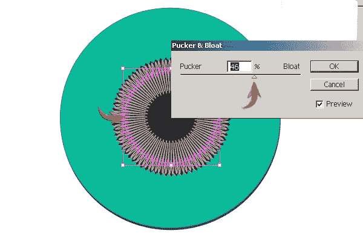](https://www.sitepoint.com/wp-content/uploads/2012/12/72.jpg)

使用选择工具(“V”)稍微缩小形状大小，并将其混合模式更改为“叠加”

### 第八步

接下来，我们要画一个圆形。创建一个新层，设置填充为无，并使用颜色#096654 设置一个中风。从顶部属性栏中选择 1 磅的描边粗细和如下所示的宽度轮廓。现在，选择椭圆工具，画一个圆，如下所示。

[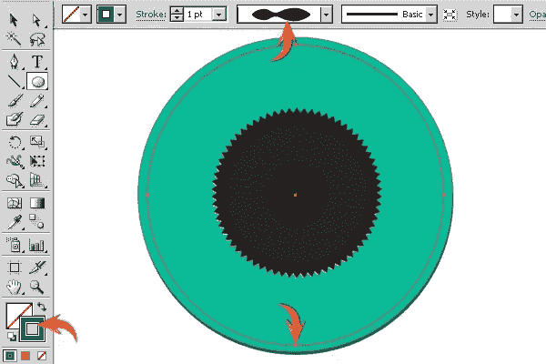](https://www.sitepoint.com/wp-content/uploads/2012/12/82.jpg)

用同样的方法再画一个小点的笔画。

### 第九步

接下来，我们将使用钢笔工具绘制丝带的前面。一旦你完成了，应用“类比 5”梯度给它。您可以在样本库菜单中找到它，方法是选择“渐变”>“颜色调和”

[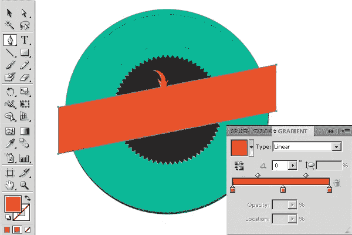](https://www.sitepoint.com/wp-content/uploads/2012/12/92.jpg)

### 第十步

现在，使用钢笔工具和#E8D8C4 作为你的填充颜色绘制下面的形状。

[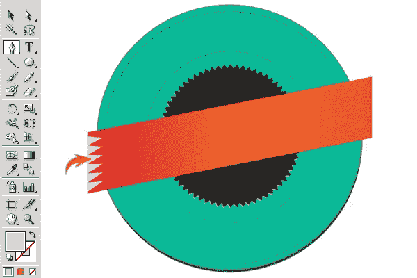](https://www.sitepoint.com/wp-content/uploads/2012/12/102.jpg)

复制这个图案层，然后进入“对象”>“变换”>“旋转”通过 180⁰旋转它，并将其定位在色带的右边缘。将图案层的不透明度降低到 30%。

[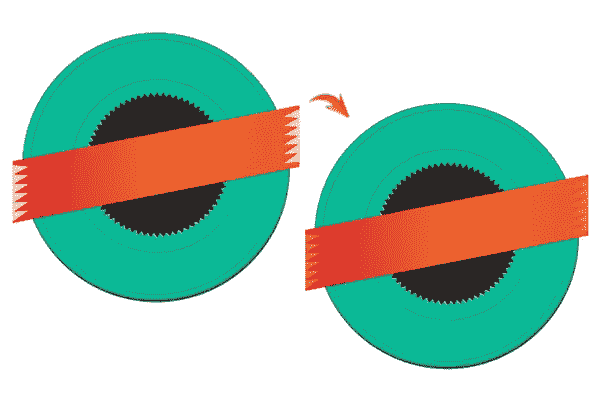](https://www.sitepoint.com/wp-content/uploads/2012/12/10b1.jpg)

### 步骤 11

现在，我们将制作丝带的背面。使用钢笔工具，以# 1E1E1E 1e 为填充颜色，在其余图层下方绘制以下三角形。复制并旋转形状 180⁰.

[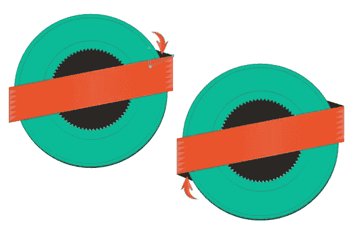](https://www.sitepoint.com/wp-content/uploads/2012/12/115.jpg)

### 步骤 12

使用钢笔工具绘制色带侧，并将其放置在其余层的下方。应用同样的“模拟 5”梯度，但改变其角度为 46⁰根据倾斜的带状侧形状。

[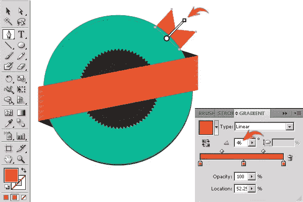](https://www.sitepoint.com/wp-content/uploads/2012/12/123.jpg)

复制这一层，并旋转它 180⁰.将其放在徽章的另一侧。

### 第十三步

现在，我将向您展示如何在 Illustrator 中以圆形键入文本。在一个新图层上画一个椭圆。现在，选择“键入路径工具”并点击圆形的顶部边缘。该圆将转换为一条路径。之后，键入所需的文本。我在这里使用“世纪教科书”字体，用#EF4F07 作为填充颜色。

[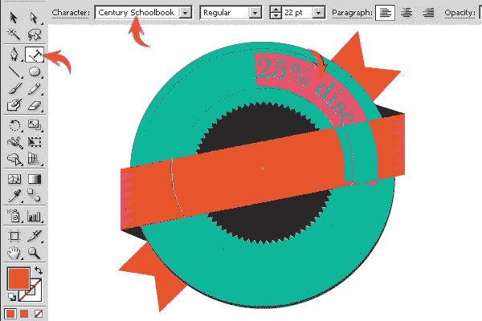](https://www.sitepoint.com/wp-content/uploads/2012/12/132.jpg)

要正确定位文本，请选择旋转工具(“R”)并将文本拖到合适的位置。

### 步骤 14

现在，选择文本层，进入“效果”>“风格化”>“内部发光”在此使用以下值。

[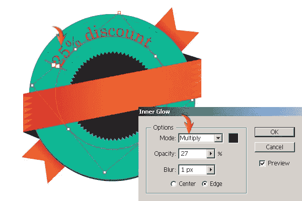](https://www.sitepoint.com/wp-content/uploads/2012/12/142.jpg)

### 第十五步

画几颗星星，按如下图排列。使用相同的颜色和内部发光设置的星星，我们用于文本。

### 第十六步

要在下拱门内添加文本，请选择前面的文本路径，按 Ctrl + "C "复制它，然后按 Ctrl + "F "将其粘贴到前面。现在，进入“文字”>“路径文字”>“路径文字选项”在此使用以下设置。

[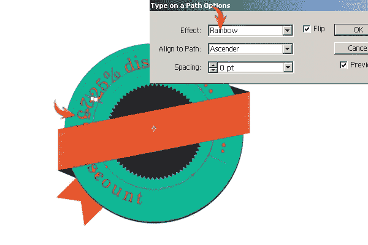](https://www.sitepoint.com/wp-content/uploads/2012/12/162.jpg)

替换此翻转文本层上的文本。我将使用和以前一样的字体。稍微减小字体的大小。现在，选择旋转工具(“R”)并简单地在下面显示的方向拖动这个文本。我也稍微向下拖动它，使它适合圆形笔画之间。

[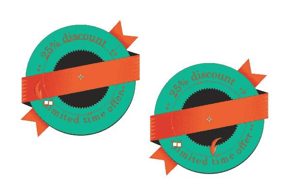](https://www.sitepoint.com/wp-content/uploads/2012/12/16b.jpg)

### 步骤 17

现在，将下拱形文本的填充颜色更改为#4F4F4F。

### 步骤 18

接下来，我们将在功能区上添加文本。选择文字工具并键入所需的文本。我使用#ECEDD9 作为填充颜色，使用“雌雄同体”作为字体。完成后，根据功能区的倾斜度，使用选择工具(“V”)旋转文本层。

### 步骤 19

复制文本层，并改变其填充颜色为#414042。将这一层放在原始层的下面，稍微向右下方拖动。

### 步骤 20

要为基础制作阴影，复制基础层，并将副本的颜色更改为纯黑色。将其放置在原始基础层的下方，并将其向下拖动。改变其混合模式为“乘”，减少其不透明度为 30%。

使用相同的技术为丝带制作阴影。

就是这样！我希望你在这个过程中学到了一些东西。请分享你的想法。

## 分享这篇文章