# 2012 年 100 大 jQuery 插件(第 3/5 部分)

> 原文：<https://www.sitepoint.com/top-100-jquery-plugins-2012-part-35/>

继[第一部分(#1-20)](http://www.jquery4u.com/plugins/top-100-jquery-plugins-2012-part-1/) 和[第二部分(#21-40)](http://www.jquery4u.com/plugins/top-100-jquery-plugins-2012-part-25/) 之后，这里是 2012 年编号为 41-60 的最佳 jQuery 插件。

## 41.偷色贼

这是一个从图像中获取主色或调色板的脚本。它使用 Javascript 和 canvas 标签来实现。

[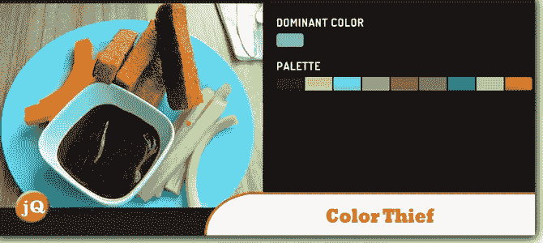](http://lokeshdhakar.com/projects/color-thief/) 
[源+演示](http://lokeshdhakar.com/projects/color-thief/)

## 42.Morris . js–jQuery 和 Raphael 图表

这是一个轻量级的库，使用 jQuery 和 Raphaë来简化简单图表的绘制。

[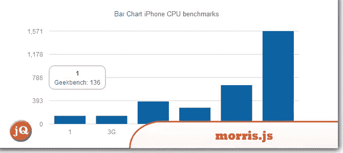](http://www.oesmith.co.uk/morris.js/) 
[源+演示](http://www.oesmith.co.uk/morris.js/)

## 43.Tweet to Map jQuery 插件

一个 jQuery 插件，让你能够创建谷歌地图，显示基于位置的推文。

[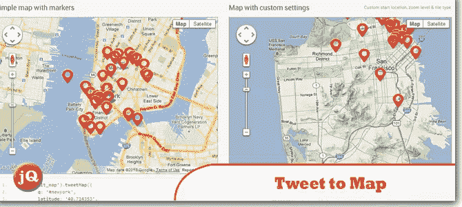](http://tweettomap.com/) 
[源+演示](http://tweettomap.com/)

## 44.模糊页面元素的模糊 jQuery 插件

一个 jQuery 插件，用于模糊页面元素，支持 IE (8 及以上)、Firefox、Safari 和 Chrome。

[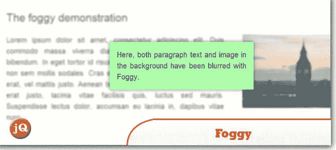](https://github.com/nbartlomiej/foggy) 
[来源](https://github.com/nbartlomiej/foggy) [演示](http://nbartlomiej.github.com/foggy/)

## 45.jQuery uLED 插件

马里乌斯·斯坦丘-塞尔吉乌开发的 jQuery 插件，可以用作倒计时、时钟或随机数。

[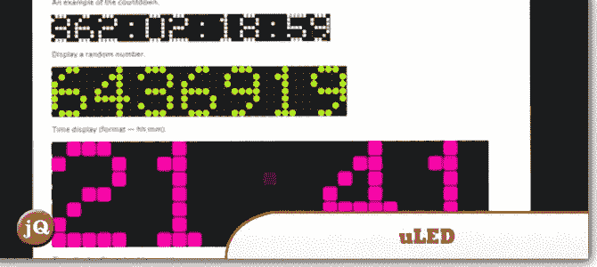](http://www.class.pm/files/jquery/uled/demo/) 
[源+演示](http://www.class.pm/files/jquery/uled/demo/)

## 46.jQuery Stick 'em:使内容在滚动时具有粘性

当你滚动到某一点时，它会使项目变得粘粘。

[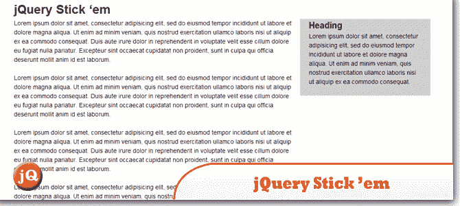](http://viget.com/inspire/jquery-stick-em) 
[来源](http://viget.com/inspire/jquery-stick-em) [演示](http://davist11.github.com/jQuery-Stickem/)

## 47.image Mapster–jQuery 地图高亮插件

一个 jQuery 插件，让你不用 Flash 就可以激活 HTML 图像地图。它几乎可以在 Javascript 的任何地方工作，包括现代浏览器、Internet Explorer 6 和移动设备，如 iPads、iPhones 和 Androids。

[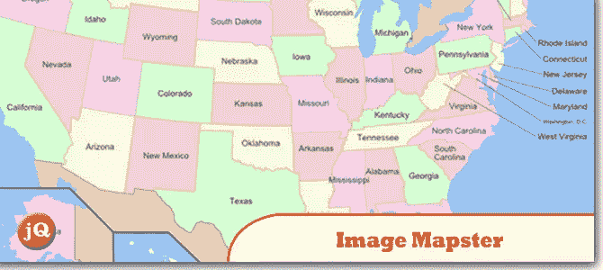](http://www.outsharked.com/imagemapster/) 
[源+演示](http://www.outsharked.com/imagemapster/)

## 48.jQuery PEP 桌面/移动拖动插件

这是一个轻量级的移动/桌面动态拖拽插件。

[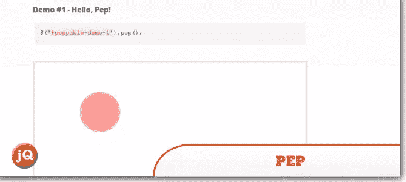](http://pep.briangonzalez.org/) 
[源+演示](http://pep.briangonzalez.org/)

## 49.WINDY:SWIFT 内容导航插件

这个 jQuery 插件可以用来快速导航内容项。这种效果会使物品像一副陷入小风暴的纸牌一样飞走。

 
[来源](http://tympanus.net/codrops/2012/10/09/windy-a-plugin-for-swift-content-navigation/) [演示](http://tympanus.net/Development/Windy/)

## 50.jQuery HiddenPosition 可以轻松定位任何元素

它将任何元素定位到任何元素，即使它们是隐藏的。

[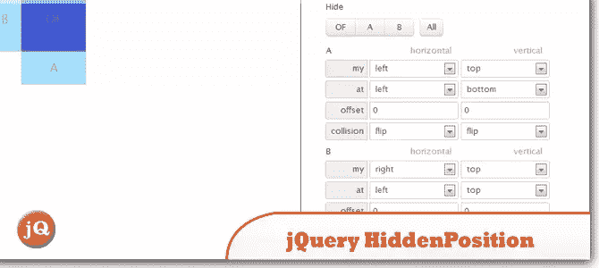](http://www.garralab.com/hiddenposition.php) 
[源+演示](http://www.garralab.com/hiddenposition.php)

## 51.页面滚动条平滑滚动变得简单

这个插件让您知道自己在页面上的位置，同时提供一个简单平滑的滚动导航。将你的网站组织成容易理解的部分。

 
[源+演示](http://pagescroller.com/)

## 52.sly——jQuery 插件，支持基于项目的单向滚动导航

一个用于单向滚动模拟的 jQuery 插件，具有基于项目的导航支持和许多其他好东西。您可以实现水平、垂直或无限滚动的单向滚动。

[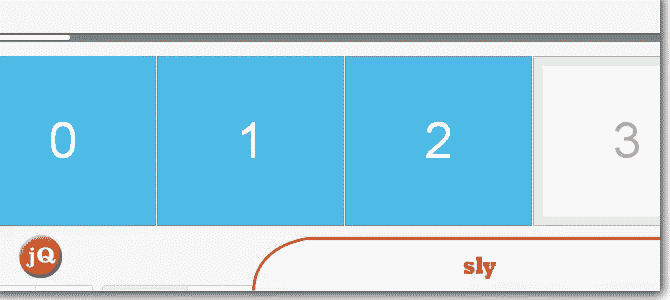](http://darsa.in/sly/) 
[来源](http://darsa.in/sly/) [演示](http://fineuploader.com/fine-uploader-with-jquery-wrapper-demo.html)

## 53.gMap 轻量级谷歌地图插件

一个轻量级的 jQuery 插件，可以帮助你将谷歌地图嵌入到你的网站中。只有 2 KB 的大小，它非常灵活，高度可定制。

[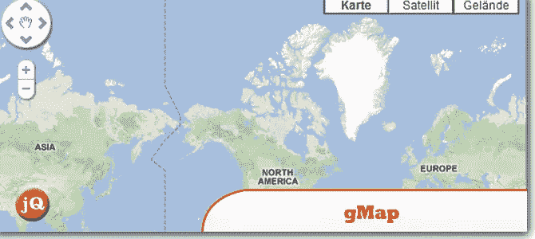](http://gmap.nurtext.de/) 
[源+演示](http://gmap.nurtext.de/)

## 54.jHERE——地图变得简单。

使用 jHERE，您可以轻松地将交互式地图添加到您的网站上。只有 4KB (1.95KB Gzipped)，你得到了一个强大的地图 API，高度可定制的标记，事件处理和信息气泡。

[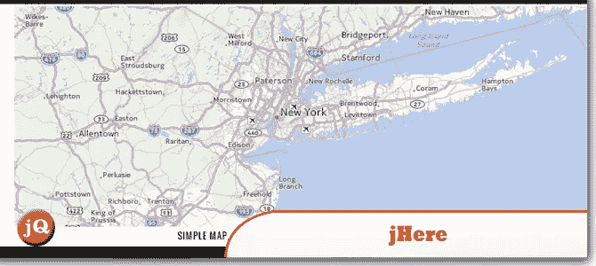](http://jhere.net/) 
[源+演示](http://jhere.net/)

## 55.jquery holobox 外挂程式

这个盒子适合你的设备的方向。

[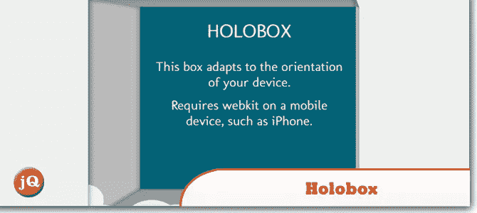](http://hakim.se/experiments/css/holobox/) 
[源+演示](http://hakim.se/experiments/css/holobox/)

## 56.精美的上传器——带有 jQuery 包装器

文件上传没有麻烦。

[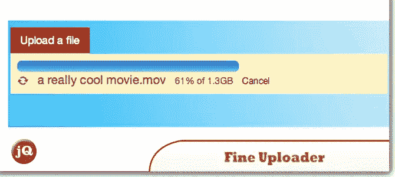](http://fineuploader.com/) 
[源+演示](http://fineuploader.com/)

## 57.ddSlick jQuery 下拉插件

ddSlick 是一个免费的轻量级 jQuery 插件，允许你创建一个带有图片和描述的自定义下拉菜单。

[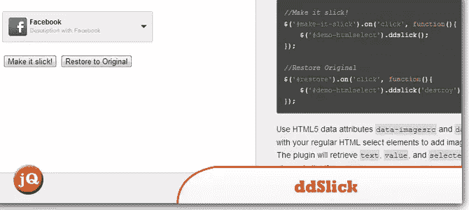](http://designwithpc.com/Plugins/ddSlick) 
[源+演示](http://designwithpc.com/Plugins/ddSlick)

## 58.jQuery 可检查的

这个插件取代了默认的复选框和单选按钮，以获得更好的外观。

[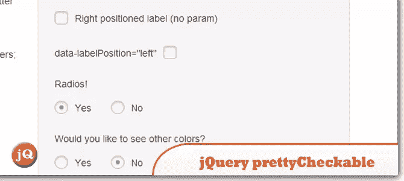](http://arthurgouveia.com/prettyCheckable/) 
[源+演示](http://arthurgouveia.com/prettyCheckable/)

## 59.迪纳摩画布——jQuery html 5 画布插件

一个 jQuery 插件，旨在尽可能简单地利用 HTML5 canvas 标签的所有特性。

[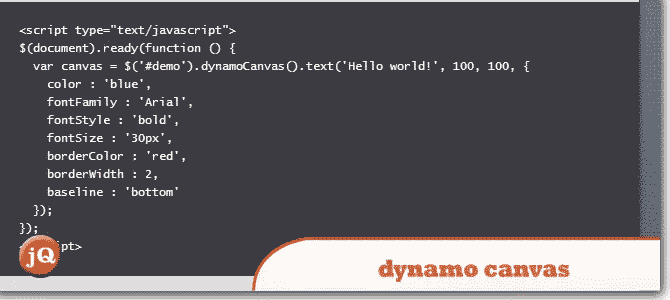](http://iwhitcomb.github.com/dynamocanvas/) 
[源+演示](http://iwhitcomb.github.com/dynamocanvas/)

## 60.filt rify–html 5/jQuery 过滤器插件

一个高级标签过滤插件。使用 filtrify，您可以在标签中搜索标签，并通过不同类别的多个标签过滤项目，并获得包含相关标签的项目数量的实时反馈。

[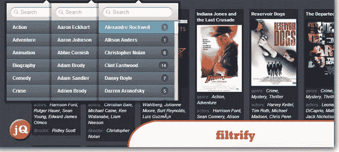](http://luis-almeida.github.com/filtrify/) 
[来源](http://luis-almeida.github.com/filtrify/) [演示](http://luis-almeida.github.com/filtrify/movies.html)

## 分享这篇文章