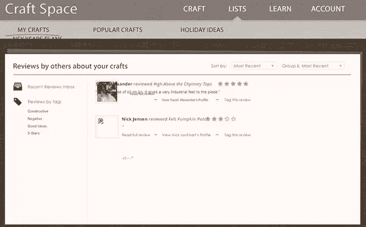

# 破碎 CSS 的例子通缉！

> 原文：<https://www.sitepoint.com/examples-of-broken-css-wanted/>

我们知道，在 2013 年的美丽新世界中，有许多精彩的 CSS 在网络上实现，提供高质量的访问者体验，并经常推动人们认为不借助 Flash 就可以在网页上完成的事情的界限。

最近可能没有比我们自己的 SitePoint 圣诞特卖更好的例子了。如果你已经忘记了那种感觉(已经？)，你可以在这里再次查看[，并阅读](https://xmas.sitepoint.com/story/css#day/1)[关于亚历克斯·沃克如何将它组合在一起的故事](https://www.sitepoint.com/css-animation-telling-the-sitepoint-christmas-story/)。

可悲的是，我们也知道有很多不太好的 CSS，提供有裂缝的，破碎的和糟糕的网页体验，让人们远离某些网站，有时甚至是网页本身。

如果我们能找到所有坏了的 CSS，然后…修复它，那该有多好？

作为重视网络的人，我们都知道，当对用户来说，事情看起来很糟糕的时候，情况就最糟糕了。这里有一个例子。

呀！破碎的图像，重叠的文本，页面元素互相流入:真是一团糟。

使用下面的评论，我们要求您向我们指出看起来有问题的网站，要么是因为桌面、平板电脑或智能手机屏幕上的 CSS 或 JavaScript 问题。

这个练习我们确实有一个目标，但是当我们收集了足够的材料来开个好头时，我们会让你知道我们的计划。

所以，继续吧，给我们一些你知道的坏掉的网站的链接，在 2013 年及以后成为一个更好的网站的一部分。

## 分享这篇文章