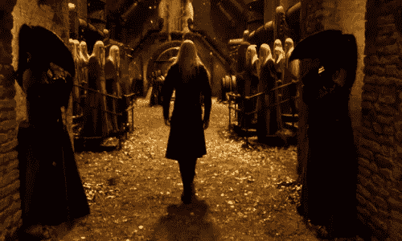
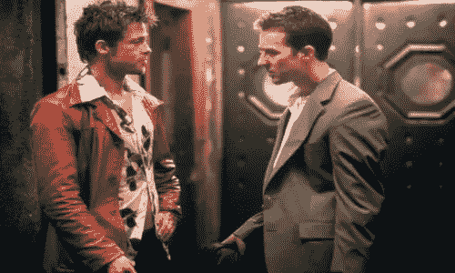
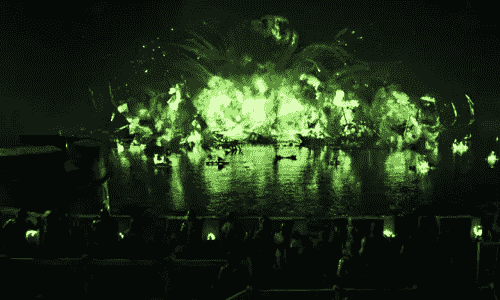
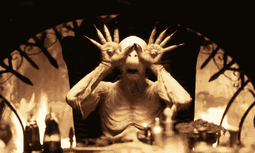
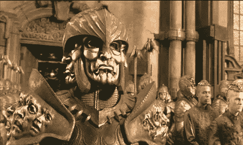

# 设计师可以从电影中学到的 5 件事

> 原文：<https://www.sitepoint.com/5-things-designers-can-learn-from-films/>

灵感有许多不同的形状和大小，从这种灵感中可以得到各种各样的教训，既简单又复杂。重要的是，不仅要从错误和其他人的设计工作中学习，还要从灵感来源中获取线索，如果让我们自己去做，我们可能不会考虑这些线索。

我是一名电影制作人和动画师，事实上，我今年五月刚刚毕业，获得了电影学位。这些年来，我看了各种各样的电影，发现一些新的东西可以应用到我的艺术和摄影中。一位教授告诉我们，在他的课程结束后，我们不能再以同样的方式看电影了。老实说，我现在看一部电影都不能不分解场景，并试图从中吸取一些东西应用到我的设计工作中。

电影制作是一种设计形式，我不仅仅指服装和布景设计师。从剧本的不断修改到演员的考虑，一直到后期制作，电影制作人和那些在这个过程中提供帮助的人都在不断地设计。电影中的设计过程需要改变和反复，可以作为图形设计师和网页开发人员的设计线索。

在这篇文章中，我不会进入任何电影术语或任何技术，但我想分享五件事，作为一个设计师，你可以坐下来，积极分析电影中的某些场景。

### 保持平衡

不管你的设计领域是什么，普遍的共识是平衡是必不可少的。在电影中，平衡是通过许多不同的方式来实现的，包括人物数量(有多少个对手和主角)，场景的设置(元素的安排)，场景中使用的光量，等等。看看下面由吉尔莫·德尔·托罗导演的《地狱男爵 2:黄金军团》(2008)中的静态图像。

这不仅仅是一个值得欣赏的美丽场景。这部电影中的这个特殊图像强调了几个平衡元素，这些元素构成了一个完美的镜头。这个场景是平衡的缩影，从守卫和旁观者的位置一直到建筑(你会注意到它是对称的)。

如果你看过这部电影，你会理解王子的位置(舞台中央)和这个场景的拍摄方式的讽刺。在接下来的场景中，他的行为将导致一个转变，有效地破坏他父亲(坐在王位上)努力获得的平衡。尽管在这张照片中，他的服装与其他人有很大的不同，但在色彩的帮助下，仍然达到了平衡。主色调为红色、黑色，而金色般的泥土色调贯穿始终。

这种特殊的场景如何转化到你的设计作品中？如果你正在创作一幅肖像(比如说一张海报)，考虑通过层次来平衡你的元素，如果你正在创作一幅风景(比如一个网站)，考虑在你主要焦点的两侧平衡你的元素，就像忠诚者和卫兵在王子和国王的两侧一样。

 **### 颜色

现在我们都应该知道，颜色可以成就或毁掉你的设计。颜色的真正目的是产生和激发情感的转变，以获得想要的反应。自从电影业开始使用颜色心理学以来，这种心理学已经得到了有效的应用。

大多数时候，你会在电影中看到颜色被用来吸引注意力，甚至提供真实的情节信息。想想我们有多经常能够区分主角和对手，以及这种区分与多少颜色有关。应该特别注意颜色，因为颜色总是有原因地被故意选择。让我们来看看这张来自大卫·芬奇《搏击俱乐部》(1999)的静态图片。

搏击俱乐部的第一条规则是:你不要谈论搏击俱乐部。当然，我们不应该谈论搏击俱乐部，但这并不意味着我们不能谈论泰勒·德顿，特别是泰勒·德顿和红色。我承认我没有马上意识到这一点，但只有一个场景，如果你不计算泰勒赤膊上阵的次数，泰勒·德顿没有穿红色或有红色的东西。即使当他赤膊上阵时，他身上也有红色的血。而且，他经常穿着浴袍，戴着玫瑰色眼镜，趾高气扬地走来走去。

为什么这些都很重要？好吧，让我们想想在电影《搏击俱乐部》中，德顿先生代表了什么，红色意味着什么。泰勒可以代表几个东西，但这不是电影分析，所以我们将决定说他代表“每个人”，杰克想成为的那个人。现在红色意味着几件事，包括暴力、危险、战争和革命。泰勒穿着他的红色皮夹克，简直就是一面行走的红旗；他是一个挑衅者，一个革命者，我们不要忘记暴力。当你真正回过头来注意到像颜色这样看似不重要的事情时，你会意识到像泰勒对红色的嗜好这样的事情是经过深思熟虑的。

从搏击俱乐部得到启示，考虑每种选择的颜色意味着什么。不要仅仅把颜色看做是对你设计的一个很好的对比或赞美；看看你把颜色放在哪里，这意味着什么..颜色在不同的文化中有不同的翻译，所以你需要研究这些差异，特别是如果你要为一个不熟悉的文化做印刷媒体。

### 对比

电影中的对比是分离和区分电影元素的有效方法。我知道这不是电影，但 HBO 的《权力的游戏》也可能是。《黑水》第二季第九集，反差极大。让我们仔细看看。

上图中，一整支舰队几乎被一艘装载爆炸性“野火”的非法无人飞船摧毁。对于这幅你还没亲眼见过的图像，我没什么可说的。前景中有一群旁观者，与他们之前的混乱相比，他们几乎看不见，看着几艘船被一团绿色的烟雾和火焰吞噬。

最终的结果是绝对美丽的绿色照亮了天空和水的巨大黑色背景。对比色不仅让我们看起来很漂亮，还能吸引我们的注意力。这就是对比工作的美妙之处；你应该注意这张照片中对比元素的大小。“野火”相当大，展示了它的强大和灾难性，但它也大到能抓住你的注意力。此外，请注意，它没有占据整个屏幕，它留下了足够的夜空和水，以便您可以看到对比。

对比色和对比色元素应该用来引导或吸引观众的注意力。想想你的 logo 设计，效果如何。如果它看起来不像你想要的那样有效，你可能要考虑重新设计它，并使用对比色使它更加突出。在印刷和数字媒体中，最好使用对比鲜明的背景，尤其是当您的项目包含大量文本时。前景和背景之间的对比或差异越大，元素就越容易被识别。

### 焦点

在电影中，我们被告知，作为电影制作人，我们的工作是引导或引导观众的目光，我们通过使用特定的镜头移动和角度来防止观众看到我们不想让他们看到的东西。不幸的是，除非你的网站有一些惊人的高科技功能，就像一个摄像头，否则你无法阻止你的观众看他们想看的任何东西。幸运的是，有能力使用焦点来引导眼睛到它需要去的地方。焦点在电影中被大量使用，包括导演的另一部电影《潘的迷宫》(2006)。

上图是一个怪诞可怕的人物，他透过放在手掌缝隙中的眼球看到东西。这张图片展示了几种技术，但主要的技术是焦点。有几种方法来建立焦点，其中几种在这个特定的镜头中使用。这个奇形怪状的生物被直接放在屏幕中间。他的位置居中，由于镜头的选择，他占据了大部分屏幕。

还记得对比色吗？他们在建立联络点方面发挥了作用。一个哥特式风格的设定让他成为镜头中最亮的元素；这自然会把我们的视线吸引到他身上。用来吸引注意力的最后一项技术涉及到壁炉，你可以看到指向生物的华丽设计。这个战略性的位置被用来代替眼睛。一般来说，当有人想让你注意电影中的某些东西时，相机会顺着这个人的视线移动。在这种情况下，指向的铁制金属制品充当眼睛，我们顺着它们的视线直接看到生物。

那么，这如何应用到设计中呢？说到设计，创造一个焦点将有助于你集中观众的注意力。你会想要使用对比色的组合。你还需要注意位置和比例，甚至考虑使用醒目的标志，如箭头或其他有影响力的图形。

### 重复

我们在电影中重复许多元素:主题、美学、服装、建筑，甚至音乐作品。重复远不是一件坏事，事实上，重复的使用有助于暗示平衡——世界上一切都好。当电影中的重复被打断时，很可能是出了什么问题。

想想在恐怖电影中，当主角的妹妹总是在下午 3:15 回家，但现在是晚上 11:25 时，你是如何知道事情不对劲的。你不能在网页和平面设计中真正展示这种重复，但是你可以通过你使用的设计元素来展示重复，就像大卫·杜西导演的《瑞迪历险记》(2004)中使用的重复一样。

科幻和奇幻电影大量使用 repition，Riddick 编年史也不例外。在这里，这个恶棍戴着一个有三张脸的头盔，头的两边各有一张，其中一张作为面具。为了不被超越，他的泡泡龙上布满了不断增大的张开嘴的脸的雕刻。

如果你看过这部电影，你会注意到这不是你会发现这些面孔的唯一地方，事实上这些相同的面孔在方尖碑和宇宙飞船上。这幅静物画中重复的地方很多，它清楚地描绘了作为重要象征的脸/头。你应该注意到，恶棍的头是不一样的，张开的嘴的严重程度不同，从公开绝望的表情到无声的尖叫。

在你的设计中，如果你希望人们强调某些元素的重要性，你应该考虑使用重复。重复显示一致性，并有助于促进平衡和流动。如果你打算使用重复，考虑从这件盔甲中得到启示，使用不同的颜色、图案和尺寸，但是记住要使用相同的形状，这样你的设计才会流畅。

### 结论

多年来，电影一直在启发人们的审美选择，所以为什么不让它们启发你的设计方式呢？电影不仅仅是娱乐；如果只有这种情况，你就不会有这么多有才华的人在每一个设计选择上投入这么多的思考和努力。我强烈建议你不仅要欣赏下一部电影，还要从中获得灵感。看看颜色和灯光，看看你是否能从中得出一些东西用于你的下一个设计项目。

某些电影是否激发了你的设计选择？你认为电影是一种有影响力的设计媒介吗？** 

## **分享这篇文章**