# 在 Illustrator 中设计矢量动物标志

> 原文：<https://www.sitepoint.com/design-a-vectorized-animal-logo-in-illustrator/>

徽标无处不在——它们用来代表一个公司或品牌。这就是为什么设计一个标志不是一件容易的事情；为了从众多视觉竞争者中脱颖而出，它必须经过深思熟虑的设计。一个标志应该完美地描绘客户的意识形态。它必须简单、独特，同时又有趣。

在本教程中，我将带您了解在 Adobe Illustrator 中为一家建筑公司设计动物标志的过程。Illustrator 让我们能够轻松地将视觉创意转化为矢量形式。如果你不熟悉这个伟大的工具，你就错过了一个伟大的设计应用。让我们通过本教程来探索 Illustrator。

**资源:**

[ChunkFive 字体](http://www.fontsquirrel.com/fonts/ChunkFive "ChunkFive")

**最终结果:[(要下载完整的分层文件，请单击此处。)](https://www.sitepoint.com/wp-content/uploads/2012/12/animal-logo.zip "animal logo")**

### 第一步

在 Illustrator 中创建新文档，宽度为 600 像素，高度为 400 像素。

[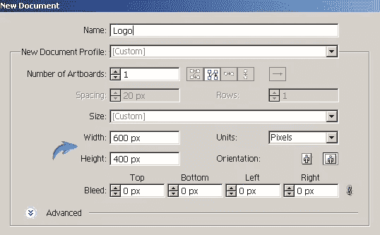](https://www.sitepoint.com/wp-content/uploads/2012/12/116.jpg)

### 第二步

我们将创建一个名为国王的建设者虚构公司的标志。在制作这个标志的时候，我们必须专注于我们设计的品牌和公司。因为我们是为 King's Builders 设计的，所以我想用一只狮子(丛林之王)和几块砖来象征建筑行业。你的方法可能会不同；我只是向你展示一种方法。

首先，我们将绘制狮子的草图来补充“国王”方面。在 Illustrator 中，将填充颜色设置为“无”，并将描边设置为纯黑色。从顶部属性栏中选择一个 2 磅的描边粗细。现在，选择铅笔工具(“N”)并绘制如下所示的耳朵形状。如果对第一次尝试不满意，可以重画，直到得到想要的形状。或者，您可以使用橡皮擦工具随时擦除该部分。继续使用钢笔工具绘制草图。确保在单独的新图层上绘制每个笔画。

**第三步**
现在，我们给这些笔画一些*字符*。通过单击相应层上的环形目标选择一个描边层，并更改其宽度轮廓。我在下面的笔画路径中使用宽度轮廓 2。

[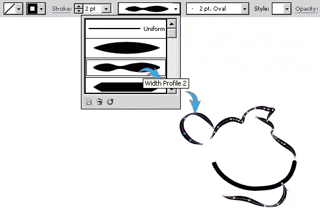](https://www.sitepoint.com/wp-content/uploads/2012/12/34.jpg)

然后，将以下描边的宽度更改为宽度轮廓 1。

[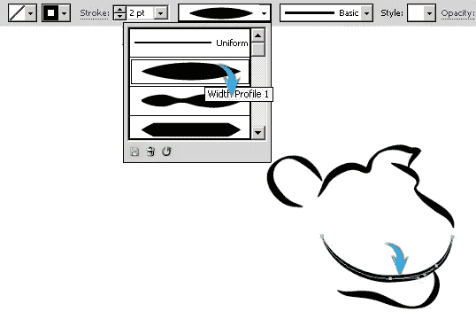](https://www.sitepoint.com/wp-content/uploads/2012/12/3b3.jpg)

### 第四步

用 1 磅的笔画粗细在单独的图层上画下面两个笔画。

[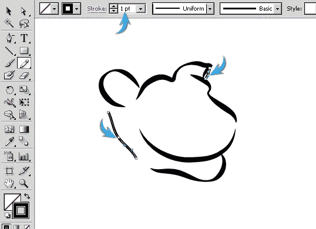](https://www.sitepoint.com/wp-content/uploads/2012/12/43.jpg)

如下所示更改它们的宽度轮廓。

[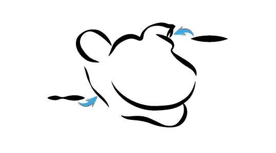](https://www.sitepoint.com/wp-content/uploads/2012/12/4b1.jpg)

**第五步**

选择黑色作为您的填充颜色，并设置中风为无。现在，选择钢笔工具并绘制以下形状。不需要和我的一模一样。你喜欢怎么画就怎么画。

[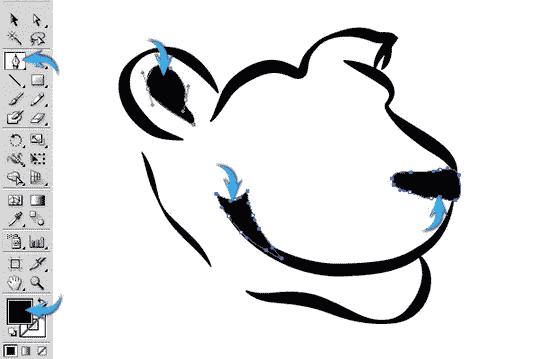](https://www.sitepoint.com/wp-content/uploads/2012/12/53.jpg)

**第六步**

使用宽度轮廓 4 绘制以下两个笔画。

[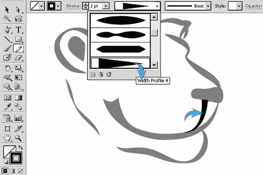](https://www.sitepoint.com/wp-content/uploads/2012/12/63.jpg)

[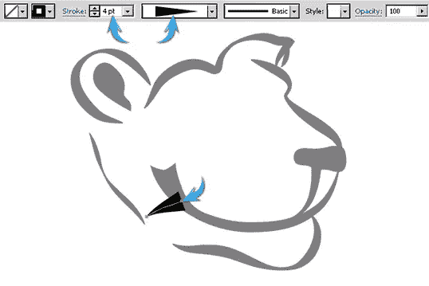](https://www.sitepoint.com/wp-content/uploads/2012/12/6b2.jpg)

### 第七步

接下来，我们要为我们的国王狮子做眼睛。使用 2pt 的重量和宽度轮廓 1 绘制笔划。

[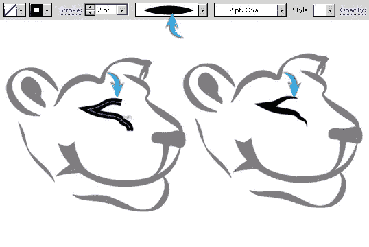](https://www.sitepoint.com/wp-content/uploads/2012/12/73.jpg)

### 第八步

再添加一些细节，如下所示。这里用小笔画(0.5-0.25pt)。

[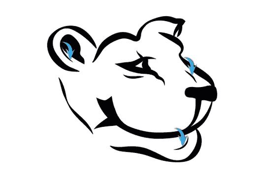](https://www.sitepoint.com/wp-content/uploads/2012/12/83.jpg)

### 第九步

使用 2pt 的笔划权重为头发绘制一些笔划，并如下所示更改它们的宽度轮廓。

[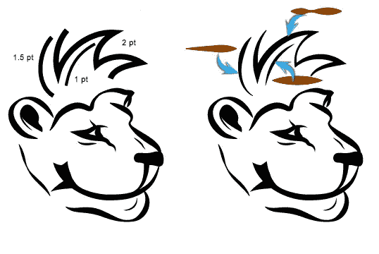](https://www.sitepoint.com/wp-content/uploads/2012/12/93.jpg)

### 第十步

使用相同的技术绘制其余的头发笔画。

[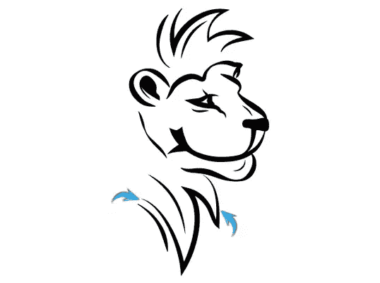](https://www.sitepoint.com/wp-content/uploads/2012/12/103.jpg)

### 步骤 11

我们完成了狮子的素描。现在，我们将继续创建我们徽标的另一半。我们会为此造几块砖。收集所有的狮子层到一个新的层。新建一个图层，用矩形工具画一个矩形。使用黑色填充你的初始砖块。

[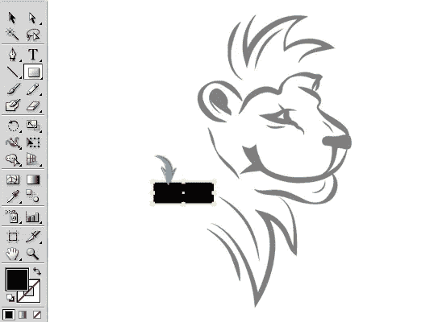](https://www.sitepoint.com/wp-content/uploads/2012/12/117.jpg)

### 步骤 12

在黑色的矩形上画一个更小的白色矩形来突出显示。将高亮矩形的不透明度降低到 50%-60%。收集两个矩形到一个新的层，并标记为“砖”。

[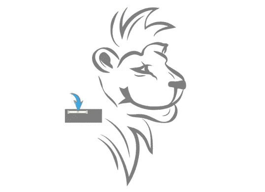](https://www.sitepoint.com/wp-content/uploads/2012/12/124.jpg)

### 第十三步

复制“砖”层几次，并安排这些副本彼此随机得到如下所示的效果。

[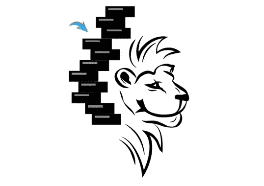](https://www.sitepoint.com/wp-content/uploads/2012/12/133.jpg)

### 步骤 14

现在，您可以添加文本。选择文字工具，在徽标下方键入文本。我在这里使用“ChunkFive Roman”字体。

[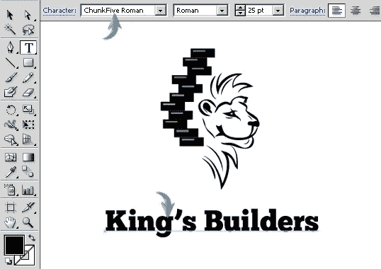](https://www.sitepoint.com/wp-content/uploads/2012/12/143.jpg)

我们完成了标识。你可以给它任何你想要的颜色、纹理或处理。既然是建筑公司，我就选了下面的木头。

[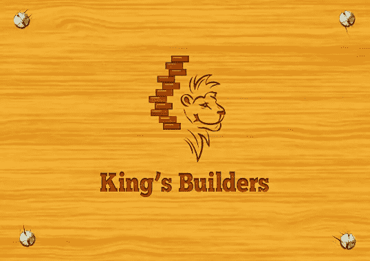](https://www.sitepoint.com/wp-content/uploads/2012/12/Final-result10.jpg)

我希望你们喜欢这个过程。请分享你的想法！

## 分享这篇文章