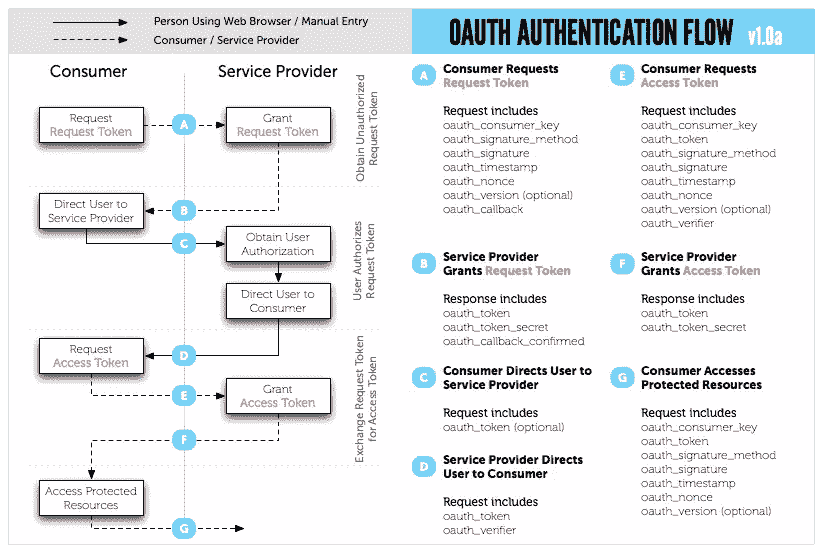

# 创建 PHP OAuth 服务器

> 原文：<https://www.sitepoint.com/creating-a-php-oauth-server/>

如果您曾经集成过另一个需要安全性的 API(比如 Twitter)，那么您可能已经使用过 OAuth 服务。在本文中，我将探索如何创建您自己的三脚 OAuth 服务器，例如，允许您创建您自己的安全 API 并公开发布。

在处理 OAuth 时，您通常会看到它被实现为两条腿或三条腿的 OAuth 服务器。它们之间的主要区别是两条腿认证不涉及另一个用户。例如，如果您想要访问特定用户的 Twitter 信息，您将使用三脚服务器，因为您的应用程序中必须为该用户生成一个访问令牌，而不仅仅是 Twitter 为您提供一个令牌。我们将把重点放在三条腿的种类上，因为它在现实世界中更实用。

我们将使用 [oauth-php](http://code.google.com/p/oauth-php/ "oauth-php - OAuth - Consumer and Server library for PHP - Google Project Hosting") 为我们执行许多繁重的工作。该库托管在 Google Code 上，并没有列在[packagest](https://packagist.org/ "Packagist")中，但是仍然可以使用 [Composer](https://www.sitepoint.com/re-introducing-composer/ "PHP Dependency Management with Composer") 安装。有关详细信息，请查看 GitHub 上本文附带的 composer.json 文件的代码。

## 理解流程

使用三脚 OAuth 服务器时，开发人员实现和使用服务的典型流程如下:



上图由[OAuth.net](http://oauth.net/ "OAuth Community Site")提供，相当复杂，但简单来说，它展示了以下内容:

*   消费者向服务器请求令牌
*   然后，消费者将用户引导到登录页面，并将令牌传递给他们
*   用户登录，并使用访问令牌重定向回消费者
*   消费者获取访问令牌，并请求 OAuth 令牌用于将来的安全请求
*   OAuth 令牌被检索，开发人员现在可以通过传递令牌进行验证来发出安全请求

## 设置数据库

将 oauth-php 库放在可访问的位置后，需要创建并初始化一个新的数据库。我将使用在`library/store/mysql/mysql.sql`中找到的模式脚本。

如果浏览这些表，您会看到`oauth_server_registry`表包含一个名为`osr_usa_id_ref`的字段。这由 OAuth 服务器在注册过程中填充。它假设您已经有了一个与之相关的 users 表。如果你有，那就完美了！但是如果没有，那么下面是一些创建标准用户表的基本 SQL:

```
CREATE TABLE users (
    id INTEGER UNSIGNED NOT NULL AUTO_INCREMENT,
    name VARCHAR(255) NOT NULL DEFAULT '',
    password VARCHAR(255) NOT NULL DEFAULT '',
    email VARCHAR(255) NOT NULL DEFAULT '', 
    created DATE NOT NULL DEFAULT '0000-00-00',

    PRIMARY KEY (id)
);
```

## 创建 OAuth 服务器

让我们开始编写 OAuth 服务器。以下是我们其余代码中常见的，所以我把它放在单独的文件`include/common.php`中:

```
<?php
require_once '../vendor/autoload.php';

session_start();

// Add a header indicating this is an OAuth server
header('X-XRDS-Location: http://' . $_SERVER['SERVER_NAME'] .
     '/services.xrds.php');

// Connect to database
$db = new PDO('mysql:host=localhost;dbname=oauth', 'dbuser', 'dbpassword');

// Create a new instance of OAuthStore and OAuthServer
$store = OAuthStore::instance('PDO', array('conn' => $db));
$server = new OAuthServer();
```

该文件为每个请求添加了一个额外的 HTTP 头，以通知客户端这是一个 OAuth 服务器。注意它引用了`services.xrds.php`；该文件随 oauth-php 库附带的示例一起提供。您应该将它从`example/server/www/services.xrds.php`复制到 web 服务器的根公共目录。

接下来的几行代码建立了到数据库的连接(连接信息应该根据您自己的设置进行更新),并创建库提供的`OAuthStore`和`OAuthServer`对象的新实例。

OAuth 服务器的设置现在已经完成，服务器可以完全实现了。在剩下的例子中，每次实例化服务器时都必须包含`includes/common.php`文件。

## 允许注册

在开发人员使用您的 OAuth 服务器之前，他们必须向它注册。为此，我们需要创建一个基本的注册表单。以下字段是必需的，因为它们被传递到库:`requester_name`和`requester_email`。剩下的字段是可选的:`application_uri`和`callback_uri`。

```
<form method="post" action="register.php">
 <fieldset>
  <legend>Register</legend>
  <div>
   <label for="requester_name">Name</label>
   <input type="text" id="requester_name" name="requester_name">
  </div>
  <div>
   <label for="requester_email">Email</label>
   <input type="text" id="requester_email" name="requester_email">
  </div>
  <div>
   <label for="application_uri">URI</label>
   <input type="text" id="application_uri" name="application_uri">
  </div>
  <div>
   <label for="callback_uri">Callback URI</label>
   <input type="text" id="callback_uri" name="callback_uri">
  </div>
 </fieldset>
 <input type="submit" value="Register">
</form>
```

正如我前面提到的，库假设您已经有了想要使用您的服务器的用户。在下面的代码中，我在`users`表中创建一个新用户，然后检索 ID，然后将其传递给`updateConsumer()`方法，为该用户创建(或更新)消费者密钥和秘密。当您将它集成到您的应用程序中时，应该对它进行修改，并将其放在您现有的登录流程中，您已经知道谁是正在注册访问的用户。

```
<?php
$stmt = $db->prepare('INSERT INTO users (name, email, created) ' .
    'VALUES (:name, :email, NOW())');
$stmt->execute(array(
    'name' => $_POST['requester_name'],
    'email' => $_POST['requester_email']
));
$id = $db->lastInsertId();

$key = $store->updateConsumer($_POST, $id, true);
$c = $store->getConsumer($key, $id);
?>
<p><strong>Save these values!</strong></p>
<p>Consumer key: <strong><?=$c['consumer_key']; ?></strong></p>
<p>Consumer secret: <strong><?=$c['consumer_secret']; ?></strong></p>
```

注册完成后，输出用户的新消费者密钥和消费者秘密密钥。用户应保存这些值以备将来使用。

既然用户已经注册，他们就可以开始请求访问令牌了！

## 生成请求令牌

一旦用户注册，他们应该对您的`request_token.php`文件执行 OAuth 请求。这个文件(还是因为库)非常简单:

```
<?php
require_once 'include/oauth.php';

$server->requestToken();
```

`requestToken()`方法负责验证用户是否提供了有效的消费者密钥和签名。如果请求有效，则返回新的请求令牌。

## 将请求令牌交换为访问令牌

一旦生成请求令牌，用户将被重定向到您的登录页面。这个页面应该有以下 URL 参数:`oauth_token`和`oauth_callback`。

登录页面应该从 users 表中检索用户。检索完成后，用户 ID(和`oauth_token`)被传递给库提供的`authorizeVerify()`方法。假设用户已经授权了应用程序，那么登录用户的 ID 就与消费者的密钥相关联，从而允许他们安全地访问该用户的数据。
一个基本`login.php`的必要逻辑可能如下所示:

```
<?php
// check if the login information is valid and get the user's ID
$sql = 'SELECT id FROM users WHERE email = :email';
$stmt = $db->prepare($sql);
$result = $stmt->exec(array(
    'email' => $_POST['requester_email']
));
$row = $result->fetch(PDO::FETCH_ASSOC);

if (!$row) {
    // incorrect login
}
$id = $row['id'];
$result->closeCursor();

// Check if there is a valid request token in the current request.
// This returns an array with the consumer key, consumer secret,
// token, token secret, and token type.
$rs = $server->authorizeVerify();
// See if the user clicked the 'allow' submit button (or whatever
// you choose)
$authorized = array_key_exists('allow', $_POST);
// Set the request token to be authorized or not authorized
// When there was a oauth_callback then this will redirect to
// the consumer
$server->authorizeFinish($authorized, $id);
```

用户登录后，他们将被重定向回使用有效令牌的消费开发者的网站(通过`oauth_callback`参数)。然后，该令牌和验证密钥可用于交换有效的访问令牌。

一个基本的`access_token.php`文件如下所示:

```
<?php
require_once 'include/oauth.php';

$server->accessToken();
```

这个文件和之前创建的`request_token.php`一样简单。这些工作都是在 oauth-php 库提供的`accessToken()`方法中完成的。当请求成功时，会输出一个有效的`oauth_token`和`oauth_token_secret`，它们应该被存储起来，供将来对 API 的请求使用。

## 验证请求

此时，OAuth 服务器已经启动并正在运行。但是我们仍然需要验证请求是否包含有效的 OAuth 签名。我创建了一个基本的测试文件来完成这个任务:

```
<?php
require_once 'includes/oauth.php';

if (OAuthRequestVerifier::requestIsSigned()) {
    try {
        $req = new OAuthRequestVerifier();
        $id = $req->verify();
        // If we have a user ID, then login as that user (for
        // this request)
        if ($id) {
            echo 'Hello ' . $id;
        }
    }  catch (OAuthException $e)  {
        // The request was signed, but failed verification
        header('HTTP/1.1 401 Unauthorized');
        header('WWW-Authenticate: OAuth realm=""');
        header('Content-Type: text/plain; charset=utf8');
        echo $e->getMessage();
        exit();
    }
}
```

在本例中，如果请求得到验证，我只回显登录用户的用户 id。我建议为任何需要安全性的 API 调用创建一个包含这些代码的可重用方法。

## 测试 OAuth 服务器

最后，是时候测试 OAuth 服务器了。下面是一个简单的测试文件，它执行上述步骤，要求用户登录并执行安全请求:

```
<?php
define('OAUTH_HOST', 'http://' . $_SERVER['SERVER_NAME']);
$id = 1;

// Init the OAuthStore
$options = array(
    'consumer_key' => '<MYCONSUMERKEY>',
    'consumer_secret' => '<MYCONSUMERSECRET>',
    'server_uri' => OAUTH_HOST,
    'request_token_uri' => OAUTH_HOST . '/request_token.php',
    'authorize_uri' => OAUTH_HOST . '/login.php',
    'access_token_uri' => OAUTH_HOST . '/access_token.php'
);
OAuthStore::instance('Session', $options);

if (empty($_GET['oauth_token'])) {
    // get a request token
    $tokenResultParams = OauthRequester::requestRequestToken($options['consumer_key'], $id);

    header('Location: ' . $options['authorize_uri'] .
        '?oauth_token=' . $tokenResultParams['token'] . 
        '&oauth_callback=' . urlencode('http://' .
            $_SERVER['SERVER_NAME'] . $_SERVER['PHP_SELF']));
}
else {
    // get an access token
    $oauthToken = $_GET['oauth_token'];
    $tokenResultParams = $_GET;
    OAuthRequester::requestAccessToken($options['consumer_key'],
        $tokenResultParams['oauth_token'], $id, 'POST', $_GET);
    $request = new OAuthRequester(OAUTH_HOST . '/test_request.php',
        'GET', $tokenResultParams);
    $result = $request->doRequest(0);
    if ($result['code'] == 200) {
        var_dump($result['body']);
    }
    else {
        echo 'Error';
    }
}
```

OAuth 要求将时间戳和签名附加到每个请求上，这个库将再次为我们完成这项工作。

上面代码的第一部分是配置信息，应该根据您的需要进行相应的更新。用户 ID、消费者密钥和消费者秘密密钥都是在服务器上的注册过程中生成的。

如三脚 OAuth 服务器简介中所述，在上面的测试文件中执行以下过程:

*   用消费者密钥请求一个请求令牌(通过`request_token.php`文件)
*   收到令牌后，将用户重定向到登录页面，通过 URL 参数传递令牌和回调 URL
*   用户登录后，会被重定向回上面的测试页面。测试页面获取令牌并请求访问令牌(通过`access_token.php`文件)
*   成功后，返回必要的 OAuth 信息，测试文件执行对`test_request.php`的安全请求。
*   如果一切顺利，将显示一个基本的“Hello 1”。

## 摘要

至此，您应该知道如何创建一个基本的 OAuth 服务器。以`test_request.php`文件为例，您可以开始创建更多使用 Oauth 保护的特性！如果您想研究一些代码，可以在 GitHub 上找到本文的完整源代码。

<small>图片 via[Fotolia](http://us.fotolia.com/?utm_source=sitepoint&utm_medium=website_link&utm=campaign=sitepoint "Royalty Free Stock Photos at Fotolia.com")</small>

如果你喜欢读这篇文章，你会爱上[可学的](https://learnable.com?utm_source=sitepoint&utm_medium=link&utm_campaign=learnablelink)；向大师们学习新技能和技术的地方。会员可以即时访问 SitePoint 的所有电子书和交互式在线课程，如 [Jump Start PHP](https://learnable.com/books/jump-start-php?utm_source=sitepoint&utm_medium=link&utm_campaign=learnablelink) 。

对这篇文章的评论已经关闭。有关于 PHP 的疑问？为什么不在我们的[论坛](https://www.sitepoint.com/forums/forumdisplay.php?34-PHP?utm_source=sitepoint&utm_medium=link&utm_campaign=forumlink)上问呢？

## 分享这篇文章