# Tumblr 更好的标签云

> 原文：<https://www.sitepoint.com/a-better-tag-cloud-for-tumblr/>

标签云是帮助访问者在你的博客上探索不同主题的好方法。然而，虽然 WordPress 和 Blogger 都支持标签云，但 Tumblr 用户必须经历一些困难才能建立标签云。

Tumblr 的经典标签云解决方案是 Heather Rivers 的 Tumblr 标签云，但这个脚本有一个缺点:每次有人访问你的网站时，标签云都是在客户端使用 JavaScript 生成的，所以你的帖子越多，加载时间就越长。我曾经在我的博客上使用过 Rivers 的脚本，但是由于我已经发表了几百篇文章，标签云需要 30 秒才能出现。

开发者拓印酒精已经用一个类似名字的 PHP 应用解决了这个问题， [Tumblr 标签云](https://github.com/rubbingalcoholic/tumblr_tag_cloud)。与 Rivers 的标签云不同，这种标签云依赖于服务器端的缓存，并会以固定的间隔重新生成标签云，而不是每次有人在你的博客上加载页面时都重新生成。这对于有很多帖子的 Tumblr 博客来说太棒了！

Tumblr 标签云是在麻省理工学院许可下发布的免费软件。要使用它，您需要将其托管在您自己的服务器上。虽然这使得设置过程比使用其他人的服务器上的脚本(la Rivers 的脚本)稍微复杂一点，但它最终会在速度上得到回报，因为你不需要依赖其他所有带有标签云的 Tumblr blogger 所依赖的服务器。

## 要求

*   网络托管服务器
*   PHP 5
*   关系型数据库
*   托管应用程序的域或子域(这必须是一个真正的子域，而不仅仅是主站点的子目录)

## 装置

首先在服务器上创建一个数据库和一个数据库用户，供应用程序使用。如果您的站点使用 cPanel，请转到“数据库”部分并选择“MySQL 数据库”这将带您进入数据库管理页面，您可以在其中创建数据库并添加用户:

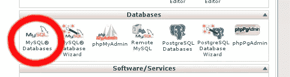

完成后，从 GitHub 获取最新版本的 Tumblr 标签云:

`git clone https://github.com/rubbingalcoholic/tumblr_tag_cloud.git`

注意:如果您的系统上没有 Git，您可以从 GitHub 页面下载 ZIP 存档文件。

现在您将拥有一个名为`tumblr_tag_cloud`的目录。其内容如下所示:

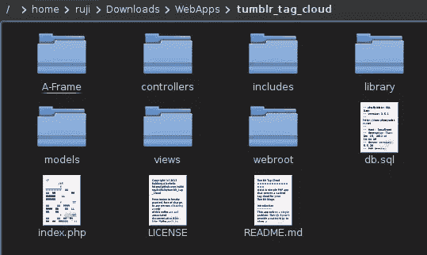

我们需要编辑配置。将文件`includes/local.default.php`复制到`includes/local.php`，在文本编辑器中打开`local.php`。

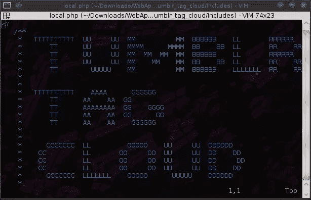

该文件被大量注释，因此很容易看出不同部分的用途。首先输入您想要使用的管理员用户名和密码(这可以防止随机的人在您的数据库上托管他们自己的标签云):

```
define('ADMIN_USERNAME', 'admin');

define('ADMIN_PASSWORD', 'p@ssw0rd');

Below that, put in your database information. Don't forget to include the prefixes. For example:

$config['db']['dsn'] = array(

'hostspec' => '127.0.0.1',

'port' => '3306',

'username' => 'rujic_cloud',

'password' => 'p@ssw0rd',

'database' => 'rujic_cloud',
```

现在是时候把文件上传到你的服务器了。子目录`webroot`中的所有文件必须放在您的域或子域的`public_html`文件夹中。如果你的服务器为你所有的子域使用一个单一的`public_html`目录，把这些文件直接放到适当的子域的主目录中。

接下来，`tumblr_tag_cloud`中的所有其他文件和目录必须进入你放置 webroot 文件的目录的*父目录*。

## 创建标签云

如果前面的步骤一切顺利，您可以通过访问安装 Tumblr 标签云的域或子域来访问它。

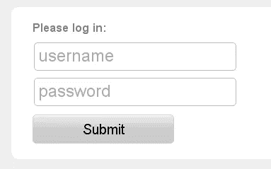

使用您之前在`local.php`中设置的管理员凭据登录。假设您正确配置了数据库信息，您应该会看到以下内容:

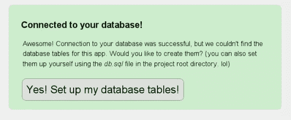

继续设置数据库表。然后，系统会提示您添加要创建标签云的博客(您可以稍后添加更多博客)。

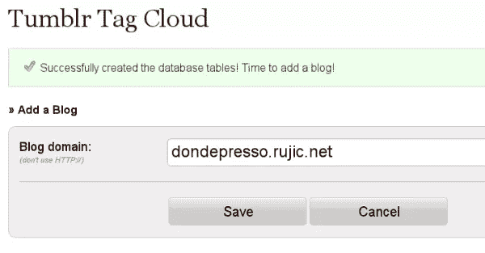

将博客添加到数据库后，您会看到一些配置选项。你可以随意摆弄这些东西。

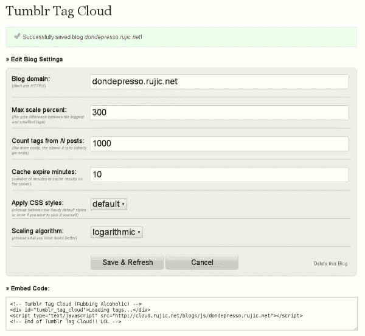

该页面还将为您提供标签云的嵌入代码以及预览。请注意，预览版没有考虑到 Tumblr 博客上的 CSS，因此最终产品可能会有所不同。

## 将你的标签云放到 Tumblr 上

登录你的 Tumblr 博客，进入设置页面。在“主题”部分，单击“自定义”:

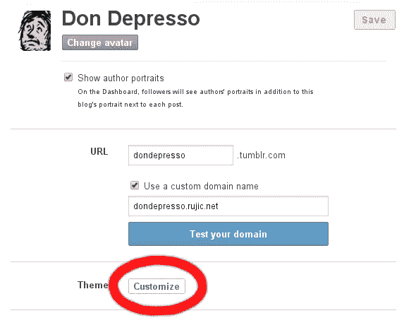

这将带你到你的博客的预览，以及编辑主题的左边栏。点击“编辑 HTML”:

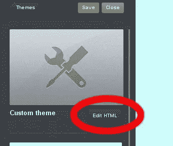

一个 HTML 编辑器将在侧边栏中打开。将嵌入代码粘贴到您希望标签云显示的位置。这将根据您使用的主题而有所不同。我把我的放在了右边栏的最小主题中:

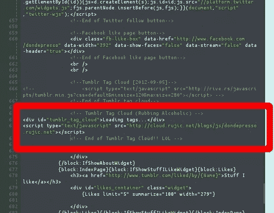

保存您的更改并转到您的博客。第一次生成标签云可能需要几秒钟，但之后它将被缓存在服务器的内存中。

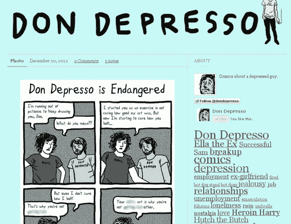

就这样吧！你在 Tumblr 博客上使用标签云吗？如果没有，要不要一个？请在评论中告诉我们这个解决方案对你的效果如何！

## 分享这篇文章