# 25 个背景模糊的精彩网站

> 原文：<https://www.sitepoint.com/25-wonderful-websites-with-blurred-backgrounds/>

作为设计师，我们经常被要求将我们的设计集中在特定的目标和目的上。但是，信不信由你，有时候失去注意力也会对你有利。在网页设计领域，一个最新的设计趋势是模糊不清的背景。设计师使用不在焦点上的背景有很多原因:它可以将注意力吸引到前景中的其他东西，它可以创造一种新的独特的感觉，这种感觉可能是你的设计所缺少的。当你和家人朋友一起享受假期的时候，为什么不开始着手你明年要尝试的新趋势呢？这里有一些伟大的、鼓舞人心的网页设计，它们有效地使用了焦点之外的背景。

**笼子**

[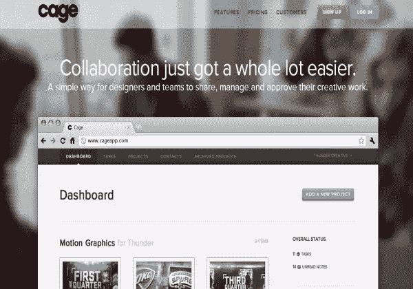](http://www.cageapp.com/)

**慈善主题**

[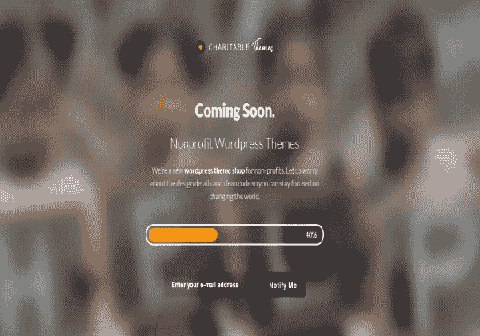](http://charitablethemes.com/)

**丹尼尔·菲勒**

[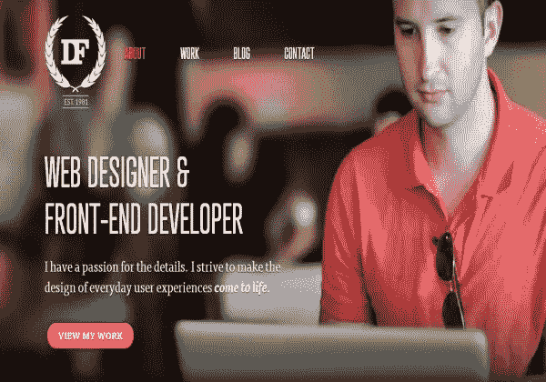](http://danielfiller.com/)

**做**

**Everpix**

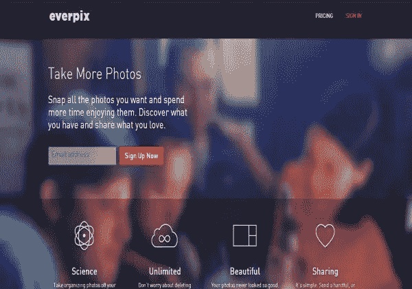

**胖龙**

[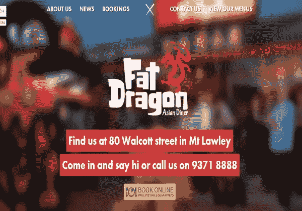](http://fatdragon.com.au/)

**我追踪我的时间**

**Joost Huver**

[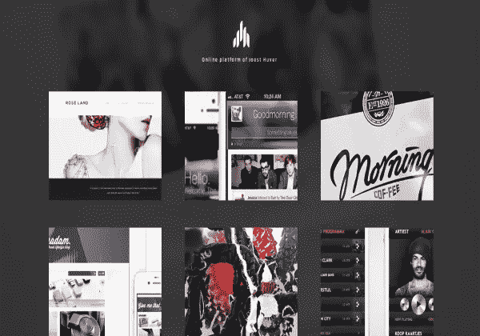](http://joosthuver.com/)

Joshua smibert

[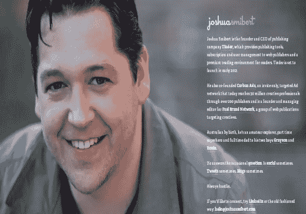](http://joshuasmibert.com/)

**曼波工业**

**Moovents**

[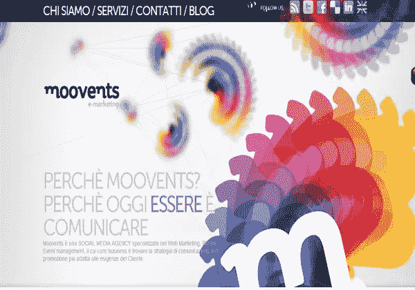](http://www.moovents.com/)

**NEC**

[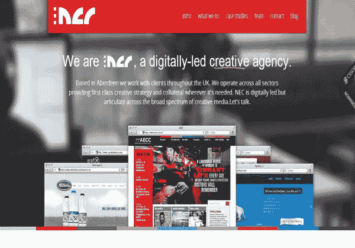](http://www.studionec.com/)

**Niiws**

**超过**

[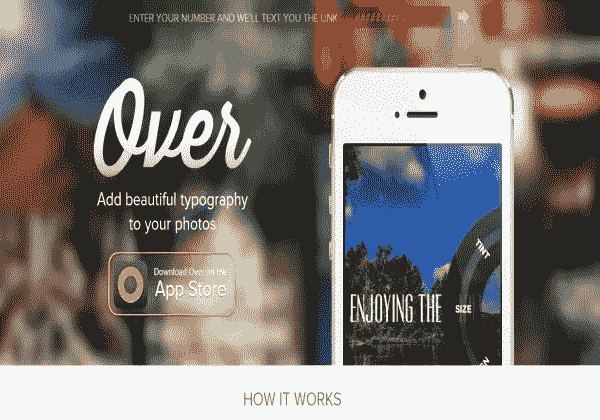](http://madewithover.com/)

**松树小径**

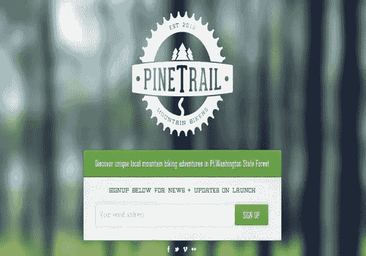

**游乐场**

[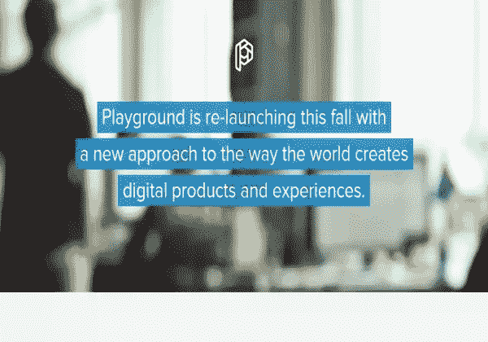](http://playgroundinc.com/)

**Poco 人**

[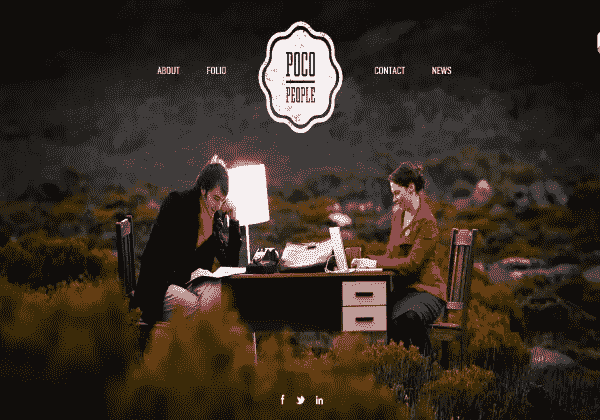](http://www.pocopeople.com.au/)

**砰然一声**

[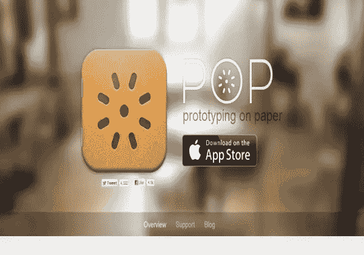](http://popapp.in/)

**赖利洛克**

[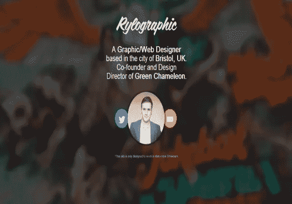](http://www.rylographic.com/)

**咸指关节**

[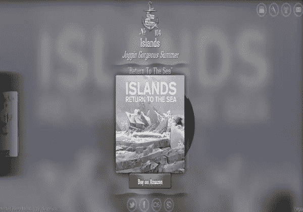](http://www.saltyknuckles.net/2012-51)

希克

[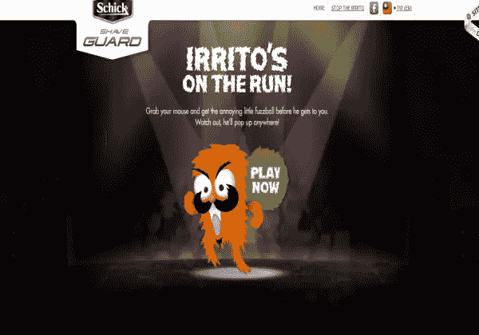](http://www.shaveguard.com/tw_en/irrito/)

**空格框**

[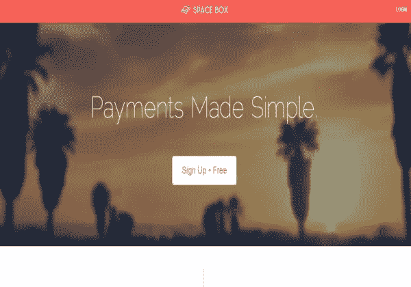](https://spacebox.io/)

**正方形**

**团队极客**

[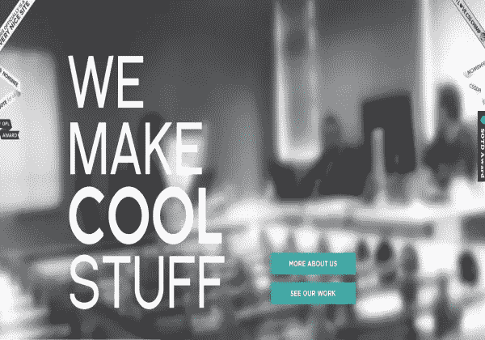](http://www.teamgeek.co.za/)

**天气表盘**

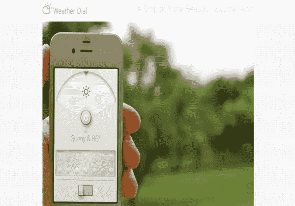

### 结论

使用模糊和失焦的设计可以让你的网页内容脱颖而出，无论你选择使用摄影还是抽象设计。你会惊讶于模糊背景下的设计看起来有多清晰。

你喜欢模糊或“散景”背景吗？你是利用它们将焦点转移到前景内容上，还是完全避开它们？

## 分享这篇文章