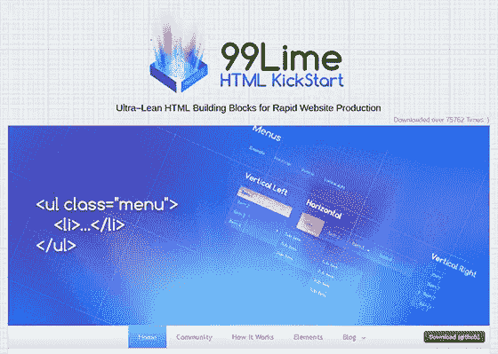
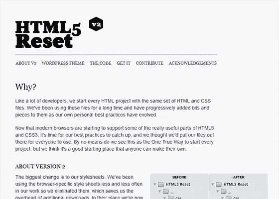
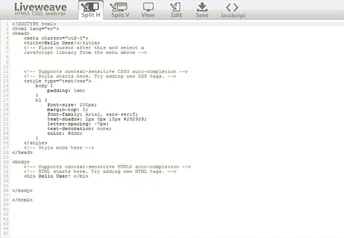
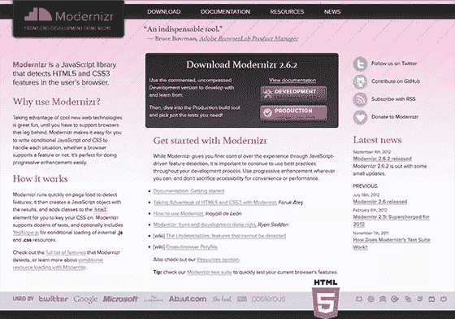
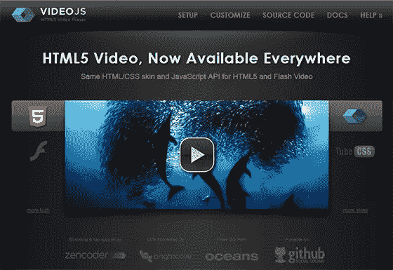

# 6 个有用的 HTML5 工具

> 原文：<https://www.sitepoint.com/6-useful-html5-tools/>

下面你会发现六个在线工具，它们能很好地帮助人们理解 HTML5 和学习如何创建 HTML5 网站。

本文中提到的工具都可以通过桌面浏览器访问，并且可以在桌面浏览器上使用。每个工具的描述中都提到了任何特定的浏览器版本要求。这个列表没有特定的顺序。有些工具你可能永远都不需要使用，但是如果你要使用所有这些工具，那么你可能会成为一个快乐的开发者。

没有办法完全客观地看待这个问题，所以我选择工具是因为它们证明了有用性，而不是受欢迎程度。每个设计师和开发人员都会有自己的喜好，可能不在本文中。尽管有这些遗漏，我相信这个列表会对新手、中级或有经验的 web 开发人员有所帮助。

## Adobe Edge 动画

这是一个创建交互式网页内容的伟大工具。你可以创建动画和互动界面，这将证明你的网站访客引人注目。你可以创建一个精确的控制功能，创建一个充满有趣元素的密集网站。

这个套件的核心是:**Adobe Edge**——自 2011 年夏天以来一直处于测试阶段。更名为 **Adobe Edge 动画工具**，它现在有一个最终版本，显示类似于 Flash Pro 的图形界面。AdobeEdge Animate 支持 HTML (HTML5)、JavaScript 和 CSS JSON 以及图形格式 JPG、SVG、PNG 和 GIF。应用程序是从主库(Edge.js)生成的 JSON (JavaScript 对象符号)。渲染针对 Webkit 进行了优化，并与所有主流浏览器兼容。标签 HTML5 画布和音频尚不支持。

它首先是一个编辑器，在源代码中生成动态 web 链接。这由 Adobe Edge Code 补充，这是一个基于开源项目括号(托管在 GitHub 上)的代码编辑器，由 Adobe 工程师推出。它的附加值？用 HTML、CSS 和 JavaScript 开发，可以在源代码中动态导航。

例如，括号提供了访问 HTML 标签的相应 CSS 代码、修改和查看实时渲染的可能性，而无需重新加载浏览器。因为它的开源性质和它的基础网络支架，人们可以开发插件。Adobe 已经拥有超过 100 个，特别是涵盖了辅助完成、代码格式化和测试。
除了支架和生态系统开源插件，Adobe Edge Code 还附带了两个额外的扩展。一个用于 PhoneGap Build，这是一个构建工具(基于开发环境 PhoneGap 跨平台)，允许应用程序为主要的移动操作系统(iOS、Android 和 Windows Phone)打包原生 HTML 容器。第二个提供对服务边缘字体的访问。从收购 Typekit 开始，它可以(像 Google Web Fonts 一样)提供对开源 Web 字体库(大约 500 个)的在线访问，你可以插入它的网页——使用 CSS `@font-face`并通过复制和粘贴 JavaScript 源代码中的一行。

价格——独立产品每月 10 美元。创意云套件 50 美元/月。

[http://html.adobe.com/edge/animate/?sdid=KAPIL&skw cid = TC | 22737 | adobe % 20 edge % 20 animate | | S | b | 17657114450&ef _ id = UNDdzAAAUIRb @ UdI:20121220170320:S](http://html.adobe.com/edge/animate/?sdid=KAPIL&skwcid=TC%7C22737%7Cadobe%20edge%20animate%7C%7CS%7Cb%7C17657114450&ef_id=UNDdzAAAUIRb@UdI:20121220170320:s)

## HTML 快速启动

这是一堆 CSS、HTML5 和 jQuery 构建块，你可以用它们来开发你的网站。

它有布局，元素和文件，会给你一个良好的开端来创建你的网站。HTML KickStart 是一个非常方便的方式来节省时间生成一个网站。对于精通 HTML 和 CSS 的集成商和开发人员来说，这个初学者工具包允许通过许多预配置和预风格化的功能块，非常快速地实现某些功能:幻灯片显示、按钮、标签等。

Kickstart 展示了当前网页设计中使用的主要工具:JavaScript、Blueprint grid、HTML5 和 CSS3，它兼容所有主流浏览器。没有什么需要配置的，只需要将包移动到你的站点开发的根目录下。

Kickstart 允许你设计图像、按钮、表格、标签、证券、画廊、灯箱、列表、菜单、图标、表格和网格。对一些人来说，它是 HTML5 的灵感来源，对另一些人来说，它只是一个节省时间的工具:它值得安装和测试。

价格-免费

[www.99lime.com/](http://www.99lime.com/)

## HTML5 重置

当你创建网站时，你从基本的 HTML 开始，然后随着代码的发展，几年后再添加进去。然后 HTML5 出现了，你的最佳实践又回来困扰你。

这个在线工具为开发人员提供了一种重置时钟的方法。它使网页设计者可以重新编写他们的旧网站设计，就好像他们处理的第一个代码是 HTML5 一样。

该模板可以下载并用于台式计算机的任何主流浏览器。与其说是在浏览器上使用这个工具，不如说是把它集成到你的网站上。

价格-免费

[http://html5reset.org/](http://html5reset.org/)

## 活织

这是一个 HTML5、JavaScript 和 CSS3 的游乐场，人们可以在上面测试他们的代码。

这是一个非常好的在线工具，使用它不会有负面影响，而且有神奇的能力为你节省大量时间。它还为一些代码提供了上下文相关的自动完成功能，因此开发和测试代码更加容易。

开发人员显然厌倦了每周浪费时间等待屏幕加载。您可以在任何主流桌面浏览器上使用该工具。粘贴代码的区域直接出现，不需要在网站上搜索工具。

价格-免费

[http://liveweave.com/](http://liveweave.com/)

## 现代化 zr

这是一个非常方便的小 JavaScript 库，它能够检测 HTML5 本地实现的可用性。然后，您可以针对特定的浏览器，使您的网站更适合该浏览器。

如果你对 HTML5 网站有需求，那么这是一个你会经常使用的网站工具。HTML5 是最初由 Opera Software 提出的 HTML 标准的最新版本，仍在开发中。

正是这种持续的发展，使得 HTML5(和 CSS3)一方面被开发人员推崇为不断扩展的可能性，但也遭到了指责，认为它尚未得到所有浏览器的完全支持。HTML5 实际上提供了几种技术，简化了 web 设计和开发的整个过程，使之更加灵活和强大。诸如`canvas local storage`或允许 web 开发者像在桌面上一样使用浏览器的功能表明，HTML5 可能会通过向开发者提供一组 API 来彻底改变世界，这些 API 允许后代在浏览器中完成我们甚至无法想象的事情。

Modernizr 是一个相对较新的 JavaScript 库。它的开发始于 2009 年末，允许您通过确定哪些 API 是本地可用的来测试浏览器。这允许建立回退功能，在浏览器中上传额外的脚本，为开发者提供与测试的 HTML5 功能相同的 API。这些库通常被称为后备 Polyfill，幸运的是所有 HTML5 特性都可用。

聚脂填料无疑是一种权宜之计。在设计网站或 web 应用程序时，重要的是要考虑哪些功能是实现最佳功能和设计目标所真正需要的。添加没有添加到您的应用程序或站点的 HTML5 功能是没有意义的，并且需要回退聚合填充支持。

Modernizr 允许您测试新 HTML5 API 提供的原生支持和 CSS3 的新图形效果。它的使用非常简单，可以帮助您发现最新一代产品对某个特性的本机支持。如果您对如何使用 Modernizr 自动下载 Polyfills 感兴趣，您应该使用方法`Modernizr.load`,该方法接受一个对象作为参数，该对象包含要运行的测试、测试成功时要加载的脚本路径以及测试失败时要加载的脚本路径。

Modernizr 支持 Chrome、Firefox 3.5+、IE6+、Opera 9.6+和 Safari 2+。在手机上，它们支持 Android 的 WebKit 浏览器、黑莓 6+、Firefox Mobile、iOS 的 mobile Safari 和 Opera Mobile。

价格-免费

[http://modern . com/](http://modernizr.com/)

## 视频. js

js 是一个基于 JavaScript 的 HTML5 视频播放器。它被网页设计者和网站管理员使用，他们希望在他们的网站上添加视频，同时确保它们看起来不错，并成为网站的一部分。

要使用这个工具，你只需要下载源代码，然后按照文档说明将它集成到你的网站上。网站上的文档也将为您提供动态加载网站的替代设置说明。

价格-免费

[www.videojs.com/](http://www.videojs.com/)

所以，我在 2012 年发现了六个最有用的 HTML5 工具。他们每个人都帮助我解决了一个问题，他们每个人都以这样或那样的方式启发了我。你呢？你发现了什么好的新工具来使用 HTML5 吗？

如果你喜欢读这篇文章，你会喜欢[可学的](https://learnable.com/)；向大师们学习新技能和技术的地方。会员可以即时访问 SitePoint 的所有电子书和交互式在线课程，如真实世界的[html 5&CSS3](https://learnable.com/courses/html5-css3-for-the-real-world-1484)。

## 分享这篇文章