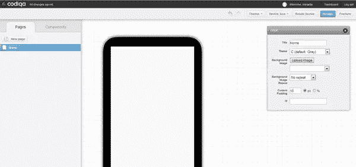
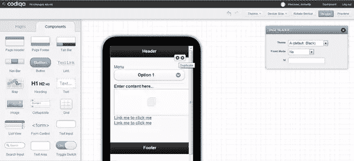
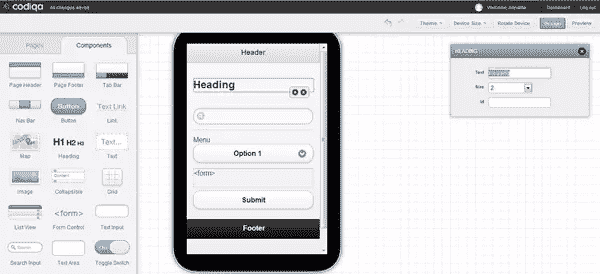

# 用 Codiqa 创建一个移动应用程序模型

> 原文：<https://www.sitepoint.com/create-a-mobile-mockup-with-codiqa/>

在编写 web 应用程序的实际代码之前，每个 web 设计师或开发人员都应该创建他们工作的模型或草图。在网络上，作为一名设计师，你甚至可以在开始编码之前使用一些工具来设想和调整你的数字项目。其中最著名的两个是 [Codiqa](http://www.codiqa.com/ "Codiqa Official Website") 和 [Balsamiq](http://www.balsamiq.com/ "Balsamiq Official Website") 。在本文中，我将概述 Codiqa 的特性，并向您解释如何利用它节省时间和开发更好的应用程序的潜力。

### 规划一个项目

当你开始规划一个新的网站或移动应用程序时，理想的第一步是定义一个详细的初始工作计划。在开始编写代码之前，即使是手绘的计划草图也可以避免你将来犯很多错误，并且还可以使你的想法更加清晰和深入。不管你是在计划一个个人项目还是在专业基础上工作。虽然内容非常重要，但是项目的成功需要一个坚实的开发过程，在这个过程中，你要保持对你想要实现的目标的清晰想法。

如果你的目标是满足客户的需求，你必须分析他们的预期需求，并起草一份设计规范，其中包括布局草图、受众定义和技术要求。在项目的下一阶段，你将使用这个规范作为指南。web 应用程序界面的每一个布局都是从一个实体模型开始的，它通常只不过是一个简单的预期结果的草图。这可以很容易地根据客户的反馈和设计团队的贡献进行修改，如果你有的话。

当设计变得更加稳定时，实体模型可以发展成一个精细的状态，它通常被称为“线框”线框显示了一个更完整的页面布局版本，包括导航元素、搜索功能、广告空间和其他功能。但是，在开始讨论线框是什么和不是什么之前，让我们看看如何为你的下一个应用程序建立一个简单、清晰的模型。

### Codiqa 是什么？

Codiqa 是 jQuery Mobile 的一个简单的界面构建工具。它的使用非常直观，而且是由 100%的 HTML5 组件组成的。将你的想法原型化后，你将获得完美的可用代码。其实后面不用再编码了。这个应用程序的优势在于它的拖放界面，该界面允许轻松快速地构建移动原型。您可以从云中的任何地方访问您的项目，此外，共享功能允许您与团队成员或其他开发人员共享项目，以便进行实时测试和反馈。Codiqa 唯一的“缺陷”是它不是一个完全免费的工具。事实上，在 30 天的试用期后，如果你想继续使用这个工具，你必须订阅一个计划。有四种计划可供选择:个人计划、初级计划、职业计划和团队计划，所有这些计划都在 Codiqa 网站上有详细描述。

### Codiqa 如何工作

既然您对 Codiqa 有了更多的了解，是时候深入研究它的特性了。请注意，30 天免费试用版限制您只能打开和处理一个项目，并且您不能与其他用户共享您的工作。

第一项任务是定义您想要为其创建实体模型的设备的大小。你可以在 iPhone (3，4，4S，5)，iPad (1/2/3)，600 x 1024 像素尺寸的平板电脑和 240 x 320 像素到 800 x 1280 像素的手机之间进行选择。下一步，让我们研究一下主页的风格，默认情况下称为“Home”(您可以根据自己的喜好更改标题)。你可以在五个可用的主题中选择一个，上传一个背景图片(也可以选择 X 和 Y 轴上的重复)，并以像素或百分比为单位对你的内容填充进行编程。

让我们看看还有什么可以添加到我们的新主页。如果你点击页面左侧“Pages”旁边的“Components”元素，你会发现你可以添加许多元素，其中许多是常见的和非常有用的。现在，让我们考虑一下我们可能想要添加的元素:一个页眉、一个页脚、一个菜单列表、一个内容文本框、一个小图片和一些链接。有了 Codiqa 简单、直观的拖放系统，您只需点击几下鼠标，就可以轻松添加您想要的任何内容。添加了我们想要的元素后，我们的实体模型现在看起来像这样:

现在，我们开始使用设备屏幕右侧的菜单逐一定制所有组件。页眉和页脚可以在五个可用元素中选择，您可以决定是否要固定这些元素。在标题所在的地方点击，你可以很容易地改变它的文本和大小。

在“选择菜单”框中，当你点击相应的空间时出现，你可以设置名称，你想要显示的标题，主题，大小(在“正常”和“迷你”选项之间选择)，以及菜单中提供的项目。要在菜单上添加一个新的项目，你只需点击“新选项”，在盒子底部的绿色按钮。您会发现一个典型的文本编辑器，您可以在其中指定段落的特征和内容。

关于图像，我们在内容框下面添加了一个示例图像。它的大小可以用像素或百分比来指定。最后，在 link 菜单中，您可以构建超链接并指定所有常用的链接属性。对于功能，您可以在渐变、弹出、翻转、旋转、流动、滑动渐变、滑动、向上滑动和向下滑动之间进行选择。请记住，您可以随时旋转您的设备，以验证您的设计选择在横向模式下工作良好。

现在，让我们创建另一个页面，了解更多关于我们可以使用的其他组件的信息。下面，我创建了一个名为“联系我们”的页面，除了页眉、菜单和页脚之外，我还添加了一个标题、一个搜索输入、一个表单和一个提交按钮。为了清楚起见，请看下面。

对于这份联系方式，你必须指出一个 URL，在“GET”和“POST”方法之间做出选择，并决定是否用 AJAX 提交。提交按钮可以根据大小、标题、内嵌配置进行修改，在这种情况下，您也可以选择一个图标。还有一些元素不完全适合我的模型示例，但它们确实值得一提:

*   **Map** :和图片一样，它的宽度和高度可以用像素来指定。您还可以确定缩放级别；
*   **列表视图**:您可以创建一个列表，定义分隔线和项目的主题、链接转换、链接路径以及按钮的标题；
*   **单选按钮**:单选按钮是一个元素，它允许用户只选择一组预定义的互斥选项中的一个；
*   **拨动开关**:显示选中/未选中状态，按钮上有“灯”指示，默认情况下有“开”或“关”字样。你可以选择主题，名称，大小，以及最终你想要显示的文本，而不是“开”和“关”。

### 结论

本文展示了使用 Codiqa 提供的工具为网站或 web 应用程序创建模型是多么简单和直观。这种仔细的前期规划可以为您节省无数的开发时间，并且在协作环境中向您的合作伙伴展示您的想法的可视化、交互式模型特别有帮助。

你在创建你的应用程序模型方面受过训练吗，或者你会毫不浪费时间就开始编码吗？你觉得模型在协作环境中有用吗？它们有助于你设想项目的细节吗？

## 分享这篇文章