# 设计喜庆的 3D 糖果棒排版

> 原文：<https://www.sitepoint.com/design-festive-3d-candy-cane-typography/>

假期到了，毫无疑问，你会在你的任务清单上遇到一些与假期相关的设计项目。能够创造主题设计和艺术品是设计师工作描述的一部分。有能力在你的作品中创造各种各样的风格使你成为任何设计公司的多才多艺的资产。如果你是一名自由职业者，当你拥有更全面的技能时，推销自己会更容易。随着假期的到来，拐杖糖将会被到处传递。我们将创建三维糖果甘蔗排版去与传统。

在 Photoshop CS6 中创建新文档。我把尺寸设置为 1024 像素 x 768px 像素，分辨率为 72 像素。我们必须从一开始就以正确的方式处理这个项目，所以我们必须考虑我们开始选择的字体。字体需要修圆，比如 Arial Rounded，但是我选的字体是 Bariol Bold。字体很粗，两端是圆形的，这有助于平滑地转换成 3D。键入你的节日信息，并使其足够大以填充你的画布。将颜色设置为#7f7f7f，因为在 3D 中会比黑白更容易看到。我的字体大小为 212 磅，行距为 170 磅。

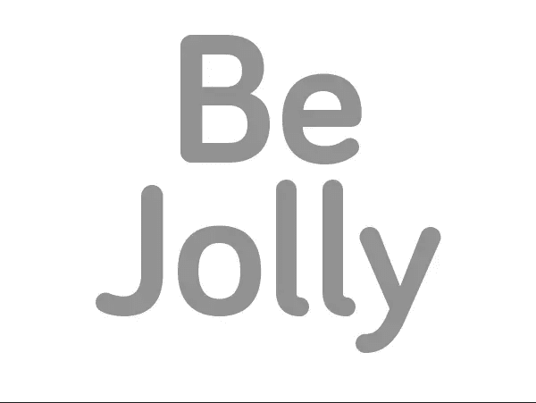

下一步，我们需要将我们的文本转换成 3D，所以进入“3D”>“从选定层新建 3D 挤出”工作空间将被转换为 3D 工作空间。我们将主要在 3D 和属性面板中工作。当你第一次转换为 3D 时，结果将是块状和方形的，但通过对设置的一些更改，我们可以很容易地解决这个问题。

[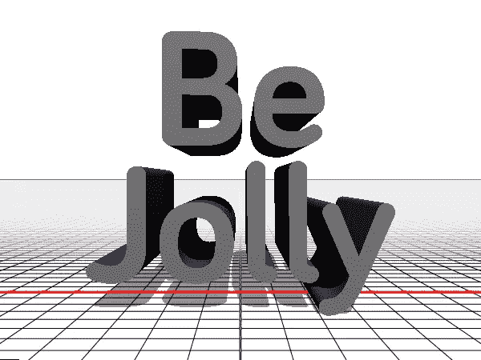](https://www.sitepoint.com/wp-content/uploads/2012/12/Screen-shot-2012-12-06-at-10.12.41-AM.png)

我们处理这个问题的方式将会有很大的不同。我们将希望使正面和背面是圆形的，同时删除挤压，使两个半圆面(正面和背面)相遇，形成一个完美的圆柱形。这很容易做到，你只需要知道要改变哪些设置才能得到你想要的结果。单击 3D 面板中带有“T”符号和消息的图层。在这个部分，你可以在 3D 平面内扭曲和操纵文本的形状。

[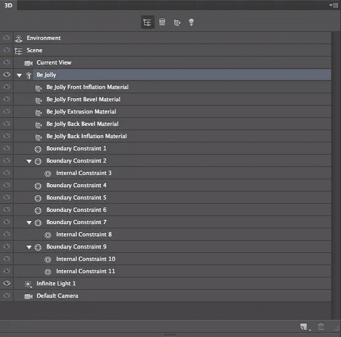](https://www.sitepoint.com/wp-content/uploads/2012/12/Screen-shot-2012-12-06-at-10.23.34-AM.png)

[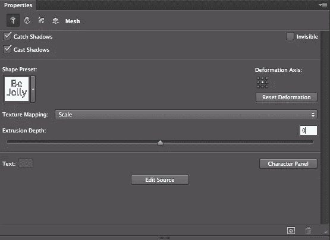](https://www.sitepoint.com/wp-content/uploads/2012/12/Screen-shot-2012-12-06-at-10.24.31-AM.png)

当您在 3D 面板中单击“T”部分时，以下选项在“属性”面板中变为可用。首先，我们必须将挤出设置为 0，以便正面和背面相遇。请注意该部分属性面板顶部的四个图标。我们将用这些来改变我们的类型。随着挤压消除，我们现在需要圆形的前沿。

[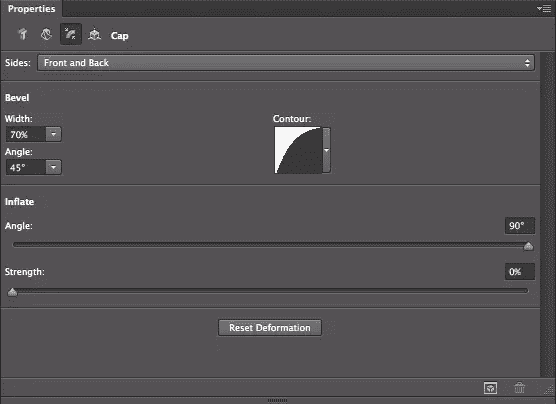](https://www.sitepoint.com/wp-content/uploads/2012/12/Screen-shot-2012-12-06-at-10.47.09-AM.png)

将侧面选项设置为正面和背面，并将斜角设置为 70%。保持 45 度角。您必须将宽度增加到 0%以外的值，否则当您更改轮廓时将看不到您的更改。点击“轮廓”部分，选择“半圆”作为你的选项。这将为我们的文本提供所需的管状形状。

现在，我们需要让我们的文本看起来像一个有正确图案的糖果棒。点击“正面充气材料”部分。在属性面板中，您会看到几个不同的选项，但是您想要选择的是属性面板右上角的球体图标。这是一个重要的部分，在这里您可以将纹理和图案应用到您的 3D 作品，以及不透明度、反射等。我们要关注的是右下角的“环境”单击“环境”旁边的向下箭头，选择“新建纹理”再次单击它，但这次单击“编辑纹理”一个新的标签或窗口将出现一个空白的画布。在这里，您可以为 3D 对象创建纹理。

[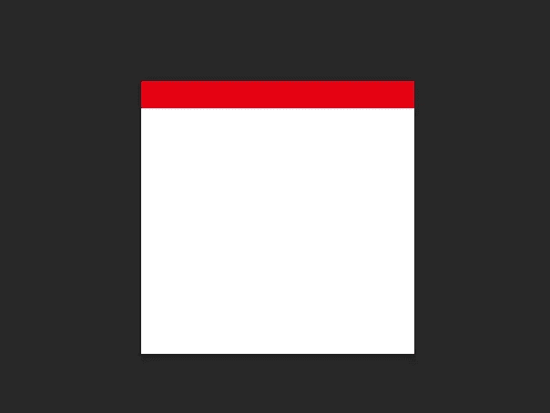](https://www.sitepoint.com/wp-content/uploads/2012/12/Screen-shot-2012-12-06-at-1.54.17-PM.png)

在背景图层上新建一个图层。选择选框工具，在整个画布上画一个矩形。在这里，我们将创建我们的糖果棒的条纹。用红色填充选区。取消选择矩形和点击命令/Ctrl+“J”复制条纹层。重复几次。然后，将最后一个条纹层向下移出画布。按住 shift 并选择所有的条纹层。在屏幕顶部的选项栏中，您会看到标准的对齐和分布图标。点击“分布垂直中心”，Photoshop 会将你的条纹均匀地分布在空间上。

[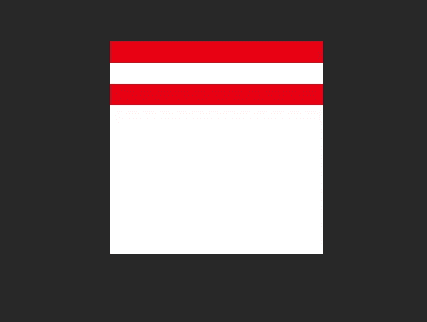](https://www.sitepoint.com/wp-content/uploads/2012/12/Screen-shot-2012-12-06-at-1.54.52-PM.png)

确保条纹离开画布，因为你最终会将纹理倾斜 45 度，它们需要填充空间。要么合并矩形，要么按住 shift 键全选，然后按 Command/Ctrl + "T "键变换矩形。按住 Shift 键以精确的增量旋转它们，直到它们成 45 度角。然后，将它们放在合适的位置，填满整个正方形。如果需要，可以沿矩形的宽度拉伸矩形。

[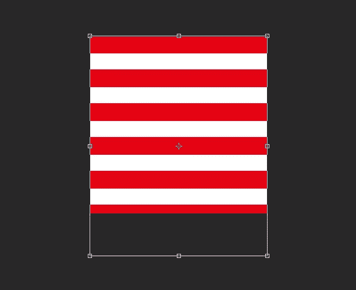](https://www.sitepoint.com/wp-content/uploads/2012/12/Screen-shot-2012-12-06-at-2.24.04-PM.png)

[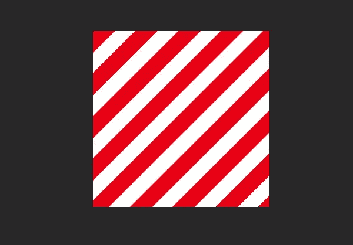](https://www.sitepoint.com/wp-content/uploads/2012/12/Screen-shot-2012-12-06-at-2.32.04-PM.png)

保存文件并退出此文档，以返回原始 3D 工作空间。您将看到球体图标已经更新，以显示您制作的条纹。单击向下箭头并选择“新材质”将其设置为预设。您可以将此纹理保存为预设，这意味着您可以在以后使用它。

[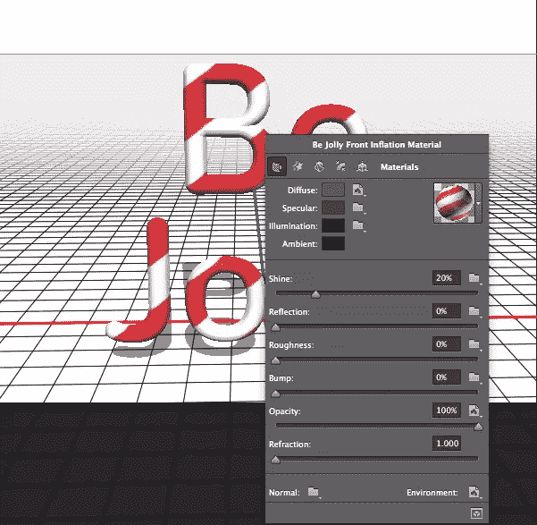](https://www.sitepoint.com/wp-content/uploads/2012/12/Screen-shot-2012-12-06-at-3.34.30-PM.png)

为了加快速度，您可以通过右键单击对象本身来访问 3D 对象的属性。从上面的例子可以看出，它显示了应用于文本的纹理和应用于文本的所有其他设置，就像您在属性面板中看到的一样。单击下拉菜单中的 candy cane 纹理，将其应用于前斜面。接下来，在画布上单击并拖动鼠标，围绕文本旋转。(只要确保您在 3D 面板中选择了环境，否则它将旋转您的文本，而不是旋转您的相机视图。)右键点击后充气材质，此刻是灰色的。选择相同的糖果纹理应用到 3D 文本的背面。

[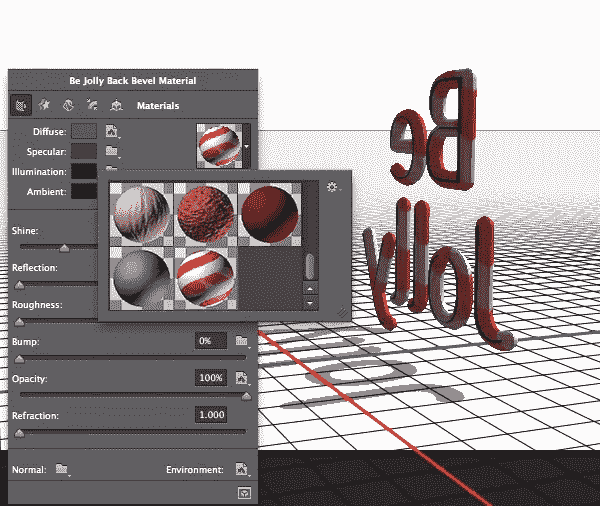](https://www.sitepoint.com/wp-content/uploads/2012/12/Screen-shot-2012-12-06-at-3.40.25-PM.png)

材料的设置会影响文本的外观。不同的属性决定了对象及其曲面与环境的交互方式。根据你的对象，你需要考虑它在现实生活中会如何反应。糖果是坚硬的，表面光滑。它是有光泽的，所以在光照下会发光。它会产生轻微的反射，但它不像玻璃一样透明，所以它不会折射光线。这就是我们如何确定我们的设置。光泽将被设置为高，一直到 100%，反射大约为 25%，粗糙度和凹凸将被设置为 0%，不透明度为 100%，折射为 0%。

[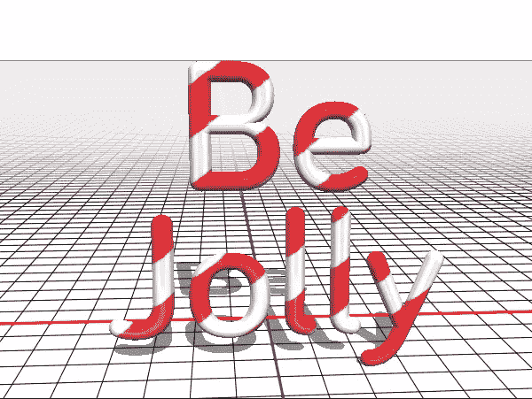](https://www.sitepoint.com/wp-content/uploads/2012/12/Screen-shot-2012-12-06-at-3.54.13-PM.png)

此刻你不会看到太多的不同，但是当你渲染最终的设计时，它会显示你指定的所有反射和光亮。接下来，我们需要在文本中添加一个节日背景。打开一个新文档(这将使它更容易使用)，并以 600 x 450 像素的尺寸创建它。用深绿色填充背景；我用的是#0b2409。创建一个新层，使用选框工具创建一个高矩形从顶部到底部的文件，大约 1/3 的宽度。用好看的节日红(#5e0202)填充。使用顶部的对齐选项将其居中。

[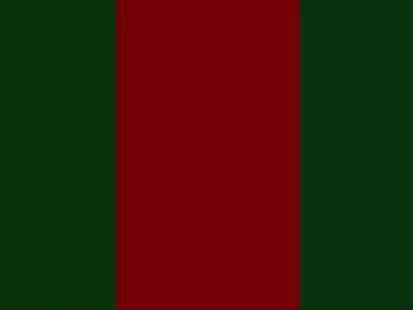](https://www.sitepoint.com/wp-content/uploads/2012/12/Screen-shot-2012-12-10-at-10.35.49-AM.png)

双击红色层，调出你的图层样式。选择描边——我们将沿着红色矩形的边创建一个金色描边来分割东西。添加从中金色(#807c03)到浅金色(#d3c200)的渐变描边，并将角度设置为 90°。

[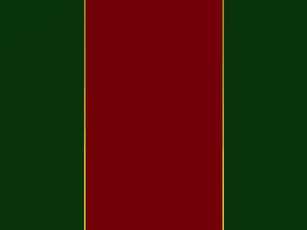](https://www.sitepoint.com/wp-content/uploads/2012/12/Screen-shot-2012-12-10-at-10.48.35-AM.png)

点按 Command/Ctrl+ "E "来合并您的文稿，或者您可以将其展平。然后，使用移动工具将您的设计拖到 3D 文档中。这将在您的 3D 图层上创建一个新图层。将它移动到文本下方，在它仍被选中的情况下，转到“3D”>“从图层新建网格”>“明信片”这将使你的背景在它自己的空间里变成 3D。它将独立于你的 candy cane 文本移动，但我们可以很容易地将我们的背景设计添加到场景中。按住 Shift 键，同时点击明信片和文字 3D 图层，然后进入“3D”>“合并 3D 图层”合并 3D 图层后，您将在 3D 面板中看到它们。当您想要操纵 3D 场景的某个部分时，只需在 3D 面板中单击该对象的图层。

[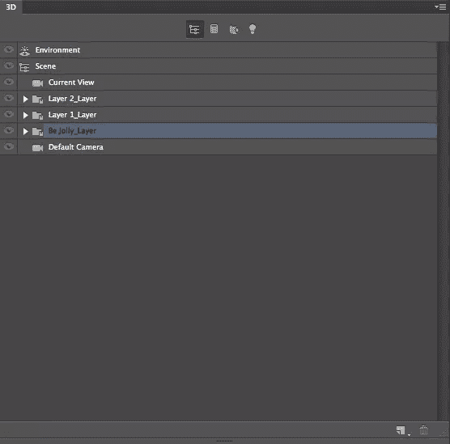](https://www.sitepoint.com/wp-content/uploads/2012/12/Screen-shot-2012-12-10-at-11.06.15-AM.png)

使用 3D 控制将文本放置在背景上。接下来，我们将在文本上添加一个光源，这样背景上会显示一个阴影。点击 3D 面板中的“新建图层”图标，选择“无限光”在属性面板中，将柔和度增加到 15%左右。一旦你调整完你的光源，你可以通过点击属性面板右下角的图标来渲染你的场景，或者你可以进入“3D”>“渲染”下面是我们的三维场景的镜头。

[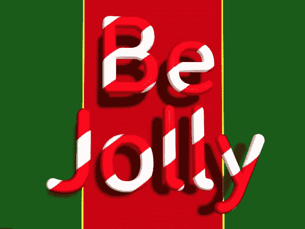](https://www.sitepoint.com/wp-content/uploads/2012/12/Screen-shot-2012-12-10-at-11.23.46-AM.png)

对我来说一切都有点太简单了，所以如果你想在你的作品中加入一种维度的倾斜。单击 3D 面板中的“环境”,然后单击鼠标并将其拖动到画布上，以旋转场景视图。我旋转了场景，成品如下图。

[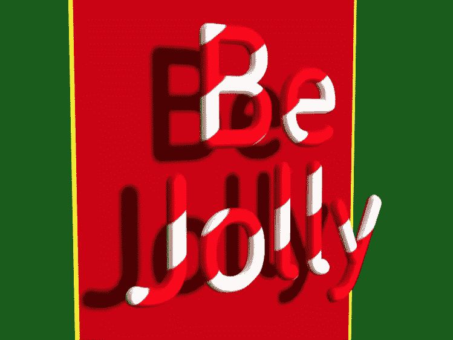](https://www.sitepoint.com/wp-content/uploads/2012/12/Screen-shot-2012-12-10-at-12.12.10-PM.png)

### 结论

在 Photoshop 中创建 3D candy cane 文本并不太难，但是您可以将相同的原则应用于 Photoshop 中的任何其他 3D 文本效果。现在，您可以为任何场合创建任何类型的 3D 文本。通过给你的作品增加一个新的维度，你将能够使任何文本脱颖而出。PSD 文件包含在下面，如果你卡住了，你可以看看它。

**[下载源文件](https://www.sitepoint.com/wp-content/uploads/2012/12/candycane-df.PSD_.zip)**

## 分享这篇文章