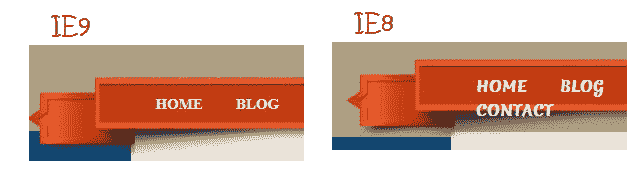
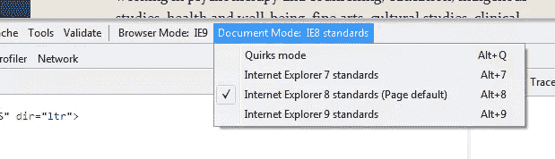

# 快速 IE7 和 IE8 浏览器测试

> 原文：<https://www.sitepoint.com/ie7-ie8-testing/>

众所周知，在 IE7 和 IE8 中进行测试非常令人兴奋！(即使在最好的情况下)。我想我会分享一个**快速测试方法，如果你不使用工具或虚拟机，你的布局是否在 IE7 和 IE8** 中被破坏。你只需要在开始的 head 标签之后直接包含下面的 meta 标签。

这是一个使用 IE8 标准模式发现的坏菜单的例子。

## 指定 IE 文档兼容模式

> 您可以使用文档模式来控制 Internet Explorer 解释和显示网页的方式。

The X-UA-Compatible header directs Internet Explorer to mimic the behavior of Internet Explorer 8 when determining how to display the webpage. Read more on [defining document compatiability](http://msdn.microsoft.com/en-us/library/cc288325%28v=vs.85%29.aspx#SetMode).

因此，您的页面可能如下所示:

```
 <title>My webpage</title>

内容放在这里。 
```

## IE 开发工具

如果我们检查 IE 开发工具，我们可以看到它在 IE8 标准文档模式下运行(按 F12 打开 IE 开发工具)。从这里我们可以很容易地在版本之间切换，但是我们在 meta 标签中指定的版本将成为页面默认版本。



## 为什么使用 meta 标签？

你可能会想，当你可以在 IE 开发工具中改变模式时，为什么要使用 meta 标签呢？如果你使用一个条件来加载一个 IE8 样式表，meta 标签会强制加载它。

## IE7

对于 IE7，同样的事情只需要使用下面的 meta 标签。

## 更多想法

请注意，我很确定这只会在使用 IE9 时起作用(在 FF 或 Chrome 上不起作用——如果我错了，请纠正我),一旦添加了 meta 标签，您将需要进行硬页面刷新。另外我不确定 IE10，我还没有用过它！！！

## 分享这篇文章