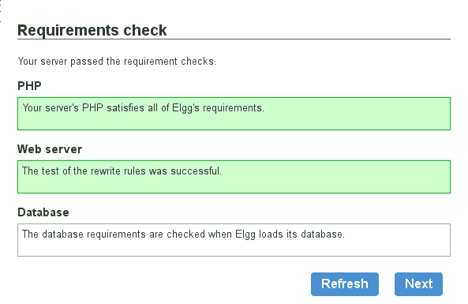
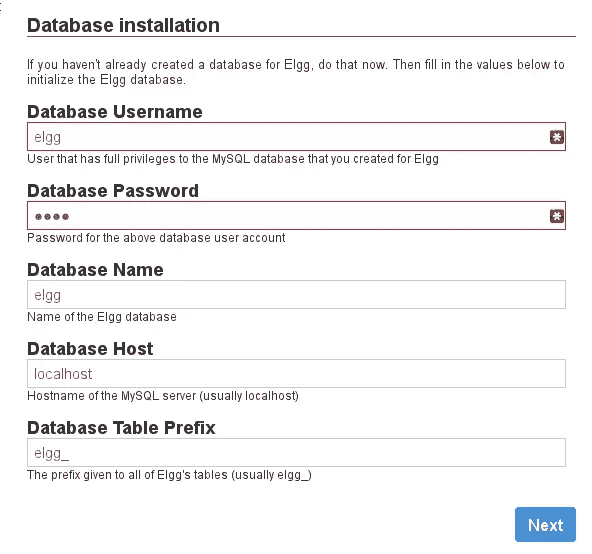
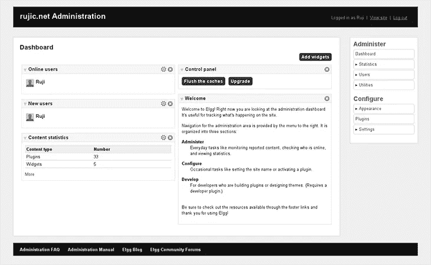
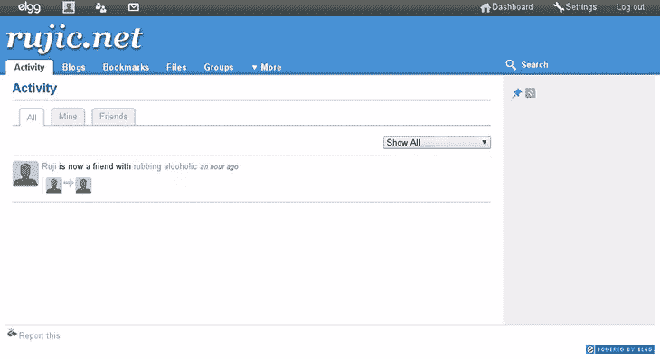
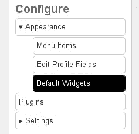
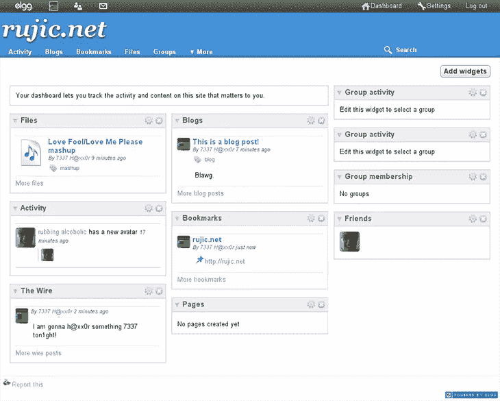
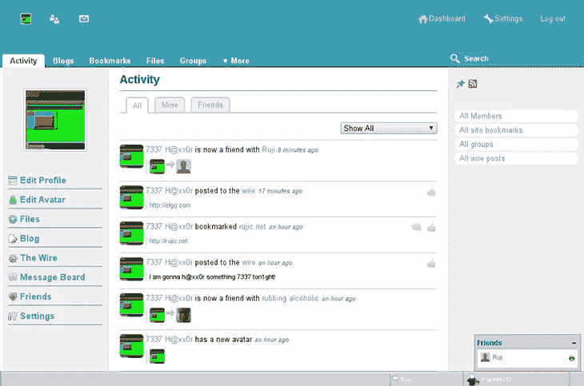

# Elgg:开源社交网络

> 原文：<https://www.sitepoint.com/elgg-open-source-social-networking/>

也许你(合理地)担心你在脸书的隐私，不管出于什么原因，主要的替代社交网络并没有为你切断它。或者，你可能希望有某种方式让你的客户更多地参与到你的业务中来。

为什么不用开源软件创建自己的社交网络呢？

今天我要向大家介绍的是 [Elgg](http://elgg.org) ，这是一个功能齐全的开源社交网络引擎，易于安装和设置。你可以用许多第三方插件来增强它的功能。Elgg 在 GPL 和 MIT 许可下是双重许可的。本条适用于 Elgg 1.8。

以下是设置 Elgg 网络所需的内容:

*   虚拟主机和域名。如果不想花什么钱，可以用自己的服务器。寻找一个免费的动态 DNS 服务，比如 [DynDNS](http://dyn.com) ，它会给你一个域名。如果你在无线网络上运行你的服务器，你还需要在你的路由器上启用[端口转发](http://lifehacker.com/127276/geek-to-live--how-to-access-a-home-server-behind-a-routerfirewall)，以使你的站点可以在你的局域网之外访问。
*   PHP 5
*   MySQL 5+
*   Elgg 的最新版本

#### 入门指南

下载。从 Elgg [下载页面](http://elgg.org/download.php)下载 ZIP 文件，并将其解压到服务器上的任意位置。

现在导航到该目录中的`install.php`页面。阅读欢迎信息，点击“下一步”；Elgg 现在将检查您的服务器是否安装了所需的软件。如果一切顺利，您应该会看到:

然后 Elgg 会提示你初始化一个数据库。请注意，您必须首先在服务器上创建数据库，并授予数据库用户读/写权限。大多数虚拟主机公司都为 MySQL 提供了一个管理接口，比如 phpMyAdmin。

接下来，您将命名您的站点并填写一些其他细节，例如安装目录和管理员信息。当您到达“数据目录”部分时，安装程序会要求您提供“您为 Elgg 创建的保存文件的目录”，因此在继续之前，请确保创建此目录。我把我的放在我的站点的根目录(`public_html`)之外，以保证它的安全。

当您完成安装并访问您的站点时，您会看到如下内容:

#### 配置 Elgg

右侧菜单提供了几个 Elgg 设置的链接。你可以在“基本设置”中(在“设置”下拉菜单下)更改网站名称和描述，进入“高级设置”将让你调整其他几个参数，包括默认的帖子隐私级别和新用户注册的能力。

转到“插件”部分激活或停用插件。默认情况下，几个预装插件已经被激活。您可能希望激活的一些值得注意的已停用插件包括:

*   Elgg 开发者工具(用于编写插件和主题)
*   嵌入(允许用户在帖子中嵌入媒体内容)
*   用户仪表板
*   OAuth API(允许 Elgg 安装连接到其他受 OAuth 保护的站点)

如果你启用开发者工具，你会在屏幕右下角看到一个名为“开发”的新菜单。你可以到这里的工具->主题沙盒来测试你的 Elgg 安装使用 CSS 的主题。沙箱是各种站点元素的 CSS 属性的可视化概述。

#### 仪表板

仪表板充当注册用户的可定制站点门户。任何用户都可以更改他们自己的仪表板的配置。我注册了一个非管理用户来测试注册过程(自从一两年前我最后一次试用 Elgg 以来，注册过程已经变得流畅多了；这次确认邮件真的来了！).作为这个用户登录后，我首先看到的是(到目前为止)看起来相当普通的活动页面，默认显示的是网站上的公共活动和互动:

Rubbing Alcoholic 是我的开发者朋友，他帮助测试了我的 Elgg 安装。现在我们以 Elgg 的方式完成了我们的友谊！

从那里我走向仪表板(`your-elgg-installation.com/dashboard`)，它也完全是空的:

要创建自己的仪表盘，只需点击右边的“添加小部件”按钮。如果您希望为所有新用户修改默认仪表板的外观，请以管理员身份登录，然后转到右侧工具栏中的外观->默认小部件(这不会更改已注册用户的仪表板)。

现在选择页面标题下的“Dashboard”选项卡，然后单击“Add widgets”您可以选择添加以下任何内容:

*   活动(有点像脸书的新闻提要)
*   书签
*   老友记
*   组成员关系
*   《火线》(微博)
*   博客
*   文件(是的，可以和 Elgg 共享文件！)
*   分组活动
*   页

添加完 widget 后，您可以通过点按 widget 顶部的齿轮来修改其设置。您还可以使用此部分向用户简档添加默认小部件。这是在我添加了一些小部件并产生了一些站点活动之后，我的用户仪表板看起来的样子:

#### 第三方工具

责任不止于此。Elgg 有数以千计的第三方[插件](http://community.elgg.org/plugins)和[主题](http://community.elgg.org/plugins/category/themes)可用。

一旦你下载了一个插件或者主题，把解压后的文件夹放到 Elgg 安装的“mod”目录下。然后，以管理员身份登录，进入配置->插件并激活它。您可以按最新插件排序，以快速找到您刚刚上传的插件。

以下是我在 Elgg 社区网站上找到的一些很酷的插件:

*   [独立专业版](http://community.elgg.org/plugins/1094537/oris/independence-pro-theme-for-elgg-18)主题
*   [SW Wire Links Pro](http://community.elgg.org/plugins/1132696/T%7CX/sw-wire-links-pro)–在 Wire 中发布的链接的缩略图(要使其工作，您需要进入插件设置，并在询问“您想使用 Wire Links Pro 吗？”时选择“是”)
*   [脸书连线](http://community.elgg.org/plugins/1139191/1.8.8/facebook-connect-18)
*   [社交连接](http://community.elgg.org/plugins/1116977/1.0/social-connect)–让您使用 HybridAuth 引擎通过许多其他社交网络进行连接
*   添加一个底部的聊天栏，很像脸书的

开发者，自己搭建插件！Elgg 网站有大量关于创建插件、主题和其他定制的文档。

#### 结论

虽然 Elgg 不能提供脸书和 Google+现成的所有功能，但它是高度可配置的，因此可以为任何人的需求提供一个很好的解决方案。在过去的几年里，它已经成熟了，而且它的用户群体还在继续增长。

## 分享这篇文章